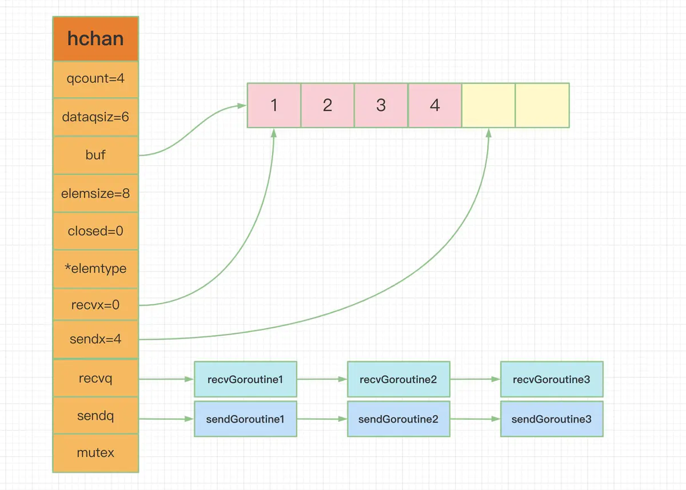
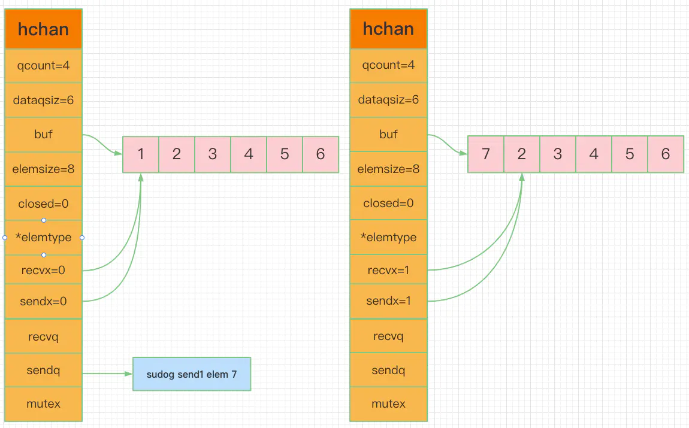

# Golang Channel底层实现

## channel是什么

"do not communicate by sharing memory; instead, share memory by communicating"- 
Rob Pike

不要通过共享内存来通信，而应该通过通信来共享内存。很经典的go的并发哲学，依赖
csp模型，通过channel实现。

go的并发主要靠goroutine实现的，而channel则像一个管道一样，实现goroutine之间的
通信。虽然也可以通过锁，原子操作能够实现数据的同步，但使用channel更优雅。

总结一下，channel是**并发安全**的**管道**，主要用于goroutine之间的消息传递
和事件通知。

再来看一下在go中channel的数据结构

```go
type hchan struct {
    // 元素数量
    qcount   uint
    // 底层循环数组的长度
    dataqsiz uint
    // 指向底层循环数组的指针
    buf      unsafe.Pointer
    // 元素大小
    elemsize uint16
    // 是否关闭
    closed   uint32
    // 元素类型
    elemtype *_type
    // 已发送元素在循环数组中的索引
    sendx    uint
    // 已接收元素在循环数组中的索引
    recvx    uint
    // 等待接收的goroutine队列
    recvq    waitq         
    // 等待发送的goroutine队列
    sendq    waitq
    // 锁
    lock mutex     
}
```

结合下图更直观的看一下



## channel的创建

根据channel的size分为无缓冲和有缓冲channel

```go
// 无缓冲channel
ch1 := make(chan int)
// 有缓冲channel
ch2 := make(chan int, 10)
```

根据channel的发送接收能力来将它分为是那种类型，不指明方向的channel既能发送也
能接收，<- chan 只能发送，chan <- 只能接收。

```go
// 可以发送和接收T类型的数据
chan T      
// 只能发送T类型的数据
chan <-  T  
// 只能接收T类型的数据
<-chan  T    
```

使用make函数就可以额创建一个能够收发的channel，只能读或者写的channel一般作为
函数参数做限制。

```go
    var wg sync.WaitGroup
    
    ch1 := make(chan int)
    ch2 := make(chan int, 2)

    wg.Add(2)
    
    // 只能从recvCh接收数据
    go func(recvCh <-chan int) {
        data := <-recvCh
        fmt.Println(data)
        wg.Done()
    }(ch1)
    
    // 只能向sendCh发送数据
    go func(sendCh chan<- int) {
        sendCh <- 1
        wg.Done()
    }(ch2)

    wg.Wait()
```

make函数最终调用了/go/src/runtime/chan.go下面的makechan方法，主要做了chan
初始化内存分配

```go
func makechan(t *chantype, size int) *hchan {
    elem := t.elem

    // compiler checks this but be safe.
    if elem.size >= 1<<16 {
        throw("makechan: invalid channel element type")
    }
    if hchanSize%maxAlign != 0 || elem.align > maxAlign {
        throw("makechan: bad alignment")
    }

    mem, overflow := math.MulUintptr(elem.size, uintptr(size))
    if overflow || mem > maxAlloc-hchanSize || size < 0 {
        panic(plainError("makechan: size out of range"))
    }

    // Hchan does not contain pointers interesting for GC when elements stored in buf do not contain pointers.
    // buf points into the same allocation, elemtype is persistent.
    // SudoG's are referenced from their owning thread so they can't be collected.
    // TODO(dvyukov,rlh): Rethink when collector can move allocated objects.
    var c *hchan
    switch {
    case mem == 0:
        // Queue or element size is zero.
        c = (*hchan)(mallocgc(hchanSize, nil, true))
        // Race detector uses this location for synchronization.
        c.buf = c.raceaddr()
    case elem.ptrdata == 0:
        // Elements do not contain pointers.
        // Allocate hchan and buf in one call.
        c = (*hchan)(mallocgc(hchanSize+mem, nil, true))
        c.buf = add(unsafe.Pointer(c), hchanSize)
    default:
        // Elements contain pointers.
        c = new(hchan)
        c.buf = mallocgc(mem, elem, true)
    }

    c.elemsize = uint16(elem.size)
    c.elemtype = elem
    c.dataqsiz = uint(size)
    lockInit(&c.lock, lockRankHchan)

    if debugChan {
        print("makechan: chan=", c, "; elemsize=", elem.size, "; dataqsiz=", size, "\n")
    }
    return c
}
```

## channel的发送

```go
ch := make(chan int, 3)
ch <- 1
```

channel的发送代码很简单，不过这只是编译器表面的语法糖而已，实际上调用了runtime.
chansend函数。

```go
// 位于 src/runtime/chan.go
func chansend(c *hchan, ep unsafe.Pointer, block bool, callerpc uintptr) bool {
    // 如果 channel 是 nil
    if c == nil {
        // 不能阻塞，直接返回 false，表示未发送成功
        if !block {
            return false
        }
        // 当前 goroutine 被挂起
        gopark(nil, nil, "chan send (nil chan)", traceEvGoStop, 2)
        throw("unreachable")
    }

    // 省略 debug 相关……

    // 对于不阻塞的 send，快速检测失败场景
    //
    // 如果 channel 未关闭且 channel 没有多余的缓冲空间。这可能是：
    // 1. channel 是非缓冲型的，且等待接收队列里没有 goroutine
    // 2. channel 是缓冲型的，但循环数组已经装满了元素
    if !block && c.closed == 0 && ((c.dataqsiz == 0 && c.recvq.first == nil) ||
        (c.dataqsiz > 0 && c.qcount == c.dataqsiz)) {
        return false
    }

    var t0 int64
    if blockprofilerate > 0 {
        t0 = cputicks()
    }

    // 锁住 channel，并发安全
    lock(&c.lock)

    // 如果 channel 关闭了
    if c.closed != 0 {
        // 解锁
        unlock(&c.lock)
        // 直接 panic
        panic(plainError("send on closed channel"))
    }

    // 如果接收队列里有 goroutine，直接将要发送的数据拷贝到接收 goroutine
    if sg := c.recvq.dequeue(); sg != nil {
        send(c, sg, ep, func() { unlock(&c.lock) }, 3)
        return true
    }

    // 对于缓冲型的 channel，如果还有缓冲空间
    if c.qcount < c.dataqsiz {
        // qp 指向 buf 的 sendx 位置
        qp := chanbuf(c, c.sendx)

        // ……

        // 将数据从 ep 处拷贝到 qp
        typedmemmove(c.elemtype, qp, ep)
        // 发送游标值加 1
        c.sendx++
        // 如果发送游标值等于容量值，游标值归 0
        if c.sendx == c.dataqsiz {
            c.sendx = 0
        }
        // 缓冲区的元素数量加一
        c.qcount++

        // 解锁
        unlock(&c.lock)
        return true
    }

    // 如果不需要阻塞，则直接返回错误
    if !block {
        unlock(&c.lock)
        return false
    }

    // channel 满了，发送方会被阻塞。接下来会构造一个 sudog

    // 获取当前 goroutine 的指针
    gp := getg()
    mysg := acquireSudog()
    mysg.releasetime = 0
    if t0 != 0 {
        mysg.releasetime = -1
    }

    mysg.elem = ep
    mysg.waitlink = nil
    mysg.g = gp
    mysg.selectdone = nil
    mysg.c = c
    gp.waiting = mysg
    gp.param = nil

    // 当前 goroutine 进入发送等待队列
    c.sendq.enqueue(mysg)

    // 当前 goroutine 被挂起
    goparkunlock(&c.lock, "chan send", traceEvGoBlockSend, 3)

    // 从这里开始被唤醒了（channel 有机会可以发送了）
    if mysg != gp.waiting {
        throw("G waiting list is corrupted")
    }
    gp.waiting = nil
    if gp.param == nil {
        if c.closed == 0 {
            throw("chansend: spurious wakeup")
        }
        // 被唤醒后，channel 关闭了。坑爹啊，panic
        panic(plainError("send on closed channel"))
    }
    gp.param = nil
    if mysg.releasetime > 0 {
        blockevent(mysg.releasetime-t0, 2)
    }
    // 去掉 mysg 上绑定的 channel
    mysg.c = nil
    releaseSudog(mysg)
    return true
}
```    

上面的代码注释很清楚说明了channel的发送流程，下面小结一下发送的过程：

1. 向一个nil channel发送数据，会调用gopark函数将当前goroutine挂起。
2. 向一个已经关闭的channel发送数据，会直接panic。
3. 如果channel的recvq当前队列中有被阻塞的接收者，则直接将数据发送给当前goroutine
，并将它设置成下一个运行的goroutine。
4. 当channel的缓冲区还有空闲空间，则将数据发送到sendx指向缓冲区的位置。
5. 当没有缓冲区或者缓冲区已满，则会创建一个sudog的结构体将其放到channel的sendq
队列当中陷入休眠等待被唤醒。

## channel的接收

```go
ch := make(chan int)
// 不带ok的方式
data := <- ch
// 带ok的方式
data, ok := <-ch
```

channel的接收分为两种方式，也是编译器语法糖的结果，最终会独爱用runtime.chanrecv1
和runtime.chanrecv2，而这两个函数最终调用了runtime.chanrecv函数。

```go
// entry points for <- c from compiled code
func chanrecv1(c *hchan, elem unsafe.Pointer) {
    chanrecv(c, elem, true)
}

func chanrecv2(c *hchan, elem unsafe.Pointer) (received bool) {
    _, received = chanrecv(c, elem, true)
    return
}
```

接下来看一下chanrecv函数的代码：

```go
// 位于 src/runtime/chan.go

// chanrecv 函数接收 channel c 的元素并将其写入 ep 所指向的内存地址。
// 如果 ep 是 nil，说明忽略了接收值。
// 如果 block == false，即非阻塞型接收，在没有数据可接收的情况下，返回 (false, false)
// 否则，如果 c 处于关闭状态，将 ep 指向的地址清零，返回 (true, false)
// 否则，用返回值填充 ep 指向的内存地址。返回 (true, true)
// 如果 ep 非空，则应该指向堆或者函数调用者的栈

func chanrecv(c *hchan, ep unsafe.Pointer, block bool) (selected, received bool) {
    // 省略 debug 内容 …………

    // 如果是一个 nil 的 channel
    if c == nil {
        // 如果不阻塞，直接返回 (false, false)
        if !block {
            return
        }
        // 否则，接收一个 nil 的 channel，goroutine 挂起
        gopark(nil, nil, "chan receive (nil chan)", traceEvGoStop, 2)
        // 不会执行到这里
        throw("unreachable")
    }

    // 在非阻塞模式下，快速检测到失败，不用获取锁，快速返回
    // 当我们观察到 channel 没准备好接收：
    // 1. 非缓冲型，等待发送列队 sendq 里没有 goroutine 在等待
    // 2. 缓冲型，但 buf 里没有元素
    // 之后，又观察到 closed == 0，即 channel 未关闭。
    // 因为 channel 不可能被重复打开，所以前一个观测的时候 channel 也是未关闭的，
    // 因此在这种情况下可以直接宣布接收失败，返回 (false, false)
    if !block && (c.dataqsiz == 0 && c.sendq.first == nil ||
        c.dataqsiz > 0 && atomic.Loaduint(&c.qcount) == 0) &&
        atomic.Load(&c.closed) == 0 {
        return
    }

    var t0 int64
    if blockprofilerate > 0 {
        t0 = cputicks()
    }

    // 加锁
    lock(&c.lock)

    // channel 已关闭，并且循环数组 buf 里没有元素
    // 这里可以处理非缓冲型关闭 和 缓冲型关闭但 buf 无元素的情况
    // 也就是说即使是关闭状态，但在缓冲型的 channel，
    // buf 里有元素的情况下还能接收到元素
    if c.closed != 0 && c.qcount == 0 {
        if raceenabled {
            raceacquire(unsafe.Pointer(c))
        }
        // 解锁
        unlock(&c.lock)
        if ep != nil {
            // 从一个已关闭的 channel 执行接收操作，且未忽略返回值
            // 那么接收的值将是一个该类型的零值
            // typedmemclr 根据类型清理相应地址的内存
            typedmemclr(c.elemtype, ep)
        }
        // 从一个已关闭的 channel 接收，selected 会返回true
        return true, false
    }

    // 等待发送队列里有 goroutine 存在，说明 buf 是满的
    // 这有可能是：
    // 1. 非缓冲型的 channel
    // 2. 缓冲型的 channel，但 buf 满了
    // 针对 1，直接进行内存拷贝（从 sender goroutine -> receiver goroutine）
    // 针对 2，接收到循环数组头部的元素，并将发送者的元素放到循环数组尾部
    if sg := c.sendq.dequeue(); sg != nil {
        // Found a waiting sender. If buffer is size 0, receive value
        // directly from sender. Otherwise, receive from head of queue
        // and add sender's value to the tail of the queue (both map to
        // the same buffer slot because the queue is full).
        recv(c, sg, ep, func() { unlock(&c.lock) }, 3)
        return true, true
    }

    // 缓冲型，buf 里有元素，可以正常接收
    if c.qcount > 0 {
        // 直接从循环数组里找到要接收的元素
        qp := chanbuf(c, c.recvx)

        // …………

        // 代码里，没有忽略要接收的值，不是 "<- ch"，而是 "val <- ch"，ep 指向 val
        if ep != nil {
            typedmemmove(c.elemtype, ep, qp)
        }
        // 清理掉循环数组里相应位置的值
        typedmemclr(c.elemtype, qp)
        // 接收游标向前移动
        c.recvx++
        // 接收游标归零
        if c.recvx == c.dataqsiz {
            c.recvx = 0
        }
        // buf 数组里的元素个数减 1
        c.qcount--
        // 解锁
        unlock(&c.lock)
        return true, true
    }

    if !block {
        // 非阻塞接收，解锁。selected 返回 false，因为没有接收到值
        unlock(&c.lock)
        return false, false
    }

    // 接下来就是要被阻塞的情况了
    // 构造一个 sudog
    gp := getg()
    mysg := acquireSudog()
    mysg.releasetime = 0
    if t0 != 0 {
        mysg.releasetime = -1
    }

    // 待接收数据的地址保存下来
    mysg.elem = ep
    mysg.waitlink = nil
    gp.waiting = mysg
    mysg.g = gp
    mysg.selectdone = nil
    mysg.c = c
    gp.param = nil
    // 进入channel 的等待接收队列
    c.recvq.enqueue(mysg)
    // 将当前 goroutine 挂起
    goparkunlock(&c.lock, "chan receive", traceEvGoBlockRecv, 3)

    // 被唤醒了，接着从这里继续执行一些扫尾工作
    if mysg != gp.waiting {
        throw("G waiting list is corrupted")
    }
    gp.waiting = nil
    if mysg.releasetime > 0 {
        blockevent(mysg.releasetime-t0, 2)
    }
    closed := gp.param == nil
    gp.param = nil
    mysg.c = nil
    releaseSudog(mysg)
    return true, !closed
}
```

上面的代码注释很清楚的说明了channel的接收数据的过程，下面小结一下接收数据的过程：

1. 从一个nil channel接收数据，会调用gopark函数将当前goroutine挂起，让出处理器的
使用权。
2. 从一个已经关闭并且缓冲区中没有元素的channel中接收数据则会收到该类型的默认
元素，并且第二个返回值返回false。
3. 如果channel没有缓冲区且sendq的队列有阻塞的goroutine，则把sendq队列头的sudog
中保存的元素值copy到目标地址中。
4. 如果channel有缓冲区且缓冲区里有元素，则把recvx指向缓冲区的元素值copy到目标
地址当中，sendq队列头的sudog的元素值copy到recvx指向缓冲区位置的地址中，看下图



5. 当上面的条件都不符合时，则会创建一个sudog的结构体将其放到channel的recvq
队列当中陷入休眠等待被唤醒

   ## channel的关闭

```go
ch := make(chan int)
close(ch)
```

关闭channel相对简单，编译器会转换成runtime.closechan函数。

```go
func closechan(c *hchan) {
    // 关闭一个 nil channel，panic
    if c == nil {
        panic(plainError("close of nil channel"))
    }

    // 上锁
    lock(&c.lock)
    // 如果 channel 已经关闭
    if c.closed != 0 {
        unlock(&c.lock)
        // panic
        panic(plainError("close of closed channel"))
    }

    // …………

    // 修改关闭状态
    c.closed = 1

    var glist *g

    // 将 channel 所有等待接收队列的里 sudog 释放
    for {
        // 从接收队列里出队一个 sudog
        sg := c.recvq.dequeue()
        // 出队完毕，跳出循环
        if sg == nil {
            break
        }

        // 如果 elem 不为空，说明此 receiver 未忽略接收数据
        // 给它赋一个相应类型的零值
        if sg.elem != nil {
            typedmemclr(c.elemtype, sg.elem)
            sg.elem = nil
        }
        if sg.releasetime != 0 {
            sg.releasetime = cputicks()
        }
        // 取出 goroutine
        gp := sg.g
        gp.param = nil
        if raceenabled {
            raceacquireg(gp, unsafe.Pointer(c))
        }
        // 相连，形成链表
        gp.schedlink.set(glist)
        glist = gp
    }

    // 将 channel 等待发送队列里的 sudog 释放
    // 如果存在，这些 goroutine 将会 panic
    for {
        // 从发送队列里出队一个 sudog
        sg := c.sendq.dequeue()
        if sg == nil {
            break
        }

        // 发送者会 panic
        sg.elem = nil
        if sg.releasetime != 0 {
            sg.releasetime = cputicks()
        }
        gp := sg.g
        gp.param = nil
        if raceenabled {
            raceacquireg(gp, unsafe.Pointer(c))
        }
        // 形成链表
        gp.schedlink.set(glist)
        glist = gp
    }
    // 解锁
    unlock(&c.lock)

    // Ready all Gs now that we've dropped the channel lock.
    // 遍历链表
    for glist != nil {
        // 取最后一个
        gp := glist
        // 向前走一步，下一个唤醒的 g
        glist = glist.schedlink.ptr()
        gp.schedlink = 0
        // 唤醒相应 goroutine
        goready(gp, 3)
    }
}
```

小结一下channel的关闭流程：

1. 关闭一个nil channel会panic
2. 关闭一个已经关闭的channel会panic
3. 把sendq和recvq队列中的元素加入到glist当中，清除所有sudog上所有未被处理过的
元素
4. 最后把所有的阻塞的sudog全部唤醒，做一些扫尾工作。
