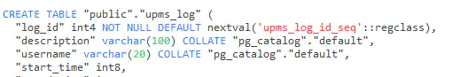

[TOC]: # "Spring Cloud"


## 使用navicat创建postgresql数据库的表时如何设定主键自增？

我们知道，在navicat中mysql里边有auto_increment自增字段Postgresql没有自增字段这这一说法，但是有单独的对象：序列。可以用序列或者其他方法时是实现这样的语法。或者设置某一列的默认值为sequence的值即可

## 在MySQL当中，我们可以通过勾选在实现ID自增，我们的navicat如下图所示

```mysql
`area_id` int(10) unsigned NOT NULL AUTO_INCREMENT,
```


## 在postgresql当中，我们的navicat如下图所示


在postgresql当中，我们实现ID自增首先创建一个关联序列

打开navicat查询列表，去创建一个序列

```postgresql
CREATE SEQUENCE upms_log_id_seq START 10;
```

然后在字段默认值里设置`nextval(' upms_log_id_seq')` 即可


实际生成自增组件表结构

```postgresql
"area_id" int4 NOT NULL DEFAULT nextval('upms_area_id_seq'::regclass),
```




## 或者使用数据库脚本

方法一：

```postgresql
CREATE TABLE banners  
(  
  id SERIAL primary key ,  
  name character varying
)  
```

方法二：

```postgresql
CREATE SEQUENCE banners_id_seq  
START WITH 1  
INCREMENT BY 1  
NO MINVALUE  
NO MAXVALUE  
CACHE 1;  
  
alter table banners alter column id setdefault nextval('banners_id_seq');
```

## PostgreSQL主要优势：

- postgresql完全免费，而且是BSD协议，如果你把postgresql改一改，然后再拿去卖钱，也没有人管你，这一点很重要，这表明了Postgresql数据库不会被其他公司控制。Oracle数据库不用说了，是商业数据库，不开放。而且MySQL数据库虽然是开源的，但现在随着SUN被Oracle公司收购，基本上被Oracle公司控制，其实在SUN被收购之前，MySQL中最重要的InnoDB引擎也是被Oracle控制的，而在mysql的市场范围与Oracle数据库的市场范围冲突时，Oracle公司必定会牺牲mysql，这是毫无疑问的
- 与postgresql配合的开源软件有很多，有很多分布式集群软件，如pgpool、pgcluster、slony、plploxy等等，很容易做读写分离、负载均衡、数据水平拆分等方案，而这在MySQL下则比较困难、
- Postgresql源代码写的很清晰，易读性比mysql强太多了，怀疑mysql的源代码被混淆过。所以很多公司都是基于postgresql做二次开发的。
