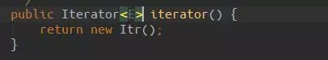
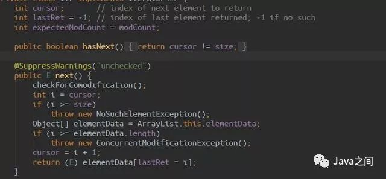
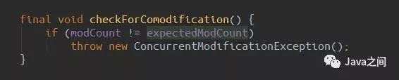

[TOC]: # "foreach判断最后一个_ArrayList集合为什么不能使用foreach增删改"

编程过程中常常需要使用到集合，而ArrayList也是我们常常使用的，但是最近在一次删除和增加中出现了一些问题，分享记录下。

请款下面两段代码，哪段代码会报错呢，或者都会成功呢。

``` java
List arrayList1 = new ArrayList();
arrayList1.add("1");
arrayList1.add("2");for (String s : arrayList1) {if("1".equals(s)){
 arrayList1.remove(s);
 }
}
List arrayList2 = new ArrayList();
arrayList2.add("2");
arrayList2.add("1");for (String s : arrayList2) {if("1".equals(s)){
 arrayList2.remove(s);
 }
}
```

程序运行结果如下：

> arrayList1的remove方法成功执行，但是arrayList2的remove方法运行抛出ConcurrentModificationException异常。

为了寻找原因，我们只能看源代码了。

因为foreach的本事就是使用的迭代七Iterator，所有的Collection集合类都会实现Iterable接口。

找到ArrayList类的iterator()方法



使用自己的Itr内部类，并且实现了Iterator接口

迭代器的本事是先调用hasNext()方法判断存不存在下一个元素，然后再使用next()方法取下一个元素



上面arrayList1为什么能remove成功呢，其实它只循环了一次，所以成功了。

因为它在remove元素1之后，它的size-1变成了1，然后Itr内部的cursor变量由0变成1  
此时1=1，循环结束，所以成功了。

arrayList2为什么remove失败呢，因为他在循环第二次的时候，也remove成功了，但是第三次判断next的时候
cursor的值为2导致不等于选择的size1，所以执行了next方法，最重要的来了，之前remove的操作导致ArrayList的modCount
值加1，然后Itr类中的expectedModCount保持不变，所以会抛出异常。



同理可得，由于add操作也会导致modCount自增，所以不允许在foreach中删除、增加、修改ArrayList中的元素。

对此，推荐大家使用迭代器Iterator删除元素，

```java
Iterator iterator = arrayList2.iterator();while(iterator.hasNext()){
 String item = iterator.next();if("1".equals(item)){
 iterator.remove();
 }
}
```

如果存在并发操作，还需要对Iterator进行加锁操作。


