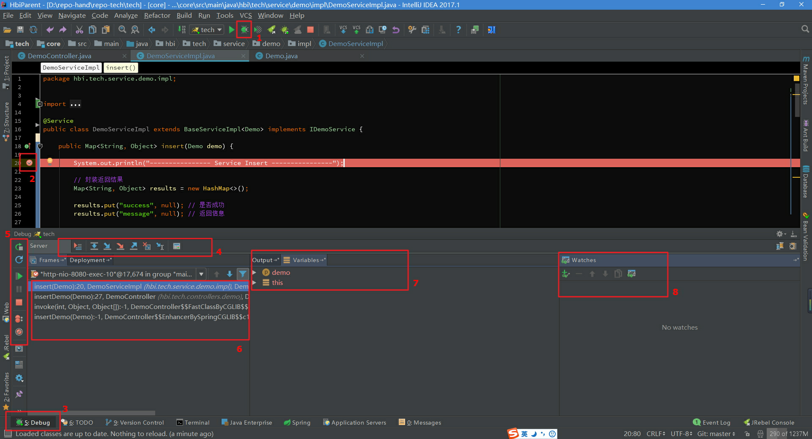
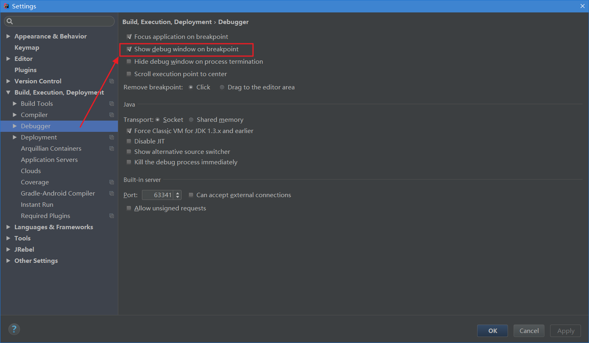
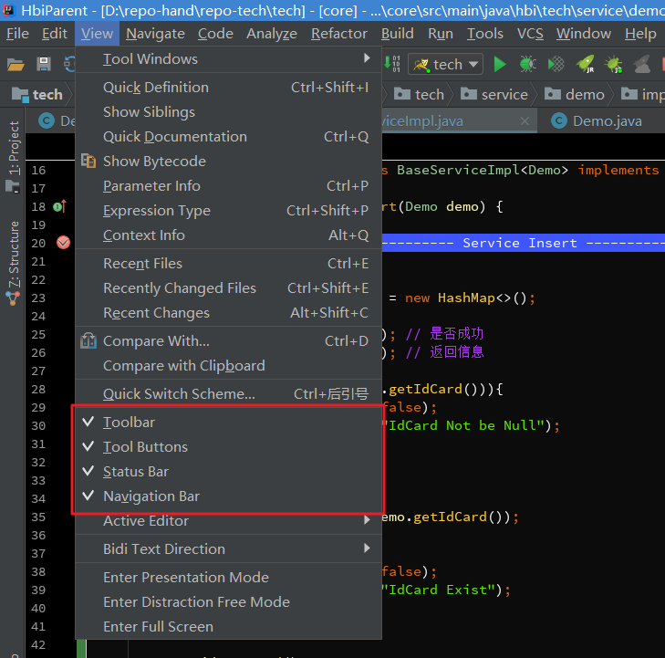
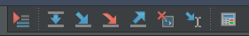
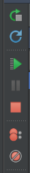
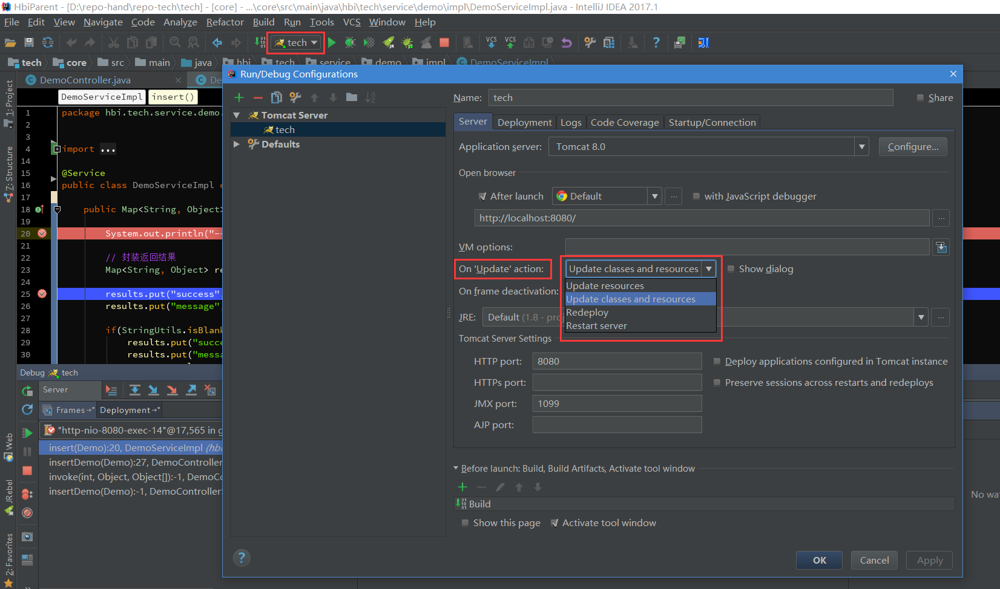

[TOC]: # "idea调试攻略"

# idea调试攻略
- [Debug开篇](#debug开篇)

在现在的开发中，我们经常采用Debug来追踪代码的运行流程，通畅在程序运行过程中出现异常，启用Debug模式可以分析定位异常发生的位置，以及运行过程中参数的变化。通畅我们也可以启用Debug模式来跟踪代码的运行流程去学习三方框架的源码。

## 一、Debug开篇

首先看下IDEA中DEBUG模式下的界面

如下是在IDEA中启动Debug模式，进入断点后的界面，我这里是Windows，可能和Mac的图标等会有些不一样。就简单说下图中标注的8个地方：

1. 以Debug模式启动服务，左边的一个按妞则是以Run模式启动。在开发中，我一般会直接启动Debug模式，方便随时调试代码。
2. 断点：在左边行号单击左键，或者快捷键Ctrl+F8打上/取消断点，断点行的颜色可以自己去设置。
3. Debug窗口：访问请求到达第一个断点后，会自动激活Debug窗口。如果没有自动激活，如图1.2
4. 调试按钮：一共有八个按钮，调试的主要功能就对应着这几个按钮，鼠标悬停在按钮上可以查看对应的快捷键。在菜单栏Run里可以找到同样的对应的功能，如图1.4.
5. 服务按钮：可以在这里关闭/启动服务，设置断点等。
6. 调用方法栈：这里显示了该线程调试所经过的所有方法，勾选右上角的\[Show All Frame\]按钮，就不会显示其他类库的方法了，否则这里会有一大堆的方法。
7. Variable：在变量区可以查看当前断点之前的当前方法的变量。
8. Watches：查看变量，可以将Variables区中的变量拖到Watches中查看。

图1.2 ----在设置里勾选Show debug window on breakpoint，则请求进入到断点后自动激活Debug窗口

图1.3 ----如果你的IDEA底部没有显示工具栏或者状态栏，可以在View里打开，显示出工具栏会方便我们使用。可以自己去尝试下这四个选项。

图1.4 ----在菜单栏Run里有调试对应的功能，同时可以查看对应的快捷键。

## 二、基本用法&快捷键

Debug调试的功能主要对应图一中4和5两组按钮：

1. 首先说第一组按钮，共8个按钮，从左到右依次如下：

\> Show Execution Point (Alt + F10)：如果你的光标在其他行或其他页面，点击这个按钮可以跳转到当前代码执行的行。

\> Step Over (F8)：步过，一行一行地往下走，如果这一行有方法不会进入方法。

\> Step Into (F7)：步入，如果当前行有方法，可以进入方法内部，一般用于进入自定义方法内，不会进入官方类库的方法，如第25行的put方法。

\> Force Step Into(Alt+Shift+F7)：强制步入，能进入任何方法，查看底层源码的时候可以用这个进入官方类库的方法。

\> Step Out(Shift+F8)：步出，从步入的方法内退出到方法调用处，此时方法已经执行完毕，知识还没有完成赋值。

\> Drop Frame(默认无)：回退断点，后面章节详细说明。

\> Run to Cursor(Alt+F9)：运行到光标处，你可以将光标定位到你需要查看的那一行，然后使用这个功能，代码会运行至光标行，而不需要打断点。

\> Evaluate Expression(Alt+F8)：计算表达式，后面章节详细说明。

2. 第二组按钮，共7个按钮，从上到下依次如下：

 \[图2.2]

\> Rerun 'xxxx'： 重新运行程序，会关闭服务后重新启动程序。

\> Update 'xxxx' application (Ctrl+F5)：更新程序，一般在你的代码有改动后可执行这个功能。而这个功能对应的操作则是在服务配置里，如图2.3.

 \[图2.3]

\> Resume Program (F9) ：恢复程序，比如，你在第20行和25行有两个断点

## 三、变量查看

## 四、计算表达式

## 五、智能步入

## 六、断点条件设置

## 七、多线程调试

## 八、回退断点

## 九、中断Debug

