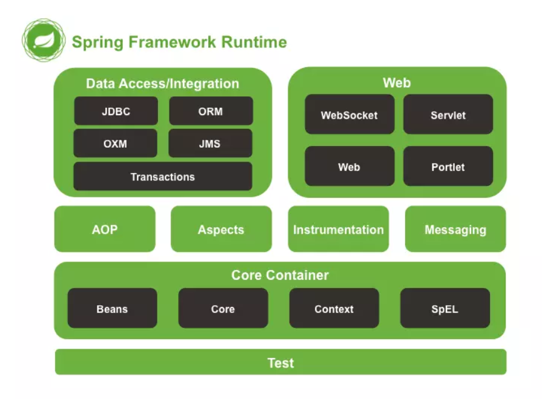
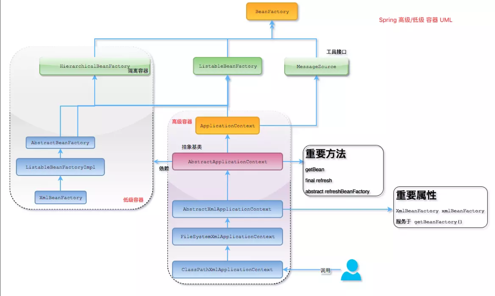
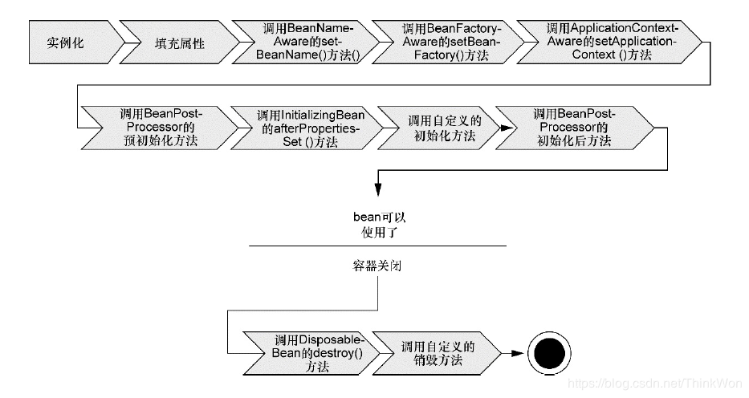

[TOC]: # "Spring"

# Spring
- [Spring概述](#spring概述)
  - [什么是Spring？](#什么是spring)
  - [Spring框架的设计目标，设计理念和核心是什么？](#spring框架的设计目标设计理念和核心是什么)
  - [Spring的优缺点是什么？](#spring的优缺点是什么)
  - [Spring有哪些应用场景](#spring有哪些应用场景)
  - [Spring框架中都用到了哪些设计模式？](#spring框架中都用到了哪些设计模式)
  - [详细讲解一下核心容器(Spring context应用上下文）模块](#详细讲解一下核心容器spring-context应用上下文模块)
  - [Spring框架中有哪些不同类型的事件](#spring框架中有哪些不同类型的事件)
  - [Spring应用程序有哪些不同组件？](#spring应用程序有哪些不同组件)
  - [使用Spring有哪些方式？](#使用spring有哪些方式)
- [Spring控制反转(IoC)](#spring控制反转ioc)
  - [什么是Spring IOC容器？](#什么是spring-ioc容器)
  - [控制反转(IOC)有什么作用](#控制反转ioc有什么作用)
  - [IOC的优点是什么？](#ioc的优点是什么)
  - [Spring IoC的实现机制](#spring-ioc的实现机制)
  - [Spring的IoC支持哪些功能](#spring的ioc支持哪些功能)
  - [BeanFactory和ApplicationContext有什么区别？](#beanfactory和applicationcontext有什么区别)
  - [Spring如何设计容器的，BeanFactory和ApplicationContext的关系详解](#spring如何设计容器的beanfactory和applicationcontext的关系详解)
  - [ApplicationContext通常的实现是什么？](#applicationcontext通常的实现是什么)
  - [什么是Spring的依赖注入？](#什么是spring的依赖注入)
  - [依赖注入的基本原则](#依赖注入的基本原则)
  - [依赖注入有什么优势？](#依赖注入有什么优势)
  - [有哪些不同类型的依赖注入实现方式？](#有哪些不同类型的依赖注入实现方式)
  - [构造器依赖注入和Setter方法注入的区别](#构造器依赖注入和setter方法注入的区别)
- [Spring Beans](#spring-beans)
  - [什么是Spring beans？](#什么是spring-beans)
  - [一个Spring bean定义包含什么？](#一个spring-bean定义包含什么)
  - [如何给Spring容器提供配置元数据？Spring有几种配置方式](#如何给spring容器提供配置元数据spring有几种配置方式)
  - [Spring基于xml注入bean的几种方式](#spring基于xml注入bean的几种方式)
  - [怎样定义类的作用域？](#怎样定义类的作用域)
  - [解释Spring支持的几种bean的作用域](#解释spring支持的几种bean的作用域)
  - [Spring框架中的单例bean都是线程安全的吗？](#spring框架中的单例bean都是线程安全的吗)
  - [Spring如何处理线程并发问题？](#spring如何处理线程并发问题)
  - [解释Spring框架中bean的生命周期](#解释spring框架中bean的生命周期)


## Spring概述

### 什么是Spring？

Spring是一个**轻量级Java开发框架**，最早有Rod
Johnson创建，目的时为了解决企业级应用开发的业务逻辑层和其他各层的耦合问题。他是一个分层的JavaSE/JavaEE
full-stack（一站式）轻量级开源框架，为开发Java应用程序提供全面的基础架构支持。Spring负责基础架构，因此Java开发者可以专注于应用程序的开发。

Spring最根本的使命就是**解决企业级应用开发的复杂性，即简化Java开发。**

Spring可以做很多事情，它为企业级开发提供了丰富的功能，但是这些功能的底层都依赖与它的两个特性，也就是**依赖注入（dependency
injection，
DI）和面向切面编程（aspect-oriented
programming，AOP）。

为了减低Java开发的复杂性，Spring采取了以下4种关键策略

- 基于POJO的轻量级和最小侵入性编程；
- 通过依赖注入和面向接口实现松耦合；
- 基于切面和惯例进行声明式编程；
- 通过切面和模板减少样板式代码。

### Spring框架的设计目标，设计理念和核心是什么？

**Spring设计目标：**
Spring为开发者提供了一个一站式轻量级应用开发平台；

**Spring设计理念：**
在JavaEE开发中，支持POJO和JavaBean开发模式，使应用面向接口开发，充分支持OO（面向对象）设计方法；

**Spring框架的核心：**
IoC容器和AOP模块。通过IoC容器管理POJO对象以及他们之间的耦合关系；通过AOP以动态非侵入的方式增强服务。

IoC让相互协作的组件保持松散的耦合，让AOP编程允许你把遍布于各层应用的功能分离出来形成可重用的功能组件。

### Spring的优缺点是什么？

优点

- 方便解耦，简化开发

  Spring就是一个大工厂，可以将所有对象的创建和依赖关系的维护，交给Spring管理。

- AOP编程的支持

  Spring提供面向切面编程，可以方便的实现对程序进行权限拦截、运行监控等功能。

- 声明式事务的支持

  只需要通过配置就可以完成对事物的管理，而无需手动编程。

- 方便程序测试

  Spring对Junit4支持，可以通过注解方便的测试Spring程序。

- 方便集成各种优秀框架

  Spring不排斥各种优秀的开源框架，其内部提供了对各种优秀框架的直接支持（如：Struts、Hibernate、Mybatis等）。

- 降低JavaEE API的使用难度

  Spring对JavaEE开发中非常难用的一些API（JDBC、JavaMail、远程调用等），都提供了封装，使这些API应用难度大大降低。

缺点

- Spring明明是一个很轻量级的框架，却给人感觉大而全。
- Spring依赖反射，反射影响性能
- 使用门槛高，入门Spring需要较长时间

### Spring有哪些应用场景

**应用场景：**
JavaEE企业应用开发，包括SSH、SSM等

**Spring价值**

- Spring是非侵入式的框架，目标是使应用代码对框架依赖最小化；
- Spring提供一个一致的编程模型，使应用直接使用POJO开发，与运行环境隔离开来；
- Spring推动应用设计风格向面向对象和面向接口开发转变，提高了代码的重用性和可测试性；

**Spring由哪些模块组成？**

Spring总共大约有20个模块，由1300多个不同的文件构成。而这些文件被分别整合在`核心容器（Core
Container）`、`AOP(Aspect Oriented
Programming)和设备支持(Instrumentation)`、`数据访问与集成(Data
Access/Integration)`、`Web`、`消息(Messaging)`、`Test`等六个模块中。以下是Spring
5的模块结构图：



- spring
  core：提供了框架的基本组成部分，包括控制反转（Inversion
  of Control
  ，IoC）和依赖注入（Dependency
  Injection，DI）功能。
- spring
  beans：提供了BeanFactory，是工厂模式的一个经典实现，Spring将管理对象称为Bean。
- spring
  context：构建于core封装包基础上的context封装包，提供了一种框架式的对象访问方法。
- spring
  jdbc：提供了一个JDBC的抽象层，消除了繁琐的JDBC编码和数据库厂商特有的错误代码解析，用于简化JDBC。
- spring
  aop：提供了面向切面的编程实现，让你可以自定义拦截器、切点等、
- spring
  web：提供了针对Web开发的集成特性，例如文件上传，利用servlet
  listeners进行ioc容器初始化和针对Web的ApplicationContext。
- spring
  test：主要为测试提供支持的，支持使用JUnit或TestNG对Spring组件进行单元测试和集成测试。

### Spring框架中都用到了哪些设计模式？

1. 工厂模式：BeanFactory就是简单工厂模式的实现，用来创建对象的实例；
2. 单例模式：Bean默认为单例模式。
3. 代理模式：Spring的AOP功能用到了JDK的动态代理和CGLIB字节码生成技术；
4. 模板方法：用来解决代码重复的问题。比如：RestTemplate，JMSTemplate，JpaTemplate。
5. 观察者模式：定义对象间一种对多的依赖关系，当一个对象的状态发生改变时，所有依赖于它的对象都会得到通知被动更新，如Spring中的listener的实现-ApplicationListener。

### 详细讲解一下核心容器(Spring context应用上下文）模块

这是基本的Spring模块，提供spring框架的基础功能，BeanFactory是任何以Spring为基础的应用的核心。Spring框架建立此模块之上，它使Spring成为一个容器。

Bean工厂是工厂模式的一个实现，提供了控制反转的功能，用来把应用的配置和依赖从真正的应用代码中分离。最常用的就是org.springframework.beans.factory.xml.XmlBeanFactory，它根据XML文件中的定义加载beans。该容器从XML文件读取配置元数据并用它去创建一个完全配置的系统或应用。

### Spring框架中有哪些不同类型的事件

Spring提供了以下5种标准的事件：

1. 上下文更新事件(ContextRefreshedEvent):在调用ConfigurableApplicationContext接口中的refresh()方法时被触发。
2. 上下文开始事件(ContextStartedEvent):当容器调用ConfigurableApplicationContext的Start()方法开始/重新开始容器时触发该事件。
3. 上下文停止事件(ContextStoppedEvent):当容器调用ConfigurableApplicationContext的stop()方法停止容器时触发该事件。
4. 上下文关闭事件(ContextClosedEvent):当ApplicationContext被关闭时触发该事件。容器被关闭时，其管理的所有单例Bean都被销毁。
5. 请求处理事件(RequestHandledEvent):在Web应用中，当一个http请求(request)结束触发该事件。如果一个bean实现了ApplicationListener接口，当一个ApplicationEvent被发布以后bean会自动被通知。

### Spring应用程序有哪些不同组件？

Spring应用一般有以下组件：

- 接口-定义功能。
- Bean类-它包含属性，setter和getter方法，函数等。
- Bean配置文件-包含类的信息以及如何配置它们。
- Spring面向切面编程（AOP）-
  提供面向切面编程的功能。
- 用户程序-它使用接口。

### 使用Spring有哪些方式？

使用Spring有以下方式：

- 作为一个成熟的Spring Web应用程序。
- 作为第三方Web框架，使用Spring
  Frameworks中间层。
- 作为企业级Java
  Bean，它可以包装现有POJO（Plain Old
  Java Objects）。
- 用于远程使用。

## Spring控制反转(IoC)

### 什么是Spring IOC容器？

控制反转即IoC（Inversion of
Control），它把传统上由程序代码直接操控的对象的调用权交给容器，通过容器来实现对象组件的装配和管理。所谓“控制反转”概念就是对组件对象控制权的转移到了外部容器。

Spring
IOC负责创建对象，管理对象（通过依赖注入（DI）），装配对象，配置对象，并且管理这些对象的整个生命周期。

### 控制反转(IOC)有什么作用

- 管理对象的创建和依赖关系的维护。对象的创建并不是一件简单的事，在对象关系比较复杂时，如果依赖关系需要程序员来维护的话，那是相当头疼的
- 解耦，由容器去维护具体的对象
- 托管了类的产生过程，比如我们需要在类的产生过程中做一些处理，最直接的例子就是代理，如果有容器程序可以把这部分处理交给容器，应用程序则无需去关心类是如何完成代理的

### IOC的优点是什么？

- IOC或依赖注入把应用的代码量降到最低。
- 它使应用容易测试，单元测试不再需要单例和JDNI查找机制。
- 最小的代价和最小的侵入性使松散耦合得以实现。
- IOC容器支持加载服务时的饿汉式初始化和懒加载。

### Spring IoC的实现机制

Spring中的IoC的原理就是工厂模式加反射机制。

示例：

```java
interface Fruit {
    public abstract void eat();
}

class Apple implements Fruit {
    @Override
    public void eat() {
        System.out.println("Apple");
    }
}

class Orange implements Fruit {
    @Override
    public void eat() {
        System.out.println("Orange");
    }
}

class Factory {
    public static Fruit getInstance(String className) {
        Fruit fruit = null;
        try {
            fruit = (Fruit) Class.forName(className).newInstance();
        } catch (Exception e) {
            e.printStackTrace();
        }
        return fruit;
    }
    
    class Client {
        public static void main(String[] args){
          Fruit fruit = Factory.getInstance("io.github.snax.spring.Apple");
          if (fruit != null) {
          fruit.eat();
          }
        }
    }
}
```

### Spring的IoC支持哪些功能

Spring的IoC设计支持以下功能：

- 依赖注入
- 依赖检查
- 自动装配
- 支持集合
- 指定初始化方法和销毁方法
- 支持回调某些方法（但是需要实现Spring接口，略有侵入）

其中，最重要的就是依赖注入，从XML的配置上来说，即ref标签。对应Spring
RuntimeBeanReference对象。

对于IoC来说，最重要的就是容器。容器管理着Bean的生命周期，控制着Bean的依赖注入。

### BeanFactory和ApplicationContext有什么区别？

BeanFactory和ApplicationContext是Spring的两大核心接口，都可以当做Spring的容器。其中ApplicationContext是BeanFactory的子接口。

**依赖关系**

BeanFactory：是Spring里边最底层的接口，包含了各种Bean的定义，读取bean配置文档，管理bean的加载、实例化，控制bean的生命周期，维护bean之间的依赖关系。

ApplicationContext接口作为BeanFactory的派生，除了提供BeanFactory所具有的功能外，还提供了更完整的框架功能：

- 继承MessageSource，因此支持国际化。
- 统一的资源文件访问方式。
- 提供在监听器中注册bean的事件。
- 同时加载多个配置文件
- 载入多个（有继承关系）上下文，使得每一个上下文都专注于一个特定的层次，比如应用的web层。

**加载方式**

BeanFactory采用的是延迟加载形式来注入Bean的，即只有在使用某个Bean时（调用getBean()），才对该Bean进行加载实例化。这样，我们就不能发现一些存在的Spring的配置问题。如果Bean的某一个数据没有注入，BeanFactory加载后，直至第一次使用调用getBean方法才会抛出异常。

ApplicationContext，它是在容器启动时，一次性创建了所有Bean。这样，在容器启动时，我们就可以发现Spring中存在的配置错误，这样有利于检查所依赖属性是否注入。ApplicationContext启动后预载入所有的单例Bean，通过预载入单实例Bean，确保当你需要的时候，你就不用等待，因为他们已经创建好了。

相对于基本的BeanFactory，ApplicationContext唯一的不足是占用内存空间。当应用程序配置Bean较多时，程序启动较慢。

**创建方式**

BeanFactory通常以编程的方式被创建，ApplicationContext还能以声明的方式创建，如使用ContextLoader。

**注册方式**

BeanFactory和ApplicationContext都支持BeanPostProcessor、BeanFactoryPostProcessor的使用，但两者之间的区别是：
BeanFactory需要手动注册，而ApplicationContext则是自动注册。

### Spring如何设计容器的，BeanFactory和ApplicationContext的关系详解

Spring作者Rod
Johnson设计了两个接口用以表示容器。
- BeanFactory
- ApplicationContext

BeanFactory简单粗暴，可以理解为就是个HashMap，Key是BeanName，Value是Bean实例。通常只提供注册（put），获取（get）这两个功能。我们可以称之为“**低级容器**”。

ApplicationContext可以称之为“**高级容器**”。因为他比BeanFactory多了更多的功能。他继承了多个接口。因此具备了更多的功能。例如资源的获取，支持多种消息（例如JSP
tag的支持），对BeanFactory多了工具级别的支持等待。所以你看他的名字，已经不是BeanFactory之类的工厂了，而是“应用上下文”，代表着整个大容器的所有功能。该接口定义了一个refresh方法，此方法是所有阅读spring源码的人最熟悉的方法，用于刷新整个容器，即重新加载/刷新所有的bean。

当然，除了这两大接口，还有其他的辅助接口。

BeanFactory和ApplicationContext的关系。

为了更直观的展示“低级容器”和“高级容器”的关系，这里通过常用的ClassPathXMLApplicationContext类来展示整个容器的层级UML关系。



最上面的是BeanFactory，下面的3个绿色的，都是功能扩展接口，这里就不展开讲。

看下面的隶属ApplicationContext粉红色的“高级容器”，依赖着“低级容器”，这里说的是依赖，不是继承。他依赖着“低级容器”的getBean功能。而高级容器有更多的功能：支持不同的信息源头，可以访问文件资源，支持应用事件（Observer模式）。

通常用户看到的就是“高级容器”。但BeanFactory也够用了

左边灰色的区域是“低级容器”，只负责加载Bean，获取Bean。容器其他的高级功能是没有的。例如上图画的refresh刷新Bean工厂所有配置，生命周期事件回调等。

小结：
IoC在Spring里，只需要低级容器就可以实现，2个步骤：

1. 加载配置文件，解析成BeanDefinition放在Map里。
2. 调用getBean的时候，从BeanDefinition所属的Map里，拿出Class对象进行实例化，同时如果有依赖关系，将递归调用getBean方法——完成依赖注入。

上面就是Spring低级容器（BeanFactory）的IoC。

至于高级容器ApplicationContext，它包含了低级容器的功能，当他执行refresh模板方法的时候，将刷新整个容器的Bean。同时其作为高级容器，包含了太多的功能。一句话，它不仅仅是IoC。他支持不同信息源头，支持BeanFactory工具类，支持层级容器，支持访问文件资源，支持事件发布通知，支持接口回调等等。

### ApplicationContext通常的实现是什么？

**FileSystemXmlApplicationContext：**
此容器从一个XML文件中加载beans的定义，XML
Bean配置文件的全路径名必须提供给它的构造函数。

**ClassPathXmlApplicationContext：**
此容器也从一个XML文件中加载beans的定义，这里，你需要正确设置classpath因为这个容器将在classpath里找Bean配置。

**WebXmlApplicationContext**
此容器加载一个XML文件，此文件定义了一个WEB应用的所有bean。

### 什么是Spring的依赖注入？

控制反转IoC是一个很大的概念，可以用不同的方式来实现。其主要实现方式有两种：依赖注入和依赖查找。

依赖注入：相对于IoC而言，依赖注入（DI）更加准确的描述了IoC的设计理念。所谓依赖注入（Dependency
Injection），即组件之间的依赖关系由容器在应用系统运行期来决定，也就是由容器动态的将某种依赖关系的目标对象实例注入到应用系统中的各个关联的组件之中。组件不做定位查询，只提供普通的Java方法让容器去决定依赖关系。

### 依赖注入的基本原则

依赖注入的基本原则是：应用组件不应该负责查找资源或者其他以来的协作对象。配置对象的工作应该由IoC容器负责，“查找资源”的逻辑应该从应用组件的代码中抽取出来，交给IoC容器负责。容器全权负责组件的装配，它会把符合依赖关系的对象通过属性（JavaBean中的setter）或者是构造器传递给需要的对象。

### 依赖注入有什么优势？

依赖注入之所以更流行是因为它是一种更可取的方式：让容器全权负责依赖查询，受管组件只需要暴露JavaBean的setter方法或者带参数的构造器或者接口，使容器可以在初始化时组装对象的依赖关系。其与依赖查找方式相比，主要优势为：

- 查找定位操作与应用代码完全无关。
- 不依赖于容器的API，可以很容易的在任何容器以外使用应用对象。
- 不需要特殊的接口，绝大多数对象可以做到完全不必依赖容器。

### 有哪些不同类型的依赖注入实现方式？

依赖注入是时下最流行的IoC实现方式，依赖注入分为接口注入（Interface
Injection），Setter方法注入（Setter
Injection）和构造器注入（Constructor
Injection）三种方式。其中接口注入由于在灵活性和易用性比较差，现在从Spring4开始已被废弃。

**构造器依赖注入：**
构造器依赖注入通过容器触发一个类的构造器来实现的，该类有一系列参数，每个参数代表一个对其他类的依赖。

**Setter方法注入：**
Setter方法注入是容器通过调用无参构造器或无参static工厂方法实例化bean之后，调用该bean的setter方法，即实现了基于setter的依赖注入。

### 构造器依赖注入和Setter方法注入的区别

| 构造函数注入                          | setter方法注入                       |
|:------------------------------|:------------------------------|
| 没有部分注入                          | 有部分注入                              |
| 不会覆盖setter属性               | 会覆盖setter属性                   |
| 任意修改都会创建一个新实例 | 任意修改不会创建一个新实例 |
| 适用于设置很多属性               | 适用于设置少量属性                |

两种依赖方式都可以使用，构造器注入和Setter方法注入。最好的解决方案使用构造器参数实现强制依赖。

## Spring Beans

### 什么是Spring beans？

SpringBeans是那些形成Spring应用的主干的java对象。它们被Spring
IoC容器初始化，装配和管理。这些beans通过容器中配置的元数据创建。比如，以XML文件中的形式定义。


### 一个Spring bean定义包含什么？

一个SpringBean的定义包含容器的所有配置元数据，包括如何创建一个bean，它的生命周期详情及它的依赖。

### 如何给Spring容器提供配置元数据？Spring有几种配置方式

Spring配置文件是个XML文件，这个文件包含了类信息，描述了如何配置它们，以及如何相互调用。

### Spring基于xml注入bean的几种方式

1. set方法注入
2. 构造器注入：①通过index设置参数位置；②通过type设置参数类型；
3. 静态工厂注入；
4. 实例工厂；

### 怎样定义类的作用域？

当定义一个在Spring里，我们还能给这个bean声明一个作用域。它可以通过bean定义中scope属性来定义。如，当Spring要在需要的时候每次生产一个新的bean实例，bean的scope属性被指定为prototype。另一方面，一个bean每次使用时候必须返回同一个实例，这个bean的scope属性必须设置成Singleton。

### 解释Spring支持的几种bean的作用域

Spring框架支持以下五种bean的作用域：

- **singleton：** bean在每个Spring
  IoC容器中只有一个实例。
- **prototype：**
  一个bean的定义可以有多个实例。
- **request：**
  每次http请求都会创建一个bean，该作用域仅在基于web的Spring
  ApplicationContext情形下有效
- **session：** 在一个HTTP
  Session中，一个bean定义对应一个实例。该作用域仅在基于web的Spring
  ApplicationContext情形下有效。
- **global-session:** 在一个全局的HTTP
  session中，一个bean定义对应一个实例。该作用域仅在基于web的Spring
  ApplicationContext情形下生效。

**注意：** 缺省的Spring
bean的作用域是Singleton。使用prototype作用域需要慎重的参考，因为频繁创建和销毁bean会带来很大的性能开销。

### Spring框架中的单例bean都是线程安全的吗？

不是，Spring框架中的单例bean不是线程安全的。

spring中的bean默认是单例模式，spring框架并没有对单例bean进行多线程的封装处理、

实际上大部分时候spring
bean是无状态的（比如dao类），所以某种程度来说bean也是安全的，但如果bean有状态的话（比如view
model对象），那就要开发者自己去保证线程安全了，最简单的就是改变bean的作用域，把“Singleton”改成“prototype”，这样请求bean相当于new
Bean()了，所以就可以保证线程安全了。

- 有状态就是有数据存储功能
- 无状态就是不会保存数据

### Spring如何处理线程并发问题？

在一般情况下，只有无状态的Bean才可以在多线程环境下共享，在Spring中，绝大部分Bean都可以声明Singleton作用域，因为Spring对一些bean中非线程安全状态采用ThreadLocal进行处理，解决线程安全问题。

ThreadLocal和线程同步机制都是为了解决多线程中相同变量的访问冲突问题。同步机制采用了“时间换空间“的方式，仅提供一份变量，不同的线程在访问前需要获取锁，没获得锁的线程则需要排队。而ThreadLocal采用了”空间换时间”的方式。

ThreadLocal惠威每个线程提供一个独立的变量副本，从而隔离了多个线程对数据的访问冲突。因为每一个线程都拥有自己的变量副本，从而也就没有必要对该变量进行同步了。ThreadLocal提供了线程安全的共享对象，在编写多线程代码时，可以把不安全的变量封装进ThreadLocal。

### 解释Spring框架中bean的生命周期

在传统的Java应用中，bean的生命周期很简单。使用Java关键字new进行bean实例化，然后该bean就可以使用了。一旦该bean不再被使用，则由java自动进行垃圾回收。相比之下，Spring容器中的bean的生命周期就显得相对复杂多了。正确理解Spring
bean的生命周期非常重要，因为你或许要利用Spring提供的扩展点来自定义bean的创建过程。下图展示了bean装在到Spring应用上下文中的一个典型的生命周期过程。



bean在Spring容器中从创建到销毁经历了若干阶段，每一阶段搜可以针对Spring如何管理bean进行个性化定制。

详细描述：

Spring对bean进行实例化；

Spring将值和bean的引用注入到bean对应的属性中；

如果bean实现了BeanNameAware接口，Spring将bean的ID传递给setBean-Name()方法；

如果bean实现了BeanFactoryAware接口，Spring将调用setBeanFactory()方法，将BeanFactory容器实例传入；

如果bean实现了BeanPostProcessor接口，Spring将调用他们的post-ProcessBeforeInitialization()方法；

如果bean实现了InitializingBean接口，Spring将调用他们的after-PropertiesSet()方法。类似地，如果bean使用initmethod声明了初始化方法，该方法也会被调用；

如果bean实现了BeanPostProcessor接口，Spring将调用他们的post-ProcessAfterInitialization()方法；

此时，bean已经准备就绪，已经可以被应用程序使用了，它们将一直驻留在应用上下文中，知道该应用上下文被销毁；

如果bean实现了DisposableBean接口，Spring将调用它的destroy()接口方法。同样，如果bean使用destroy-method声明了销毁方法，该方法也会被调用。


