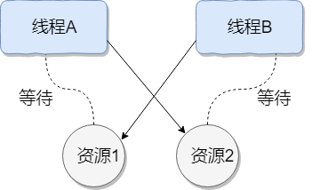

[TOC]: # "并发编程"

# 并发编程
- [基础知识](#基础知识)
  - [并发编程的优缺点](#并发编程的优缺点)
    - [为什么要使用并发编程（并发编程的优点）](#为什么要使用并发编程并发编程的优点)
    - [并发编程有什么缺点](#并发编程有什么缺点)
    - [并发编程三要素是什么？ Java程序中怎么保证多线程的运行安全？](#并发编程三要素是什么-java程序中怎么保证多线程的运行安全)
    - [并行和并发有什么区别？](#并行和并发有什么区别)
    - [什么是多线程，多线程的优劣？](#什么是多线程多线程的优劣)
  - [线程和进程的区别](#线程和进程的区别)
    - [什么是线程和进程？](#什么是线程和进程)
    - [线程和进程的区别](#线程和进程的区别-1)
    - [什么是上下文切换？](#什么是上下文切换)
    - [守护线程和用户线程什么区别？](#守护线程和用户线程什么区别)
    - [如何在Windows和Linux上查找哪个线程CPU利用率最高？](#如何在windows和linux上查找哪个线程cpu利用率最高)
    - [什么是线程死锁](#什么是线程死锁)
    - [形成死锁的四个必要条件](#形成死锁的四个必要条件)
    - [如何避免线程死锁](#如何避免线程死锁)
  - [创建线程的四种方式](#创建线程的四种方式)
    - [创建线程有哪几种方式](#创建线程有哪几种方式)

## 基础知识

### 并发编程的优缺点

#### 为什么要使用并发编程（并发编程的优点）

- 充分利用多核CPU的计算能力：通过并发编程的形式可以将多核CPU的计算能力发挥到极致，性能得到提升
- 方便进行业务拆分，提升系统并发能力和性能：在特殊的业务场景下，先天的就适合于并发编程。现在的系统动不动就要求百万级甚至千万级的并发量，而多线程并发编程正是开发高并发系统的基础，利用好多线程机制可以大大提高系统整体的并发能力以及性能。面对复杂业务模型，并行程序会比串行程序更适应业务需求，而并发编程更能吻合这种业务拆分。

#### 并发编程有什么缺点

并发编程的目的就是为了能提高程序的执行效率，提高程序的运行速度，但是并发编程并不能总是能提高程序运行速度的，而且并发编程可能会遇到很多问题，比如：**内存泄漏、上下文切换、线程安全、死锁**等问题。

#### 并发编程三要素是什么？ Java程序中怎么保证多线程的运行安全？

并发编程三要素（线程的安全性问题所在）

原子性：原子，即一个不可再被分割的颗粒。原子性指的是一个或多个操作要么全部执行成功要么全部执行失败。

可见性：一个线程对共享变量的修改，另一个线程能够立刻看到。（synchronized，volatile）

有序性：程序执行的顺序按照代码的先后顺序进行。（处理器可能会对执行进行重排序）

出现线程安全问题的原因：
- 线程切换带来的原子性问题
- 缓存导致的可见性问题
- 编译优化带来的有序性问题

解决方法：
- JDK
  Atomic开头的原子类、synchronized、LOCK，都可以解决原子性问题
- synchronized、volatile、LOCK，可以解决可见性问题
- Happens-Before 规则可以解决有序性问题

#### 并行和并发有什么区别？

- 并发：多个任务在同一个CPU核上，按细分的时间片上轮流（交替）执行，从逻辑上来看那些任务是同时执行。
- 并行：单位时间内，多个处理器或多核处理器同时处理多个任务，是真正意义上的“同时进行”。
- 串行：有n个任务，由一个线程按顺序执行。由于任务、方法都在一个线程执行所以不存在线程不安全的情况，也不存在临界区的问题。

做一个形象的比喻 并发 =
两个队列和一台咖啡机 并行 =
两个队列和两台咖啡机 串行 =
一个队列和一台咖啡机

#### 什么是多线程，多线程的优劣？

多线程：多线程是指程序中包含多个执行流，即在一个程序中可以同时运行多个不同的线程来执行不同的任务。

多线程的好处：

可以提高CPU的利用率。在多线程程序中，一个线程必须等待的时候，CPU可以运行其它的线程而不是等待，这样就大大提高了程序的效率。也就是说与允许单个程序创建多个并行执行的线程来完成各自的任务。

多线程的劣势：
- 线程也是程序，所以线程需要占用内存，线程越多占用内存也越多；
- 多线程需要协调和管理，所以需要CPU时间跟踪线程；
- 线程之间对共享资源的访问会相互影响，必须解决竞用共享资源的问题。

### 线程和进程的区别

#### 什么是线程和进程？

进程

一个在内存中运行的应用程序。每个进程都有自己独立的一块内存空间，一个进程可以有多个线程，比如在Windows系统中，一个运行的xx.exe就是一个进程。

线程

进程中的一个执行任务（控制单元），负责当前进程中程序的执行。一个进程至少有一个线程，一个进程可以运行多个线程，多个线程可共享数据。

#### 线程和进程的区别

线程具有许多传统进程所具有的特征，故又称为轻型进程（Light-Weight
Process）或进程元；而把传统的进程成为重型进程（Heavy-Weight
Process），它相当于只有一个线程的任务。在引入了线程的操作系统中，通常一个进程都有若干个线程，至少包含一个线程。

**根本区别：**
进程是操作系统资源分配的基本单位，而线程是处理器调度和执行的基本单位
**资源开销：**
每个进程都有独立的代码和数据空间（程序上下文），程序之间的切换会有较大开销；线程可以看做轻量级的进程，同一类线程共享代码和数据空间，每个线程都有自己独立的运行栈和程序计数器（PC），线程之间切换的开销小。
**包含关系：**
如果一个进程内有多个线程，则执行过程不是一条线的，而是多条线（线程）共同完成的；线程是进程的一部分，所以线程也被称为轻权线程或者轻量级线程。
**内存分配：**
同一进程的线程共享本进程的地址空间和资源，而进程之间的地址空间和资源是互相独立的。
**影响关系：**
一个进程崩溃后，在保护模式下不会对其他进程产生影响，但是一个线程崩溃整个进程都死掉。所以多进程要比多线程健壮。

#### 什么是上下文切换？

多线程编程中一般线程的个数都大于CPU核心的个数，而一个CPU核心在任意时刻只能被一个线程使用，为了让这些线程都能得到有效执行，CPU采取的策略是为每个线程分配时间片并轮转的形式。当一个线程的时间片用完的时候就会重新处于就绪状态让给其他线程使用，这个过程就属于一次上下文切换。

概括来说就是：当前任务在执行完CPU时间片切换到另一任务之前会先保存自己的状态，以便下次再切换回这个任务时，可以再加载这个任务的状态。**任务从保存到再加载的过程就是一次上下文切换**。

上下文切换通常是计算密集型的。也就是说，它需要相当可观的处理器时间，在每秒几十上百次的切换中，每次切换都需要纳秒量级的时间。所以，上下文切换对系统来说意味着消耗大量的CPU时间，事实上，可能是操作系统中时间消耗最大的操作。

Linux相比与其他操作系统（包括类unix系统）有很多的优点，其中一项就是其上下文切换和模式切换的时间消耗非常少。

#### 守护线程和用户线程什么区别？

守护线程和用户线程：
- **用户(User)线程:**
  运行在前台，执行具体的任务，如程序的主线程、连接网络的子线程等都是用户线程。
- **守护(Daemon)线程:**
  运行在后台，为其他前台线程服务。也可以说守护线程是JVM中非守护线程的“佣人”。一旦所有用户线程都结束运行，守护线程会随JVM一起结束工作。

main函数所在的线程就是一个用户线程，main函数启动的同时JVM内部同时还启动了好多守护线程，比如垃圾回收线程。

比较明显的区别之一是用户线程结束，JVM退出，不管这个时候有没有守护线程运行。而守护线程不会影响JVM的退出。

**注意事项：**
1. setDaemon(true)必须在start()方法前执行，否则会抛出IllegalThreadStateException异常。
2. 在守护线程中产生的新线程也是守护线程
3. 不是所有的任务都可以分配给守护线程来执行，比如读写操作或者计算编辑
4. 守护（Daemon）线程中不能依靠finally块的内容来确保执行关闭或清理资源的逻辑。因为一旦所有用户线程都结束运行，守护线程会随JVM一起结束工作，所以守护线程中的finally语句块可能无法被执行。

#### 如何在Windows和Linux上查找哪个线程CPU利用率最高？

Windows上用任务管理器查看，linux下可以用top这个工具看。
1. 找出CPU耗用厉害的进程pid，终端执行top命令，然后按下shift+p查找出cpu利用最厉害的pid号
2. 根据上一步拿到的pid，top -H -p
   pid。然后按下shift +
   p，查找出cpu利用率最厉害的线程号，比如top
   -H -p 1328
3. 将获取到的线程号转换成16进制，去百度转换一下就行。
4. 用jstack工具将进程信息打印输出，jstack
   pid号 > /tmp/t.dat,比如jstack 31365 >
   /tmp/t.dat
5. 编辑/tmp/t.dat文件，查找线程号对应的信息

#### 什么是线程死锁

`百度百科`：死锁是指两个或两个以上进程（线程）在执行过程中，由于竞争资源或者由于彼此通信而造成的一种阻塞的现象，若无外力作用，它们都将永远无法推进下去。此时成系统处于死锁状态或系统产生了死锁，这些永远在互相等待的进程（线程）成为死锁进程（线程）。

多个线程同时被阻塞，它们中的一个或者全部都在等待某个资源被释放。由于线程被无限期地阻塞，因此程序不可能正常终止。

如下图所示，线程A持有资源2，线程B持有资源1，它们同时都想申请对方的资源，所以这两个线程就会互相等待而进入死锁状态。



下面通过一个例子来说明线程死锁，代码模拟了上图的死锁的情况（代码来源于《并发编程之美》）

```java
class DeadLockDemo {
    private static Object resource1 = new Object();//资源1
    private static Object resource2 = new Object();//资源2

    public static void main(String[] args) {
        new Thread(() -> {
            synchronized (resource1) {
                System.out.println(Thread.currentThread() + "get resource1");
                try {
                    Thread.sleep(1000);
                } catch (InterruptedException e) {
                    e.printStackTrace();
                }
                System.out.println(Thread.currentThread() + "waiting get resource2");
                synchronized (resource2) {
                    System.out.println(Thread.currentThread() + "get resource2");
                }
            }
        }, "线程1").start();       
        new Thread(() -> {
            synchronized (resource2) {
                System.out.println(Thread.currentThread() + "get resource2");
                try {
                    Thread.sleep(1000);
                } catch (InterruptedException e) {
                    e.printStackTrace();
                }
                System.out.println(Thread.currentThread() + "waiting get resource1");
                synchronized (resource1) {
                    System.out.println(Thread.currentThread() + "get resource1");
                }
            }
        }, "线程2").start();
    }
}
```

输出结果

```
Thread[线程 1,5,main]get resource1
Thread[线程 2,5,main]get resource2
Thread[线程 1,5,main]waiting get resource2
Thread[线程 2,5,main]waiting get resource1
```

线程A通过synchronized(resource1)获得resource1的监视器锁，然后通过`Thread.sleep(1000)`;让线程A休眠1s为的是让线程B得到CPU执行权，然后获取到resource2的监视器锁。线程A和线程B休眠结束了都开始企图请求获取对方的资源，然后这两个线程就会陷入互相等待的状态，这也就产生了死锁。上面的例子符合产生死锁的四个必要条件。

#### 形成死锁的四个必要条件
1. 互斥条件：线程（进程）对于分配到的资源具有排他性，即一个资源只能被一个线程（进程）占用，直到被该线程（进程）释放
2. 请求与保持条件：一个线程（进程）因请求被占用资源而发生阻塞时，对已获得的资源保持不放。
3. 不剥夺条件：线程（进程）已获得的资源在未使用完之前不能被其他线程强行剥夺，只有自己使用完毕后才释放资源。
4. 循环等待条件：当发生死锁时，所有等待的线程（进程）必定会形成一个环路（类似于死循环），造成永久阻塞。

#### 如何避免线程死锁
我们只要破坏产生死锁的四个条件中的其中一个就可以了。

**破坏互斥条件**

这个条件我们没有办法破坏，因为我们用锁本来就是想让他们互斥的（临界资源需要互斥访问）。

**破坏请求与保持条件**

一次性申请所有资源

**破坏不剥夺条件**

占用部分资源的吸纳成进一步申请其他资源时，如果申请不到，可以主动释放它占有的资源。

**破坏循环等待条件**

靠按序申请资源来预防。按某一顺序申请资源，释放资源则反序释放。破坏循环等待条件。

我们对线程2的代码修改成下面这样就不会产生死锁了。

```java
new Thread(()->{
        System.out.println(Thread.currentThread() + "get resource1");
        try {
        Thread.sleep(1000);
        } catch (InterruptedException e) {
        e.printStackTrace();
        }
        System.out.println(Thread.currentThread()+"waiting get resource2");
synchronized (resource2){
        System.out.println(Thread.currentThread() + "get resource2");
        }
        },"线程2").start();
```

输出结果
```
Thread[线程 1,5,main]get resource1
Thread[线程 1,5,main]waiting get resource2
Thread[线程 1,5,main]get resource2
Thread[线程 2,5,main]get resource1
Thread[线程 2,5,main]waiting get resource2
Thread[线程 2,5,main]get resource2
```

我们分析一下上面的代码为什么避免了死锁的发生？

线程1首先活的到resource1的监视器锁，这时候线程2就获取不到了。然后线程1再去获取resource2的监视器锁，可以获取到。然后线程1释放了对resource1、resource2的监视器锁的占用，线程2获取到就可以执行了。这样就破坏了循环等待条件，因此避免了死锁。

### 创建线程的四种方式
#### 创建线程有哪几种方式
创建线程有四种方式：
- 继承Thread类；
- 实现Runnable接口；
- 实现Callable接口；
- 使用Executor工具类创建线程池

**继承Thread类**

步骤
1. 定义一个Thread类的子类，重写run方法，将相关逻辑实现，run()方法就是线程要执行的业务逻辑方法
2. 创建自定义的线程子类对象
3. 调用子类实例的start()方法来启动线程

```java
public class MyThread extends Thread {
    @Override
    public void run() {
        System.out.println(Thread.currentThread().getName() + " run()方法正在执行....");
    }
}
```

```java
public class ThreadTest{
    public static void main(String[] args){
    MyThread myThread = new MyThread();
    myThread.start();
    System.out.println(Thread.currentThread().getName() + " main()方法执行结束");
    }
}
```

运行结果

```
main main()方法执行结束
Thread-0 run()方法正在执行
```

**实现Runnable接口**

步骤
1. 定义Runnable接口实现类MyRunnable，并重写run()方法
2. 创建MyRunnable实例myRunnable，以myRunnable作为target创建Thread对象，**该Thread对象才是真正的线程对象**
3. 调用线程对象的start()方法

```java
class MyRunnable implements Runnable {
    @Override
    public void run() {
        System.out.println(Thread.currentThread().getName() + " run()方法执行中....");
    }
}
```

```java
public class RunnableTest{
    public static void main(String[] args){
      MyRunnable myRunnable = new MyRunnable();
      Thread  thread = new Thread(myRunnable);
      thread.start();
      System.out.println(Thread.currentThread().getName()+" main()方法执行完成");
    }
}
```
执行结果
```

```
