[TOC]: # "Docker 核心技术与实现原理"

# Docker 核心技术与实现原理
- [NameSpaces](#namespaces)
- [进程](#进程)
- [网络](#网络)
- [Libnetwork](#libnetwork)
- [挂载点](#挂载点)
  - [Chroot](#chroot)
  - [CGroups](#cgroups)
  - [UnionFS](#unionfs)
  - [存储驱动](#存储驱动)
  - [AUFS](#aufs)
  - [其他存储驱动](#其他存储驱动)
- [总结](#总结)
- [Reference](#reference)


提到虚拟化技术，我们首先想到的一定是Docker，经过几年的快速发展Docker已经成为了很多公司的标配，也不再是一个只能在开发阶段使用的玩具了。作为在生产环境中广泛应用的产品，Docker有着非常成熟的社区以及大量的使用者，代码库的内容也变得非常庞大。

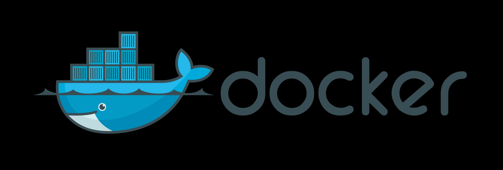

同样，由于项目的发展、功能的拆分以及何种奇怪的改名PR，让我们再次理解Docker的整体架构变得更加困难。

虽然Docker目前的组件较多，并且实现也非常复杂，但是本文不想过多的介绍docker具体的实现细节，我们更想谈一谈Docker这种虚拟化技术的出现有哪些核心技术的支撑。

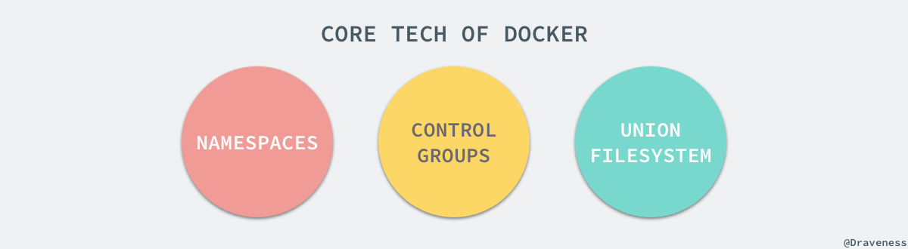

首先，Docker的出现一定是因为目前的后端在开发和运维阶段确实需要一种虚拟化技术解决开发环境和生产环境一致的问题，通过Docker我们可以将程序运行的环境也纳入到版本控制中，排除因为环境造成不同运行结果的可能。但是上述需求虽然推动了虚拟化技术的产生，但是如果没有合适的底层技术支撑，那么我们仍然得不到一个完美的产品。本文剩下的内容会介绍几种Docker使用的核心技术，如果我们了解它们的使用方法和原理，就能清楚Docker的实现原理。

## NameSpaces

命名空间（namespaces）是linux为我们提供的用于分离进程树、网络接口、挂载点以及进程间通信等资源的方法。在日常使用Linux或者macOS时，我们并没有运行多个完全分离的服务器的需要，但是如果我们在服务器上启动了多个服务，这些服务其实会互相影响的，每一个服务都能看到其他服务的进程，也可以访问宿主机器上的任意文件，这是很多时候我们都不愿意看到的，我们更希望运行在同一台机器上的不同服务能做到**完全隔离**，就像运行在多台不同的机器上一样。

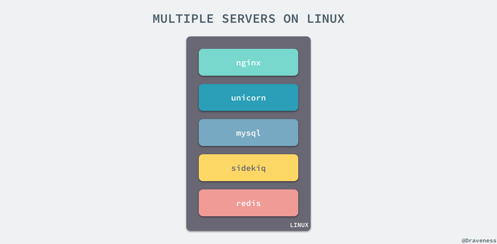

在这种情况下，一旦服务器上的某个服务被入侵，那么入侵者就能够访问当前机器上的所有服务和文件，这也是我们不想看到的，而Docker其实就通过Linux的Namespaces对不同的容器实现了隔离。

Linux的命名空间机制提供了以下其中不同的命名空间，包括CLONE_NEWCGROUP、CLONE_NEWIPC、CLONE_NEWNET、CLONE_NEWNS、CLONE_PID、CLONE_NEWUSER和CLONE_NEWUTS，通过这七个选项我们能在创建新的进程时设置新进程应该在哪些资源上与宿主机器进行隔离。

## 进程

进程是Linux以及现在操作系统中非常重要的概念，它表示一个正在执行的程序，也是在现代分时系统中的一个任务单元。在每一个Linux的操作系统上，我们都能够通过ps命令打印出当前操作系统中正在执行的进程，比如在Ubuntu上，使用该命令就能得到以下的结果：

```shell script
$ ps -ef
UID        PID  PPID  C STIME TTY          TIME CMD
root         1     0  0 Apr08 ?        00:00:09 /sbin/init
root         2     0  0 Apr08 ?        00:00:00 [kthreadd]
root         3     2  0 Apr08 ?        00:00:05 [ksoftirqd/0]
root         5     2  0 Apr08 ?        00:00:00 [kworker/0:0H]
root         7     2  0 Apr08 ?        00:07:10 [rcu_sched]
root        39     2  0 Apr08 ?        00:00:00 [migration/0]
root        40     2  0 Apr08 ?        00:01:54 [watchdog/0]
...
```

当前机器上有很多的进程正在执行，在上述进程中有两个非常特殊，一个是pid为1的/sbin/init进程，另一个是pid为2的kthreadd进程，这两个进程都是被Linux中的上帝进程idle创建出来的，其中前者负责执行内核的一部分初始化工作和系统配置，也会创建一些类似getty的注册进程，而后者负责管理和调度其他的内核进程。

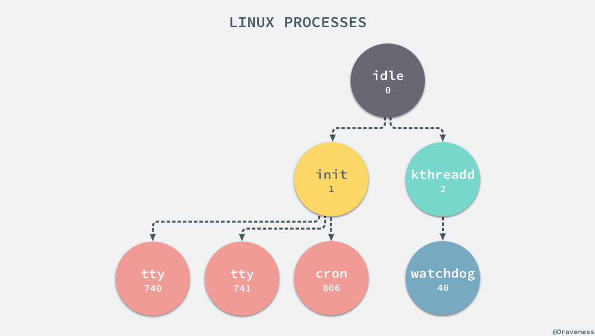

如果我们在当前的Linux操作系统下运行一个新的Docker容器，并通过exec进入其内部的bash并打印其中的全部进程，我们会得到以下的结果：

```shell script
root@iZ255w13cy6Z:~# docker run -it -d ubuntu
b809a2eb3630e64c581561b08ac46154878ff1c61c6519848b4a29d412215e79
root@iZ255w13cy6Z:~# docker exec -it b809a2eb3630 /bin/bash
root@b809a2eb3630:/# ps -ef
UID        PID  PPID  C STIME TTY          TIME CMD
root         1     0  0 15:42 pts/0    00:00:00 /bin/bash
root         9     0  0 15:42 pts/1    00:00:00 /bin/bash
root        17     9  0 15:43 pts/1    00:00:00 ps -ef
```

在新的容器内部执行ps命令打印出了非常干净的进程列表，只有包含当前ps -ef在内的三个进程，在宿主机器上的几十个进程都已经消失不见了。

当前的Docker容器成功将容器内的进程与宿主机器中的进程隔离，如果我们在宿主机上打印当前所有全部进程时，会得到下面三条与Docker相关的结果：

```shell script
UID        PID  PPID  C STIME TTY          TIME CMD
root     29407     1  0 Nov16 ?        00:08:38 /usr/bin/dockerd --raw-logs
root      1554 29407  0 Nov19 ?        00:03:28 docker-containerd -l unix:///var/run/docker/libcontainerd/docker-containerd.sock --metrics-interval=0 --start-timeout 2m --state-dir /var/run/docker/libcontainerd/containerd --shim docker-containerd-shim --runtime docker-runc
root      5006  1554  0 08:38 ?        00:00:00 docker-containerd-shim b809a2eb3630e64c581561b08ac46154878ff1c61c6519848b4a29d412215e79 /var/run/docker/libcontainerd/b809a2eb3630e64c581561b08ac46154878ff1c61c6519848b4a29d412215e79 docker-runc
```

在当前的宿主机器上，可能就存在由上述的不同进程构成的进程树：

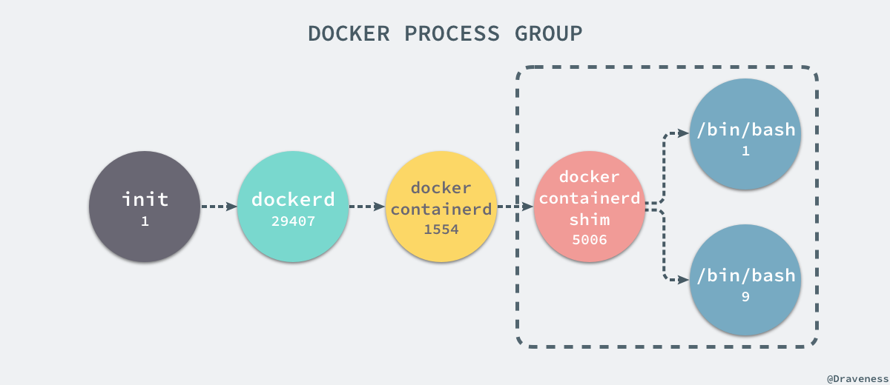

这就是在使用 clone(2) 创建新进程时传入CLONE_NEWPID实现的，也就是使用Linux的命名空间实现进程的隔离，Docker容器内部的任意进程都对宿主机器的进程一无所知

```
containerRouter.postContainersStart
└── daemon.ContainerStart
└── daemon.createSpec
    └── setNamespaces
        └── setNamespace
```

Docker的容器就是使用上述技术实现与宿主机的进程隔离，当我们每次运行都docker run或者docker start时，都会在下面的方法中创建一个用于设置进程间隔离的Spec：

```go
func (daemon *Daemon) createSpec(c *container.Container) (*specs.Spec, error) {
s := oci.DefaultSpec()

// ...
if err := setNamespaces(daemon, &s, c); err != nil {
    return nil, fmt.Errorf("linux spec namespaces: %v", err)
}

return &s, nil
} 
```

在setNamespaces方法中不仅会设置进程相关的命名空间，还会设置与用户、网络、IPC以及UTS相关的命名空间：

```go
func setNamespaces(daemon *Daemon, s *specs.Spec, c *container.Container) error {
// user
// network
// ipc
// uts

// pid
if c.HostConfig.PidMode.IsContainer() {
    ns := specs.LinuxNamespace{Type: "pid"}
    pc, err := daemon.getPidContainer(c)
    if err != nil {
        return err
    }
    ns.Path = fmt.Sprintf("/proc/%d/ns/pid", pc.State.GetPID())
    setNamespace(s, ns)
} else if c.HostConfig.PidMode.IsHost() {
    oci.RemoveNamespace(s, specs.LinuxNamespaceType("pid"))
} else {
    ns := specs.LinuxNamespace{Type: "pid"}
    setNamespace(s, ns)
}

return nil
} 
```

所有命名空间相关的设置Spec最后都会作为Create函数的入参在创建新的容器是进行设置：

```go
daemon.containerd.Create(context.Background(), container.ID, spec, createOptions)
```

所有与命名空间相关的设置都是在上述的两个函数中完成的。Docker通过命名空间成功完成了与宿主机进程和网络的隔离。

## 网络

如果Docker的容器通过Linux的命名空间完成了与宿主机进程的网络隔离，但是却没有办法通过宿主机的网络与整个互联网相连，就会产生很多限制，所以docker虽然可以通过命名空间创建一个隔离的网络环境，但是Docker中的服务仍然需要与外界相连才能发挥作用。每一个使用Docker run启动的容器其实都是具有单独的网络命名空间，Docker为我们提供了四种不同的网络模式，Host、Container、None、和Bridge模式。


在这一部分，我们将介绍Docker默认的网络设置模式：网桥模式。在这种模式下，除了分配隔离的网络命名空间之外，Docker还会为所有的容器设置IP地址。当Docker服务器在主机上启动之后会创建新的虚拟网桥docker0，随后在该主机上启动的全部服务在默认情况下都与该网桥相连。

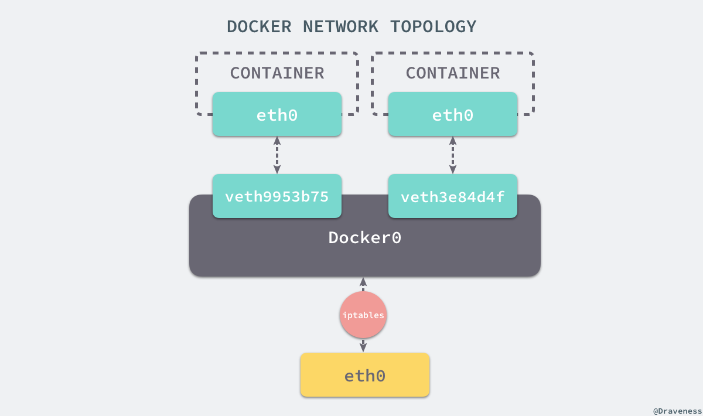

在默认情况下，每一个容器在创建时都会创建一对虚拟网卡，两个虚拟网卡组成了数据的通道，其中一个会放在创建的容器中，会加入到名为docker0的网桥中。我们可以使用如下的命令来查看当前网桥的接口：

```shell script
$ brctl show
bridge name bridge id       STP enabled interfaces
docker0     8000.0242a6654980   no      veth3e84d4f
                                    veth9953b75
```

docker0会为每一个容器分配一个新的IP地址并将docker0的IP地址设置为默认的网关。网桥docker0通过iptables中的配置与宿主机器上的网卡相连，所有符合条件的请求都会通过iptables转发到docker0并由网桥分发给对应的机器。

```shell script
$ iptables -t nat -L
Chain PREROUTING (policy ACCEPT)
target     prot opt source               destination
DOCKER     all  --  anywhere             anywhere             ADDRTYPE match dst-type LOCAL

Chain DOCKER (2 references)
target     prot opt source               destination
RETURN     all  --  anywhere             anywhere
```

我们在当前的机器上使用docker run -d -p 6379:6379 redis 命令启动了一个新的Redis容器，在这之后我们在查看当前iptables的NAT配置就会看到在DOCKER的链中出现了一条新的规则：

```
DNAT       tcp  --  anywhere             anywhere             tcp dpt:6379 to:192.168.0.4:6379
```

上述规则会将从任意源发送到当前机器6379端口的TCP包转发到192.168.0.4:6379所在的地址上。

这个地址其实也是Docker为Redis服务分配的IP地址，如果我们在当前机器上直接ping这个IP地址就会发现它是可以访问到的：

```shell script
$ ping 192.168.0.4
PING 192.168.0.4 (192.168.0.4) 56(84) bytes of data.
64 bytes from 192.168.0.4: icmp_seq=1 ttl=64 time=0.069 ms
64 bytes from 192.168.0.4: icmp_seq=2 ttl=64 time=0.043 ms
^C
--- 192.168.0.4 ping statistics ---
2 packets transmitted, 2 received, 0% packet loss, time 999ms
rtt min/avg/max/mdev = 0.043/0.056/0.069/0.013 ms
```

从上述的一系列现象，我们就可以推测出Docker是如何将容器的内部的端口暴露出来并对数据包进行转发的了；当有Docker的容器需要将服务暴露给宿主机器，就会为容器分配一个IP地址，同时向iptables中追加一个新的规则。

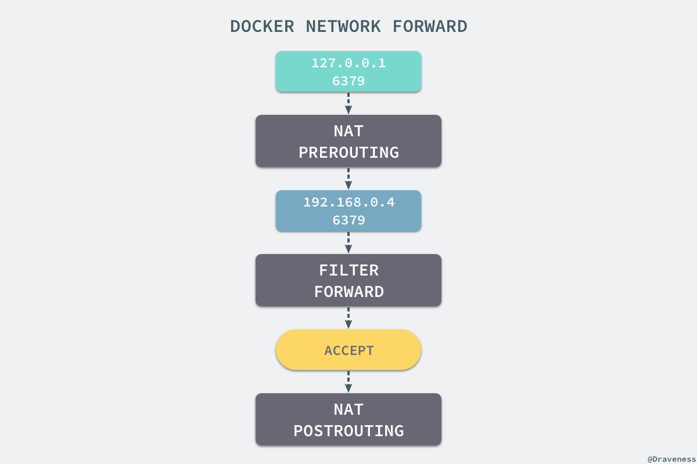

当我们使用redis-cli在宿主机器的命令行中访问127.0.0.1:6379的地址时，经过iptables的NAT PREROUTING将ip地址定向到了192.168.0.4，重定向过的数据包就可以通过iptables中的FILTER配置，最终在NAT POSTROUTING阶段将ip地址伪装成127.0.0.1，到这里虽然从外边看起来我们请求的是127.0.0.1:6379，但实际上请求的已经是Docker容器暴露出的端口了。

```shell script
$ redis-cli -h 127.0.0.1 -p 6379 ping
PONG
```

Docker通过Linux的命名空间实现了网络的隔离，又通过iptables进行数据包转发，让Docker容器能够优雅的为宿主机器或者其他容器提供服务。

## Libnetwork

整个网络部分的功能都是通过Docker拆分出来的libnetwork实现的，它提供了一个连接不同容器的实现，同时也能够为应用给出一个能够提供一致的编程接口和网络层抽象的容器网络模型。

> The goal of libnetwork is to deliver a robust Container Network Model that provides a consistent programming interface and the required network abstractions for applications.

libnetwork中最重要的概念，容器网络模型由一下的几个主要组件组成，分别是Sandbox、Endpoint、和Network：

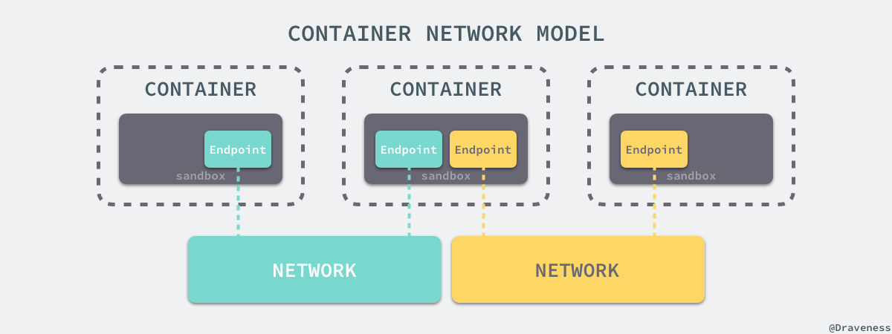

在容器网络模型中，每一个容器内部都包含一个Sandbox，其中存储这当前容器的网络栈配置，包括容器的接口、路由表和DNS设置，Linux使用网络命名空间实现这个Sandbox，每一个Sandbox中都可能会有一个或多个Endpoint，在Linux上就是一个虚拟的网卡veth，Sandbox通过Endpoint加入到对应的网络中，这里的网络可能就是我们在上面提到的Linux网桥或者VLAN。


> 想要获得更多与 libnetwork 或者容器网络模型相关的信息，可以阅读 [Design · libnetwork](https://github.com/docker/libnetwork/blob/master/docs/design.md) 了解更多信息，当然也可以阅读源代码了解不同 OS 对容器网络模型的不同实现。

## 挂载点

虽然我们已经通过Linux的命名空间解决了进程和网络隔离的问题，在Docker进程中我们已经没有办法访问宿主机器上的其他进程并且限制了网络访问，但是Docker容器中的进程仍然能够访问或者修改宿主机器的其他目录，这是我们不希望看到的。

在新的进程中创建隔离的挂载点命名空间需要在clone函数中传入CLONE_NEWNS，这样子进程就能得到父进程挂载点的拷贝，如果不传入这个参数子进程对文件系统的读写都会同步回父进程以及整个主机的文件系统。

如果一个容器需要启动，那么它一定需要提供一个根文件系统（rootfs），容器需要使用这个文件系统来创建一个新的进程，所有二进制的执行必须在这个根文件系统中。

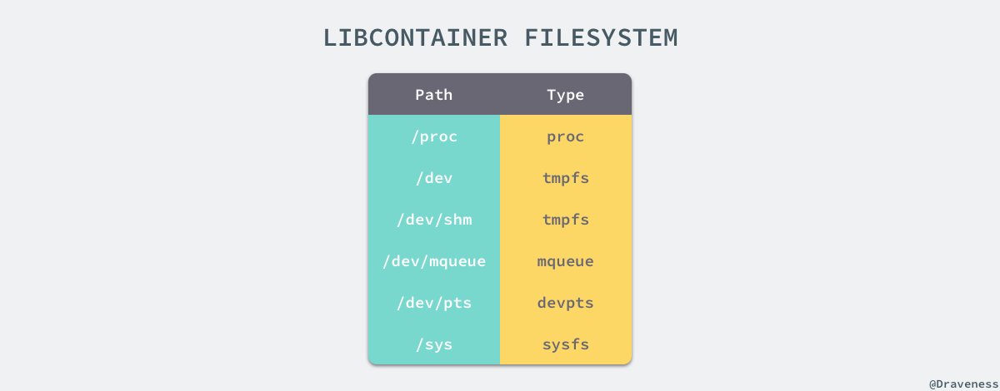

想要正常启动一个容器就需要在rootfs中挂载以上几个特定的目录，除了上述的几个目录需要挂载之外我们还需要建立一些符号链接保证系统IO不会出现问题

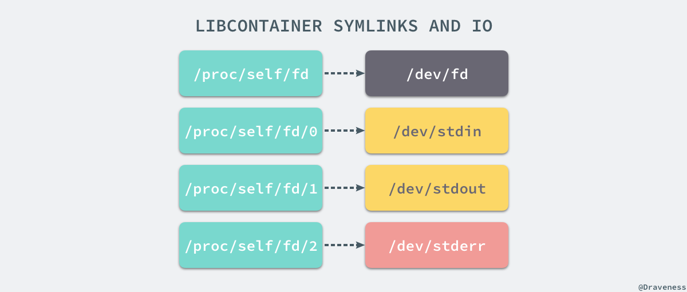

为了保证当前的容器进程没有办法访问宿主机器上的其他目录，我们在这里还需要通过libcontainer提供的pivor_root或者chroot函数改变进程能够访问整个文件目录的根节点

```shell script
// pivor_root
put_old = mkdir(...);
pivot_root(rootfs, put_old);
chdir("/");
unmount(put_old, MS_DETACH);
rmdir(put_old);

// chroot
mount(rootfs, "/", NULL, MS_MOVE, NULL);
chroot(".");
chdir("/");
```

到这里我们就将容器需要的目录挂载到了容器中，同时也禁止当前的容器进程访问宿主机器上的其他目录，保证了不同文件系统的隔离。

>  这一部分的内容是作者在 libcontainer 中的 [SPEC.md](https://github.com/opencontainers/runc/blob/master/libcontainer/SPEC.md) 文件中找到的，其中包含了 Docker 使用的文件系统的说明，对于 Docker 是否真的使用 chroot 来确保当前的进程无法访问宿主机器的目录，作者其实也没有确切的答案，一是 Docker 项目的代码太多庞大，不知道该从何入手，作者尝试通过 Google 查找相关的结果，但是既找到了无人回答的[问题](https://forums.docker.com/t/does-the-docker-engine-use-chroot/25429)，也得到了与 SPEC 中的描述有冲突的[答案](https://www.quora.com/Do-Docker-containers-use-a-chroot-environment)，如果各位读者有明确的答案可以在博客下面留言，非常感谢。

### Chroot

在这里不得不简单介绍下chroot（change root），在linux系统中，系统默认的目录就是以/也就是根目录开头的，chroot的使用能够改变当前的系统根目录结构，通过改变当前系统的根目录，我们能够限制用户的权利，在新的根目录下并不能够访问旧系统根目录的结构文件，也就建立了一个与原系统完全隔离的目录结构。

>  与 chroot 的相关内容部分来自《[理解 chroot](https://www.ibm.com/developerworks/cn/linux/l-cn-chroot/index.html)》一文，各位读者可以阅读这篇文章获得更详细的信息。

### CGroups

我们通过Linux的命名空间为新创建的进程隔离了文件系统、网络并与宿主机器之间的进程相互隔离，但是命名空间并不能够为我们提供物理资源上的隔离，比如CPU和内存，如果在同一台机器上运行了多个对彼此以及宿主机器一无所知的【容器】，这些容器却共同占用了宿主机器的物理资源

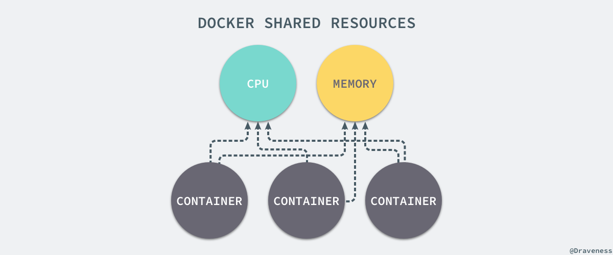

如果其中的某一个容器正在执行CPU密集型的任务，那么就会影响其他容器中任务的性能与执行效率，导致多个容器相互影响并且抢占资源。如何多个容器的资源使用进行限制就成了解决进程虚拟资源隔离之后的主要问题，而Control Groups（简称CGroups）就是能够隔离宿主机器上的物理资源，例如CPU、内存、磁盘I/O和网络带宽。

每一个CGroup都是一组被相同的标准和参数限制的进程，不同的CGroup之间是有层级关系的，也就是说它们之间可以从父类继承一些用于限制资源使用的标准和参数。

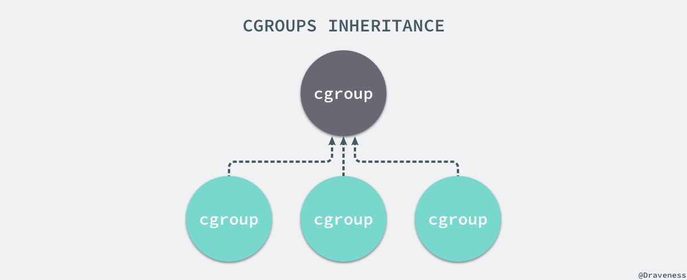

Linux的CGroup能够为一组进程分配资源，也就是我们在上面提到的CPU、内存、网络带宽等资源，通过对资源的分配，CGroup能够提供以下几种功能：

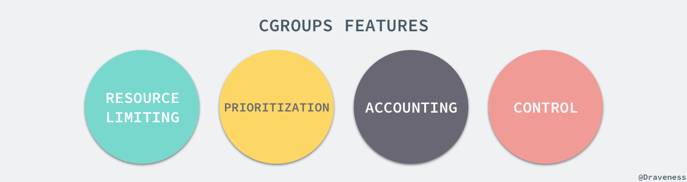

> 在 CGroup 中，所有的任务就是一个系统的一个进程，而 CGroup 就是一组按照某种标准划分的进程，在 CGroup 这种机制中，所有的资源控制都是以 CGroup 作为单位实现的，每一个进程都可以随时加入一个 CGroup 也可以随时退出一个 CGroup。  
> ——[CGroup 介绍、应用实例及原理描述](https://www.ibm.com/developerworks/cn/linux/1506_cgroup/index.html)

Linux 使用文件系统来实现CGroup，我们可以直接使用下面的命令查看当前的CGroup中有哪些子系统：

```shell script
$ lssubsys -m
cpuset /sys/fs/cgroup/cpuset
cpu /sys/fs/cgroup/cpu
cpuacct /sys/fs/cgroup/cpuacct
memory /sys/fs/cgroup/memory
devices /sys/fs/cgroup/devices
freezer /sys/fs/cgroup/freezer
blkio /sys/fs/cgroup/blkio
perf_event /sys/fs/cgroup/perf_event
hugetlb /sys/fs/cgroup/hugetlb
```

大多数Linux的发行版都有着非常相似的子系统，而之所以将上面的cpuset 、cpu等东西称作子系统，是因为它们能够为对应的控制组分配资源并限制资源的使用。

如果我们想要创建一个新的cgroup只需要在想要分配或者限制资源的子系统下面创建一个新的文件夹，然后这个文件夹下就会自动出现很多的内容，如果你在Linux上装了Docker，你就会发现所有的子系统的目录下都有一个名为Docker的文件夹：

```shell script
$ ls cpu
cgroup.clone_children  
...
cpu.stat  
docker  
notify_on_release 
release_agent 
tasks

$ ls cpu/docker/
9c3057f1291b53fd54a3d12023d2644efe6a7db6ddf330436ae73ac92d401cf1 
cgroup.clone_children  
...
cpu.stat  
notify_on_release 
release_agent 
tasks
```

9c3057xxx其实就是我们运行的一个Docker容器，启动这个容器时，Docker会为这个容器创建一个与容器标识符相同的CGroup，在当前的主机上CGroup就会有以下的层级关系。

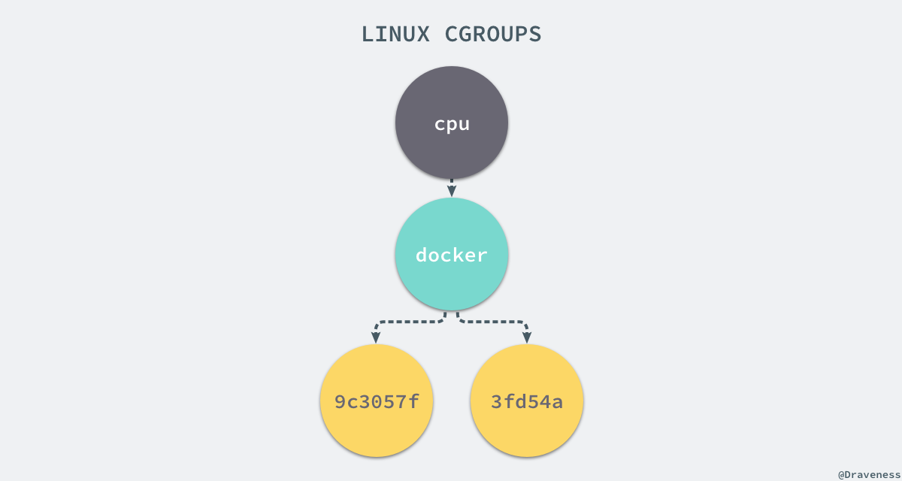

每一个CGroup下面都有一个tasks文件，其中存储着属于当前控制组的所有进程的pid，作为负责cpu的子系统，cpu.cfs_quota_us文件中的内容能够对CPU的使用作出限制，如果当前文件的内容为50000，那么当前控制组中的全部进程CPU占用率不能超过50%。

如果系统管理员想要控制Docker某个容器的资源利用率就可以在docker这个父控制组下面找到相应的子控制组并且改变它们对应文件的内容，当然我们也可以直接在程序运行时就使用参数，让Docker进程去改变相应文件中的内容。

```shell script
$ docker run -it -d --cpu-quota=50000 busybox
53861305258ecdd7f5d2a3240af694aec9adb91cd4c7e210b757f71153cdd274
$ cd 53861305258ecdd7f5d2a3240af694aec9adb91cd4c7e210b757f71153cdd274/
$ ls
cgroup.clone_children  cgroup.event_control  cgroup.procs  cpu.cfs_period_us  cpu.cfs_quota_us  cpu.shares  cpu.stat  notify_on_release  tasks
$ cat cpu.cfs_quota_us
50000
```

当我们使用Docker关闭掉正在运行的容器时，Docker的子控制组对应的文件夹也会被Docker进程移除，Docker在使用CGroup时其实也只是做了一些创建文件夹改变文件内容的文件操作，不过CGroup的使用也确实解决了我们限制子容器资源占用的问题，系统管理员能够为多个容器合理的分配资源并且不会出现多个容器互相抢占资源的问题。

### UnionFS

Linux的命名空间和控制组分别解决了不同资源隔离的问题，前者解决了进程、网络以及文件系统的隔离，后者实现了CPU、内存等资源的隔离，但是在Docker中还有另一个非常重要的问题需要解决——也就是镜像。

镜像到底是什么，它又是如何自称和组织的是作者使用Docker以来的一段时间内比较让作者感到困惑的问题，我们可以使用docker run非常轻松的从远程下载Docker的镜像并在本地运行。

Docker奖项其实本质就是一个压缩包，我们可以使用下面的命令将一个Docker镜像中的文件导出：

```shell script
$ docker export $(docker create busybox) | tar -C rootfs -xvf -
$ ls
bin  dev  etc  home proc root sys  tmp  usr  var
```

你可以看到这个busybox镜像中的目录结构与Linux操作系统的根目录中的内容并没有太多的区别，可以说Docker镜像就是一个文件。

### 存储驱动

Docker使用了一系列不同的存储系统管理镜像内的文件系统并运行容器，这些存储启动与Docker卷（volume）有些不同，存储引擎管理着能够在多个容器之间共享的存储。

想要理解Docker使用的驱动存储，我们首先需要理解Docker是如何构建并且存储镜像的，也需要明白Docker的镜像是如何被每一个容器所使用的；Docker中的每一个镜像都是由一系列只读的层组成的，Dockerfile中的每一个命令都会在已有的只读层创建一个新的层：

```shell script
FROM ubuntu:15.04
COPY . /app
RUN make /app
CMD python /app/app.py
```

容器中的每一层都只对当前容器进行了非常小的修改，上述的Dockerfile文件会构建一个拥有四层layer的镜像。

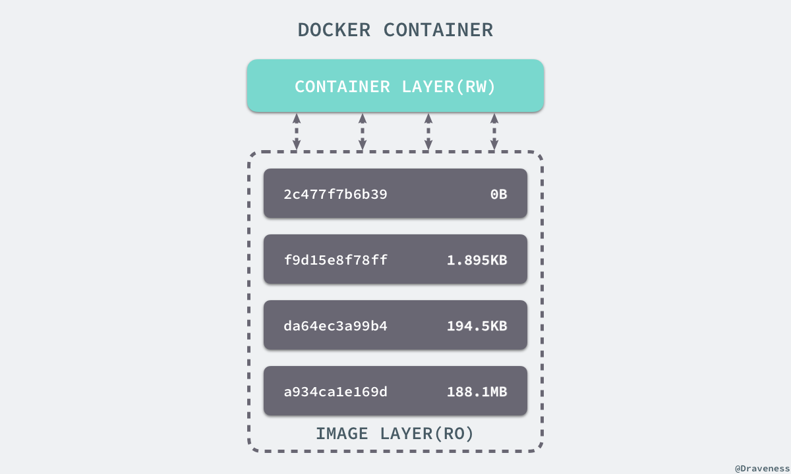

当镜像被docker run命令创建时就会在镜像的最上层添加一个可写的层，也就是容器层，所有对于运行时容器的修改其实都是对这个容器读写层的修改。

容器和镜像的区别就在于，所有的镜像都是只读的，而每一个容器其实等于镜像加上一个可读写的层，也就是同一个镜像可以对应多个容器。

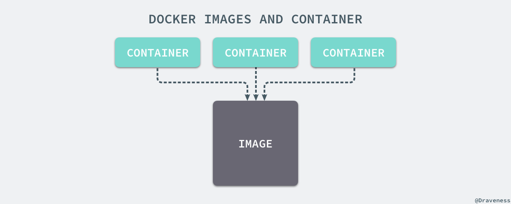

### AUFS

UnionFS其实是一种为Linux操作系统设计的用于把多个文件系统【联合】到同一挂载点的文件系统服务。而AUFS即Advanced UnionFS 其实就是UnionFS的升级版，它能够提供更优秀的性能和效率。

AUFS作为联合文件系统，它能够将不同文件夹中的层联合（Union）到了同一个文件夹中，这些文件夹AUFS中称作为分支，整个（联合）的过程被成为联合挂载（Union Mount）

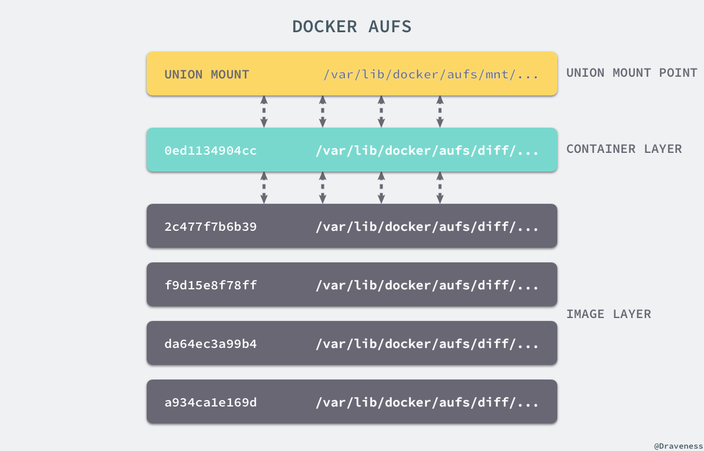

每一个镜像层或者容器层都是/var/lib/docker/目录下的一个子文件夹；在Docker中，所有镜像层和容器层的内容都存储在/var/lib/docker/aufs/diff/目录中：

```
$ ls /var/lib/docker/aufs/diff/00adcccc1a55a36a610a6ebb3e07cc35577f2f5a3b671be3dbc0e74db9ca691c       93604f232a831b22aeb372d5b11af8c8779feb96590a6dc36a80140e38e764d8
00adcccc1a55a36a610a6ebb3e07cc35577f2f5a3b671be3dbc0e74db9ca691c-init  93604f232a831b22aeb372d5b11af8c8779feb96590a6dc36a80140e38e764d8-init
019a8283e2ff6fca8d0a07884c78b41662979f848190f0658813bb6a9a464a90       93b06191602b7934fafc984fbacae02911b579769d0debd89cf2a032e7f35cfa
...
```

而/var/lib/docker/aufs/layers/中存储着镜像层的元数据，每一个文件都保存着镜像层的源数据，最后的/var/lib/docker/aufs/mnt/包含镜像或者容器层的挂载点，最终会被Docker通过联合的方式进行组装。

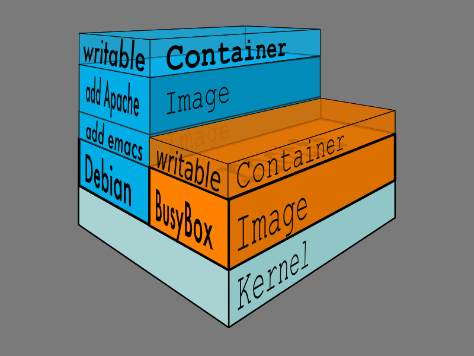

上面的这张图片非常好的展示了组装的过程，每一个镜像层都是建立在另一个镜像层之上，同时所有的镜像层都是只读的，只有每个容器最顶层的容器层才可以被用户直接读写，所有的容器都建立在一些底层服务（Kernel）上，包括命名空间、控制组、rootfs等等，这种容器的组装方式提供了非常大的灵活性，只读的镜像层通过共享也能够减少磁盘的占用。

### 其他存储驱动

AUFS只是Docker使用的存储驱动的一种，出了AUFS之外，docker还支持了不同的存储驱动，包括aufs，devicemapper，overlay2、zfs和vfs等等，在最新的docker中，overlay2取代了aufs成为了推荐的存储的驱动，但是在没有overlay2驱动的机器上仍然会使用aufs作为Docker的默认驱动。

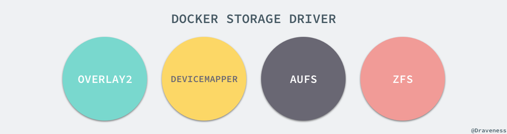

不同的存储驱动在存储镜像和容器文件时也有着完全不同的实现，有兴趣的读者可以在Docker的官方文档  [Select a storage driver](https://docs.docker.com/engine/userguide/storagedriver/selectadriver/)中找到相应的内容。

想要查看当前系统的Docker上使用了哪些存储驱动只需要使用以下的命令就能得到相对应的信息：

```
$ docker info | grep Storage
Storage Driver: aufs
```

作者的这台Ubuntu上由于没有overlay2存储驱动，所以使用aufs作为Docker的默认存储驱动。

## 总结

Docker目前已经成为了非常主流的技术，已经在很多成熟公司的生产环境中使用，但是Docker的核心技术其实已经有很多年的历史，Linux命名空间、控制组和UnionFS三大技术支撑了目前Docker的实现，也是Docker能够出现的最重要原因。

作者在学习Docker实现原理的过程中查阅了非常多的资料，从中也学习到了很多与Linux操作系统相关的知识，不过由于Docker目前的代码库实在是过于庞大，想要从源代码的角度完全理解Docker的实现细节已经是非常困难的了，但是如果各位读者真的对其实现细节感兴趣，可以从[Docker CE](https://github.com/docker/docker-ce)源代码开始了解Docker的原理。

##  Reference

*   [Chapter 4. Docker Fundamentals · Using Docker by Adrian Mount](https://www.safaribooksonline.com/library/view/using-docker/9781491915752/ch04.html)
*   [TECHNIQUES BEHIND DOCKER](https://washraf.gitbooks.io/the-docker-ecosystem/content/Chapter%201/Section%203/techniques_behind_docker.html)
*   [Docker overview](https://docs.docker.com/engine/docker-overview/#the-underlying-technology)
*   [DOCKER 基础技术：AUFS](https://coolshell.cn/articles/17061.html)
*   [RESOURCE MANAGEMENT GUIDE](https://access.redhat.com/documentation/en-us/red_hat_enterprise_linux/6/html/resource_management_guide/)
*   [Kernel Korner - Unionfs: Bringing Filesystems Together](http://www.linuxjournal.com/article/7714)
*   [Union file systems: Implementations, part I](https://lwn.net/Articles/325369/)
*   [IMPROVING DOCKER WITH UNIKERNELS: INTRODUCING HYPERKIT, VPNKIT AND DATAKIT](https://blog.docker.com/2016/05/docker-unikernels-open-source/)
*   [Separation Anxiety: A Tutorial for Isolating Your System with Linux Namespaces](https://www.toptal.com/linux/separation-anxiety-isolating-your-system-with-linux-namespaces)
*   [理解 chroot](https://www.ibm.com/developerworks/cn/linux/l-cn-chroot/index.html)
*   [Linux Init Process / PC Boot Procedure](http://www.yolinux.com/TUTORIALS/LinuxTutorialInitProcess.html)
*   [Docker 网络详解及 pipework 源码解读与实践](http://www.infoq.com/cn/articles/docker-network-and-pipework-open-source-explanation-practice#)
*   [Docker Bridge Network Driver Architecture](https://github.com/docker/labs/blob/master/networking/concepts/05-bridge-networks.md)
*   [Linux Firewall Tutorial: IPTables Tables, Chains, Rules Fundamentals](http://www.thegeekstuff.com/2011/01/iptables-fundamentals/)
*   [Traversing of tables and chains](http://www.iptables.info/en/structure-of-iptables.html)
*   [Docker 网络部分执行流分析（Libnetwork 源码解读）](http://dockone.io/article/1255)
*   [Libnetwork Design](https://github.com/docker/libnetwork/blob/master/docs/design.md)
*   [剖析 Docker 文件系统：Aufs与Devicemapper](http://www.infoq.com/cn/articles/analysis-of-docker-file-system-aufs-and-devicemapper)
*   [Linux - understanding the mount namespace & clone CLONE\_NEWNS flag](https://stackoverflow.com/questions/22889241/linux-understanding-the-mount-namespace-clone-clone-newns-flag)
*   [Docker 背后的内核知识 —— Namespace 资源隔离](http://www.infoq.com/cn/articles/docker-kernel-knowledge-namespace-resource-isolation)
*   [Infrastructure for container projects](https://linuxcontainers.org)
*   [Spec · libcontainer](https://github.com/opencontainers/runc/blob/master/libcontainer/SPEC.md)
*   [DOCKER 基础技术：LINUX NAMESPACE（上）](https://coolshell.cn/articles/17010.html)
*   [DOCKER 基础技术：LINUX CGROUP](https://coolshell.cn/articles/17049.html)
*   [《自己动手写Docker》书摘之三： Linux UnionFS](https://yq.aliyun.com/articles/65034)
*   [Introduction to Docker](http://www.programering.com/a/MDMzAjMwATk.html)
*   [Understand images, containers, and storage drivers](https://docs.docker.com/v1.9/engine/userguide/storagedriver/imagesandcontainers/)
