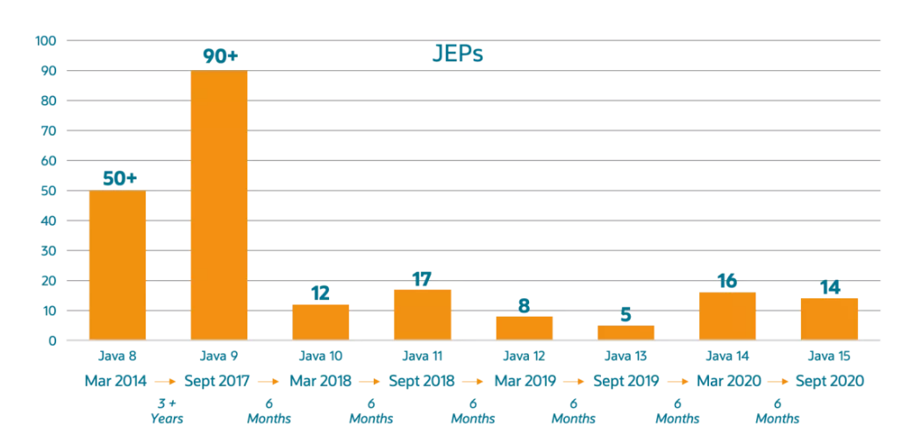
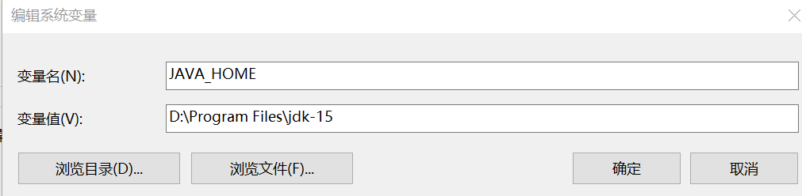
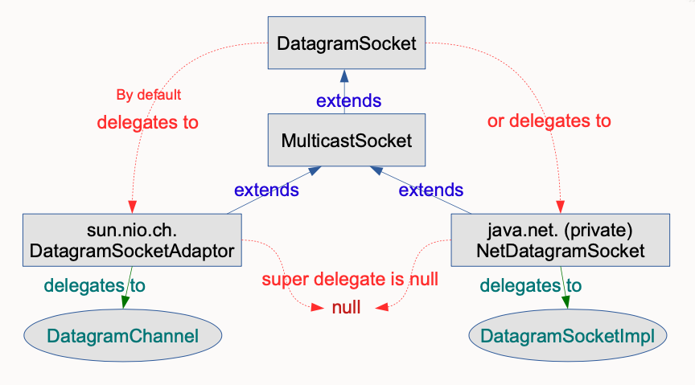

[TOC]: # "JDK15安装及新特性介绍"

JDK15已经于2020年9月15日如期发布。本文介绍JDK15新特性。

## 发布版本说明

根据发布的规划，这次发布的JDK15将是一个短期的过渡版，只会被Oracle支持(维护)6个月，直到明年3月的JDK16发布此版本将停止维护。而Oracle下一个长期支持版(LTS版)会在明年的9月份发布(Java17)，LTS每3年发布一个，上一次长期支持版是18年9月的JDK11。下图展示了各个版本的发布历史。



## 安装包下载

主要分为OpenJDK版本和Oracle版本，下载地址如下：

- OpenJDK版本：[https://jdk.java.net/15/](https://jdk.java.net/15/)
- Oracle版本：[http://www.oracle.com/technetwork/java/javase/downloads/index.html](http://www.oracle.com/technetwork/java/javase/downloads/index.html)

上述版本，如果是个人学习用途，则差异不大。但如果是用于商业用途，则需要仔细看好相关的授权。OracleJDK根据二进制代码徐鹤协议获得许可，而OpenJDK根据GPL v2许可获得许可。

## 安装、验证

本例子以OpenJDK版本为例。解压安装包`openjdk-15_windows-x64_bin.zip`到任意位置。

设置系统环境变量"JAVA_HOME"，如下图所示。



在用户变量"Path"中，增加“%JAVA_HOME%\bin”。

安装完成后，执行下面命令进行验证：

```cmd
>java -version
openjdk version "15" 2020-09-15
OpenJDK Runtime Environment (build 15+36-1562)
OpenJDK 64-Bit Server VM (build 15+36-1562, mixed mode, sharing)
```

## JDK15新特性说明

JDK15为用户提供了14项主要的增强/更改，包括一个孵化器模块，三个预览功能，两个不推荐使用的功能以及两个删除功能、

### 1. EdDSA数字签名算法

新加入的Edward-Curve数字签名算法(EdDSA)实现加密签名。在许多其他加密库（如OpenSSL和BoringSSL）中得到支持。与JDK中现有签名方案相比，EdDSA具有更高的安全性和性能。这是一个新的功能。

使用示例如下：

```java
// example: generate a key pair and sign
KeyPairGenerator kpg = KeyPairGenerator.getInstance("Ed25519");
KeyPair kp = kpg.generateKeyPair();
// algorithm is pure Ed25519 
Signature sig = Signature.getInstansce("Ed25519");
sig.initSign(kp.getPrivate());
sig.update(msg);
byte[] s = sig.sign();

//example: use KeyFactory to contruct a public key
KeyFactory kf = KeyFactory.getInstance("EdDSA");
boolean xOdd = ...
BigInteger y = ...
NamedParameterSpec paramSpec = new NamedParamaterSpec("Ed25519");
EdECPublicKeySpec pubSpec = new EdECPublicKeySpec(paramSpec,new EdPoint(xOdd,y));
PublicKey pub = kf.generatePublic(pubSpec);
```

有关EdDSA数字签名算法的详细内容见[RFC 8032](https://tools.ietf.org/html/rfc8032)规范。

### 2.封闭类（预览特性）

可以是封闭类和或者封闭接口，用来增强Java编程语言，防止其他类或接口扩展或实现它们。

有了这个特性，意味着以后不是你想继承就继承，想实现就实现了，你得经过允许才行。

示例如下：

```java
public abstract sealed class Student
permits ZhangSan,Lisi,ZhaoLiu{
    ...
}
```

类Student被sealed修饰，说明它是一个封闭类，并且只允许指定的3个子类继承。

### 3. 隐藏类

此功能可帮助需要在运行时生成类的框架。框架生成类需要动态扩展其行为，但是又希望限制对这些类的访问。隐藏类很有用，因为它们只能通过反射访问，而不能从普通字节码访问。此外，隐藏类可以独立于其他类加载，这可以减少框架的内存占用。这是一个新功能。

### 4. 移除了Nashorn JavaScript脚本引擎

移除了Nashorn JavaScript脚本引擎、APIs，以及jjs工具。这些早在JDK11中就已经被标记为deprecated了，JDK15被移除就很正常了。

Nashorn是JDK1.8引入的一个JavaScript脚本引擎，用来取代Rhino脚本引擎。Nashorn是ECMAScript-2625.1的完整实现，增强了java和JavaScript的兼容性，并且大大提升了性能。

那么为什么要移除？

官方的解释是主要的：随着ECMAScript 脚本语言的结构、API的改变速度越来越快，维护Nashorn太有挑战性了，所以......。

### 5. 重新实现了DatagramSocket API

重新实现旧版DatagramSocket API，更简单、更现代的实现来代替java.net.DatagramSocket和java.net.MulticastSocketAPI 的基础实现，提高了 JDK 的可维护性和稳定性。

新的底层实现将很容易使用虚拟线程，目前Loom项目中进行探索。这也是JEP 353的后续更新版本，JEP 353已经重新实现了Socket API。



### 6. 准备禁用和废除偏向锁

在JDK15中，默认情况下禁用偏向锁（Biased Locking），并弃用所有相关的命令行选项。

后面再确定是否需要支持偏向锁，因为维护这种锁同步优化的成本太高了。

### 7. 模式匹配（第二次预览）

第一次预览JDK 14中提出来的。

Java 14之前用法：

```java
if (obj instanceof String) {
    String s = (String) obj;
    // 使用s
}
```

Java 14 之后的用法：

```java
if (obj instanceof String s) {
    // 使用s
}
```

Java 15 并没有对此特性进行调整，继续预览特性，只是为了收集更多的用户反馈，可能还不成熟吧。

### 8.ZGC功能转正

ZGC是一个可伸缩、低延迟的垃圾回收器。

ZGC已由JEP 333集成到JDK 11中，其目标是通过减少GC停顿时间来提高性能。借助JEP 377，JDK15将ZGC垃圾收集器从预览特性变更为正式特性而已，没错，转正了。

这个JEP不会更改默认的GC，默认仍然是G1.

### 9.文本块功能转正

文本块，是一个多行字符串，它可以避免使用大多数转义符号，自动以可预测的方式格式化字符串，并让开发人员在需要时可以控制格式。

文本块最早准备在JDK 12添加的，但最终撤销了，然后在JDK 13中作为预览 特性进行了添加，然后又在JDK14 中再次预览，在JDK15中，文本块终于转正，暂不再做进一步的更改。

Java 13 之前用法，使用one-dimensional的字符串语法：

```java
String html = "<html>\n" +
              "    <body>\n" +
              "        <p>Hello, world</p>\n" +
              "    </body>\n" +
              "</html>\n";
```

Java 13 之后用法，使用two-dimensional文本块语法：

```java
String html = """
              <html>
                  <body>
                      <p>Hello, world</p>
                  </body>
              </html>
              """;
```

### 10. Shenandoah垃圾回收算法转正

Shenandoah 垃圾回收从实验特性变为产品特性。这是一个从 JDK 12 引入的回收算法，该算法通过与正在运行的 Java 线程同时进行疏散工作来减少 GC 暂停时间。Shenandoah 的暂停时间与堆大小无关，无论堆栈是 200 MB 还是 200 GB，都具有相同的一致暂停时间。

JDK 15 Shenandoah垃圾收集器从预览特性变更为正式特性而已，没错，又是转正了。

### 11. 移除了Solaris和SPARC端口

移除了 Solaris/SPARC、Solaris/x64 和 Linux/SPARC 端口的源代码及构建支持。这些端口在 JDK 14 中就已经被标记为 deprecated 了，JDK 15 被移除也不奇怪。

### 12.外部存储器访问API（二次孵化）

这个最早在JDK14 中成为孵化特性，JDK15 继续二次孵化并对其API有了一些更新。

目的是引入一个API，以允许Java程序安全有效的访问Java堆之外的外部内存。这同样是Java 14 的一个预览特性。

### 13.Record Class （二次预览）

Record Class也是第二次出现的预览功能，它在JDK14中也出现过一次了，使用Record可以更方便的创建一个常量类，使用的前后代码对比如下。

旧写法：

```java
class Point {
    private final int x;
    private final int y;
 
    Point(int x, int y) { 
        this.x = x;
        this.y = y;
    }
 
    int x() { return x; }
    int y() { return y; }
 
    public boolean equals(Object o) { 
        if (!(o instanceof Point)) return false;
        Point other = (Point) o;
        return other.x == x && other.y = y;
    }
 
    public int hashCode() {
        return Objects.hash(x, y);
    }
 
    public String toString() { 
        return String.format("Point[x=%d, y=%d]", x, y);
    }
}
```

新写法：

```java
record Point(int x, int y) { }
```

也就是说在使用了record之后，就可以用一行代码编写出一个常量类，并且这个常量类还包含了构造方法、toString()、equals()和hashCode()等方法。

### 14. 废除RMI激活

废除RMI激活，以便在将来进行删除。需要说明的是，RMI激活是RMI中一个过时的组件，自Java8以来一直是可选的。

