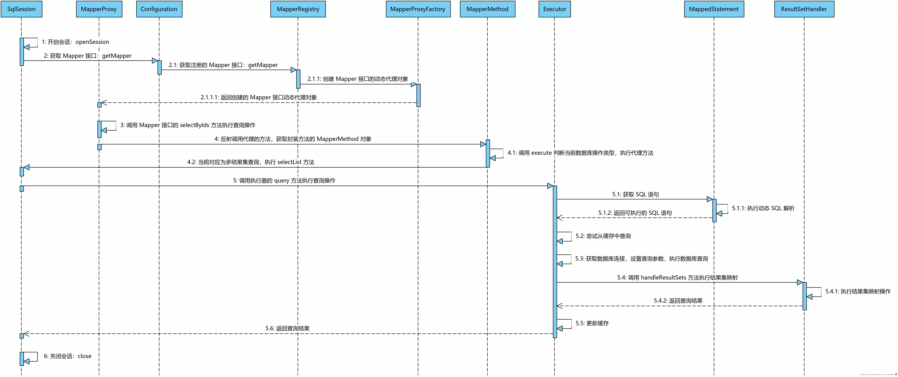
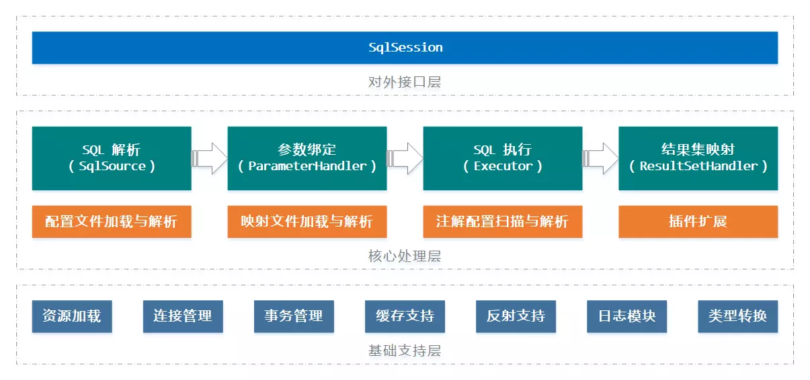

[TOC]: # "MyBatis源码解析"

# MyBatis源码解析
- [架构初探](#架构初探)
- [配置文件的加载和解析](#配置文件的加载和解析)
  - [配置文件的加载过程](#配置文件的加载过程)
  - [配置文件的解析过程](#配置文件的解析过程)


## 架构初探

[MyBatis](http://blog.mybatis.org/)是一个易用、轻量，且强大的半自动化的ORM框架，在设计思想和代码实现上都有许多值得我们借鉴的地方，例如动态代理机制的应用，资源文件的加载与解析，缓存模块的设计、反射机制的应用，插件模块的设计，架构分层，以及对设计模式的应用等，是一个非常是适合初入源码阅读领域的练手项目。本文将从配置文件解析、映射文件解析，以及SQL语句执行机制这三大方向对整个框架的实现展开分析。本章主要从整体的角度对MyBatis的架构设计做一个综述性的介绍。

在正式开始之前，先以一个小例子演示以下MyBatis的基本使用。Mybatis目前已经同时支持XML和注解方式编写SQL语句，虽然注解在Spring中极大的提升了使用体验，但是对于MyBatis而言，个人还是比较倾向于XML配置SQL语句。下面的示例采用XML配置的方式：

```xml
  <resultMap id="BaseResultMap" type="org.zhenchao.mybatis.entity.User">
    <id column="id" jdbcType="BIGINT" property="id"/>
    <result column="username" jdbcType="VARCHAR" property="username"/>
    <result column="password" jdbcType="VARCHAR" property="password"/>
    <result column="age" jdbcType="INTEGER" property="age"/>
    <result column="phone" jdbcType="VARCHAR" property="phone"/>
    <result column="email" jdbcType="VARCHAR" property="email"/>
</resultMap>

<sql id="Base_Column_List">
    id, username, `password`, age, phone, email
</sql>

<select id="selectByName" parameterType="java.lang.String" resultMap="BaseResultMap">
    select
    <include refid="Base_Column_List"/>
    from t_user
    where username = #{name,jdbcType=VARCHAR}
</select>
```

接下来，我们就可以编写代码基于MyBatis执行数据库操作，示例如下：

```java
SqlSessionFactory sessionFactory = new SqlSessionFactoryBuilder()
        .build(Resources.getResourceAsStream("mybatis-config.xml"));
try (SqlSession sqlSession = sessionFactory.openSession()) {
    UserMapper mapper = sqlSession.getMapper(UserMapper.class);
    User user = mapper.selectByName("zhenchao");
    // ... use user object
}
```

这个小例子演示了查询特定名称对应的用户信息的操作，MyBatis可以基于传递的参数动态生成对应的SQL语句。后面的源码分析章节，我们将围绕这个小例子去探究MyBatis加载解析资源文件、绑定实参并执行方法对应的SQL语句，以及最终返回目标实体对象的过程。下面先对MyBatis的运行机制做一个简单的概括，先从整体上对该框架的执行过程有一个感知。

Mybatis是基于配置的框架，它包含两大类型的配置文件，即`mybatis-config.xml`和Mapper接口对应的SQL语句配置。这里先约定一下，后面的文章我们会将前者称为**配置文件**，而将后者称为映射文件。MyBatis框架在启动时会加载并解析这两大类配置，整个过程对应上述示例中的第一行代码。当完成了对框架的初始化过程，接下来我们就可以创建数据库会话，获取Mapper对象并执行目标数据库操作，这一过程可以用下面这幅时序图进行描述



SqlSession是MyBatis对外提供的执行数据库操作的统一接口，表示一次数据库会话，所以在具体操作数据库之前需要先开启会话（即获取SqlSession对象）。然后需要告知MyBatis当前期望操作的具体Mapper接口，Mybatis规定所有的Mapper需要定义成接口的形式，这主要是配合JDK自带的动态代理机制。Mybatis会基于动态代理机制为当前Mapper接口创建对应的代理对象，并激活对象`InvocationHandler#invoke`方法。在方法执行过程中判断当前的SQL语句类型，并转给SQL执行器Executor去执行。Executor先尝试从框架自带的缓存（一级缓存和二级缓存）中获取当前查询对应的结果，如果缓存不命中则会执行数据库操作。对于查询操作而言，数据库返回的结果集与我们期望的实际对象时间还差那么一丢丢，此时，MyBatis强大的结果集映射处理就可以大显身手，讲解国际按照我们的配置映射成为具体的是实体类对象（集合）返回。

以上只是大致对框架的运行机制做了一个概括，具体的实现细节后续会用专门的章节进行讲解。下面来看一下MyBatis整体的架构设计，如下图所示：



按照功能进行划分，并参考前人的一些总结，我将MyBatis的架构设计分为三层：基础支持层、核心处理层、以及对外接口层。本文的后续章节将分别从配置文件分析、映射文件解析，以及SQL语句执行机制三个方面对MyBatis的实现进行探究，期间会涉及到上图中的各个模块。


## 配置文件的加载和解析

上一章我们曾约定`mybatis-config.xml`文件为配置文件，SQL语句配置文件为映射文件，本章我们将沿用上一章中的示例程序，一起来探究一下MyBatis加载和解析配置文件（即`Mybatis-config.xml`)的过程。

### 配置文件的加载过程

在示例程序中，执行配置文件（包括后面要介绍的映射文件）加载与解析的过程位于第一行代码中（如下）。其中，Resources是一个简单的基于类路径或其他位置获取数据流的工具类，借助该工具类可以获取配置文件的InputStream流对象，然后将其传递给`SqlSessionFactoryBuilder#build`方法以构造SqlSessionFactory对象。

```java
SqlSessionFactory sessionFactory = new SqlSessionFactoryBuilder()
                .build(Resources.getResourceAsStream("mybatis-config.xml"));
```

SqlSessionFactoryBuilder 由名字可知它是一个构造器，用于构造 SqlSessionFactory 对象。按照 MyBatis 的官方文档来说，SqlSessionFactoryBuilder 一旦构造完 SqlSessionFactory 对象便完成了其使命。其实现也比较简单，只定义了`SqlSessionFactoryBuilder#build`这一个方法及其重载版本，如下：

```java
public SqlSessionFactory build(InputStream inputStream, String environment, Properties properties) {
    try {
        // 创建 XML 配置文件解析器，期间会创建 Configuration 对象
        XMLConfigBuilder parser = new XMLConfigBuilder(inputStream, environment, properties);
        // 解析配置文件填充 Configuration 对象，并基于配置构造 SqlSessionFactory
        return this.build(parser.parse());
    } catch (Exception e) {
        throw ExceptionFactory.wrapException("Error building SqlSession.", e);
    } finally {
        // 执行关闭前的清理工作
        ErrorContext.instance().reset();
        try {
            inputStream.close();
        } catch (IOException e) {
            // Intentionally ignore. Prefer previous error.
        }
    }
}

public SqlSessionFactory build(Configuration config) {
    return new DefaultSqlSessionFactory(config);
}
```

上述实现的核心在于如下两行：

```java
XMLConfigBuilder parser = new XMLConfigBuilder(inputStream, environment, properties);
return this.build(parser.parse());
```

第一行用来构造XMLConfigBuilder对象，XMLConfigBuilder 可以看作是`mybatis-config.xml`配置文件的解析器；第二行则调用该对象的`XMLConfigBuilder#parse`方法对配置文件进行解析，并记录相关配置项到Configuration对象中，然后基于该配置对象创建SqlSessionFactory对象返回。  
Configuration可以看作是MyBatis框架内部全局唯一的配置类，用于记录几乎所有的配置和映射，以及运行过程中的中间值。后面我们会经常遇到这个类，现在可以将其理解为MyBatis框架的配置中心。

我们来看一下XMLConfigBuilder对象的构造过程：

```java
public XMLConfigBuilder(InputStream inputStream, String environment, Properties props) {
    this(
        // 构造 XPath 解析器
        new XPathParser(inputStream, true, props, new XMLMapperEntityResolver()),
        environment,
        props);
}

private XMLConfigBuilder(XPathParser parser, // XPath 解析器
                         String environment, // 当前使用的配置文件组 ID
                         Properties props) // 参数指定的配置项
{
    // 构造 Configuration 对象
    super(new Configuration());
    ErrorContext.instance().resource("SQL Mapper Configuration");
    // 将参数指定的配置项记录到 Configuration#variables 属性中
    this.configuration.setVariables(props);
    // 标识配置文件还未被解析
    this.parsed = false;
    this.environment = environment;
    this.parser = parser;
}
```

构造方法各参数的释义见代码注释。这里针对一些比较不直观的参数作进一步说明，首先看一下XPathParser类型的构造参数。我们需要知道的一点是，MyBatis基于DOM树对XML配置文件进行解析，而操作DOM树的方式则是基于XPath[（XML Path Language)](https://zh.wikipedia.org/wiki/XPath)。它是一种能够极大简化XML操作的路径语言，优点在于简单、直观，并且好用，没有接触过的同学可以针对性的学习一下。XPathParser基于XPath基于语法对XML进行解析，其实现比较简单，这里不展开说明。

接着看一下environment参数。基于配置的框架一般都允许配置多套环境，以应对开发、测试、灰度，以及生产环境。除了后面会讲到的`<environment/>`配置，MyBatis也允许我们通过参数指定实际生效的配置环境，我们在调用`SqlSessionFactoryBuilder#build`方法时，可以以参数形式执行当前使用的配置环境。

### 配置文件的解析过程

完成了XMLConfigBuilder对象的构造，下一步会调用其`XMLConfigBuilder#parse`方法执行对配置文件的解析操作。在具体配置文件的解析过程之前，先简单介绍以下后续过程依赖的一些基础组件。

上面用到的XMLConfigBuilder类派生自BaseBuilder抽象类，包括后面会介绍的XMLMapperBuilder、XMLStatementBuilder，以及SqlSourceBuilder 等都继承自该抽象类。先来看一下BaseBuilder的字段含义：

```java
/** 全局唯一的配置对象 */
protected final Configuration configuration;
/** 记录别名与类型的映射关系 */
protected final TypeAliasRegistry typeAliasRegistry;
/** 记录类型对应的类型处理器 */
protected final TypeHandlerRegistry typeHandlerRegistry;
```

BaseBuilder仅定义了三个属性，各属性的作用见代码注释。XMLConfigBuilder构造方法调用了父类BaseBuilder的构造方法以实现对这三个属性的初始化，前面我们提及到的封装全局配置的Configuration对象就记录在这里。接下来分析一下属性`BaseBuilder#typeAliasRegistry`和`BaseBuilder#typeHandlerRegistry`分别对应的TypeAliasRegistry类和TypeHandlerRegistry类的功能和实现。

- TypeAliasRegistry

我们都知道在编写SQL语句时可以为表名或列名定义别名(alias)，以减少书写量，而TypeAliasRegistry是对别名这一机制的延申，借助于此，我们可以为任意类型定义别名。

TypeAliasRegistry中仅定义了一个Map类型的属性 `TypeAliasRegistry#typeAliases` 充当内存数据库，记录这别名与具体类型之间的映射关系。TypeAliasRegistry 持有一个无参数的构造方法，其中只做一件事，即调用 `TypeAliasRegistry#registerAlias` 方法为常用类型注册对应的别名。该方法的实现如下：

```java
public void registerAlias(String alias, Class<?> value) {
    if (alias == null) {
        throw new TypeException("The parameter alias cannot be null");
    }
    // 将别名转换成小写
    String key = alias.toLowerCase(Locale.ENGLISH);
    // 防止重复注册
    if (typeAliases.containsKey(key) && typeAliases.get(key) != null && !typeAliases.get(key).equals(value)) {
        throw new TypeException("The alias '" + alias + "' is already mapped to the value '" + typeAliases.get(key).getName() + "'.");
    }
    // 建立映射关系记录到 Map 中
    typeAliases.put(key, value);
}
```

整个方法的执行过程本质上就是将(alias,value)键值对写入Map集合中，只是在插入之前需要保证alias不为null，且不允许相同的别名和类型重复注册。除了这里的单个注册，TypeAliasRegistry 还提供了`TypeAliasRegistry#registerAliases` 方法，允许扫描注册指定package下main的所有类或指定类型及其子类型。在批量扫描注册时，我们可以利用@Alias注解为类指定别名，否则Mybatis将会以当前类的simple name作为类型别名。

当然，能够注册就能够获取，方法TypeAliasRegistry#resolveAlias提供了获取指定别名对应类型的能力。实现比较简单，无非就是从Map集合中获取指定key对应的value。

- TypeHandlerRegistry

再来看一下TypeHandlerRegistry类，在开始分析之前我们必须先对TypeHandler接口有一个了解。我们都知道JDBC定义的类型（枚举类JdbcType对已有JDBC类型进行了封装）与Java定义的类型并不是完全匹配的，所以就需要在这中间执行一些转换操作，而TypeHandler的职责就在于此。TypeHandler是一个接口，其中定义了4个方法：

```java
import java.sql.PreparedStatement;

public interface TypeHandler<T> {

    /** 为 {@link PreparedStatement} 对象绑定参数（将数据由 java 类型转换成 JDBC 类型） */
    void setParameter(PreparedStatement ps, int i, T parameter, JdbcType jdbcType) throws SQLException;

    /** 获取结果集中对应的参数值（将数据由 JDBC 类型转换成 java 类型） */
    T getResult(ResultSet rs, String columnName) throws SQLException;
    T getResult(ResultSet rs, int columnIndex) throws SQLException;

    /** 获取存储过程中输出类型的参数值（将数据由 JDBC 类型转换成 java 类型） */
    T getResult(CallableStatement cs, int columnIndex) throws SQLException;

}
```
围绕TypeHandler接口的实现类用于处理特定类型，具体可以参考官方文档。

对TypeHandler有一个基本认识之后，继续来看TypeHandlerRegistry。顾名思义，这是一个TypeHandler的注册中心。TypeHandlerRegistry中定义了多个final类型Map类型属性，已记录类型及其类型处理器TypeHandler之间的映射关系，其中最核心的两个属性定义如下：

```java
/**
 * 记录 JDBC 类型与 {@link TypeHandler} 之间映射关系，
 * 用于从结果集读取数据时，将 JDBC 类型转换对应的 java 类型
 */
private final Map<JdbcType, TypeHandler<?>> jdbcTypeHandlerMap = new EnumMap<>(JdbcType.class);

/**
 * 记录 java 类型转 JDBC 类型时所需要的 {@link TypeHandler}，
 * 一个 java 类型可能存在多个 JDBC 类型
 */
private final Map<Type, Map<JdbcType, TypeHandler<?>>> typeHandlerMap = new ConcurrentHashMap<>();
```

在构造TypeHandlerRegistry 对象时，会调用 `TypeHandlerRegistry#register` 方法注册类型及其对应的类型处理器，实现如下：

```java
private void register(Type javaType, JdbcType jdbcType, TypeHandler<?> handler) {
    // 如果 javaType 不为空，则添加对应的类型处理器到 typeHandlerMap 集合中
    if (javaType != null) {
        Map<JdbcType, TypeHandler<?>> map = typeHandlerMap.get(javaType);
        if (map == null || map == NULL_TYPE_HANDLER_MAP) {
            map = new HashMap<>();
        }
        map.put(jdbcType, handler);
        typeHandlerMap.put(javaType, map);
    }
    // 记录所有的 TypeHandler 对象
    allTypeHandlersMap.put(handler.getClass(), handler);
}
```

上述方法的核心逻辑在于往 `TypeHandlerRegistry#typeHandlerMap` 属性
