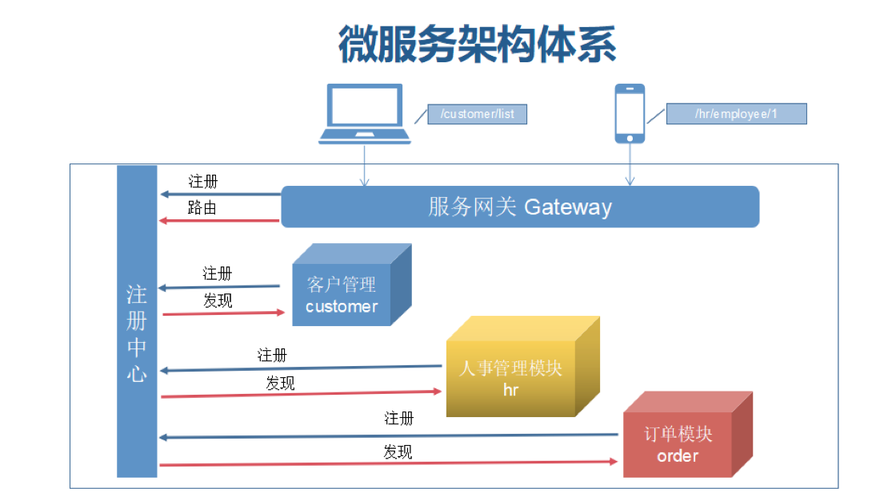
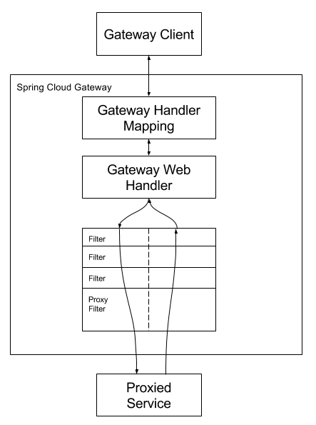

# SpringCloud-gateway

## SpringCloud GateWay简介

SpringCloud GateWay 是由spring官方基于Spring5.0、Spring Boot2.x、Project Reactor等技术开发的网关，目的是代替原先版本中得我Spring Cloud NetFlix Zuul。



## Gateway 网关特性

- 统一入口所有请求通过网关路由到内部其他服务
- 断言（Predicates）和过滤器（filters）特定路由。断言是根据具体的请求的规则有route去处理；过滤器用来对请求做各种判断和修改。
- 可集成熔断器：Hystrix熔断机制。Hystrix 是 spring cloud gateway 中是以 filter 的形式使用的。
- 路由重写（rewrite）：路径重写自定义路由转发规则。
- 能够自由设置任何请求属性的路由
- SpringCloud DiscoveryClient原生支持

## GateWay 流程架构



## 静态路由

所谓静态路由，就是指API网关启动前，通过配置文件或者代码的方式，静态的配置好API之间的路有关系，此后不需要二次维护， 大多数的内部API网关适用于这种方式。

### 方法一 配置文件方式

本质上是修改application.yml文件，相关修改方法，官方已经有详尽的描述了，[官方文档](https://docs.spring.io/spring-cloud-gateway/docs/current/reference/html/)
。 举例说明：

```yaml
spring:
  cloud:
    gateway:
      routes:
        # 认证中心
        - id: diaoyucheng-auth
          uri: lb://diaoyucheng-auth
          predicates:
            - Path=/auth/**
          filters:
            # 验证码处理
            - CacheRequestFilter
            - ValidateCodeFilter
            - StripPrefix=1 
```

### 方法二 代码构建路由

```java

public class GenerateRoute {
    // static imports from GatewayFilters and RoutePredicates
    @Bean
    public RouteLocator customRouteLocator(RouteLocatorBuilder builder, ThrottleGatewayFilterFactory throttle) {
        return builder.routes()
            .route(r -> r.host("**.abc.org")
                .and()
                .path("/image/png")
                .filters(f -> f.addResponseHeader("X-TestHeader", "foobar"))
                .uri("http://snax.org:80"))
            .route(r -> r.path("/image/webp")
                .filters(f -> f.addResponseHeader("X-AnotherHeader", "baz"))
                .uri("http://snax.org:80")
                .metadata("key", "value"))
            .route(r -> r.order(-1)
                .host("**.throttle.org")
                .and()
                .path("/get")
                .filters(f -> f.filter(throttle.apply(1, 1, 10, TimeUnit.SECONDS)))
                .uri("http://snax.org:80")
                .metadata("key", "value"))
            .build();

    }

}
```

通过代码即可完成路由的创建，会在Spring Cloud Gateway启动时自动加载到运行态，本质上配置文件和代码的方式，
仅仅是两种加载形态，底层没有太大区别。然后，静态路由往往不能满足我们的需求。

## 断言(Predicates)

### After

匹配在某时间之后的请求

```yaml
spring:
  cloud:
    gateway:
      routes:
      - id: after_route
        uri: https://example.org
        predicates:
          - After=2021-12-10T00:00:00.000
```

### Before

匹配在某时间之前的请求

```yaml
spring:
  cloud:
    gateway:
      routes:
      - id: after_route
        uri: https://example.org
        predicates:
          - Before=2021-12-10T00:00:00.000
```

### Between

匹配在两时间之间的请求

```yaml
spring:
  cloud:
    gateway:
      routes:
        - id: after_route
          uri: https://example.org
          predicates:
            - Between=2021-12-10T00:00:00.000,2021-12-10T00:00:00.000
```


| 关键字        | 说明               |
|------------|------------------|
| Cookie     | Cookie属性正则表达式匹配  |
| Query      | 参数匹配             |
| Method     | 方法匹配             |
| Host       | 主机名正则表达式匹配       |
| Weight     | 权重匹配             |
| Header     | Header属性和正则表达式匹配 |
| Path       | 请求路径匹配           |   
| RemoteAddr | IP地址匹配（支持子网掩码）   |  

[官方参考地址](https://cloud.spring.io/spring-cloud-gateway/reference/html/#_after_route_predicate_factory)

## 过滤器(Filter)

路由器允许以某种方式修改传入的HTTP请求或传出的HTTP响应。路径过滤器的范围限定


