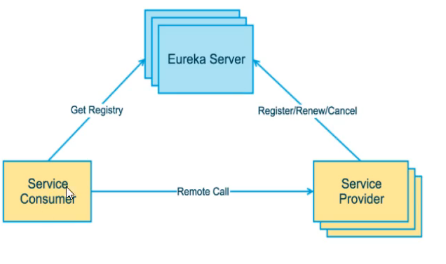
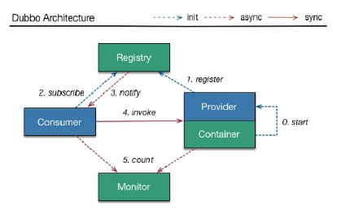

[TOC]: # "Spring Cloud"

# Spring Cloud
- [Eureka](#eureka)
  - [什么是服务注册与发现](#什么是服务注册与发现)

## Eureka
### 什么是服务注册与发现

Eureka采用了CS的设计架构，Eureka Server作为服务注册功能的服务器，它是服务注册中心。而系统汇总的其他微服务，使用Eureka的客户端连接到Eureka Server并维持心跳连接。这样系统的维护人员就可以通过Eureka Server来监控系统中各个微服务是否正常运行。

在服务注册与发现中，有一个注册中心。当服务器启动的时候，会把当前自己服务器的信息 比如 服务器地址通讯地址等以别名的方式注册到注册中心上。另一方（消费者|服务提供者），以该别名的方式去注册中心上获取到实际的服务通讯地址，然后在实现本地RPC调用RPC远程调用框架

核心设计思想：在于注册中心，因为使用注册中心管理每个服务与服务之间的一个依赖关系（服务治理概念）。在任何RPC远程框架中，都会也有一个注册中心（存放服务地址相关信息（接口地址））

## Eureka包含两个组件：Eureka Server和Eureka Client

- Eureka Server提供服务注册服务

    各个微服务节点通过配置启动后，
