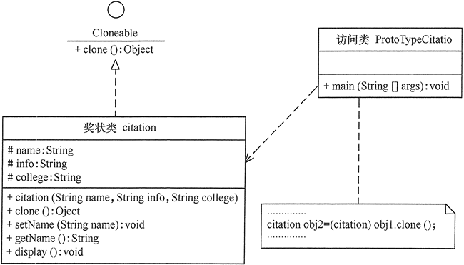

[TOC]: # "java设计模式"

# java设计模式
- [GoF的23中设计模式的分类和功能](#gof的23中设计模式的分类和功能)
  - [1. 根据目的来分](#1-根据目的来分)
  - [2. 根据作用范围来分](#2-根据作用范围来分)
  - [3. GOF的23中设计模式的功能](#3-gof的23中设计模式的功能)
- [单例模式(单例设计模式)详解](#单例模式单例设计模式详解)
  - [单例模式的定义与优点](#单例模式的定义与优点)
  - [单例模式的结构与实现](#单例模式的结构与实现)
    - [1. 单例模式的结构](#1-单例模式的结构)
    - [2. 单例模式的实现](#2-单例模式的实现)
  - [单例模式的应用案例](#单例模式的应用案例)
  - [单例模式的应用场景](#单例模式的应用场景)
  - [单例模式的扩展](#单例模式的扩展)
- [原型模式(原型设计模式)详解](#原型模式原型设计模式详解)
  - [原型模式的定义与特点](#原型模式的定义与特点)
  - [原型模式的结构与实现](#原型模式的结构与实现)
  - [原型模式的应用实例](#原型模式的应用实例)
  - [原型模式的应用场景](#原型模式的应用场景)
  - [原型模式的扩展](#原型模式的扩展)
- [工厂方法模式](#工厂方法模式)


## GoF的23中设计模式的分类和功能

### 1. 根据目的来分
根据模式是用来完成什么工作来划分，这种方式可分为创建型模式、结构型模式和行为型模式3种

1. 创建型模式：用于描述“怎样创建对象”，它的主要特点是“将对象的创建与使用分离”。GOF中提供了单例、原型、工厂方法、抽象工厂、建造者等5种创建型模式
2. 结构型模式：用于描述如何将类或对象按某种不具组成更大的结构，GOF中提供了代理、适配器、桥接、装饰、外观、享元、组合等7种结构模式。
3. 行为型模式：用于描述类或对象之间怎样相互协作共同完成单个对象都无法单独完成的任务，以及怎样分配职责。GoF中提供了模板方法、策略、命令、职责链、状态、观察者、中介者、迭代器、访问者、备忘录、解释器等11种行为型模式

### 2. 根据作用范围来分

1. 类模式：用于处理类和子类之间的关系，这些关系通过继承来建立，是静态的，在编译时刻便确定下来了。GoF中的工厂方法、（类）适配器，模板方法、解释器属于该模式。
2. 对象模式：用于处理对象之间的关系，这些关系可以通过组合或聚合来实现，在运行时刻是可以变化的，更具动态性。GoF中除了以上4中，其他的都是对象模式。

### 3. GOF的23中设计模式的功能

前面说明了GoF的23种设计模式的分类，现在对各个模式的功能进行介绍。

1. 单例（Singleton）模式：某个类只能生成一个实例，该类提供了一个全局访问点供外部获取该实例，其拓展是有限多例模式。
2. 原型（prototype）模式：将一个对象作为原型，通过对其进行复制而克隆出多个和原型类似的新实例。
3. 工厂方法（Factory Method）模式：定义一个用于创建产品的接口，由子类决定生产什么产品。
4. 抽象工厂（AbstractFactory）模式：提供一个创建产品族的接口，其每个子类可以生产一系列相关产品。
5. 建造者（Builder）模式：将一个复杂对象分解成多个相对简单的部分，然后根据不同需要分别创建它们，最后构建成该复杂对象。
6. 代理（Proxy）模式：为某对象提供一种代理以控制对该对象的访问。即客户端通过代理间接的访问该对象，从而限制、增强或修改该对象的一些特性。
7. 适配器（Adapter）模式：将一个类的接口转换成客户希望的另一个接口，使得原本由于接口不兼容而不能一起工作的那些类能一起工作。
8. 桥接（Bridge）模式：将抽象与实现分离，使它们可以独立变化。它是用组合关系替代继承关系来实现，从而降低了抽象和实现这两个可变维度的耦合度。
9. 装饰（Decorator）模式：为多个复杂的子系统提供一个一致的接口，是这些子系统更加容易被访问。
10. 外观（Facade）模式：为多个复杂的子系统提供一个一致的接口，使这些子系统更加容易被访问。
11. 享元（Flyweight）模式：运用共享技术来有效的支持大量细粒度对象的复用。
12. 组合（Composite）模式：将对象组合成树状的层次结构，使用户对单个对象和组合对象具有一直的访问性。
13. 模板方法（TemplateMethod）模式：定义一个操作中的算法骨架，而将算法的一些步骤延迟到子类中，使得子类可以不改变该算法结构的情况下重定义改算法的某些特定的步骤。
14. 策略（Strategy）模式：定义了一系列算法，并将每个算法封装起来，使它们可以互相替换，且算法的改变不会影响使用算法的客户。
15. 命令（Command）模式：将一个请求封装为一个对象，是发出请求的责任和执行请求的责任分隔开。
16. 职责链（Chain of Responsibility）模式：把请求从链中的一个对象传到下一个对象，直到请求被相应为止。通过这种方式去除对象之间的耦合。
17. 状态（State）模式：允许一个对象在其内部状态发生改变其行为能力。
18. 观察者（Observer）模式：多个对象间存在一对多的关系，当一个对象发生改变时，把这种改变通知给其他多个对象，从而影响其他对象的行为。
19. 中介者（Mediator）模式：定义一个中介对象来简化原有对象之间的交互关系，降低系统中对象间的耦合度，使原有对象之间不必相互了解。
20. 迭代器（Iterator）模式：提供一种方法来顺序访问聚合对象中的一系列数据，而不暴露聚合对象的内部表示。
21. 访问者（Visitor）模式：在不改变集合元素的前提下，为一个集合中的每个元素提供多种访问能方式，即每个元素有多个访问者对象访问。
22. 备忘录（Memento）模式：在不破坏封装性的前提下，获取并保存一个对象的内部状态，以便以后恢复它。
23. 解释器（Interpreter）模式：提供如何定义语言的文法，以及对语言句子的解释方法，即解释器。

必须指出，<font color=red>这23中设计模式不是孤立存在的，很多模式之间存在一定的关联关系，</font>在大的系统开发中常常同时使用多种设计模式。


## 单例模式(单例设计模式)详解

在有些系统中，为了节省内存资源、保证数据内容的一致性，对某些类要求只能创建一个实例，这就是所谓的单例模式。

### 单例模式的定义与优点

单例(Singleton)模式的定义：指一个类只有一个实例，且该类能自行创建这个实例的一种模式。例如，Windows中只能打开一个任务管理器，这样可以避免因打开多个任务管理器窗口而造成内存资源的浪费，或出现各个窗口显示内容的不一致等错误。

在计算机系统中，还有Windows的回收站。操作系统中的文件系统、多线程中的线程池、显卡的驱动程序对象、打印机的后台处理任务、应用程序的日志对象、数据库的连接池、网站的计数器、Web应用的配置对象、应用程序中的对话框、系统中的缓存等常常被设计成单例

单例模式有3个特点：
1. 单例类只有一个实例对象；
2. 该单例对象必须有单例类自行创建；
3. 单例类对外提供一个访问该单例的全局访问点；

### 单例模式的结构与实现

单例模式是设计模式中最简单的模式之一。通常，普通类的构造函数是公有的，外部类可以通过"new构造函数()"来生成多个实例。但是如果将类的构造函数设为私有的，外部类就无法调用该构造函数，也无法生成多个实例。但是，如果将类的构造函数设为私有的，外部类就无法调用该构造函数，也就无法生成多个实例。这是该类自身必须定义一个静态私有实例，并向外提供一个静态的公有函数用于创建或获取该静态私有实例。

下面来分析其基本结构和实现方法。

#### 1. 单例模式的结构

单例模式的主要角色如下。
- 单例类：包含一个实例且能自行创建这个实例的类。
- 访问类：使用单例的类

其结构如图一所示。


#### 2. 单例模式的实现

Singleton 模式通常有两种实现形式。

**第1种：懒汉式单例**

该模式的特点是类加载时没有生成单例，只有当第一次调用getInstance方法时采取创建这个单例。

代码如下：
```java
public class LazySingleton
{
    private static volatile LazySingleton instance=null;    //保证 instance 在所有线程中同步
    private LazySingleton(){}    //private 避免类在外部被实例化
    public static synchronized LazySingleton getInstance()
    {
        //getInstance 方法前加同步
        if(instance==null)
        {
            instance=new LazySingleton();
        }
        return instance;
    }
}
```

注意：如果编写的是多线程程序，则不要删除上例代码中的关键字volatile和synchronized，否则将存在线程非安全的问题。如果不删除这两个关键字就能保证线程安全，但是每次访问时都要同步，会影响性能，且消耗更多的资源，这是懒汉式单例的缺点。

**第2种：饿汉式单例**

该模式的特点是类一旦加载就创建一个单例，保证在调用getInstance方法之前单例已经存在了

```java
public class HungrySingleton
{
    private static final HungrySingleton instance=new HungrySingleton();
    private HungrySingleton(){}
    public static HungrySingleton getInstance()
    {
        return instance;
    }
}
```

饿汉式单例在类创建的同事就已经创建好了一个静态的对象供系统使用，以后不再改变，所以是线程安全的，可以直接用于多线程而不会出现问题。

### 单例模式的应用案例

【例1】用懒汉式单例模式模拟产生美国当今总统对象。

分析：在每一届任期内，美国的总统只有一人，所以本实例适合用单例模式实现，图2所示使用懒汉式单例实现的结构图。


程序代码如下
```java
public class SingletonLazy
{
    public static void main(String[] args)
    {
        President zt1=President.getInstance();
        zt1.getName();    //输出总统的名字
        President zt2=President.getInstance();
        zt2.getName();    //输出总统的名字
        if(zt1==zt2)
        {
           System.out.println("他们是同一人！");
        }
        else
        {
           System.out.println("他们不是同一人！");
        }
    }
}
class President
{
    private static volatile President instance=null;    //保证instance在所有线程中同步
    //private避免类在外部被实例化
    private President()
    {
        System.out.println("产生一个总统！");
    }
    public static synchronized President getInstance()
    {
        //在getInstance方法上加同步
        if(instance==null)
        {
               instance=new President();
        }
        else
        {
           System.out.println("已经有一个总统，不能产生新总统！");
        }
        return instance;
    }
    public void getName()
    {
        System.out.println("我是美国总统：特朗普。");
    }  
}
```

程序运行结果如下：

    产生一个总统！
    我是美国总统：特朗普。
    已经有一个总统，不能产生新总统！
    我是美国总统：特朗普。
    他们是同一人！

【例2】用饿汉式单例模式模拟产生猪八戒对象

分析：同上例类似，猪八戒也只有一个，所以本实例同样适合用单例模式实现。分析：同上例类似，猪八戒也只有一个，所以本实例同样适合用单例模式实现。本实例由于要显示猪八戒的图像[（点此下载该程序所要显示的猪八戒图片）](http://c.biancheng.net/uploads/soft/181113/3-1Q1131J636.zip)，所以用到了框架窗体 JFrame 组件，这里的猪八戒类是单例类，可以将其定义成面板 JPanel 的子类，里面包含了标签，用于保存猪八戒的图像，客户窗体可以获得猪八戒对象，并显示它。图 3 所示是用饿汉式单例实现的结构图。


程序代码如下：

```java
import java.awt.*;
import javax.swing.*;
public class SingletonEager
{
    public static void main(String[] args)
    {
        JFrame jf=new JFrame("饿汉单例模式测试");
        jf.setLayout(new GridLayout(1,2));
        Container contentPane=jf.getContentPane();
        Bajie obj1=Bajie.getInstance();
        contentPane.add(obj1);    
        Bajie obj2=Bajie.getInstance(); 
        contentPane.add(obj2);
        if(obj1==obj2)
        {
            System.out.println("他们是同一人！");
        }
        else
        {
            System.out.println("他们不是同一人！");
        }   
        jf.pack();       
        jf.setVisible(true);
        jf.setDefaultCloseOperation(JFrame.EXIT_ON_CLOSE);
    }
}
class Bajie extends JPanel
{
    private static Bajie instance=new Bajie();
    private Bajie()
    { 
        JLabel l1=new JLabel(new ImageIcon("src/Bajie.jpg"));
        this.add(l1);   
    }
    public static Bajie getInstance()
    {
        return instance;
    }
}
```

程序运行结果如图4所示。


### 单例模式的应用场景

前面分析了单例模式的结构与特点，以下是它通常适用的场景和特点

- 在应用场景中，某类只要求生成一个对象的时候，如一个班中的班长、每个人的身份证号等、
- 在对象需要被共享的场合。由于单例模式只允许创建一个对象，共享该对象可以节省内存，并加快对象的访问速度。如Web中的配置对象、数据库连接池等。
- 当某类需要频繁实例化，而创建的对象又频繁被销毁的时候，如多线程的线程池、网络连接池等。

### 单例模式的扩展

单例模式可扩展为有限的多例(Multitcm)模式，这种模式可生成有限个实例并保存在ArmyList中，客户需要时可随机获取，其结构图如图5所示。


## 原型模式(原型设计模式)详解

在有些系统中，存在大量相同或者相似对象的创建问题，如果用传统的构造函数来创建对象，会比较复杂且耗时好资源，用原型模式生成对象就很高效。

### 原型模式的定义与特点

原型(Prototype)模式的定义如下：用一个已经创建的实例作为原型，通过复制该原型对象来创建一个和原型相同或相似的新对象。在这里，原型实例指定了要创建的对象的种类。用这种方式创建对象非常高效，根本无需知道对象创建的细节。例如，Windows操作系统的安装通常较耗时，如果复制接快了很多。

### 原型模式的结构与实现

由于Java提供了对象的clone()方法，所以用Java实现原型模式很简单

**1. 模式的结构**

原型模式包含以下主要角色

1. 抽象原型类：规定了具体原型对象必须实现的接口。
2. 具体原型类：实现抽象原型类的clone()方法，它是可被复制的对象。
3. 访问类：使用具体原型类中的clone()方法来复制新的对象

**2. 模式的实现**
原型模式的克隆分为浅克隆和深克隆，Java中的Object类提供了浅克隆的clone()方法，具体原型类只要实现Cloneable接口就可实现对象的浅克隆，这里的Cloneable接口就是抽象原型类。其代码如下：

```java
//具体原型类
class Realizetype implements Cloneable
{
    Realizetype()
    {
        System.out.println("具体原型创建成功！");
    }
    public Object clone() throws CloneNotSupportedException
    {
        System.out.println("具体原型复制成功！");
        return (Realizetype)super.clone();
    }
}
//原型模式的测试类
public class PrototypeTest
{
    public static void main(String[] args)throws CloneNotSupportedException
    {
        Realizetype obj1=new Realizetype();
        Realizetype obj2=(Realizetype)obj1.clone();
        System.out.println("obj1==obj2?"+(obj1==obj2));
    }
}
```

程序的运行结果如下:

    具体原型创建成功！
    具体原型复制成功！
    obj1=obj2?false

### 原型模式的应用实例

【例1】用原型模式模拟"孙悟空"复制自己

分析：孙悟空拔下猴毛轻轻一吹就变出很多孙悟空，这实际上是用到了原型模式。这里的孙悟空类SunWukong是具体原型类，而Java中的Cloneable接口是抽象原型类。

同前面介绍的猪八戒实例一样，由于要显示孙悟空的图像，同前面介绍的猪八戒实例一样，由于要显示孙悟空的图像[（点击此处下载该程序所要显示的孙悟空的图片）](http://c.biancheng.net/uploads/soft/181113/3-1Q114103933.zip)，所以将孙悟空类定义成面板 JPanel 的子类，里面包含了标签，用于保存孙悟空的图像。

另外，重写了 Cloneable 接口的 clone() 方法，用于复制新的孙悟空。访问类可以通过调用孙悟空的 clone() 方法复制多个孙悟空，并在框架窗体 JFrame 中显示。图 2 所示是其结构图。


程序代码如下：

```java
import java.awt.*;
import javax.swing.*;
class SunWukong extends JPanel implements Cloneable
{
    private static final long serialVersionUID = 5543049531872119328L;
    public SunWukong()
    {
        JLabel l1=new JLabel(new ImageIcon("src/Wukong.jpg"));
        this.add(l1);   
    }
    public Object clone()
    {
        SunWukong w=null;
        try
        {
            w=(SunWukong)super.clone();
        }
        catch(CloneNotSupportedException e)
        {
            System.out.println("拷贝悟空失败!");
        }
        return w;
    }
}
public class ProtoTypeWukong
{
    public static void main(String[] args)
    {
        JFrame jf=new JFrame("原型模式测试");
        jf.setLayout(new GridLayout(1,2));
        Container contentPane=jf.getContentPane();
        SunWukong obj1=new SunWukong();
        contentPane.add(obj1);       
        SunWukong obj2=(SunWukong)obj1.clone();
        contentPane.add(obj2);   
        jf.pack();       
        jf.setVisible(true);
        jf.setDefaultCloseOperation(JFrame.EXIT_ON_CLOSE);   
    }
}
```

程序的运行结果如图所示。


用原型模式除了可以生成相同的对象，还可以生成类似的对象，请看一下实例

【例2】用原型模式生成"三好学生"奖状

分析：同一学校的"三好学生"奖状除了获奖人姓名不同，其他都相同，属于相似对象的复制，同样可以用原型模式创建，然后再做简单修改就可以了，图4所示是三好学生奖状生成器的结构图。



程序代码如下：

```java
public class ProtoTypeCitation
{
    public static void main(String[] args) throws CloneNotSupportedException
    {
        citation obj1 = new citation("张三", "同学：在2016学年第一学期中表现优秀，被评为三好学生。", "韶关学院");
        obj1.display();
        citation obj2 = (citation)obj1.clone();
        obj2.setName("李四");
        obj2.display();
    }
}

//奖状类
class citation implements Cloneable
{
    String name;

    String info;

    String college;

    citation(String name, String info, String college)
    {
        this.name = name;
        this.info = info;
        this.college = college;
        System.out.println("奖状创建成功！");
    }

    void setName(String name)
    {
        this.name = name;
    }

    String getName()
    {
        return (this.name);
    }

    void display()
    {
        System.out.println(name + info + college);
    }

    public Object clone() throws CloneNotSupportedException
    {
        System.out.println("奖状拷贝成功！");
        return (citation)super.clone();
    }
}
```

程序运行结果如下：
> 奖状创建成功！
> 张三同学：在2016学年第一学期中表现优秀，被评为三好学生。韶关学院
> 奖状拷贝成功！
> 李四同学：在2016学年第一学期中表现优秀，被评为三好学生。韶关学院


### 原型模式的应用场景

原型模式通常适用于以下场景。
- 对象之间相同或相似，即只是个别的几个属性不同的时候。
- 对象的创建过程比较麻烦，但是复制比较简单的时候。

### 原型模式的扩展

原型模式可扩展为带原型管理器的原型模式，它在圆形模式的基础上增加了一个原型管理器PrototypeManager类。该类用HashMap保存多个复制的原型，Client类可以通过管理器的get(String id)方法从中获取复制的原型。其结构图如图所示：


【例3】用带原型管理器的原型模式来生成包含”圆“和”正方形“等图形的原型，并计算其面积。分析：本案例中由于存在不同的图形类，例如，”圆“和”正方形“，他们的计算面积方法不一样，所以需要用一个原型管理器来管理他们。


程序代码如下：

``` java
import java.util.*;
interface Shape extends Cloneable
{
    public Object clone();    //拷贝
    public void countArea();    //计算面积
}
class Circle implements Shape
{
    public Object clone()
    {
        Circle w=null;
        try
        {
            w=(Circle)super.clone();
        }
        catch(CloneNotSupportedException e)
        {
            System.out.println("拷贝圆失败!");
        }
        return w;
    }
    public void countArea()
    {
        int r=0;
        System.out.print("这是一个圆，请输入圆的半径：");
        Scanner input=new Scanner(System.in);
        r=input.nextInt();
        System.out.println("该圆的面积="+3.1415*r*r+"\n");
    }
}
class Square implements Shape
{
    public Object clone()
    {
        Square b=null;
        try
        {
            b=(Square)super.clone();
        }
        catch(CloneNotSupportedException e)
        {
            System.out.println("拷贝正方形失败!");
        }
        return b;
    }
    public void countArea()
    {
        int a=0;
        System.out.print("这是一个正方形，请输入它的边长：");
        Scanner input=new Scanner(System.in);
        a=input.nextInt();
        System.out.println("该正方形的面积="+a*a+"\n");
    }
}
class ProtoTypeManager
{
    private HashMap<String, Shape>ht=new HashMap<String,Shape>(); 
    public ProtoTypeManager()
    {
        ht.put("Circle",new Circle());
           ht.put("Square",new Square());
    } 
    public void addshape(String key,Shape obj)
    {
        ht.put(key,obj);
    }
    public Shape getShape(String key)
    {
        Shape temp=ht.get(key);
        return (Shape) temp.clone();
    }
}
public class ProtoTypeShape
{
    public static void main(String[] args)
    {
        ProtoTypeManager pm=new ProtoTypeManager();    
        Shape obj1=(Circle)pm.getShape("Circle");
        obj1.countArea();          
        Shape obj2=(Shape)pm.getShape("Square");
        obj2.countArea();     
    }
}
```

运行结果如下所示：
> 这是一个圆，请输入圆的半径：3
> 该圆的面积=28.2735
>
> 这是一个正方形，请输入它的边长：3
> 该正方形的面积=9


## 简单工厂模式

现实生活中，原始社会自给自足（没有工厂），农耕社会小作坊（简单工厂，民间酒坊），工业革命流水线（工厂方法，自产自销），现代产业链代工厂（抽象工厂，富士康）。我们的项目代码同样是由简到繁一步一步迭代而来的，但对于调用者来说，也越来越简单

在日常开发中，凡是需要生成复杂对象的地方，都可以尝试考虑使用工厂模式来代替。

> 注意：上述复杂对象指的是类的构造函数过多等对类的构造有影响的情况，因为类的构造过于复杂，如果直接在其他业务类中使用，则两者的耦合过重，后续业务更改，就需要在任何引用该类的源代码内进行更改，光是查找所有依赖就很消耗时间了，更别说一个一个修改了。

工厂模式的定义：定义一个创建产品对象的工厂接口，将产品对象的实际创建工作推迟到具体子工厂类当中。这满足创建型模式中所要求的“创建与使用相分离”的特点。

按实际业务场景划分，工厂模式有3中不同的实现方式，分别是简单工厂模式、工厂方法模式和抽象工厂模式。

我们把被创建的对象称为“产品”，把创建产品的对象称为“工厂”。如果要创建的产品不多，只要一个工厂类就可以完成，这种模式叫“简单工厂模式”

在简单工厂模式中创建实例的方法通常为静态（static）方法，因此简单工厂模式（Simple Factory Pattern）又叫作静态工厂方法模式（Static Factory Method Pattern）。

简单来说，简单工厂模式有一个具体的厂类，可以生成多个不同的产品，属于创建型设计模式。简单工厂模式不在GoF23中设计模式之列。

简单工厂模式每增加一个产品就要增加一个具体产品类和一个对应的具体工厂类，这增加了系统的复杂度，违背了“开闭原则”

> “工厂方法模式”是对简单工厂模式的进一步抽象化，其好处是可以使系统在不修改原来代码的情况下引进新的产品，即满足开闭原则。

### 优点和缺点

**优点：**
1. 工厂类包含必要的逻辑判断，可以确定在什么时候创建哪一个产品的实例。客户端可以免除直接创建产品对象的职责，很方便的创建出相应的产品。工厂和产品的职责区分明确。
2. 客户端无需知道所创建具体产品的类名，只需知道参数即可。
3. 也可以引出配置文件，在不修改客户端代码的情况下更换和添加新的具体的产品类。

**缺点：**
1. 简单工厂模式的工厂类单一，负责所有产品的创建，职责过重，一旦异常，整个系统将受影响。且工厂类代码会非常臃肿，违背高聚合原则。
2. 使用简单工厂模式会增加系统中类的个数（引入新的工厂类），增加系统的复杂度和理解难度。
3. 系统扩展困难，一旦增加新厂品不得不修改工厂逻辑，在产品类型较多时，可能造成逻辑过于复杂
4. 简单工厂模式使用了static工厂方法，造成工厂角色无法形成基于继承的等级结构。

### 应用场景

对于产品种类相对较少的情况，考虑使用简单工厂模式。使用简单工厂模式的客户端只需要传入工厂类的参数，不需要关心任何创建对象的逻辑，可以很方便的创建所需产品。

### 模式的结构与实现

简单工厂模式的主要角色如下：

- 简单工厂（SimpleFactory）：是简单工厂模式的核心，负责实现创建所有实例的内部逻辑。工厂类的创建产品类的方法可以被外界直接调用，创建所需的产品对象。
- 抽象产品（Product）：是简单工厂创建的所有对象的父类，负责描述所有势力共有的公共接口。
- 具体产品（ConcreteProduct）：是简单工厂模式的创建目标。

其结构图如下图所示。


根据上图写出该模式的代码如下：

```java
public class Client{
    public static void main(String[] args){
      
    }
    //抽象产品
    public interface Product {
        void show();
    }
    
    //具体产品ProductA
    static class ConcreteProduct1 implements Product {
        public void show(){
            System.out.println("具体产品1显示......");
        }
    }
    
    //具体产品：ProductB
    static class ConcreteProduct2 implements Product {
        public void show() {
            System.out.println("具体产品2显示......");
        }
    }
    
    final class Const{
        static final int PRODUCT_A = 0;
        static final int PRODUCT_B = 1;
        static final int PRODUCT_C = 2;
    }

    static class SimpleFactory {
        public static Product makeProduct(int kind) {
            switch (kind) {
                case Const.PRODUCT_A:
                    return new ConcreteProduct1();
                case Const.PRODUCT_B:
                    return new ConcreteProduct2();
            }
            return null;
        }
    }
}
```

## 工厂方法模式（详解版）

在现实生活中社会分工越来越细，越来越专业化。这种产品有专门的工厂生产，彻底告别了自给自足的小农经济时代，这大大缩短了产品的生产周期，提高了生产效率，同样在软件开发中能否做到软件对象的生产和使用相分离呢？能否在满足“开闭原则”的前提下，客户随意增删或者改变对软件相关对象的使用？这就是本届要讨论的问题。

在简单工厂模式一节我们介绍了简单工厂模式，提到了简单工厂模式违背了开闭原则，而“工厂方法模式”是对简单工厂模式的进一步抽象化，其好处是可以是系统在不修改原来代码的情况下引进新的产品，即满足开闭原则。

**优点：**

- 用户只需要知道具体工厂的名称就可以得到所要的产品，无需知道产品的创建过程'
- 灵活性增强，对于新产品的创建，只需多写一个相应的工厂类。
- 典型的解耦框架。高层模块只需要知道产品的抽象类，无需关心其他实现类，满足迪米特法则、依赖导致原则和里氏替换原则。

**缺点：**

- 类的个数容易过多，增加复杂度
- 增加了系统的抽象性和理解难度
- 抽象产品只能生产一种产品，此弊端可以使用抽象工厂模式解决。

**应用场景：**

- 客户只知道创建产品的工厂名，而不知道具体的产品名。比如TCL电视工厂、海信电视工厂等。
- 创建对象的任务由多个具体子工厂中的某一个完成，而抽象工厂只提供创建产品的结构
- 客户不关系创建产品的细节，只关心产品的品牌

### 模式的结构与实现

工厂方法模式由抽象工厂、具体工厂和具体产品等4个要素构成。本节来分析结构和实现方法。

模式的结构
工厂方法模式的主要角色如下：


1. 抽象工厂（Abstract Factory）：提供了创建产品的接口，调用者通过它访问具体工厂的工厂方法new Product()来创建产品。
2. 具体工厂（ConcreteFactory）：主要是实现了抽象工厂中的抽象方法，完成具体产品的创建。
3. 抽象产品（Product）：定义了产品的规范，描述了产品的主要特性和功能。
4. 具体产品（Concrete Product）：实现了抽象产品角色所定义的接口，由具体工厂来创建，它同具体工厂之间一一对应。

其结构图如图1 所示：


模式的实现

根据图1写出该模式的代码如下：

```java
package FactoryMethod;

public class AbstractFactoryTest{
    public static void main(String[] args)
    {
        try {
            Product a;
            AbstractFactory af;
            af = (AbstractFactory) ReadXML1.getObject();
            a = af.newProduct();
            a.show();
        } catch (Exception e) {
            System.out.println(e.getMessage());
        }
    }
    }
    
    interface Product{
        public void show();
    }
    
    class ConcreteProduct1 implements Product {

        @Override
        public void show()
        {
            System.out.println("具体产品1显示...");
        }
    }
    class ConcreteProduct2 implements Product {

        @Override
        public void show()
        {
            System.out.println("具体产品2显示...");
        }
    }
    
    interface AbstractFactory{
        public Product newProduct();
    }

    //具体工厂1：实现了厂品的生成方法
    class ConcreteFactory1 implements AbstractFactory {
        public Product newProduct() {
            System.out.println("具体工厂1生成-->具体产品1...");
            return new ConcreteProduct1();
        }
    }
    //具体工厂2：实现了厂品的生成方法
    class ConcreteFactory2 implements AbstractFactory {
        public Product newProduct() {
            System.out.println("具体工厂2生成-->具体产品2...");
            return new ConcreteProduct2();
        }
}
```
```java
package FactoryMethod;
import javax.xml.parsers.*;
import org.w3c.dom.*;
import java.io.*;
class ReadXML1 {
    //该方法用于从XML配置文件中提取具体类类名，并返回一个实例对象
    public static Object getObject() {
        try {
            //创建文档对象
            DocumentBuilderFactory dFactory = DocumentBuilderFactory.newInstance();
            DocumentBuilder builder = dFactory.newDocumentBuilder();
            Document doc;
            doc = builder.parse(new File("src/FactoryMethod/config1.xml"));
            //获取包含类名的文本节点
            NodeList nl = doc.getElementsByTagName("className");
            Node classNode = nl.item(0).getFirstChild();
            String cName = "FactoryMethod." + classNode.getNodeValue();
            //System.out.println("新类名："+cName);
            //通过类名生成实例对象并将其返回
            Class<?> c = Class.forName(cName);
            Object obj = c.newInstance();
            return obj;
        } catch (Exception e) {
            e.printStackTrace();
            return null;
        }
    }
}
```

注意：该程序中用到了XML文件，如果想要获取改文件，请点击”[下载](http://c.biancheng.net/uploads/soft/181113/3-1Q114140222.zip)“，就可以对其进行下载。

程序运行结果如下：

> 具体工厂1生成->具体产品1...
> 具体产品1显示

如果将XML配置文件中的ConcreteFactory1改为ConcreteFactory2，则程序运行结果如下：

> 具体工厂2生成->具体产品2...
> 具体产品2显示

### 模式的应用实例

【例1】用工厂方法模式设计畜牧场。

分析：有很多种类的畜牧场，如养马场用于养马，养牛场用于养牛，所以该实例用工厂方法模式比较适合。

对养马场和养牛场等具体工厂类，只要定义一个生成动物的方法newAnimal()即可。由于要显示马类和牛类等具体产品类的图像，所以它们的构造函数中用到了JPanel。JLabd和ImageIcon等组件，并定义一个show()方法来显示它们。

客户端程序通过对象生成器ReadXML2读取xml配置文件中的数据来决定养马还是养牛。其结构图如图2所示。


注意：该程序中用到了XML文件，并且要显示马类和牛类等具体产品类的图像，如果想要获取HTML文件和图片，请点击“[下载](http://c.biancheng.net/uploads/soft/181113/3-1Q114140526.zip)”，就可以对其进行下载。

程序代码如下：

``` java
package FactoryMethod;

import java.awt.*;
import javax.swing.*;

public class AnimalFarmTest {
    public static void main(String[] args) {
        try {
            Animal a;
            AnimalFarm af;
            af = (AnimalFarm) ReadXML2.getObject();
            a = af.newAnimal();
            a.show();
        } catch (Exception e) {
            System.out.println(e.getMessage());
        }
    }
}

//抽象产品：动物类
interface Animal {
    public void show();
}

//具体产品：马类
class Horse implements Animal {
    JScrollPane sp;
    JFrame jf = new JFrame("工厂方法模式测试");

    public Horse() {
        Container contentPane = jf.getContentPane();
        JPanel p1 = new JPanel();
        p1.setLayout(new GridLayout(1, 1));
        p1.setBorder(BorderFactory.createTitledBorder("动物：马"));
        sp = new JScrollPane(p1);
        contentPane.add(sp, BorderLayout.CENTER);
        JLabel l1 = new JLabel(new ImageIcon("src/A_Horse.jpg"));
        p1.add(l1);
        jf.pack();
        jf.setVisible(false);
        jf.setDefaultCloseOperation(JFrame.EXIT_ON_CLOSE);    //用户点击窗口关闭
    }

    public void show() {
        jf.setVisible(true);
    }
}

//具体产品：牛类
class Cattle implements Animal {
    JScrollPane sp;
    JFrame jf = new JFrame("工厂方法模式测试");

    public Cattle() {
        Container contentPane = jf.getContentPane();
        JPanel p1 = new JPanel();
        p1.setLayout(new GridLayout(1, 1));
        p1.setBorder(BorderFactory.createTitledBorder("动物：牛"));
        sp = new JScrollPane(p1);
        contentPane.add(sp, BorderLayout.CENTER);
        JLabel l1 = new JLabel(new ImageIcon("src/A_Cattle.jpg"));
        p1.add(l1);
        jf.pack();
        jf.setVisible(false);
        jf.setDefaultCloseOperation(JFrame.EXIT_ON_CLOSE);    //用户点击窗口关闭
    }

    public void show() {
        jf.setVisible(true);
    }
}

//抽象工厂：畜牧场
interface AnimalFarm {
    public Animal newAnimal();
}

//具体工厂：养马场
class HorseFarm implements AnimalFarm {
    public Animal newAnimal() {
        System.out.println("新马出生！");
        return new Horse();
    }
}

//具体工厂：养牛场
class CattleFarm implements AnimalFarm {
    public Animal newAnimal() {
        System.out.println("新牛出生！");
        return new Cattle();
    }
}
```


```java
package FactoryMethod;
import javax.xml.parsers.*;
import org.w3c.dom.*;
import java.io.*;

class ReadXML2 {
    public static Object getObject() {
        try {
            DocumentBuilderFactory dFactory = DocumentBuilderFactory.newInstance();
            DocumentBuilder builder = dFactory.newDocumentBuilder();
            Document doc;
            doc = builder.parse(new File("src/FactoryMethod/config2.xml"));
            NodeList nl = doc.getElementsByTagName("className");
            Node classNode = nl.item(0).getFirstChild(); xiazunhai
            String cName = "FactoryMethod." + classNode.getNodeValue();
            System.out.println("新类名：" + cName);
            Class<?> c = Class.forName(cName);
            Object obj = c.newInstance();
            return obj;
        } catch (Exception e) {
            e.printStackTrace();
            return null;
        }
    }
}
```

程序的运行结果如图3所示。


注意：当需要生成的产品不多且不会增加，一个具体工厂类就可以完成任务时，可以删除抽象工厂类，此时工厂方法模式将退化到简单工厂模式。

## 抽象工厂模式（详解版）

前面介绍的工厂方法模式中考虑的是一类产品的生产，如畜牧场只养动物、电视机厂只生产电视机、计算机软件学院只培养计算机软件专业的学生等。

同种类成为同等级，也就是说：工厂方法模式值考虑生产同等级的产品，但是在现实生活中许多工厂是综合型的工厂，能生产多等级（种类）的产品，如农场里既养动物又种植物，电器厂既生产电视机又生产洗衣机或空调，大学既有软件专业又有生物专业等。

本节要介绍的抽象工厂模式将考虑多等级产品的生产，将同一具体工厂所生产的位于不同等级的一组产品称为一个产品族，图1所示的是海尔工厂和TCL工厂所生产的电视机与空调对应的关系图。


### 模式的定义与特点

抽象工厂（AbstractFactory)模式的定义：是一种为访问类提供一个创建一组相关或相互依赖对象的接口，且访问类无需指定所要产品的具体类就能得到同族的不同等级的产品的模式结构。

抽象工厂模式是工厂方法模式的升级版本，工厂方法模式只生产一个等级的产品，而抽象工厂模式可生产多个等级的产品。

使用抽象工厂模式一般要满足以下条件：

- 系统中有多个产品族，每个具体工厂创建的同一族但属于不同等级结构的产品
- 系统一次只可能消费某一组产品，即同族的产品一起使用。

抽象工厂模式除了具有工厂方法模式的优点外，其他主要优点如下。

- 可以在类的内部对产品族中相关联的多等级产品共同管理，而不必专门引入多个新的类来进行管理。
- 当需要产品族时，抽象工厂可以保证客户端始终只是用同一个产品的产品族。
- 抽象工厂增强了程序的可扩展性，当增加一个新的产品族时，不需要修改源代码，满足开闭原则。

其缺点是：当产品族中需要增加一个新的产品时，所有的工厂类都需要修改，增加了系统的抽象性和理解难度。

### 模式的结构与实现

抽象工厂模式同工厂方法模式一样，也是抽象工厂、具体工厂、抽象产品和具体产品等4个要素构成，但抽象工厂中方法个数不同，抽象产品的个数也不同。现在我们来分析其基本结构和实现方法。

模式的结构

抽象工厂模式的主要角色如下：

1. 抽象工厂（Abstract Factory）：提供了创建产品的接口，它包含了多个创建产品的方法 newProduct()，可以创建多个不同等级的产品。
2. 具体工厂（Concrete Factory）：主要是实现抽象工厂中的多个抽象方法，完成具体产品的创建。
3. 抽象产品（Product）：定义了产品的规范，描述了产品的主要特性和功能，抽象工厂模式有多个抽象产品。
4. 具体产品（Concrete Product）：实现了抽象产品角色所定义的接口，由具体工厂来创建，它同具体工厂之间是多对一的关系。

抽象工厂模式的结构图如图2所示。


模式的实现

从图2可以看出抽象工厂模式的结构同工厂方法模式的结构相似，不同的是其产品的种类不止一个，
所以创建产品的方法也不止一个。下面给出抽象工厂和具体工厂的代码。

（1）抽象工厂：提供了产品的生成方法。

```java
interface AbstractFactory {
    public Product1 newProduct1();
    public Product2 newProduct2();
}
```

（2）具体工厂：实现了产品的生成方法。

```java
class ConcreteFactory1 implements AbstractFactory {
    public Product1 newProduct1() {
        System.out.println("具体工厂 1 生成-->具体产品 11...");
        return new ConcreteProduct11();
    }
    public Product2 newProduct2() {
        System.out.println("具体工厂 1 生成-->具体产品 21...");
        return new ConcreteProduct21();
    }
}
```

### 模式的应用实例

【例1】用抽象工厂模式设计农场类，

分析：农场中除了像畜牧场一样可以养动物，还可以培养动物，如养马、养牛、种菜、种水果等，所以本实例比前面介绍的畜牧场类复杂，必须用抽象工厂模式来实现。

本例用抽象工厂模式来设计两个农场，一个是韶关农场用于养牛和种菜，一个是上饶农场用于养马和种水果，可以在以上两个农场中定义一个生成动物的方法newAnimal()和一个培养植物的方法newPlant()。

对马类、牛类、蔬菜类和水果类等具体产品类，由于要显示他们的图像（[点此下载图片](http://c.biancheng.net/uploads/soft/181113/3-1Q114160J0.zip))，所以它们的构造函数中用了JPanel，JLabel和ImageIcon等组件，并定义一个show()方法来显示它们。

客户端程序通过对象生成器类ReadXML读取XML配置文件中的数据来决定养什么动物和培养什么植物（[点此下载XML文件](http://c.biancheng.net/uploads/soft/181113/3-1Q114160S7.zip)）。其结构图如图3所示。


程序代码如下：

```java
package AbstractFactory;

import java.awt.*;
import javax.swing.*;

public class FarmTest {
    public static void main(String[] args) {
        try {
            Farm f;
            Animal a;
            Plant p;
            f = (Farm) ReadXML.getObject();
            a = f.newAnimal();
            p = f.newPlant();
            a.show();
            p.show();
        } catch (Exception e) {
            System.out.println(e.getMessage());
        }
    }
}

//抽象产品：动物类
interface Animal {
    public void show();
}

//具体产品：马类
class Horse implements Animal {
    JScrollPane sp;
    JFrame jf = new JFrame("抽象工厂模式测试");

    public Horse() {
        Container contentPane = jf.getContentPane();
        JPanel p1 = new JPanel();
        p1.setLayout(new GridLayout(1, 1));
        p1.setBorder(BorderFactory.createTitledBorder("动物：马"));
        sp = new JScrollPane(p1);
        contentPane.add(sp, BorderLayout.CENTER);
        JLabel l1 = new JLabel(new ImageIcon("src/A_Horse.jpg"));
        p1.add(l1);
        jf.pack();
        jf.setVisible(false);
        jf.setDefaultCloseOperation(JFrame.EXIT_ON_CLOSE);//用户点击窗口关闭
    }

    public void show() {
        jf.setVisible(true);
    }
}

//具体产品：牛类
class Cattle implements Animal {
    JScrollPane sp;
    JFrame jf = new JFrame("抽象工厂模式测试");

    public Cattle() {
        Container contentPane = jf.getContentPane();
        JPanel p1 = new JPanel();
        p1.setLayout(new GridLayout(1, 1));
        p1.setBorder(BorderFactory.createTitledBorder("动物：牛"));
        sp = new JScrollPane(p1);
        contentPane.add(sp, BorderLayout.CENTER);
        JLabel l1 = new JLabel(new ImageIcon("src/A_Cattle.jpg"));
        p1.add(l1);
        jf.pack();
        jf.setVisible(false);
        jf.setDefaultCloseOperation(JFrame.EXIT_ON_CLOSE);//用户点击窗口关闭
    }

    public void show() {
        jf.setVisible(true);
    }
}

//抽象产品：植物类
interface Plant {
    public void show();
}

//具体产品：水果类
class Fruitage implements Plant {
    JScrollPane sp;
    JFrame jf = new JFrame("抽象工厂模式测试");

    public Fruitage() {
        Container contentPane = jf.getContentPane();
        JPanel p1 = new JPanel();
        p1.setLayout(new GridLayout(1, 1));
        p1.setBorder(BorderFactory.createTitledBorder("植物：水果"));
        sp = new JScrollPane(p1);
        contentPane.add(sp, BorderLayout.CENTER);
        JLabel l1 = new JLabel(new ImageIcon("src/P_Fruitage.jpg"));
        p1.add(l1);
        jf.pack();
        jf.setVisible(false);
        jf.setDefaultCloseOperation(JFrame.EXIT_ON_CLOSE);//用户点击窗口关闭
    }

    public void show() {
        jf.setVisible(true);
    }
}

//具体产品：蔬菜类
class Vegetables implements Plant {
    JScrollPane sp;
    JFrame jf = new JFrame("抽象工厂模式测试");

    public Vegetables() {
        Container contentPane = jf.getContentPane();
        JPanel p1 = new JPanel();
        p1.setLayout(new GridLayout(1, 1));
        p1.setBorder(BorderFactory.createTitledBorder("植物：蔬菜"));
        sp = new JScrollPane(p1);
        contentPane.add(sp, BorderLayout.CENTER);
        JLabel l1 = new JLabel(new ImageIcon("src/P_Vegetables.jpg"));
        p1.add(l1);
        jf.pack();
        jf.setVisible(false);
        jf.setDefaultCloseOperation(JFrame.EXIT_ON_CLOSE);//用户点击窗口关闭
    }

    public void show() {
        jf.setVisible(true);
    }
}

//抽象工厂：农场类
interface Farm {
    public Animal newAnimal();

    public Plant newPlant();
}

//具体工厂：韶关农场类
class SGfarm implements Farm {
    public Animal newAnimal() {
        System.out.println("新牛出生！");
        return new Cattle();
    }

    public Plant newPlant() {
        System.out.println("蔬菜长成！");
        return new Vegetables();
    }
}

//具体工厂：上饶农场类
class SRfarm implements Farm {
    public Animal newAnimal() {
        System.out.println("新马出生！");
        return new Horse();
    }

    public Plant newPlant() {
        System.out.println("水果长成！");
        return new Fruitage();
    }
}
```

```java
package AbstractFactory;
import javax.xml.parsers.*;
import org.w3c.dom.*;
import java.io.*;

class ReadXML {
    public static Object getObject() {
        try {
            DocumentBuilderFactory dFactory = DocumentBuilderFactory.newInstance();
            DocumentBuilder builder = dFactory.newDocumentBuilder();
            Document doc;
            doc = builder.parse(new File("src/AbstractFactory/config.xml"));
            NodeList nl = doc.getElementsByTagName("className");
            Node classNode = nl.item(0).getFirstChild();
            String cName = "AbstractFactory." + classNode.getNodeValue();
            System.out.println("新类名：" + cName);
            Class<?> c = Class.forName(cName);
            Object obj = c.newInstance();
            return obj;
        } catch (Exception e) {
            e.printStackTrace();
            return null;
        }
    }
}
```

程序运行结果如图4所示。


### 模式的应用场景

抽象工厂模式最早的应用是用于创建属于不同操作系统的视窗构建。如Java的AWT中的Button和Text等构件在Windows和Unix中的本地实现是不同的。

抽象工厂模式通常适用于以下场景：

1. 当需要创建的对象时一系列相互关联或相互依赖的产品族时，如电器工厂中的电视机、洗衣机、空调等。
2. 系统中有多个产品族，但每次只使用其中的某一族产品。如有人只喜欢穿某一个品牌的衣服和鞋。
3. 系统中提供了产品的类库，且所有产品的接口相同，客户端不依赖产品实例的创建细节和内部结构。

### 模式的扩展

抽象工厂模式的扩展有一定的“开闭原则”倾斜性

1. 当增加一个新的产品族时只需增加一个新的具体工厂，不需要修改源代码，满足开闭原则。
2. 当产品族中需要增加一个新种类的产品时，则所有的工厂类都需要进行修改，不满足开闭原则。

另一方面，当系统中只存在一个等级结构的产品时，抽象工厂模式将退化到工厂方法模式。


