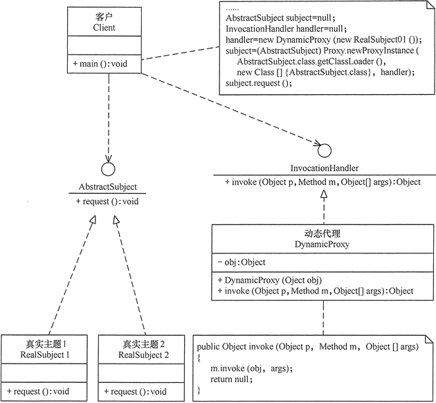
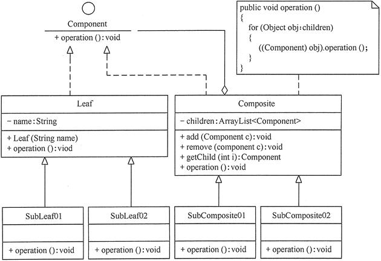

[TOC]: # "java设计模式"

# java设计模式
- [GoF的23中设计模式的分类和功能](#gof的23中设计模式的分类和功能)
  - [1. 根据目的来分](#1-根据目的来分)
  - [2. 根据作用范围来分](#2-根据作用范围来分)
  - [3. GOF的23中设计模式的功能](#3-gof的23中设计模式的功能)
- [单例模式(单例设计模式)详解](#单例模式单例设计模式详解)
  - [单例模式的定义与优点](#单例模式的定义与优点)
  - [单例模式的结构与实现](#单例模式的结构与实现)
    - [1. 单例模式的结构](#1-单例模式的结构)
    - [2. 单例模式的实现](#2-单例模式的实现)
  - [单例模式的应用案例](#单例模式的应用案例)
  - [单例模式的应用场景](#单例模式的应用场景)
  - [单例模式的扩展](#单例模式的扩展)
- [原型模式(原型设计模式)详解](#原型模式原型设计模式详解)
  - [原型模式的定义与特点](#原型模式的定义与特点)
  - [原型模式的结构与实现](#原型模式的结构与实现)
  - [原型模式的应用实例](#原型模式的应用实例)
  - [原型模式的应用场景](#原型模式的应用场景)
  - [原型模式的扩展](#原型模式的扩展)
- [简单工厂模式](#简单工厂模式)
  - [优点和缺点](#优点和缺点)
  - [应用场景](#应用场景)
  - [模式的结构与实现](#模式的结构与实现)
- [工厂方法模式（详解版）](#工厂方法模式详解版)
  - [模式的结构与实现](#模式的结构与实现-1)
  - [模式的应用实例](#模式的应用实例)
- [抽象工厂模式（详解版）](#抽象工厂模式详解版)
  - [模式的定义与特点](#模式的定义与特点)
  - [模式的结构与实现](#模式的结构与实现-2)
  - [模式的应用实例](#模式的应用实例-1)
  - [模式的应用场景](#模式的应用场景)
  - [模式的扩展](#模式的扩展)
- [建造者模式（Builder模式）详解](#建造者模式builder模式详解)
  - [模式的定义与特点](#模式的定义与特点-1)
  - [模式的结构与实现](#模式的结构与实现-3)
  - [模式的应用实例](#模式的应用实例-2)
  - [模式的应用场景](#模式的应用场景-1)
  - [建造者模式和工厂模式的区别](#建造者模式和工厂模式的区别)
  - [模式的扩展](#模式的扩展-1)
- [代理模式（代理设计模式）详解](#代理模式代理设计模式详解)
  - [代理模式的定义与特点](#代理模式的定义与特点)
  - [代理模式的结构与实现](#代理模式的结构与实现)
  - [代理模式的应用场景](#代理模式的应用场景)
  - [代理模式的扩展](#代理模式的扩展)
- [适配器模式（Adapter模式）详解](#适配器模式adapter模式详解)
  - [模式的定义与特点](#模式的定义与特点-2)
  - [模式的结构与实现](#模式的结构与实现-4)
  - [模式的应用场景](#模式的应用场景-2)
  - [模式的扩展](#模式的扩展-2)
- [桥接模式（Bridge模式）详解](#桥接模式bridge模式详解)
  - [桥接模式的定义与特点](#桥接模式的定义与特点)
  - [桥接模式的结构与实现](#桥接模式的结构与实现)
  - [桥接模式的应用场景](#桥接模式的应用场景)
  - [桥接模式的扩展](#桥接模式的扩展)
- [装饰器模式（装饰设计模式）详解](#装饰器模式装饰设计模式详解)
  - [装饰器模式的定义与特点](#装饰器模式的定义与特点)
  - [装饰器模式的结构与实现](#装饰器模式的结构与实现)
  - [装饰器模式的扩展](#装饰器模式的扩展)
- [外观模式（Facade模式）详解](#外观模式facade模式详解)
  - [外观模式的定义与特点](#外观模式的定义与特点)
  - [外观模式的结构与实现](#外观模式的结构与实现)
  - [外观模式的应用场景](#外观模式的应用场景)
  - [外观模式的扩展](#外观模式的扩展)
- [享元模式](#享元模式)
  - [享元模式的定义与特点](#享元模式的定义与特点)
  - [享元模式的结构与实现](#享元模式的结构与实现)
  - [享元模式的应用场景](#享元模式的应用场景)
  - [享元模式的扩展](#享元模式的扩展)
- [组合模式](#组合模式)
  - [组合模式的定义与特点](#组合模式的定义与特点)
  - [组合模式的结构与实现](#组合模式的结构与实现)
  - [组合模式的应用场景](#组合模式的应用场景)
  - [组合模式的扩展](#组合模式的扩展)
- [策略模式（策略设计模式）详解](#策略模式策略设计模式详解)
  - [策略模式的定义与特点](#策略模式的定义与特点)
  - [策略模式的结构与实现](#策略模式的结构与实现)
  - [策略模式的应用场景](#策略模式的应用场景)
  - [策略模式的扩展](#策略模式的扩展)
- [命令模式](#命令模式)
  - [命令模式的定义与特点](#命令模式的定义与特点)
  - [命令模式的结构与实现](#命令模式的结构与实现)
  - [命令模式的应用场景](#命令模式的应用场景)
  - [命令模式的扩展](#命令模式的扩展)
- [责任链模式（职责链模式）详解](#责任链模式职责链模式详解)
  - [模式的定义与特点](#模式的定义与特点-3)
  - [模式的结构与实现](#模式的结构与实现-5)
  - [模式的应用场景](#模式的应用场景-3)
  - [模式的扩展](#模式的扩展-3)


## GoF的23中设计模式的分类和功能

### 1. 根据目的来分
根据模式是用来完成什么工作来划分，这种方式可分为创建型模式、结构型模式和行为型模式3种

1. 创建型模式：用于描述“怎样创建对象”，它的主要特点是“将对象的创建与使用分离”。GOF中提供了单例、原型、工厂方法、抽象工厂、建造者等5种创建型模式
2. 结构型模式：用于描述如何将类或对象按某种不具组成更大的结构，GOF中提供了代理、适配器、桥接、装饰、外观、享元、组合等7种结构模式。
3. 行为型模式：用于描述类或对象之间怎样相互协作共同完成单个对象都无法单独完成的任务，以及怎样分配职责。GoF中提供了模板方法、策略、命令、职责链、状态、观察者、中介者、迭代器、访问者、备忘录、解释器等11种行为型模式

### 2. 根据作用范围来分

1. 类模式：用于处理类和子类之间的关系，这些关系通过继承来建立，是静态的，在编译时刻便确定下来了。GoF中的工厂方法、（类）适配器，模板方法、解释器属于该模式。
2. 对象模式：用于处理对象之间的关系，这些关系可以通过组合或聚合来实现，在运行时刻是可以变化的，更具动态性。GoF中除了以上4中，其他的都是对象模式。

### 3. GOF的23中设计模式的功能

前面说明了GoF的23种设计模式的分类，现在对各个模式的功能进行介绍。

1. 单例（Singleton）模式：某个类只能生成一个实例，该类提供了一个全局访问点供外部获取该实例，其拓展是有限多例模式。
2. 原型（prototype）模式：将一个对象作为原型，通过对其进行复制而克隆出多个和原型类似的新实例。
3. 工厂方法（Factory Method）模式：定义一个用于创建产品的接口，由子类决定生产什么产品。
4. 抽象工厂（AbstractFactory）模式：提供一个创建产品族的接口，其每个子类可以生产一系列相关产品。
5. 建造者（Builder）模式：将一个复杂对象分解成多个相对简单的部分，然后根据不同需要分别创建它们，最后构建成该复杂对象。
6. 代理（Proxy）模式：为某对象提供一种代理以控制对该对象的访问。即客户端通过代理间接的访问该对象，从而限制、增强或修改该对象的一些特性。
7. 适配器（Adapter）模式：将一个类的接口转换成客户希望的另一个接口，使得原本由于接口不兼容而不能一起工作的那些类能一起工作。
8. 桥接（Bridge）模式：将抽象与实现分离，使它们可以独立变化。它是用组合关系替代继承关系来实现，从而降低了抽象和实现这两个可变维度的耦合度。
9. 装饰（Decorator）模式：为多个复杂的子系统提供一个一致的接口，是这些子系统更加容易被访问。
10. 外观（Facade）模式：为多个复杂的子系统提供一个一致的接口，使这些子系统更加容易被访问。
11. 享元（Flyweight）模式：运用共享技术来有效的支持大量细粒度对象的复用。
12. 组合（Composite）模式：将对象组合成树状的层次结构，使用户对单个对象和组合对象具有一直的访问性。
13. 模板方法（TemplateMethod）模式：定义一个操作中的算法骨架，而将算法的一些步骤延迟到子类中，使得子类可以不改变该算法结构的情况下重定义改算法的某些特定的步骤。
14. 策略（Strategy）模式：定义了一系列算法，并将每个算法封装起来，使它们可以互相替换，且算法的改变不会影响使用算法的客户。
15. 命令（Command）模式：将一个请求封装为一个对象，是发出请求的责任和执行请求的责任分隔开。
16. 职责链（Chain of Responsibility）模式：把请求从链中的一个对象传到下一个对象，直到请求被相应为止。通过这种方式去除对象之间的耦合。
17. 状态（State）模式：允许一个对象在其内部状态发生改变其行为能力。
18. 观察者（Observer）模式：多个对象间存在一对多的关系，当一个对象发生改变时，把这种改变通知给其他多个对象，从而影响其他对象的行为。
19. 中介者（Mediator）模式：定义一个中介对象来简化原有对象之间的交互关系，降低系统中对象间的耦合度，使原有对象之间不必相互了解。
20. 迭代器（Iterator）模式：提供一种方法来顺序访问聚合对象中的一系列数据，而不暴露聚合对象的内部表示。
21. 访问者（Visitor）模式：在不改变集合元素的前提下，为一个集合中的每个元素提供多种访问能方式，即每个元素有多个访问者对象访问。
22. 备忘录（Memento）模式：在不破坏封装性的前提下，获取并保存一个对象的内部状态，以便以后恢复它。
23. 解释器（Interpreter）模式：提供如何定义语言的文法，以及对语言句子的解释方法，即解释器。

必须指出，<font color=red>这23中设计模式不是孤立存在的，很多模式之间存在一定的关联关系，</font>在大的系统开发中常常同时使用多种设计模式。


## 单例模式(单例设计模式)详解

在有些系统中，为了节省内存资源、保证数据内容的一致性，对某些类要求只能创建一个实例，这就是所谓的单例模式。

### 单例模式的定义与优点

单例(Singleton)模式的定义：指一个类只有一个实例，且该类能自行创建这个实例的一种模式。例如，Windows中只能打开一个任务管理器，这样可以避免因打开多个任务管理器窗口而造成内存资源的浪费，或出现各个窗口显示内容的不一致等错误。

在计算机系统中，还有Windows的回收站。操作系统中的文件系统、多线程中的线程池、显卡的驱动程序对象、打印机的后台处理任务、应用程序的日志对象、数据库的连接池、网站的计数器、Web应用的配置对象、应用程序中的对话框、系统中的缓存等常常被设计成单例

单例模式有3个特点：
1. 单例类只有一个实例对象；
2. 该单例对象必须有单例类自行创建；
3. 单例类对外提供一个访问该单例的全局访问点；

### 单例模式的结构与实现

单例模式是设计模式中最简单的模式之一。通常，普通类的构造函数是公有的，外部类可以通过"new构造函数()"来生成多个实例。但是如果将类的构造函数设为私有的，外部类就无法调用该构造函数，也无法生成多个实例。但是，如果将类的构造函数设为私有的，外部类就无法调用该构造函数，也就无法生成多个实例。这是该类自身必须定义一个静态私有实例，并向外提供一个静态的公有函数用于创建或获取该静态私有实例。

下面来分析其基本结构和实现方法。

#### 1. 单例模式的结构

单例模式的主要角色如下。
- 单例类：包含一个实例且能自行创建这个实例的类。
- 访问类：使用单例的类

其结构如图一所示。


#### 2. 单例模式的实现

Singleton 模式通常有两种实现形式。

**第1种：懒汉式单例**

该模式的特点是类加载时没有生成单例，只有当第一次调用getInstance方法时采取创建这个单例。

代码如下：
```java
public class LazySingleton
{
    private static volatile LazySingleton instance=null;    //保证 instance 在所有线程中同步
    private LazySingleton(){}    //private 避免类在外部被实例化
    public static synchronized LazySingleton getInstance()
    {
        //getInstance 方法前加同步
        if(instance==null)
        {
            instance=new LazySingleton();
        }
        return instance;
    }
}
```

注意：如果编写的是多线程程序，则不要删除上例代码中的关键字volatile和synchronized，否则将存在线程非安全的问题。如果不删除这两个关键字就能保证线程安全，但是每次访问时都要同步，会影响性能，且消耗更多的资源，这是懒汉式单例的缺点。

**第2种：饿汉式单例**

该模式的特点是类一旦加载就创建一个单例，保证在调用getInstance方法之前单例已经存在了

```java
public class HungrySingleton
{
    private static final HungrySingleton instance=new HungrySingleton();
    private HungrySingleton(){}
    public static HungrySingleton getInstance()
    {
        return instance;
    }
}
```

饿汉式单例在类创建的同事就已经创建好了一个静态的对象供系统使用，以后不再改变，所以是线程安全的，可以直接用于多线程而不会出现问题。

### 单例模式的应用案例

【例1】用懒汉式单例模式模拟产生美国当今总统对象。

分析：在每一届任期内，美国的总统只有一人，所以本实例适合用单例模式实现，图2所示使用懒汉式单例实现的结构图。


程序代码如下
```java
public class SingletonLazy
{
    public static void main(String[] args)
    {
        President zt1=President.getInstance();
        zt1.getName();    //输出总统的名字
        President zt2=President.getInstance();
        zt2.getName();    //输出总统的名字
        if(zt1==zt2)
        {
           System.out.println("他们是同一人！");
        }
        else
        {
           System.out.println("他们不是同一人！");
        }
    }
}
class President
{
    private static volatile President instance=null;    //保证instance在所有线程中同步
    //private避免类在外部被实例化
    private President()
    {
        System.out.println("产生一个总统！");
    }
    public static synchronized President getInstance()
    {
        //在getInstance方法上加同步
        if(instance==null)
        {
               instance=new President();
        }
        else
        {
           System.out.println("已经有一个总统，不能产生新总统！");
        }
        return instance;
    }
    public void getName()
    {
        System.out.println("我是美国总统：特朗普。");
    }  
}
```

程序运行结果如下：

    产生一个总统！
    我是美国总统：特朗普。
    已经有一个总统，不能产生新总统！
    我是美国总统：特朗普。
    他们是同一人！

【例2】用饿汉式单例模式模拟产生猪八戒对象

分析：同上例类似，猪八戒也只有一个，所以本实例同样适合用单例模式实现。分析：同上例类似，猪八戒也只有一个，所以本实例同样适合用单例模式实现。本实例由于要显示猪八戒的图像[（点此下载该程序所要显示的猪八戒图片）](http://c.biancheng.net/uploads/soft/181113/3-1Q1131J636.zip)，所以用到了框架窗体 JFrame 组件，这里的猪八戒类是单例类，可以将其定义成面板 JPanel 的子类，里面包含了标签，用于保存猪八戒的图像，客户窗体可以获得猪八戒对象，并显示它。图 3 所示是用饿汉式单例实现的结构图。


程序代码如下：

```java
import java.awt.*;
import javax.swing.*;
public class SingletonEager
{
    public static void main(String[] args)
    {
        JFrame jf=new JFrame("饿汉单例模式测试");
        jf.setLayout(new GridLayout(1,2));
        Container contentPane=jf.getContentPane();
        Bajie obj1=Bajie.getInstance();
        contentPane.add(obj1);    
        Bajie obj2=Bajie.getInstance(); 
        contentPane.add(obj2);
        if(obj1==obj2)
        {
            System.out.println("他们是同一人！");
        }
        else
        {
            System.out.println("他们不是同一人！");
        }   
        jf.pack();       
        jf.setVisible(true);
        jf.setDefaultCloseOperation(JFrame.EXIT_ON_CLOSE);
    }
}
class Bajie extends JPanel
{
    private static Bajie instance=new Bajie();
    private Bajie()
    { 
        JLabel l1=new JLabel(new ImageIcon("src/Bajie.jpg"));
        this.add(l1);   
    }
    public static Bajie getInstance()
    {
        return instance;
    }
}
```

程序运行结果如图4所示。


### 单例模式的应用场景

前面分析了单例模式的结构与特点，以下是它通常适用的场景和特点

- 在应用场景中，某类只要求生成一个对象的时候，如一个班中的班长、每个人的身份证号等、
- 在对象需要被共享的场合。由于单例模式只允许创建一个对象，共享该对象可以节省内存，并加快对象的访问速度。如Web中的配置对象、数据库连接池等。
- 当某类需要频繁实例化，而创建的对象又频繁被销毁的时候，如多线程的线程池、网络连接池等。

### 单例模式的扩展

单例模式可扩展为有限的多例(Multitcm)模式，这种模式可生成有限个实例并保存在ArmyList中，客户需要时可随机获取，其结构图如图5所示。


## 原型模式(原型设计模式)详解

在有些系统中，存在大量相同或者相似对象的创建问题，如果用传统的构造函数来创建对象，会比较复杂且耗时好资源，用原型模式生成对象就很高效。

### 原型模式的定义与特点

原型(Prototype)模式的定义如下：用一个已经创建的实例作为原型，通过复制该原型对象来创建一个和原型相同或相似的新对象。在这里，原型实例指定了要创建的对象的种类。用这种方式创建对象非常高效，根本无需知道对象创建的细节。例如，Windows操作系统的安装通常较耗时，如果复制接快了很多。

### 原型模式的结构与实现

由于Java提供了对象的clone()方法，所以用Java实现原型模式很简单

**1. 模式的结构**

原型模式包含以下主要角色

1. 抽象原型类：规定了具体原型对象必须实现的接口。
2. 具体原型类：实现抽象原型类的clone()方法，它是可被复制的对象。
3. 访问类：使用具体原型类中的clone()方法来复制新的对象

**2. 模式的实现**
原型模式的克隆分为浅克隆和深克隆，Java中的Object类提供了浅克隆的clone()方法，具体原型类只要实现Cloneable接口就可实现对象的浅克隆，这里的Cloneable接口就是抽象原型类。其代码如下：

```java
//具体原型类
class Realizetype implements Cloneable
{
    Realizetype()
    {
        System.out.println("具体原型创建成功！");
    }
    public Object clone() throws CloneNotSupportedException
    {
        System.out.println("具体原型复制成功！");
        return (Realizetype)super.clone();
    }
}
//原型模式的测试类
public class PrototypeTest
{
    public static void main(String[] args)throws CloneNotSupportedException
    {
        Realizetype obj1=new Realizetype();
        Realizetype obj2=(Realizetype)obj1.clone();
        System.out.println("obj1==obj2?"+(obj1==obj2));
    }
}
```

程序的运行结果如下:

    具体原型创建成功！
    具体原型复制成功！
    obj1=obj2?false

### 原型模式的应用实例

【例1】用原型模式模拟"孙悟空"复制自己

分析：孙悟空拔下猴毛轻轻一吹就变出很多孙悟空，这实际上是用到了原型模式。这里的孙悟空类SunWukong是具体原型类，而Java中的Cloneable接口是抽象原型类。

同前面介绍的猪八戒实例一样，由于要显示孙悟空的图像，同前面介绍的猪八戒实例一样，由于要显示孙悟空的图像[（点击此处下载该程序所要显示的孙悟空的图片）](http://c.biancheng.net/uploads/soft/181113/3-1Q114103933.zip)，所以将孙悟空类定义成面板 JPanel 的子类，里面包含了标签，用于保存孙悟空的图像。

另外，重写了 Cloneable 接口的 clone() 方法，用于复制新的孙悟空。访问类可以通过调用孙悟空的 clone() 方法复制多个孙悟空，并在框架窗体 JFrame 中显示。图 2 所示是其结构图。


程序代码如下：

```java
import java.awt.*;
import javax.swing.*;
class SunWukong extends JPanel implements Cloneable
{
    private static final long serialVersionUID = 5543049531872119328L;
    public SunWukong()
    {
        JLabel l1=new JLabel(new ImageIcon("src/Wukong.jpg"));
        this.add(l1);   
    }
    public Object clone()
    {
        SunWukong w=null;
        try
        {
            w=(SunWukong)super.clone();
        }
        catch(CloneNotSupportedException e)
        {
            System.out.println("拷贝悟空失败!");
        }
        return w;
    }
}
public class ProtoTypeWukong
{
    public static void main(String[] args)
    {
        JFrame jf=new JFrame("原型模式测试");
        jf.setLayout(new GridLayout(1,2));
        Container contentPane=jf.getContentPane();
        SunWukong obj1=new SunWukong();
        contentPane.add(obj1);       
        SunWukong obj2=(SunWukong)obj1.clone();
        contentPane.add(obj2);   
        jf.pack();       
        jf.setVisible(true);
        jf.setDefaultCloseOperation(JFrame.EXIT_ON_CLOSE);   
    }
}
```

程序的运行结果如图所示。


用原型模式除了可以生成相同的对象，还可以生成类似的对象，请看一下实例

【例2】用原型模式生成"三好学生"奖状

分析：同一学校的"三好学生"奖状除了获奖人姓名不同，其他都相同，属于相似对象的复制，同样可以用原型模式创建，然后再做简单修改就可以了，图4所示是三好学生奖状生成器的结构图。


程序代码如下：

```java
public class ProtoTypeCitation
{
    public static void main(String[] args) throws CloneNotSupportedException
    {
        citation obj1 = new citation("张三", "同学：在2016学年第一学期中表现优秀，被评为三好学生。", "韶关学院");
        obj1.display();
        citation obj2 = (citation)obj1.clone();
        obj2.setName("李四");
        obj2.display();
    }
}

//奖状类
class citation implements Cloneable
{
    String name;

    String info;

    String college;

    citation(String name, String info, String college)
    {
        this.name = name;
        this.info = info;
        this.college = college;
        System.out.println("奖状创建成功！");
    }

    void setName(String name)
    {
        this.name = name;
    }

    String getName()
    {
        return (this.name);
    }

    void display()
    {
        System.out.println(name + info + college);
    }

    public Object clone() throws CloneNotSupportedException
    {
        System.out.println("奖状拷贝成功！");
        return (citation)super.clone();
    }
}
```

程序运行结果如下：
> 奖状创建成功！
> 张三同学：在2016学年第一学期中表现优秀，被评为三好学生。韶关学院
> 奖状拷贝成功！
> 李四同学：在2016学年第一学期中表现优秀，被评为三好学生。韶关学院


### 原型模式的应用场景

原型模式通常适用于以下场景。
- 对象之间相同或相似，即只是个别的几个属性不同的时候。
- 对象的创建过程比较麻烦，但是复制比较简单的时候。

### 原型模式的扩展

原型模式可扩展为带原型管理器的原型模式，它在圆形模式的基础上增加了一个原型管理器PrototypeManager类。该类用HashMap保存多个复制的原型，Client类可以通过管理器的get(String id)方法从中获取复制的原型。其结构图如图所示：


【例3】用带原型管理器的原型模式来生成包含”圆“和”正方形“等图形的原型，并计算其面积。分析：本案例中由于存在不同的图形类，例如，”圆“和”正方形“，他们的计算面积方法不一样，所以需要用一个原型管理器来管理他们。


程序代码如下：

``` java
import java.util.*;
interface Shape extends Cloneable
{
    public Object clone();    //拷贝
    public void countArea();    //计算面积
}
class Circle implements Shape
{
    public Object clone()
    {
        Circle w=null;
        try
        {
            w=(Circle)super.clone();
        }
        catch(CloneNotSupportedException e)
        {
            System.out.println("拷贝圆失败!");
        }
        return w;
    }
    public void countArea()
    {
        int r=0;
        System.out.print("这是一个圆，请输入圆的半径：");
        Scanner input=new Scanner(System.in);
        r=input.nextInt();
        System.out.println("该圆的面积="+3.1415*r*r+"\n");
    }
}
class Square implements Shape
{
    public Object clone()
    {
        Square b=null;
        try
        {
            b=(Square)super.clone();
        }
        catch(CloneNotSupportedException e)
        {
            System.out.println("拷贝正方形失败!");
        }
        return b;
    }
    public void countArea()
    {
        int a=0;
        System.out.print("这是一个正方形，请输入它的边长：");
        Scanner input=new Scanner(System.in);
        a=input.nextInt();
        System.out.println("该正方形的面积="+a*a+"\n");
    }
}
class ProtoTypeManager
{
    private HashMap<String, Shape>ht=new HashMap<String,Shape>(); 
    public ProtoTypeManager()
    {
        ht.put("Circle",new Circle());
           ht.put("Square",new Square());
    } 
    public void addshape(String key,Shape obj)
    {
        ht.put(key,obj);
    }
    public Shape getShape(String key)
    {
        Shape temp=ht.get(key);
        return (Shape) temp.clone();
    }
}
public class ProtoTypeShape
{
    public static void main(String[] args)
    {
        ProtoTypeManager pm=new ProtoTypeManager();    
        Shape obj1=(Circle)pm.getShape("Circle");
        obj1.countArea();          
        Shape obj2=(Shape)pm.getShape("Square");
        obj2.countArea();     
    }
}
```

运行结果如下所示：
> 这是一个圆，请输入圆的半径：3
> 该圆的面积=28.2735
>
> 这是一个正方形，请输入它的边长：3
> 该正方形的面积=9


## 简单工厂模式

现实生活中，原始社会自给自足（没有工厂），农耕社会小作坊（简单工厂，民间酒坊），工业革命流水线（工厂方法，自产自销），现代产业链代工厂（抽象工厂，富士康）。我们的项目代码同样是由简到繁一步一步迭代而来的，但对于调用者来说，也越来越简单

在日常开发中，凡是需要生成复杂对象的地方，都可以尝试考虑使用工厂模式来代替。

> 注意：上述复杂对象指的是类的构造函数过多等对类的构造有影响的情况，因为类的构造过于复杂，如果直接在其他业务类中使用，则两者的耦合过重，后续业务更改，就需要在任何引用该类的源代码内进行更改，光是查找所有依赖就很消耗时间了，更别说一个一个修改了。

工厂模式的定义：定义一个创建产品对象的工厂接口，将产品对象的实际创建工作推迟到具体子工厂类当中。这满足创建型模式中所要求的“创建与使用相分离”的特点。

按实际业务场景划分，工厂模式有3中不同的实现方式，分别是简单工厂模式、工厂方法模式和抽象工厂模式。

我们把被创建的对象称为“产品”，把创建产品的对象称为“工厂”。如果要创建的产品不多，只要一个工厂类就可以完成，这种模式叫“简单工厂模式”

在简单工厂模式中创建实例的方法通常为静态（static）方法，因此简单工厂模式（Simple Factory Pattern）又叫作静态工厂方法模式（Static Factory Method Pattern）。

简单来说，简单工厂模式有一个具体的厂类，可以生成多个不同的产品，属于创建型设计模式。简单工厂模式不在GoF23中设计模式之列。

简单工厂模式每增加一个产品就要增加一个具体产品类和一个对应的具体工厂类，这增加了系统的复杂度，违背了“开闭原则”

> “工厂方法模式”是对简单工厂模式的进一步抽象化，其好处是可以使系统在不修改原来代码的情况下引进新的产品，即满足开闭原则。

### 优点和缺点

**优点：**
1. 工厂类包含必要的逻辑判断，可以确定在什么时候创建哪一个产品的实例。客户端可以免除直接创建产品对象的职责，很方便的创建出相应的产品。工厂和产品的职责区分明确。
2. 客户端无需知道所创建具体产品的类名，只需知道参数即可。
3. 也可以引出配置文件，在不修改客户端代码的情况下更换和添加新的具体的产品类。

**缺点：**
1. 简单工厂模式的工厂类单一，负责所有产品的创建，职责过重，一旦异常，整个系统将受影响。且工厂类代码会非常臃肿，违背高聚合原则。
2. 使用简单工厂模式会增加系统中类的个数（引入新的工厂类），增加系统的复杂度和理解难度。
3. 系统扩展困难，一旦增加新厂品不得不修改工厂逻辑，在产品类型较多时，可能造成逻辑过于复杂
4. 简单工厂模式使用了static工厂方法，造成工厂角色无法形成基于继承的等级结构。

### 应用场景

对于产品种类相对较少的情况，考虑使用简单工厂模式。使用简单工厂模式的客户端只需要传入工厂类的参数，不需要关心任何创建对象的逻辑，可以很方便的创建所需产品。

### 模式的结构与实现

简单工厂模式的主要角色如下：

- 简单工厂（SimpleFactory）：是简单工厂模式的核心，负责实现创建所有实例的内部逻辑。工厂类的创建产品类的方法可以被外界直接调用，创建所需的产品对象。
- 抽象产品（Product）：是简单工厂创建的所有对象的父类，负责描述所有势力共有的公共接口。
- 具体产品（ConcreteProduct）：是简单工厂模式的创建目标。

其结构图如下图所示。


根据上图写出该模式的代码如下：

```java
public class Client{
    public static void main(String[] args){
      
    }
    //抽象产品
    public interface Product {
        void show();
    }
    
    //具体产品ProductA
    static class ConcreteProduct1 implements Product {
        public void show(){
            System.out.println("具体产品1显示......");
        }
    }
    
    //具体产品：ProductB
    static class ConcreteProduct2 implements Product {
        public void show() {
            System.out.println("具体产品2显示......");
        }
    }
    
    final class Const{
        static final int PRODUCT_A = 0;
        static final int PRODUCT_B = 1;
        static final int PRODUCT_C = 2;
    }

    static class SimpleFactory {
        public static Product makeProduct(int kind) {
            switch (kind) {
                case Const.PRODUCT_A:
                    return new ConcreteProduct1();
                case Const.PRODUCT_B:
                    return new ConcreteProduct2();
            }
            return null;
        }
    }
}
```

## 工厂方法模式（详解版）

在现实生活中社会分工越来越细，越来越专业化。这种产品有专门的工厂生产，彻底告别了自给自足的小农经济时代，这大大缩短了产品的生产周期，提高了生产效率，同样在软件开发中能否做到软件对象的生产和使用相分离呢？能否在满足“开闭原则”的前提下，客户随意增删或者改变对软件相关对象的使用？这就是本届要讨论的问题。

在简单工厂模式一节我们介绍了简单工厂模式，提到了简单工厂模式违背了开闭原则，而“工厂方法模式”是对简单工厂模式的进一步抽象化，其好处是可以是系统在不修改原来代码的情况下引进新的产品，即满足开闭原则。

**优点：**

- 用户只需要知道具体工厂的名称就可以得到所要的产品，无需知道产品的创建过程'
- 灵活性增强，对于新产品的创建，只需多写一个相应的工厂类。
- 典型的解耦框架。高层模块只需要知道产品的抽象类，无需关心其他实现类，满足迪米特法则、依赖导致原则和里氏替换原则。

**缺点：**

- 类的个数容易过多，增加复杂度
- 增加了系统的抽象性和理解难度
- 抽象产品只能生产一种产品，此弊端可以使用抽象工厂模式解决。

**应用场景：**

- 客户只知道创建产品的工厂名，而不知道具体的产品名。比如TCL电视工厂、海信电视工厂等。
- 创建对象的任务由多个具体子工厂中的某一个完成，而抽象工厂只提供创建产品的结构
- 客户不关系创建产品的细节，只关心产品的品牌

### 模式的结构与实现

工厂方法模式由抽象工厂、具体工厂和具体产品等4个要素构成。本节来分析结构和实现方法。

模式的结构
工厂方法模式的主要角色如下：


1. 抽象工厂（Abstract Factory）：提供了创建产品的接口，调用者通过它访问具体工厂的工厂方法new Product()来创建产品。
2. 具体工厂（ConcreteFactory）：主要是实现了抽象工厂中的抽象方法，完成具体产品的创建。
3. 抽象产品（Product）：定义了产品的规范，描述了产品的主要特性和功能。
4. 具体产品（Concrete Product）：实现了抽象产品角色所定义的接口，由具体工厂来创建，它同具体工厂之间一一对应。

其结构图如图1 所示：


模式的实现

根据图1写出该模式的代码如下：

```java
package FactoryMethod;

public class AbstractFactoryTest{
    public static void main(String[] args)
    {
        try {
            Product a;
            AbstractFactory af;
            af = (AbstractFactory) ReadXML1.getObject();
            a = af.newProduct();
            a.show();
        } catch (Exception e) {
            System.out.println(e.getMessage());
        }
    }
    }
    
    interface Product{
        public void show();
    }
    
    class ConcreteProduct1 implements Product {

        @Override
        public void show()
        {
            System.out.println("具体产品1显示...");
        }
    }
    class ConcreteProduct2 implements Product {

        @Override
        public void show()
        {
            System.out.println("具体产品2显示...");
        }
    }
    
    interface AbstractFactory{
        public Product newProduct();
    }

    //具体工厂1：实现了厂品的生成方法
    class ConcreteFactory1 implements AbstractFactory {
        public Product newProduct() {
            System.out.println("具体工厂1生成-->具体产品1...");
            return new ConcreteProduct1();
        }
    }
    //具体工厂2：实现了厂品的生成方法
    class ConcreteFactory2 implements AbstractFactory {
        public Product newProduct() {
            System.out.println("具体工厂2生成-->具体产品2...");
            return new ConcreteProduct2();
        }
}
```
```java
package FactoryMethod;
import javax.xml.parsers.*;
import org.w3c.dom.*;
import java.io.*;
class ReadXML1 {
    //该方法用于从XML配置文件中提取具体类类名，并返回一个实例对象
    public static Object getObject() {
        try {
            //创建文档对象
            DocumentBuilderFactory dFactory = DocumentBuilderFactory.newInstance();
            DocumentBuilder builder = dFactory.newDocumentBuilder();
            Document doc;
            doc = builder.parse(new File("src/FactoryMethod/config1.xml"));
            //获取包含类名的文本节点
            NodeList nl = doc.getElementsByTagName("className");
            Node classNode = nl.item(0).getFirstChild();
            String cName = "FactoryMethod." + classNode.getNodeValue();
            //System.out.println("新类名："+cName);
            //通过类名生成实例对象并将其返回
            Class<?> c = Class.forName(cName);
            Object obj = c.newInstance();
            return obj;
        } catch (Exception e) {
            e.printStackTrace();
            return null;
        }
    }
}
```

注意：该程序中用到了XML文件，如果想要获取改文件，请点击”[下载](http://c.biancheng.net/uploads/soft/181113/3-1Q114140222.zip)“，就可以对其进行下载。

程序运行结果如下：

> 具体工厂1生成->具体产品1...
> 具体产品1显示

如果将XML配置文件中的ConcreteFactory1改为ConcreteFactory2，则程序运行结果如下：

> 具体工厂2生成->具体产品2...
> 具体产品2显示

### 模式的应用实例

【例1】用工厂方法模式设计畜牧场。

分析：有很多种类的畜牧场，如养马场用于养马，养牛场用于养牛，所以该实例用工厂方法模式比较适合。

对养马场和养牛场等具体工厂类，只要定义一个生成动物的方法newAnimal()即可。由于要显示马类和牛类等具体产品类的图像，所以它们的构造函数中用到了JPanel。JLabd和ImageIcon等组件，并定义一个show()方法来显示它们。

客户端程序通过对象生成器ReadXML2读取xml配置文件中的数据来决定养马还是养牛。其结构图如图2所示。


注意：该程序中用到了XML文件，并且要显示马类和牛类等具体产品类的图像，如果想要获取HTML文件和图片，请点击“[下载](http://c.biancheng.net/uploads/soft/181113/3-1Q114140526.zip)”，就可以对其进行下载。

程序代码如下：

``` java
package FactoryMethod;

import java.awt.*;
import javax.swing.*;

public class AnimalFarmTest {
    public static void main(String[] args) {
        try {
            Animal a;
            AnimalFarm af;
            af = (AnimalFarm) ReadXML2.getObject();
            a = af.newAnimal();
            a.show();
        } catch (Exception e) {
            System.out.println(e.getMessage());
        }
    }
}

//抽象产品：动物类
interface Animal {
    public void show();
}

//具体产品：马类
class Horse implements Animal {
    JScrollPane sp;
    JFrame jf = new JFrame("工厂方法模式测试");

    public Horse() {
        Container contentPane = jf.getContentPane();
        JPanel p1 = new JPanel();
        p1.setLayout(new GridLayout(1, 1));
        p1.setBorder(BorderFactory.createTitledBorder("动物：马"));
        sp = new JScrollPane(p1);
        contentPane.add(sp, BorderLayout.CENTER);
        JLabel l1 = new JLabel(new ImageIcon("src/A_Horse.jpg"));
        p1.add(l1);
        jf.pack();
        jf.setVisible(false);
        jf.setDefaultCloseOperation(JFrame.EXIT_ON_CLOSE);    //用户点击窗口关闭
    }

    public void show() {
        jf.setVisible(true);
    }
}

//具体产品：牛类
class Cattle implements Animal {
    JScrollPane sp;
    JFrame jf = new JFrame("工厂方法模式测试");

    public Cattle() {
        Container contentPane = jf.getContentPane();
        JPanel p1 = new JPanel();
        p1.setLayout(new GridLayout(1, 1));
        p1.setBorder(BorderFactory.createTitledBorder("动物：牛"));
        sp = new JScrollPane(p1);
        contentPane.add(sp, BorderLayout.CENTER);
        JLabel l1 = new JLabel(new ImageIcon("src/A_Cattle.jpg"));
        p1.add(l1);
        jf.pack();
        jf.setVisible(false);
        jf.setDefaultCloseOperation(JFrame.EXIT_ON_CLOSE);    //用户点击窗口关闭
    }

    public void show() {
        jf.setVisible(true);
    }
}

//抽象工厂：畜牧场
interface AnimalFarm {
    public Animal newAnimal();
}

//具体工厂：养马场
class HorseFarm implements AnimalFarm {
    public Animal newAnimal() {
        System.out.println("新马出生！");
        return new Horse();
    }
}

//具体工厂：养牛场
class CattleFarm implements AnimalFarm {
    public Animal newAnimal() {
        System.out.println("新牛出生！");
        return new Cattle();
    }
}
```


```java
package FactoryMethod;
import javax.xml.parsers.*;
import org.w3c.dom.*;
import java.io.*;

class ReadXML2 {
    public static Object getObject() {
        try {
            DocumentBuilderFactory dFactory = DocumentBuilderFactory.newInstance();
            DocumentBuilder builder = dFactory.newDocumentBuilder();
            Document doc;
            doc = builder.parse(new File("src/FactoryMethod/config2.xml"));
            NodeList nl = doc.getElementsByTagName("className");
            Node classNode = nl.item(0).getFirstChild(); xiazunhai
            String cName = "FactoryMethod." + classNode.getNodeValue();
            System.out.println("新类名：" + cName);
            Class<?> c = Class.forName(cName);
            Object obj = c.newInstance();
            return obj;
        } catch (Exception e) {
            e.printStackTrace();
            return null;
        }
    }
}
```

程序的运行结果如图3所示。


注意：当需要生成的产品不多且不会增加，一个具体工厂类就可以完成任务时，可以删除抽象工厂类，此时工厂方法模式将退化到简单工厂模式。

## 抽象工厂模式（详解版）

前面介绍的工厂方法模式中考虑的是一类产品的生产，如畜牧场只养动物、电视机厂只生产电视机、计算机软件学院只培养计算机软件专业的学生等。

同种类成为同等级，也就是说：工厂方法模式值考虑生产同等级的产品，但是在现实生活中许多工厂是综合型的工厂，能生产多等级（种类）的产品，如农场里既养动物又种植物，电器厂既生产电视机又生产洗衣机或空调，大学既有软件专业又有生物专业等。

本节要介绍的抽象工厂模式将考虑多等级产品的生产，将同一具体工厂所生产的位于不同等级的一组产品称为一个产品族，图1所示的是海尔工厂和TCL工厂所生产的电视机与空调对应的关系图。


### 模式的定义与特点

抽象工厂（AbstractFactory)模式的定义：是一种为访问类提供一个创建一组相关或相互依赖对象的接口，且访问类无需指定所要产品的具体类就能得到同族的不同等级的产品的模式结构。

抽象工厂模式是工厂方法模式的升级版本，工厂方法模式只生产一个等级的产品，而抽象工厂模式可生产多个等级的产品。

使用抽象工厂模式一般要满足以下条件：

- 系统中有多个产品族，每个具体工厂创建的同一族但属于不同等级结构的产品
- 系统一次只可能消费某一组产品，即同族的产品一起使用。

抽象工厂模式除了具有工厂方法模式的优点外，其他主要优点如下。

- 可以在类的内部对产品族中相关联的多等级产品共同管理，而不必专门引入多个新的类来进行管理。
- 当需要产品族时，抽象工厂可以保证客户端始终只是用同一个产品的产品族。
- 抽象工厂增强了程序的可扩展性，当增加一个新的产品族时，不需要修改源代码，满足开闭原则。

其缺点是：当产品族中需要增加一个新的产品时，所有的工厂类都需要修改，增加了系统的抽象性和理解难度。

### 模式的结构与实现

抽象工厂模式同工厂方法模式一样，也是抽象工厂、具体工厂、抽象产品和具体产品等4个要素构成，但抽象工厂中方法个数不同，抽象产品的个数也不同。现在我们来分析其基本结构和实现方法。

模式的结构

抽象工厂模式的主要角色如下：

1. 抽象工厂（Abstract Factory）：提供了创建产品的接口，它包含了多个创建产品的方法 newProduct()，可以创建多个不同等级的产品。
2. 具体工厂（Concrete Factory）：主要是实现抽象工厂中的多个抽象方法，完成具体产品的创建。
3. 抽象产品（Product）：定义了产品的规范，描述了产品的主要特性和功能，抽象工厂模式有多个抽象产品。
4. 具体产品（Concrete Product）：实现了抽象产品角色所定义的接口，由具体工厂来创建，它同具体工厂之间是多对一的关系。

抽象工厂模式的结构图如图2所示。


模式的实现

从图2可以看出抽象工厂模式的结构同工厂方法模式的结构相似，不同的是其产品的种类不止一个，
所以创建产品的方法也不止一个。下面给出抽象工厂和具体工厂的代码。

（1）抽象工厂：提供了产品的生成方法。

```java
interface AbstractFactory {
    public Product1 newProduct1();
    public Product2 newProduct2();
}
```

（2）具体工厂：实现了产品的生成方法。

```java
class ConcreteFactory1 implements AbstractFactory {
    public Product1 newProduct1() {
        System.out.println("具体工厂 1 生成-->具体产品 11...");
        return new ConcreteProduct11();
    }
    public Product2 newProduct2() {
        System.out.println("具体工厂 1 生成-->具体产品 21...");
        return new ConcreteProduct21();
    }
}
```

### 模式的应用实例

【例1】用抽象工厂模式设计农场类，

分析：农场中除了像畜牧场一样可以养动物，还可以培养动物，如养马、养牛、种菜、种水果等，所以本实例比前面介绍的畜牧场类复杂，必须用抽象工厂模式来实现。

本例用抽象工厂模式来设计两个农场，一个是韶关农场用于养牛和种菜，一个是上饶农场用于养马和种水果，可以在以上两个农场中定义一个生成动物的方法newAnimal()和一个培养植物的方法newPlant()。

对马类、牛类、蔬菜类和水果类等具体产品类，由于要显示他们的图像（[点此下载图片](http://c.biancheng.net/uploads/soft/181113/3-1Q114160J0.zip))，所以它们的构造函数中用了JPanel，JLabel和ImageIcon等组件，并定义一个show()方法来显示它们。

客户端程序通过对象生成器类ReadXML读取XML配置文件中的数据来决定养什么动物和培养什么植物（[点此下载XML文件](http://c.biancheng.net/uploads/soft/181113/3-1Q114160S7.zip)）。其结构图如图3所示。


程序代码如下：

```java
package AbstractFactory;

import java.awt.*;
import javax.swing.*;

public class FarmTest {
    public static void main(String[] args) {
        try {
            Farm f;
            Animal a;
            Plant p;
            f = (Farm) ReadXML.getObject();
            a = f.newAnimal();
            p = f.newPlant();
            a.show();
            p.show();
        } catch (Exception e) {
            System.out.println(e.getMessage());
        }
    }
}

//抽象产品：动物类
interface Animal {
    public void show();
}

//具体产品：马类
class Horse implements Animal {
    JScrollPane sp;
    JFrame jf = new JFrame("抽象工厂模式测试");

    public Horse() {
        Container contentPane = jf.getContentPane();
        JPanel p1 = new JPanel();
        p1.setLayout(new GridLayout(1, 1));
        p1.setBorder(BorderFactory.createTitledBorder("动物：马"));
        sp = new JScrollPane(p1);
        contentPane.add(sp, BorderLayout.CENTER);
        JLabel l1 = new JLabel(new ImageIcon("src/A_Horse.jpg"));
        p1.add(l1);
        jf.pack();
        jf.setVisible(false);
        jf.setDefaultCloseOperation(JFrame.EXIT_ON_CLOSE);//用户点击窗口关闭
    }

    public void show() {
        jf.setVisible(true);
    }
}

//具体产品：牛类
class Cattle implements Animal {
    JScrollPane sp;
    JFrame jf = new JFrame("抽象工厂模式测试");

    public Cattle() {
        Container contentPane = jf.getContentPane();
        JPanel p1 = new JPanel();
        p1.setLayout(new GridLayout(1, 1));
        p1.setBorder(BorderFactory.createTitledBorder("动物：牛"));
        sp = new JScrollPane(p1);
        contentPane.add(sp, BorderLayout.CENTER);
        JLabel l1 = new JLabel(new ImageIcon("src/A_Cattle.jpg"));
        p1.add(l1);
        jf.pack();
        jf.setVisible(false);
        jf.setDefaultCloseOperation(JFrame.EXIT_ON_CLOSE);//用户点击窗口关闭
    }

    public void show() {
        jf.setVisible(true);
    }
}

//抽象产品：植物类
interface Plant {
    public void show();
}

//具体产品：水果类
class Fruitage implements Plant {
    JScrollPane sp;
    JFrame jf = new JFrame("抽象工厂模式测试");

    public Fruitage() {
        Container contentPane = jf.getContentPane();
        JPanel p1 = new JPanel();
        p1.setLayout(new GridLayout(1, 1));
        p1.setBorder(BorderFactory.createTitledBorder("植物：水果"));
        sp = new JScrollPane(p1);
        contentPane.add(sp, BorderLayout.CENTER);
        JLabel l1 = new JLabel(new ImageIcon("src/P_Fruitage.jpg"));
        p1.add(l1);
        jf.pack();
        jf.setVisible(false);
        jf.setDefaultCloseOperation(JFrame.EXIT_ON_CLOSE);//用户点击窗口关闭
    }

    public void show() {
        jf.setVisible(true);
    }
}

//具体产品：蔬菜类
class Vegetables implements Plant {
    JScrollPane sp;
    JFrame jf = new JFrame("抽象工厂模式测试");

    public Vegetables() {
        Container contentPane = jf.getContentPane();
        JPanel p1 = new JPanel();
        p1.setLayout(new GridLayout(1, 1));
        p1.setBorder(BorderFactory.createTitledBorder("植物：蔬菜"));
        sp = new JScrollPane(p1);
        contentPane.add(sp, BorderLayout.CENTER);
        JLabel l1 = new JLabel(new ImageIcon("src/P_Vegetables.jpg"));
        p1.add(l1);
        jf.pack();
        jf.setVisible(false);
        jf.setDefaultCloseOperation(JFrame.EXIT_ON_CLOSE);//用户点击窗口关闭
    }

    public void show() {
        jf.setVisible(true);
    }
}

//抽象工厂：农场类
interface Farm {
    public Animal newAnimal();

    public Plant newPlant();
}

//具体工厂：韶关农场类
class SGfarm implements Farm {
    public Animal newAnimal() {
        System.out.println("新牛出生！");
        return new Cattle();
    }

    public Plant newPlant() {
        System.out.println("蔬菜长成！");
        return new Vegetables();
    }
}

//具体工厂：上饶农场类
class SRfarm implements Farm {
    public Animal newAnimal() {
        System.out.println("新马出生！");
        return new Horse();
    }

    public Plant newPlant() {
        System.out.println("水果长成！");
        return new Fruitage();
    }
}
```

```java
package AbstractFactory;
import javax.xml.parsers.*;
import org.w3c.dom.*;
import java.io.*;

class ReadXML {
    public static Object getObject() {
        try {
            DocumentBuilderFactory dFactory = DocumentBuilderFactory.newInstance();
            DocumentBuilder builder = dFactory.newDocumentBuilder();
            Document doc;
            doc = builder.parse(new File("src/AbstractFactory/config.xml"));
            NodeList nl = doc.getElementsByTagName("className");
            Node classNode = nl.item(0).getFirstChild();
            String cName = "AbstractFactory." + classNode.getNodeValue();
            System.out.println("新类名：" + cName);
            Class<?> c = Class.forName(cName);
            Object obj = c.newInstance();
            return obj;
        } catch (Exception e) {
            e.printStackTrace();
            return null;
        }
    }
}
```

程序运行结果如图4所示。


### 模式的应用场景

抽象工厂模式最早的应用是用于创建属于不同操作系统的视窗构建。如Java的AWT中的Button和Text等构件在Windows和Unix中的本地实现是不同的。

抽象工厂模式通常适用于以下场景：

1. 当需要创建的对象时一系列相互关联或相互依赖的产品族时，如电器工厂中的电视机、洗衣机、空调等。
2. 系统中有多个产品族，但每次只使用其中的某一族产品。如有人只喜欢穿某一个品牌的衣服和鞋。
3. 系统中提供了产品的类库，且所有产品的接口相同，客户端不依赖产品实例的创建细节和内部结构。

### 模式的扩展

抽象工厂模式的扩展有一定的“开闭原则”倾斜性

1. 当增加一个新的产品族时只需增加一个新的具体工厂，不需要修改源代码，满足开闭原则。
2. 当产品族中需要增加一个新种类的产品时，则所有的工厂类都需要进行修改，不满足开闭原则。

另一方面，当系统中只存在一个等级结构的产品时，抽象工厂模式将退化到工厂方法模式。

## 建造者模式（Builder模式）详解

在软件开发过程中有时需要创建一个复杂的对象，这个复杂对象通常由多个子部件按一定的步骤组合而成。例如，计算机是由CPU、主板、内存、硬盘、显卡、机箱、显示器、键盘、鼠标等部件组装而成的，采购员不可能自己去组装计算机，而是将计算机的配置要求告诉计算机销售公司，计算机销售公司安排技术人员去组装计算机，然后再交给要买计算机的采购员。

生活中这样的例子很多，如游戏中的不同角色，其性别、个性、能力、脸型、体型、服装、发型等特性都有所差异；还有汽车中的方向盘、发动机、车架、轮胎等部件也多种多样；没封电子邮件的发件人、收件人、主题、内容、附件等内容也各不相同。

以上所有这些产品都是由多个部件构成的，各个部件可以灵活选择，但其创建步骤都大同小异。这类产品的创建无法用前面介绍的工厂模式描述，只有建造者模式可以很好地描述该类产品的创建。

### 模式的定义与特点

建造者（Builder）模式的定义：指将一个复杂对象的构造与它的表示分离，使同样的构建过程可以创建不同的表示，这样的设计模式被称为建造者模式。它是将一个复杂的对象分解为多个简单的对象，然后一步一步构建而成。它将变于不变相分离，即产品的组成部分是不变的，但每一部分是可以灵活选择的。

该模式的主要优点如下：

1. 封装性好，构建和表示分离。
2. 扩展性好，各个具体的建造者相互独立，有利于系统的解耦。
3. 客户端不必知道产品内部组成的细节，建造者可以对创建过程逐步细化，而不对其它模块产生任何影响，便于控制细节风险。

其缺点如下：

1. 产品的组成部分必须不同，这限制了其使用范围。
2. 如果产品的内部变化复杂，如果产品内部发生变化，则建造者也要同步修改，后期维护成本较大。

建造者（Builder）模式和工厂模式的关注点不同：建造者模式注重零部件的组装过程，而工厂方法模式更注重零部件的创建过程，但两者可以结合使用。

### 模式的结构与实现

建造者（Builder）模式由产品、抽象建造者、具体建造者、指挥者等4个要素构成，现在我们来分析其基本结构和实现方法。

模式和结构

建造者（Builder）模式的主要角色如下。

1. 产品角色（Product）：它是包含多个组成部件的复杂对象，由具体建造者来创建其各个零部件。
2. 抽象建造者（Builder）：它是一个包含创建产品各个子部件的抽象方法的接口，通常还包含一个返回复杂产品的方法getResult()。
3. 具体建造者（Concrete Builder）：实现Builder接口，完成复杂产品的各个部件的具体创建方法。
4. 指挥者（Director）：它调用建造者对象中的部件构造与装配方法完成复杂对象的创建，在指挥者中不涉及具体产品的信息。

其结构图如图1所示：


模式的实现

图1给出了建造者（Builder）模式的主要结构，其相关类的代码如下。

（1）产品角色：包含多个组成部件的复杂对象

```java
class Product {
    private String partA;
    private String partB;
    private String partC;

    public void setPartA(String partA) {
        this.partA = partA;
    }

    public void setPartB(String partB) {
        this.partB = partB;
    }

    public void setPartC(String partC) {
        this.partC = partC;
    }

    public void show() {
        //显示产品的特性
    }
}
```
(2)抽象建造者：包含创建产品各个子部件的抽象方法
```java
abstract class Builder {
    //创建产品对象
    protected Product product = new Product();

    public abstract void buildPartA();

    public abstract void buildPartB();

    public abstract void buildPartC();

    //返回产品对象
    public Product getResult() {
        return product;
    }
}
```

（3）具体建造者：实现了抽象建造者接口

```java
public class ConcreteBuilder extends Builder {
    public void buildPartA() {
        product.setPartA("建造 PartA");
    }

    public void buildPartB() {
        product.setPartB("建造 PartB");
    }

    public void buildPartC() {
        product.setPartC("建造 PartC");
    }
}
```

(4)指挥者：调用建造者中的方法完成复杂对象的创建。

```java
class Director {
    private Builder builder;

    public Director(Builder builder) {
        this.builder = builder;
    }

    //产品构建与组装方法
    public Product construct() {
        builder.buildPartA();
        builder.buildPartB();
        builder.buildPartC();
        return builder.getResult();
    }
}
```

(5)客户类

```java
public class Client {
    public static void main(String[] args) {
        Builder builder = new ConcreteBuilder();
        Director director = new Director(builder);
        Product product = director.construct();
        product.show();
    }
}
```

### 模式的应用实例

【例1】用建造者（Builder）模式描述客厅装修。

分析：客厅装修是一个复杂的过程，它包含墙体的装修、电视机的选择、沙发的购买与布局等。客户把装修的要求告诉项目经理，项目经理指挥装修工人一步步装修，最后完成整个客厅的装修与布局，所以本实例用建造者模式实现比较适合。

这里客厅是产品，包括墙、电视和沙发等组成部分。具体装修工人是具体建造者，他们负责装修与墙、电视和沙发的布局。项目经理是指挥者，他负责指挥装修工人进行装修。

另外，客厅类中提供了show()方法，可以将装修效果图显示出来。客户端程序通过对象生成器类ReadXML读取XML配置文件中的装修方案数据，调用项目经理进行装修。其类图如图2所示。


程序代码如下：

```java
package Builder;

import java.awt.*;
import javax.swing.*;

public class ParlourDecorator {
    public static void main(String[] args) {
        try {
            Decorator d;
            d = (Decorator) ReadXML.getObject();
            ProjectManager m = new ProjectManager(d);
            Parlour p = m.decorate();
            p.show();
        } catch (Exception e) {
            System.out.println(e.getMessage());
        }
    }
}

//产品：客厅
class Parlour {
    private String wall;    //墙
    private String TV;    //电视
    private String sofa;    //沙发 

    public void setWall(String wall) {
        this.wall = wall;
    }

    public void setTV(String TV) {
        this.TV = TV;
    }

    public void setSofa(String sofa) {
        this.sofa = sofa;
    }

    public void show() {
        JFrame jf = new JFrame("建造者模式测试");
        Container contentPane = jf.getContentPane();
        JPanel p = new JPanel();
        JScrollPane sp = new JScrollPane(p);
        String parlour = wall + TV + sofa;
        JLabel l = new JLabel(new ImageIcon("src/" + parlour + ".jpg"));
        p.setLayout(new GridLayout(1, 1));
        p.setBorder(BorderFactory.createTitledBorder("客厅"));
        p.add(l);
        contentPane.add(sp, BorderLayout.CENTER);
        jf.pack();
        jf.setVisible(true);
        jf.setDefaultCloseOperation(JFrame.EXIT_ON_CLOSE);
    }
}

//抽象建造者：装修工人
abstract class Decorator {
    //创建产品对象
    protected Parlour product = new Parlour();

    public abstract void buildWall();

    public abstract void buildTV();

    public abstract void buildSofa();

    //返回产品对象
    public Parlour getResult() {
        return product;
    }
}

//具体建造者：具体装修工人1
class ConcreteDecorator1 extends Decorator {
    public void buildWall() {
        product.setWall("w1");
    }

    public void buildTV() {
        product.setTV("TV1");
    }

    public void buildSofa() {
        product.setSofa("sf1");
    }
}

//具体建造者：具体装修工人2
class ConcreteDecorator2 extends Decorator {
    public void buildWall() {
        product.setWall("w2");
    }

    public void buildTV() {
        product.setTV("TV2");
    }

    public void buildSofa() {
        product.setSofa("sf2");
    }
}

//指挥者：项目经理
class ProjectManager {
    private Decorator builder;

    public ProjectManager(Decorator builder) {
        this.builder = builder;
    }

    //产品构建与组装方法
    public Parlour decorate() {
        builder.buildWall();
        builder.buildTV();
        builder.buildSofa();
        return builder.getResult();
    }
}
```

```java
package Builder;

import org.w3c.dom.Document;
import org.w3c.dom.Node;
import org.w3c.dom.NodeList;

import javax.xml.parsers.DocumentBuilder;
import javax.xml.parsers.DocumentBuilderFactory;
import java.io.File;

class ReadXML {
    public static Object getObject() {
        try {
            DocumentBuilderFactory dFactory = DocumentBuilderFactory.newInstance();
            DocumentBuilder builder = dFactory.newDocumentBuilder();
            Document doc;
            doc = builder.parse(new File("src/Builder/config.xml"));
            NodeList nl = doc.getElementsByTagName("className");
            Node classNode = nl.item(0).getFirstChild();
            String cName = "Builder." + classNode.getNodeValue();
            System.out.println("新类名：" + cName);
            Class<?> c = Class.forName(cName);
            Object obj = c.newInstance();
            return obj;
        } catch (Exception e) {
            e.printStackTrace();
            return null;
        }
    }
}
```

###  模式的应用场景

建造者模式唯一区别于工厂模式的是对复杂对象的创建。也就是说，如果创建简单对象，通常都是使用工厂模式进行创建，而如果创建复杂对象，就可以考虑使用建造者模式。

当需要创建的产品具备复杂创建流程时，可以抽取出共性创建过程，然后交由具体实现类自定义创建流程，使得同样的创建行为可以生产出不同的产品，分离了创建与表示，使创建产品的灵活性大大增加。

建造者模式主要适用于以下场景：

- 相同的方法，不同的执行顺序，产生不同的结果。
- 多个部件或零件，都可以装配到一个对象中，但是产生的结果又不相同。
- 产品类非常复杂，或者产品类中不同的调用程序产生不同的作用。
- 初始化一个对象特别复杂，参数多，而且很多参数都具有默认值。

### 建造者模式和工厂模式的区别

通过前面的学习，我们已经了解了建造者模式，那么它和工厂模式有什么区别呢？

- 建造者模式更加注重方法的调用顺序，工厂模式注重创建对象。
- 创建对象的力度不同，建造者模式创建复杂的对象，由各种复杂的部件组成，工厂模式创建出来的对象都一样
- 关注重点不一样，工厂模式只需要把对象创建出来就可以了，而建造者不仅要创建出对象，还要知道对象由哪些部件组成。
- 建造者模式根据建造过程中的顺序不一样，最终对象部件组成也不一样。

### 模式的扩展

建造者（Builder）模式在应用过程中可以根据需要改变，如果创建的产品种类只有一种，只需要一个具体建造者，这时可以省略掉抽象建造者，甚至可以省略掉指挥者角色。

## 代理模式（代理设计模式）详解

在有些情况下，一个客户不能或者不想直接访问另一个对象，这时需要找一个中介帮忙完成某项任务，这个中介就是代理对象。例如，购买火车票不一定要去火车站买，可以通过12306网站或者去火车票代收点买。又如找女朋友、找保姆、找工作等都可以通过中介完成。

在软件设计中，使用代理模式的例子也很多，例如，要访问的远程对象比较大（如视频或大图像等），其下载要花很多时间。还有因为安全原因需要屏蔽客户端直接访问真是对象，如某单位内部数据库等。

### 代理模式的定义与特点

代理模式的定义：由于某些原因需要给某地想提供一个代理以控制该对象的访问。这时，访问对象不适合或者不能直接引用目标对象，代理对象作为访问对象和目标对象之间的中介。

代理模式的主要优点有：

- 代理模式在客户端与目标对象之间起到一个中介作用和保护目标对象的作用；
- 代理对象可以扩展目标对象的功能；
- 代理模式能将客户端与目标对象分离，在一定程度上降低了系统的耦合度，增加了程序的可扩展性

其主要缺点是：

- 代理模式会造成系统设计中类的数量增加
- 在客户端和目标对象之间增加一个代理对象，会造成请求处理速度编码；
- 增加了系统的复杂度；

> 那么如何解决以上提到的缺点呢？ 答案是可以用动态代理方式

### 代理模式的结构与实现

代理模式的结构比较简单，主要是通过定义一个继承抽象主题的代理来包含真实主题，从而实现对真实主题的访问，下面来分析其基本结构和实现方法。

模式的结构：

代理模式的主要角色如下：

1. 抽象主题（Subject）类：通过接口或抽象类声明真实主题和代理对象实现的业务方法。
2. 真实主题（Real Subject）类：实现了抽象主题中的具体业务，是代理对象所代表的真实对象，是最终要引用的对象。
3. 代理（Proxy）类：提供了与真实主题相同的接口，其内部含有对真实主题的引用，它可以访问、控制或扩展真实主题的功能。

其结构图如图1所示。


在代码中，一般代理会被理解为代码增强，实际上就是在源代码逻辑前后增加一些代码逻辑，而使调用者无感知。

根据代理的创建时期，代理模式分为静态代理和动态代理。

- 静态：由程序员代理创建代理类或特定工具自动生成源代码再对其编译，在程序运行前代理类的.class文件就已经存在了。
- 动态：在程序运行时，运用反射机制动态创建而成

模式的实现：

代理模式的实现代码如下：

```java
package proxy;

public class ProxyTest {
    public static void main(String[] args) {
        Proxy proxy = new Proxy();
        proxy.Request();
    }
}

//抽象主题
interface Subject {
    void Request();
}

//真实主题
class RealSubject implements Subject {
    public void Request() {
        System.out.println("访问真实主题方法...");
    }
}

//代理
class Proxy implements Subject {
    private RealSubject realSubject;

    public void Request() {
        if (realSubject == null) {
            realSubject = new RealSubject();
        }
        preRequest();
        realSubject.Request();
        postRequest();
    }

    public void preRequest() {
        System.out.println("访问真实主题之前的预处理。");
    }

    public void postRequest() {
        System.out.println("访问真实主题之后的后续处理。");
    }
}
```

程序运行的结果如下：

> 访问真实主题之前的预处理。
> 访问真实主题方法。。。
> 访问真实主题之后的后续处理。

### 代理模式的应用场景

当无法或不想直接引用某个对象或访问某个对象困难时，可以通过代理对象来间接访问。使用代理模式主要有两个目的：一是保护对象，二是增强目标对象。

前面分析了代理模式的结构与特点，现在来分析一下的应用场景。

- 远程代理，这种方式通常是为了隐藏目标对象存在不同地址空间的事实，方便客户端访问。例如，用户申请某些网盘空间时，会在用户的文件系统中建立一个虚拟的硬盘，用户访问虚拟硬盘时实际访问的是网盘空间。
- 虚拟代理，这种方式通常用于要创建的目标对象开销很大时。例如，下载一幅很大的图像需要很长的时间，因某种计算比较复杂而短时间无法完成，这时可以先用小比例的虚拟代理替换真实的对象，消除用户对服务器慢的感觉。
- 安全代理，这种方式通常用于控制不同种类对真实对象的访问权限。
- 智能指引，主要用于调用目标对象时，代理附加一些额外的处理功能。例如，增加计算真实对象的引用次数的功能，这样当该对象没有被引用时，就可以自动释放它。
- 延迟加载，指为了提高系统的性能，延迟对目标的加载。例如，Hibernate中就存在属性的延迟加载和关联表的延时加载。

### 代理模式的扩展

在前面介绍的代理模式中，代理类中包含了对真实主题的引用，这种方式存在两个缺点

1. 真实主题与代理主题一一对应，增加真实主题也要增加代理。
2. 设计代理以前真实主题必须实现存在，不太灵活。采用动态代理模式可以解决以上问题，如SpringAOP，其结构图如图4所示。




## 适配器模式（Adapter模式）详解

在现实生活中，经常出现两个对象因接口不兼容而不能在一起工作的实例，这时需要第三者进行适配。例如，讲中文的人同讲英文的人对话时需要一个翻译，用直流电的笔记本接交流电源时需要一个电源适配器，用计算机访问照相机的SD内存卡时需要一个读卡器等。

在软件设计中也可能出现：需要开发的具有某种业务功能的组件在现有的组件库中已经存在，但它们与当前系统的接口规范不兼容，如果重新开发这些组件成本又很高，这时用适配器模式能很好得解决这些问题。

### 模式的定义与特点

适配器模式（adapter）的定义如下：将一个类的接口转换成客户希望的另外一个接口，使得原本由于接口不兼容而不能在一起工作的那些类能一起工作。适配器模式分为类结构型模式和对象结构型模式两种，前者类之间的耦合度比后者高，且要求程序员了解现有组件库中的相关组件的内部结构，所以应用相对较少些。

该模式的主要优点如下：

- 客户端通过适配器可以透明地调用目标接口。
- 复用了现存的类，程序员不需要修改原有代码而重用现有的适配者类。
- 将目标类和适配者解耦，解决了目标类和适配者类接口不一致的问题。
- 在很多业务场景中符合开闭原则

其缺点是：

- 适配器编写过程需要结合业务场景全面考虑，可能会增加系统的复杂性。
- 增加代码阅读难度，降低代码可读性，过多使用适配器会使系统代码变得凌乱。


### 模式的结构与实现

类适配器模式可采用多重继承方式实现，如C++可定义一个适配器类来同时继承当前系统的业务接口和现有组件库中已经存在的组件接口;
Java不支持多继承，但可以定义一个适配器类来实现当前系统的业务接口，同时又继承现有组件库中已经存在的组件。

对象适配器模式可采用将现有组件库中已经实现的组件引入适配器类中，该类同时实现当前系统的业务接口。现在来介绍他们的基本结构。

模式的结构

适配器模式（Adapter）包含以下主要角色。

1. 目标（Target）接口：当前系统业务锁期待的接口，它可以是抽象类或接口。
2. 适配者（Adaptee）类：它是被访问和适配的现存组件库中的组件接口。
3. 适配器（Adapter）类：它是一个转换器，通过继承或引用适配者的对象，把适配者接口转换目标接口，让客户按目标接口的格式访问适配者。

类适配器模式的结构图如图1所示


对象适配器模式的结构图如图2所示。


模式的实现

(1)类适配器模式的代码如下。

```java
package adapter;
//目标接口
interface Target
{
    public void request();
}
//适配者接口
class Adaptee
{
    public void specificRequest()
    {       
        System.out.println("适配者中的业务代码被调用！");
    }
}
//类适配器类
class ClassAdapter extends Adaptee implements Target
{
    public void request()
    {
        specificRequest();
    }
}
//客户端代码
public class ClassAdapterTest
{
    public static void main(String[] args)
    {
        System.out.println("类适配器模式测试：");
        Target target = new ClassAdapter();
        target.request();
    }
}
```

运行结果如下：

> 类适配器模式测试：
> 适配者中的业务代码被调用！

(2) 对象适配器模式的代码如下

```java
package adapter;
//对象适配器类
class ObjectAdapter implements Target
{
    private Adaptee adaptee;
    public ObjectAdapter(Adaptee adaptee)
    {
        this.adaptee=adaptee;
    }
    public void request()
    {
        adaptee.specificRequest();
    }
}
//客户端代码
public class ObjectAdapterTest
{
    public static void main(String[] args)
    {
        System.out.println("对象适配器模式测试：");
        Adaptee adaptee = new Adaptee();
        Target target = new ObjectAdapter(adaptee);
        target.request();
    }
}
```

说明：对象适配器模式中的“目标接口”和“适配者类“的代码同类适配器模式一样，只要修改适配器类和客户端的代码即可。

程序的运行结果如下：

> 对象适配器模式测试：
> 适配者中的业务代码被调用！

### 模式的应用场景

适配器模式（Adapter）通常适用于以下场景。

- 以前开发的系统存在满足新系统功能需求的类，但其接口同新系统的接口不一致。
- 使用第三方提供的组件，但组件接口定义和自己要求的接口定义不同。

### 模式的扩展

适配器模式（Adapter）可扩展为双向适配器模式，双向适配器既可以把适配者接口转换成目标接口，也可以把目标接口转换成适配者接口，其结构如图所示


程序代码如下：

```java
package adapter;
//目标接口
interface TwoWayTarget
{
    public void request();
}
//适配者接口
interface TwoWayAdaptee
{
    public void specificRequest();
}
//目标实现
class TargetRealize implements TwoWayTarget
{
    public void request()
    {       
        System.out.println("目标代码被调用！");
    }
}
//适配者实现
class AdapteeRealize implements TwoWayAdaptee
{
    public void specificRequest()
    {       
        System.out.println("适配者代码被调用！");
    }
}
//双向适配器
class TwoWayAdapter  implements TwoWayTarget,TwoWayAdaptee
{
    private TwoWayTarget target;
    private TwoWayAdaptee adaptee;
    public TwoWayAdapter(TwoWayTarget target)
    {
        this.target=target;
    }
    public TwoWayAdapter(TwoWayAdaptee adaptee)
    {
        this.adaptee=adaptee;
    }
    public void request()
    {
        adaptee.specificRequest();
    }
    public void specificRequest()
    {       
        target.request();
    }
}
//客户端代码
public class TwoWayAdapterTest
{
    public static void main(String[] args)
    {
        System.out.println("目标通过双向适配器访问适配者：");
        TwoWayAdaptee adaptee=new AdapteeRealize();
        TwoWayTarget target=new TwoWayAdapter(adaptee);
        target.request();
        System.out.println("-------------------");
        System.out.println("适配者通过双向适配器访问目标：");
        target=new TargetRealize();
        adaptee=new TwoWayAdapter(target);
        adaptee.specificRequest();
    }
}
```

程序的运行结果如下：

> 目标通过双向适配器访问适配者：
> 适配者代码被调用！
> ——————————
> 目标代码被调用！


## 桥接模式（Bridge模式）详解

在现实生活中，某些类具有两个或多个维度的变化，如图形既可按形状分，又可按颜色分。如何设计类似于PhotoShop这样的软件，能画不同形状和不同颜色的图形呢？如果用继承方式，m种形状和n种颜色的图形就有mxn种，不但对应的子类很多，而且扩展困难。

当然，这样的例子还有很多，如不同颜色和字体的文字、不同品牌和功率的汽车、不同性别和职业男女、支持不同平台和不同文件格式的模式播放器等。如果用桥接模式就能很好地解决这些问题。

### 桥接模式的定义与特点

桥接（Bridge）模式的定义如下：将抽象与实现分离，使它们可以独立变化。它是用组合关系代替继承关系来实现，从而降低了抽象和实现这两个可变维度的耦合度。

通过上面的讲解，我们能很好地感觉到桥接模式遵循了里氏替换原则和依赖导致原则，最终实现了开闭原则，对修改关闭，对扩展开放。这里将桥接模式的优缺点总结如下。

桥接（Bridge）模式的优点是：

- 抽象与实现分离，扩展能力强
- 符合开闭原则
- 符合合成复用原则
- 其实现细节对客户透明

缺点是：由于聚合关系建立在抽象层，要求开发者针对抽象化进行设计与编程，能正确的识别出系统中两个独立变化的维度，这增加了系统的理解和设计难度

### 桥接模式的结构与实现

可以将抽象化部分与实现化部分分开，取消二者的继承关系，改用组合关系。

模式的结构

桥接（Bridge）模式包含以下主要角色。

1. 抽象化（Abstraction）角色：定义抽象类，并包含一个实现化对象的引用。
2. 扩展抽象化（Refined Abstraction）角色：是抽象化角色的子类，实现父类中的业务方法，并通过组合关系调用实现化角色中的业务方法。
3. 实现化（Implementor）角色：定义实现化角色的接口，供扩展抽象化角色调用。
4. 具体实现化（Concrete Implementor）角色：给出实现化角色接口的具体实现。

其结构图如图所示


模式的实现

桥接模式的代码如下：

```java
package bridge;

public class BridgeTest {
    public static void main(String[] args) {
        Implementor imple = new ConcreteImplementorA();
        Abstraction abs = new RefinedAbstraction(imple);
        abs.Operation();
    }
}

//实现化角色
interface Implementor {
    public void OperationImpl();
}

//具体实现化角色
class ConcreteImplementorA implements Implementor {
    public void OperationImpl() {
        System.out.println("具体实现化(Concrete Implementor)角色被访问");
    }
}

//抽象化角色
abstract class Abstraction {
    protected Implementor imple;

    protected Abstraction(Implementor imple) {
        this.imple = imple;
    }

    public abstract void Operation();
}

//扩展抽象化角色
class RefinedAbstraction extends Abstraction {
    protected RefinedAbstraction(Implementor imple) {
        super(imple);
    }

    public void Operation() {
        System.out.println("扩展抽象化(Refined Abstraction)角色被访问");
        imple.OperationImpl();
    }
}
```

程序的运行结果如下：

> 扩展抽象化(Refined Abstraction)角色被访问
> 具体实现化(Concrete Implementor)角色被访问

### 桥接模式的应用场景

当一个类内部具备两种或多种变化维度时，使用桥接模式可以解耦这些变化的维度，使高层代码架构稳定。

桥接模式通常适用于以下场景。

1. 当一个类存在两个独立变化的维度，且这两个维度都需要进行扩展时。
2. 当一个系统不希望使用继承或因为多层次继承导致系统类的个数急剧增加时。
3. 当一个系统需要在构件的抽象化角色和具体化角色之间增加更多的灵活性时。

桥接模式的一个常见使用场景就是替换继承。我们知道，继承拥有很多优点，比如，抽象、封装、多态等，父类封装共性，子类实现特性。
继承可以很好的实现代码复用（封装）的功能，但这也是继承的一大缺点。

因为父类拥有的方法，子类也会继承得到，无论子类需不需要，这说明继承具备强侵入性（父类代码侵入子类），同时会导致子类臃肿。因此，在设计模式中，有一个原则为优先使用组合/聚合，而不是继承。


很多时候，我们分不清该使用继承还是组合/聚合或其他方式等，其实可以从现实语义进行思考。因为软件最终还是提供给现实生活中的人使用的，
是服务于人类社会的，软件是具备现实场景的。当我们从纯代码角度无法看清问题时，现实角度可能会提供更加开阔的思路。

### 桥接模式的扩展

在软件开发中，有时桥接（Bridge）模式可与适配器模式联合使用。当桥接（Bridge）模式的现实化角色的接口与现有类的接口不一致时，可以在二者中间定义一个适配器将二者联系起来，其具体结构图如图所示


## 装饰器模式（装饰设计模式）详解

上班族大多都有睡懒觉的习惯，每天早上上班时间都很紧张，于是很多人为了多睡一会，就会用方便的方式解决早餐的问题。
有些人的早餐可能会吃煎饼，煎饼中可以加鸡蛋，也可以加香肠，但是不管怎么“加码”，都还是一个煎饼。
在现实生活中，常常需要对现有产品增加新的功能或美化其外观，如房子装修、相片加相框等，都是装饰器模式。

在软件开发过程中，有时想用一些现存的组件。这些组件可能只是完成了一些核心功能。
但在不改变其结构的情况下，可以动态地扩展其功能。
所有这些都可以采用装饰器模式来实现。

### 装饰器模式的定义与特点

装饰器（Decorator）模式的定义：指在不改变现有对象结构的情况下，动态地给该对象增加一些职责（即增加其额外功能）的模式，它属于对象结构型模式。

装饰器模式的主要优点有：

- 装饰器模式是继承的有力补充，比继承灵活，在不改变原有对象的情况下，动态的给一个对象扩展功能，即插即用
- 通过使用不用装饰类及这些装饰类的排列组合，可以实现不同效果
- 装饰器模式完全遵守开闭原则

其主要缺点是：装饰器模式会增加许多子类，过度使用会增加程序的复杂性。

### 装饰器模式的结构与实现

通常情况下，扩展一个类的功能会使用继承方式来实现。
但继承具有静态特征，耦合度高，并且随着扩展功能的增多，子类会很膨胀。
如果使用组合关系来创建一个包装对象（即装饰对象）来包裹真实对象，并在保持真实对象的类结构不变的前提下，为其提供额外的功能，这就是装饰器模式的目标。
下面来分析其基本结构和实现方法。

模式的结构

装饰器模式主要包含以下角色

1. 抽象构件（Component）角色：定义一个抽象接口以规范准备接收附加责任的对象。
2. 具体构件（ConcreteComponent）角色：实现抽象构件，通过装饰角色为其添加一些职责。
3. 抽象装饰（Decorator）角色：继承抽象构件，并包含具体构件的实例，可以通过其子类扩展具体构件的功能。
4. 具体装饰（ConcreteDecorator）角色：实现抽象装饰的相关方法，并给具体构件对象添加附加的责任。

装饰器模式的结构如图所示。


模式的实现

装饰器模式的实现代码如下：

```java
package decorator;

public class DecoratorPattern {
    public static void main(String[] args) {
        Component p = new ConcreteComponent();
        p.operation();
        System.out.println("---------------------------------");
        Component d = new ConcreteDecorator(p);
        d.operation();
    }
}

//抽象构件角色
interface Component {
    public void operation();
}

//具体构件角色
class ConcreteComponent implements Component {
    public ConcreteComponent() {
        System.out.println("创建具体构件角色");
    }

    public void operation() {
        System.out.println("调用具体构件角色的方法operation()");
    }
}

//抽象装饰角色
class Decorator implements Component {
    private Component component;

    public Decorator(Component component) {
        this.component = component;
    }

    public void operation() {
        component.operation();
    }
}

//具体装饰角色
class ConcreteDecorator extends Decorator {
    public ConcreteDecorator(Component component) {
        super(component);
    }

    public void operation() {
        super.operation();
        addedFunction();
    }

    public void addedFunction() {
        System.out.println("为具体构件角色增加额外的功能addedFunction()");
    }
}
```

运行结果如下：

> 创建具体构件角色
> 调用具体构件角色的方法operation()
> ————————————
> 调用具体构件角色的方法operation()
> 为具体构件角色增加额外的功能addedFunction()

装饰器模式的应用场景

前面讲解了关于装饰器模式的结构与特点，下面介绍其适用的应用场景，装饰器模式通常在以下几种情况下使用。

- 当需要给一个现有类附加职责，而又不能采用生成子类的方法进行扩充时。
例如该类被隐藏或者该类是终极类或者采用继承方式会产生大量的子类
- 当需要通过对现有的一组基本功能进行排列组合而产生非常多的功能时，采用继承关系很难实现，而采用装饰器模式却很好实现。
- 当对象的功能要求可以动态的添加，也可以再动态的撤销时。

装饰器模式在Java语言中的最著名的应用莫过于Java I/O标准库的设计了。
例如，InputStream的子类FilterInputStream，OutputStream的子类FilterOutputStream，Reader的子类BufferedReader以及FilterReader，还有Writer的子类BufferedWriter、FilterWriter以及PrintWriter等，它们都是重选ing装饰类。

下面的代码是为FileReader增加缓冲区而采用的装饰类BufferedReader的例子：

```java
BufferedReader in = new BufferedReader(new FileReader("filename.txt"));
String s = in.readLine();
```

### 装饰器模式的扩展

装饰器模式包含的4个角色不是任何时候都要存在的，在有些应用环境下模式是可以简化的，如以下两种情况。

（1）如果只有一个具体构件而没有抽象构件时，可以让抽象装饰继承具体构件，其结构图如图所示：


## 外观模式（Facade模式）详解

在现实生活中，常常存在办事比较复杂的例子，如办房产证或注册一家公司，有时要同多个部门联系，这时要是有一个综合部门能解决一切手续问题就好了。

软件设计也是这样，当一个系统的功能越来越强，子系统会越来越多，客户对系统的访问也变得越来越复杂。
这是如果系统内部发生改变，客户端也要跟着改变，这违背了“开闭原则”，也违背了“迪米特法则”，所以有必要为多个子系统提供一个统一的接口，从而降低系统的耦合度，这就是外观模式的目标。

下图给出了客户去当地房产局办理房产证过户要遇到的相关部门。


### 外观模式的定义与特点

外观（Facade）模式又叫作门面模式，是一种通过为多个复杂的子系统提供一个一致的接口，而使这些系统更加容易被访问的模式。
该模式对外有一个统一接口，外部应用程序不用关系内部子系统的具体细节，这样会大大降低应用程序的复杂度，提高了程序的可维护性。

在日常的编码工作中，我们都在有意无意的大量使用外观模式。
只要是高层模块需要调度多个子系统（2个以上的类对象），我们都会自觉地创建一个新的类封装这些子系统，提供精简的接口，
让高层模块可以更加容易地间接调用这些子系统的功能。
尤其是现阶段各种第三方SDK、开源类库，很大概率都会使用外观模式。

外观（Facade）模式是“迪米特法则”的典型应用，它有以下主要特点：

1. 降低了子系统与客户端之间的耦合度，使得子系统的变化不会影响调用它的客户类。
2. 对客户屏蔽了子系统组件，减少了客户处理的对象数目，并使得子系统使用起来更加容易。
3. 降低了大型软件系统中的编译依赖性，简化了系统在不同平台之间的移植过程，因为编译一个子系统不会影响其他的子系统，也不会影响外观对象。

外观（Facade）模式的主要缺点如下：

1. 不能很好地限制客户使用子系统类，很容易带来未知风险。
2. 增加新的子系统可能需要修改外观类或客户端的源代码，违背了“开闭原则”。

### 外观模式的结构与实现

外观（Facade）模式的结构比较简单，主要是定义了一个高层接口。它包含了对各个子系统的引用，客户端可以通过它访问各个子系统的功能。现在来分析其基本结构和实现方法。

模式的结构

外观（Facade）模式包含以下主要角色。

1. 外观（Facade）角色：为多个子系统对外提供一个共同的接口。
2. 子系统（Sub System）角色：实现系统的部分功能，客户可以通过外观角色访问它。
3. 客户（Client）角色：通过一个外观角色访问各个子系统的功能。

其结构图如下图所示。


```java
package facade;

public class FacadePattern {
    public static void main(String[] args) {
        Facade f = new Facade();
        f.method();
    }
}

//外观角色
class Facade {
    private SubSystem01 obj1 = new SubSystem01();
    private SubSystem02 obj2 = new SubSystem02();
    private SubSystem03 obj3 = new SubSystem03();

    public void method() {
        obj1.method1();
        obj2.method2();
        obj3.method3();
    }
}

//子系统角色
class SubSystem01 {
    public void method1() {
        System.out.println("子系统01的method1()被调用！");
    }
}

//子系统角色
class SubSystem02 {
    public void method2() {
        System.out.println("子系统02的method2()被调用！");
    }
}

//子系统角色
class SubSystem03 {
    public void method3() {
        System.out.println("子系统03的method3()被调用！");
    }
}
```

程序运行结果如下：

> 子系统01的method1()被调用！
> 子系统02的method2()被调用！
> 子系统03的method3()被调用！

### 外观模式的应用场景

通常在以下情况下可以考虑使用外观模式。

1. 对分层结构系统创建时，使用外观模式定义子系统中每层的入口点可以简化子系统之间的依赖关系。
2. 当一个复杂系统的子系统很多时，外观模式可以为系统设计一个简单的接口供外界访问。
3. 当客户端与多个子系统之间存在很大的联系时，引入外观模式可将他们分离，从而提高子系统的独立性和可移植性。

### 外观模式的扩展

在外观模式中，当增加或移除子系统时需要修改外观类，这违背了“开闭原则”。如果引入抽象外观类，则一定程度上解决了该问题，此结构图如图所示：


## 享元模式

在面向对象程序设计过程中，有时会面临创建大量相同或相似对象实例的问题。创建那么多对象将会消耗很多的系统资源，它是系统性能提高的一个瓶颈。

例如，围棋和五子棋中的黑白棋子，图像中的坐标点或颜色，局域网中的路由器、交换机和集线器，教室里的桌子和凳子等。这些对象由很多相似的地方，如果能把它们相同的部分提取出来分享，则能节省大量的系统资源，这就是享元模式的产生背景。

### 享元模式的定义与特点

享元（Flyweight）模式的定义：运用共享技术来有效地支持颗粒度对象复用。它通过共享已经存在的对象来大幅度减少需要创建的对象数量、避免大量相似类的开销，从而提高系统资源的利用率。

享元模式的主要优点是：相同对象只要保存一份，这降低了系统中对象的数量，从而降低了系统中细粒度对象给内存带来的压力。

主要缺点是：

1. 为了使对象可以共享，需要将一些不能共享的状态外部化吗，这将增加程序的复杂性。
2. 读取享元模式的外部状态会使得运行时间稍微变长。

### 享元模式的结构与实现

享元模式的定义提出了两个要求，细粒度和共享对象。
因为要求细粒度，所以不可避免的会是对象数量多且性质接近，此时我们就像这些对象的信息分为两个部分：内部状态和外部状态。

- 内部状态指对象共享出来的信息，存储在享元信息内部，并且不会虽环境的改变而改变
- 外部状态指对象得以依赖的一个标记，随环境的改变而改变，不可共享。

比如，连接池中的连接对象，保存在连接对象中的用户名、密码、连接URL等信息，在创建对象的时候就设置好了，不会随环境的改变而改变，这些为内部状态。
而当每个连接要被回收利用时，我们需要将它标记成可用状态，这些为外部状态。

享元模式的本质是缓存共享对象，降低内存消耗。

模式的结构

享元模式的主要角色如下：

1. 抽象享元角色（Flyweight）：是所有的具体享元类的基类，为具体享元规范需要实现的公共接口，非享元的外部状态以参数的形式通过方法传入。
2. 具体享元（Concrete FlyWeight）角色：实现抽象享元角色中所规定的接口。
3. 非享元（Unsharable Flyweight）角色：是不可以共享的外部状态，它以参数的形式注入具体享元的相关方法中。
4. 享元工厂（Flyweight Factory）角色：负责创建和管理享元角色。当客户对象请求一个享元对象时，享元工厂检查系统中是否存在符合要求的享元对象，如果存在则提供给客户；如果不存在的话，则创建一个新的享元对象。

下图是享元模式的结构图，其中：

- UnsharedConcreteFlyweight 是非享元角色，里面包含了非共享的外部状态信息info；
- Flyweight是抽象享元角色，里面包含了享元方法operation（UnsharedConcreteFlyweight state），非享元的外部状态以参数的形式通过该方法传入；
- ConcreteFlyweight是非享元角色，里面包含了关键字key,它实现了抽象享元接口；
- FlyweightFactory是享元工厂角色，它是关键字Key的管理具体享元；
- 客户角色通过享元工厂获取具体享元，并访问具体享元的相关方法。


模式的实现

享元模式的熟实现代码如下：

```java
public class FlyweightPattern {
    public static void main(String[] args) {
        FlyweightFactory factory = new FlyweightFactory();
        Flyweight f01 = factory.getFlyweight("a");
        Flyweight f02 = factory.getFlyweight("a");
        Flyweight f03 = factory.getFlyweight("a");
        Flyweight f11 = factory.getFlyweight("b");
        Flyweight f12 = factory.getFlyweight("b");
        f01.operation(new UnsharedConcreteFlyweight("第1次调用a。"));
        f02.operation(new UnsharedConcreteFlyweight("第2次调用a。"));
        f03.operation(new UnsharedConcreteFlyweight("第3次调用a。"));
        f11.operation(new UnsharedConcreteFlyweight("第1次调用b。"));
        f12.operation(new UnsharedConcreteFlyweight("第2次调用b。"));
    }
}

//非享元角色
class UnsharedConcreteFlyweight {
    private String info;

    UnsharedConcreteFlyweight(String info) {
        this.info = info;
    }

    public String getInfo() {
        return info;
    }

    public void setInfo(String info) {
        this.info = info;
    }
}

//抽象享元角色
interface Flyweight {
    public void operation(UnsharedConcreteFlyweight state);
}

//具体享元角色
class ConcreteFlyweight implements Flyweight {
    private String key;

    ConcreteFlyweight(String key) {
        this.key = key;
        System.out.println("具体享元" + key + "被创建！");
    }

    public void operation(UnsharedConcreteFlyweight outState) {
        System.out.print("具体享元" + key + "被调用，");
        System.out.println("非享元信息是:" + outState.getInfo());
    }
}

//享元工厂角色
class FlyweightFactory {
    private HashMap<String, Flyweight> flyweights = new HashMap<String, Flyweight>();

    public Flyweight getFlyweight(String key) {
        Flyweight flyweight = (Flyweight) flyweights.get(key);
        if (flyweight != null) {
            System.out.println("具体享元" + key + "已经存在，被成功获取！");
        } else {
            flyweight = new ConcreteFlyweight(key);
            flyweights.put(key, flyweight);
        }
        return flyweight;
    }
}
```

程序运行结果如下：

> 具体享元a被创建！
> 具体享元a已经存在，被成功获取！
> 具体享元a已经存在，被成功获取！
> 具体享元b被创建！
> 具体享元b已经存在，被成功获取！
> 具体享元a被调用，非享元信息是:第1次调用a。
> 具体享元a被调用，非享元信息是:第2次调用a。
> 具体享元a被调用，非享元信息是:第3次调用a。
> 具体享元b被调用，非享元信息是:第1次调用b。
> 具体享元b被调用，非享元信息是:第2次调用b。

### 享元模式的应用场景

当系统中多处需要同一组信息时，可以把这些信息封装到一个对象中，然后对该对象进行缓存，这样，一个对象就可以提供给多出需要使用的地方，
避免大量同一对象的多次创建，降低大量内存空间的消耗。

享元模式其实是工厂方法模式的一个改进机制，享元模式同样要求创建一个或一组对象，并且就是通过工厂方法模式生成对象的，
只不过享元模式为工厂方法模式增加了缓存这一功能。

前面分析了享元模式的结构与特点，下面分析它适用的应用场景。享元模式是减少内存中对象的数量来节省内存空间的，所以一下集中情形适合采用享元模式。

1. 系统中存在大量相同或相似的对象，这些对象耗费大量的内存资源。
2. 大部分的对象可以按照内部状态进行分组，且可将不同部分外部化，这样每一个组只需保存一个内存状态该。
3. 由于享元模式需要额外维护一个保存享元的数据结构，所以应当在有足够多的享元实例时才值得使用享元模式。

### 享元模式的扩展

在前面介绍的享元模式中，其结构图通常包含可以共享的部分和不可以共享的部分。在实际使用过程中，有时候会稍加改变，即存在两种特殊的享元模式：单纯享元模式和复合享元模式，虾米哦按分别对它们进行简单介绍。

(1) 单纯享元模式，这种享元模式中的所有的具体享元类都是可以共享的，不存在非共享的具体享元类，其结构图如图所示


(2) 复合享元模式，这种享元模式中的有些享元对象是由一些单纯享元对象组合而成的，它们就是复合享元对象。虽然复合享元对象本身不能共享，但它们可以分解成单纯享元对象再被分享，其结构图如图所示。


## 组合模式

在现实生活中，存在很多“部分-整体”的关系，例如，大学中的部门与学院、总公司中的部门与分公司、学习用品中的书与书包、生活用品中的衣服与衣柜、以及厨房中的锅碗瓢盆等。
在软件开发中也是这样，例如，文件系统中的文件与文件夹、窗体程序中的简单控件与容器控件等。对这些简单对象与复合对象的处理，如果用组合模式来实现会很方便。

### 组合模式的定义与特点

组合（Composite Pattern）模式的定义：优势又叫作整体-部分（Part-Whole）模式，它是一种将对象组合成树状的层次结构的模式，用来表示“整体-部分”的关系，使用户对单个对象和组合对象具有一致的访问性，属于结构型设计模式。

组合模式一般用来描述整体与部分的关系，它将对象组织到树形结构中，顶层的节点被称为根节点，根节点下面可以包含树枝节点和叶子节点，
树枝节点下面又可以包含树枝节点和叶子结点，树形结构图如下：


由上图可以看出，其实根节点和树枝节点本质上属于同一种数据类型，可以作为容器使用；而叶子结点和树枝节点在语义上不属于同一种类型。
但是在组合模式中，会把树枝节点和叶子节点看做属于同一种数据类型（用统一接口定义），让它们具备一致行为。

这样，在组合模式中，整个树形结构中的对象都属于同一种类型，带来的好处就是用过户不需要辨别是树枝节点还是叶子结点，可以直接进行操作，给用户的使用带来极大的便利。

组合模式的主要优点有：

1. 组合模式是的客户端代码可以一致的处理单个对象和组合对象，无须关心自己处理的是单个对象，还是组合对象，这简化了客户端代码；
2. 更容易在组合体内加入新的对象，客户端不会因为加入了新的对象而更改源代码，满足“开闭原则”；

其主要缺点是：

1. 设计较复杂，客户端需要花更多时间理清类之间的层次关系；
2. 不容易限制容易中的构件；
3. 不容易用继承的方法来增加构件的新功能；

### 组合模式的结构与实现

组合模式的结构不是很复杂，下面对它的结构和实现进行分析。

模式的结构

组合模式包含以下主要角色。

1. 抽象构件（Component）角色：它的作用是为树叶构件和树枝构件声明公共接口，并实现它们的默认行为。
在透明式的组合模式中抽象构件还声明访问和管理子类的接口；在安全式的组合模式中不声明访问和管理子类的接口，管理工作由树枝构件完成。（总的抽象类或接口，定义一些通用的方法，比如新增、删除）
2. 树叶构件（Leaf）角色：是组合中的叶子节点对象，它没有子节点，用于继承或实现抽象构件。
3. 树枝构件（Composite）角色/中间构件：是组合中的分支节点对象，它有子节点，用于继承和实现抽象构件。它的主要作用是存储和管理子部件，通常包含add()、remove()、getChild()等方法。

组合模式分为透明式的组合模式和安全式的组合模式

 **（1）透明模式**

在该方式中，由于抽象构件声明了所有子类中的全部方法，所以客户端无须区别树叶对象和树枝对象，对客户端来说是透明的。
但其缺点是：树叶构件本来没有add()、remove()、getChild()方法，却要实现它们（空实现或抛异常），这样会带来一些安全性问题。其结构图如图所示。


**（2）安全模式**

在该方式中，将管理子构件的方法移到树枝构件中，抽象构件和树叶构件没有对子对象的管理方法，这样就避免了上一种方式的安全性问题，但由于叶子和分支有不同的接口，客户端在调用时要知道树叶对象和树枝对象的存在，所以失去了透明性。其结构图如图所示：


模式的实现

加入要访问集合c0={leaf1,{leaf2,leaf3}} 中的元素，其对应的树状图如图3所示。


透明组合模式

 ```java
 public class CompositePattern {
    public static void main(String[] args) {
        Component c0 = new Composite();
        Component c1 = new Composite();
        Component leaf1 = new Leaf("1");
        Component leaf2 = new Leaf("2");
        Component leaf3 = new Leaf("3");
        c0.add(leaf1);
        c0.add(c1);
        c1.add(leaf2);
        c1.add(leaf3);
        c0.operation();
    }
}

//抽象构件
interface Component {
    public void add(Component c);

    public void remove(Component c);

    public Component getChild(int i);

    public void operation();
}

//树叶构件
class Leaf implements Component {
    private String name;

    public Leaf(String name) {
        this.name = name;
    }

    public void add(Component c) {
    }

    public void remove(Component c) {
    }

    public Component getChild(int i) {
        return null;
    }

    public void operation() {
        System.out.println("树叶" + name + "：被访问！");
    }
}

//树枝构件
class Composite implements Component {
    private ArrayList<Component> children = new ArrayList<Component>();

    public void add(Component c) {
        children.add(c);
    }

    public void remove(Component c) {
        children.remove(c);
    }

    public Component getChild(int i) {
        return children.get(i);
    }

    public void operation() {
        for (Object obj : children) {
            ((Component) obj).operation();
        }
    }
}
 ```

 程序运行结果如下：

 > 树叶1：被访问！
 > 树叶2：被访问！
 > 树叶3：被访问！

安全组合模式

安全式的组合模式与透明式组合模式的实现代码类似，只要对其做简单修改就可以了，代码如下。

首先修改Component代码，只保留层次的公共行为。

```java
interface Component {
    public void operation();
}
```

然后修改客户端代码，将树枝构件类型更改为Composite类型，以便获取管理子类操作的方法。

```java
public class CompositePattern {
    public static void main(String[] args) {
        Composite c0 = new Composite();
        Composite c1 = new Composite();
        Component leaf1 = new Leaf("1");
        Component leaf2 = new Leaf("2");
        Component leaf3 = new Leaf("3");
        c0.add(leaf1);
        c0.add(c1);
        c1.add(leaf2);
        c1.add(leaf3);
        c0.operation();
    }
}
```

### 组合模式的应用场景

前面分析了组合模式的结构与特点，下面分析它适用的以下应用场景

1. 在需要表示一个对象整体与部分的层次结构的场合。
2. 要求对用户隐藏组合对象与单个对象的不同，用户可以用统一的接口使用组合结构中的所有对象的场合。

### 组合模式的扩展

如果对前面介绍的组合模式中的树叶节点和树枝节点进行抽象，也就是说树叶节点和树枝节点还有子节点，这时组合模式就扩展成复杂的组合模式了，
如JavaAWT/Swing中的简单组件JTextComponent有子类JTextField、JTextArea，容器组件Container也有子类Window、Panel。复杂的组合模式的结构图如图所示。



## 策略模式（策略设计模式）详解

在现实生活中常常遇到实现某种目标存在多种策略可供选择的情况，例如，出行旅游可以乘坐飞机、乘坐火车、骑自行车或自己开私家车等，超时促销可以采用打折、送商品、送积分等方法。

在软件开发中也常常遇到类似的情况，当实现某一个功能存在多种算法或者策略，我们可以根据环境或者条件的不同选择不同的算法或者策略来完成该功能，如果数据排序策略有冒泡排序、选择排序、插入排序、二叉树排序等。

如果使用多重条件转移语句实现（即硬编码），不但使条件语句变得很复杂，而且增加、删除或更换算法要修改源代码，不移维护，违背开闭原则。如果采用策略模式就能很好解决该问题。

### 策略模式的定义与特点

策略（Strategy）模式定义：该模式定义了一系列算法，并将每个算法封装起来，使它们可以互相替换，且算法的变化不会影响使用算法的客户。策略模式属于对象行为模式，它通过对算法进行封装，把使用算法的责任和算法的实现分割开来，并委派给不同的对象对这些算法进行管理。

策略模式的主要优点如下。

1. 多重条件语句不易维护，而使用策略模式可以避免使用多重条件语句，如if...else语句、switch...case语句。
2. 策略模式提供了一系列的可供重用的算法族，恰当使用继承可以把算法族的公共代码转移到父类里，从而避免重复的代码。
3. 策略模式可以提供相同行为的不同实现，客户可以根据不同时间或空间要求选择不同的。
4. 策略模式提供了对开闭原则的完美支持，可以在不修改源代码的情况下，灵活增加新算法。
5. 策略模式把算法的使用放到环境类中，而算法的实现移到具体策略类中，实现了二者的分离。

其主要缺点如下。

1. 客户端必须理解所有策略算法的区别，以便适时选择恰当的算法类。
2. 策略模式造成很多的策略类，增加维护难度。

### 策略模式的结构与实现

策略模式是准备一组算法，并将这组算法封装到一系列策略类里面，作为一个抽象策略类的子类。
策略模式的中心不是如何实现算法，而是如何组织这些算法，从而让程序结构更加灵活，具有更好的维护性和扩展性，现在我们来分析其基本结构和实现方法。

模式的结构

策略模式的实现代码如下：

```java
public class StrategyPattern {
    public static void main(String[] args) {
        Context c = new Context();
        Strategy s = new ConcreteStrategyA();
        c.setStrategy(s);
        c.strategyMethod();
        System.out.println("-----------------");
        s = new ConcreteStrategyB();
        c.setStrategy(s);
        c.strategyMethod();
    }
}

//抽象策略类
interface Strategy {
    public void strategyMethod();    //策略方法
}

//具体策略类A
class ConcreteStrategyA implements Strategy {
    public void strategyMethod() {
        System.out.println("具体策略A的策略方法被访问！");
    }
}

//具体策略类B
class ConcreteStrategyB implements Strategy {
    public void strategyMethod() {
        System.out.println("具体策略B的策略方法被访问！");
    }
}

//环境类
class Context {
    private Strategy strategy;

    public Strategy getStrategy() {
        return strategy;
    }

    public void setStrategy(Strategy strategy) {
        this.strategy = strategy;
    }

    public void strategyMethod() {
        strategy.strategyMethod();
    }
}
```

程序运行结果如下：

> 具体策略A的策略方法被访问！
> \-----------------
> 具体策略B的策略方法被访问！

### 策略模式的应用场景

策略模式在很多地方用到，如Java SE 中的容器布局管理器就是一个典型实例，
Java SE中每个容器都存在多种布局供用户选择。在程序设计中，通常在以下几种情况中使用策略模式较多。

1. 一个系统需要动态的在几种算法中选择一种时，可将每个算法封装到策略类中。
2. 一个类定义了多种行为，并且这些行为在这个类的操作中以多个条件语句的形式出现，可将每个条件分支移入他们各自的策略类中以代替这些条件语句。
3. 系统中各算法彼此完全独立，且要求对用户隐藏具体算法的实现细节时。
4. 系统要求使用算法的客户不应该知道其操作的数据时，可使用策略模式来隐藏与相关算法相关的数据结构。
5. 多个类只区别在表现行为不同，可以使用策略模式，在运行时动态选择具体要执行的行为。

### 策略模式的扩展

在一个使用策略模式的系统中，当存在的策略很多时，客户端管理所有策略算法将变得很复杂，如果在环境类中使用策略工厂模式来管理这些策略类将大大减少客户端的工作复杂度，
其结构图如图所示。


## 命令模式

在软件开发系统中，“方法的请求者”与“方法的实现者”之间经常存在紧密的耦合关系，这不利于软件功能的扩展与维护。
例如，想对方法进行“撤销、重做、记录“等处理都很不方便，因此，”如何将方法的请求者与实现者解耦？“
变得很重要，命令模式就能很好的解决这个问题。

在现实生活中，命令模式的例子也很多。比如看电视时，我们只需要轻轻一按遥控器就能完成频道的切换，
这就是命令模式，将换台请求和换台处理完全解耦了。电视机遥控器（命令发送者）通过按钮（具体命令）来遥控电视机（命令接收者）。

再比如，我们去餐厅吃饭，菜单不是等到客人来客之后才定制的，而是已经预先设置好的。
这样客人来了就只需要点菜，而不是任由客人临时定制。餐厅提供的菜单就相当于把请求和处理进行了解耦，这就是命令模式的体现。

### 命令模式的定义与特点

命令模式的定义如下：将一个请求封装为一个对象，使发出的请求的责任和执行请求的责任分隔开。这样两者之间通过命令对象进行沟通，这样方便将命令对象进行储存、传递、调用、增加与管理。

命令模式的主要优点如下。

1. 通过引入中间件（抽象接口）降低系统的耦合度。
2. 扩展性良好，增加或删除命令非常方便。采用命令模式增加与删除命令不会影响其他类，且满足“开闭原则”。
3. 可以实现宏命令。命令模式可以与组合模式结合，将多个命令装配成一个组合命令，即宏命令。
4. 方便实现Undo和Redo操作。命令模式可以与面介绍的备忘录模式结合，实现命令的撤销与恢复。
5. 可以在现有命令的基础上，增加额外功能。比如日志记录，结合装饰器模式会更加灵活。

其缺点是：

1. 可能产生大量具体的命令类。因为每一个具体操作都需要设计一个具体命令类，这会增加系统的复杂性。
2. 命令模式的结果其实就是接收方的执行结果，但是为了以命令的模式进行架构、解耦请求与实现，
引入了额外类型结构（引入了请求方与抽象命令接口），增加了理解上的困难。不过这也是设计模式的通病，
抽象必然会额外增加类的数量，代码抽离肯定比代码聚合更加难理解。

### 命令模式的结构与实现

可以将系统中的相关操作抽象成命令，使调用者与实现者相关分离，其结构如下。

模式的结构

命令模式包含以下主要角色
1. 抽象命令类（Command）角色：声明执行命令的接口，拥有执行命令的抽象方法execute()。
2. 具体命令类（Concrete Command）角色：是抽象命令类的具体实现类，它拥有接收者对象，并通过调用接收者的功能来完成命令要执行的操作。
3. 实现者/接收者（Receiver）角色： 执行命令功能的相关操作，是具体命令对象业务的真正实现者。
4. 调用者/请求者（Invoker）角色：是请求的发送者，它通常拥有很多的命令对象，并通过访问命令对象来执行相关请求，它不直接访问接受者。


模式的实现

命令模式的代码如下：

```java
package command;

public class CommandPattern {
    public static void main(String[] args) {
        Command cmd = new ConcreteCommand();
        Invoker ir = new Invoker(cmd);
        System.out.println("客户访问调用者的call()方法...");
        ir.call();
    }
}

//调用者
class Invoker {
    private Command command;

    public Invoker(Command command) {
        this.command = command;
    }

    public void setCommand(Command command) {
        this.command = command;
    }

    public void call() {
        System.out.println("调用者执行命令command...");
        command.execute();
    }
}

//抽象命令
interface Command {
    public abstract void execute();
}

//具体命令
class ConcreteCommand implements Command {
    private Receiver receiver;

    ConcreteCommand() {
        receiver = new Receiver();
    }

    public void execute() {
        receiver.action();
    }
}

//接收者
class Receiver {
    public void action() {
        System.out.println("接收者的action()方法被调用...");
    }
}
```

程序的运行结果如下：

    客户访问调用者的call()方法...
    调用者执行命令command...
    接收者的action()方法被调用...

### 命令模式的应用场景

当系统的某项操作具备命令语义，且命令实现不稳定（变化）时，可以通过命令模式解耦请求与实现。
使用抽象命令接口使请求方代码架构稳定，封装接收方具体命令的实现细节。接收方与抽象命令呈现弱耦合（内部方法无需一致），具备良好的扩展性。

### 命令模式的扩展

在软件开发中，有时将命令模式与前面学的组合模式联合使用，这就构成了宏命令模式，也叫组合命令模式。宏命令包含一组命令，它充当了具体命令与调用者的双重角色，执行它时将
递归调用它所包含的所有命令，其具体结构图如图所示。


程序代码如下

```java
package command;

import java.util.ArrayList;

public class CompositeCommandPattern {
    public static void main(String[] args) {
        AbstractCommand cmd1 = new ConcreteCommand1();
        AbstractCommand cmd2 = new ConcreteCommand2();
        CompositeInvoker ir = new CompositeInvoker();
        ir.add(cmd1);
        ir.add(cmd2);
        System.out.println("客户访问调用者的execute()方法...");
        ir.execute();
    }
}

//抽象命令
interface AbstractCommand {
    public abstract void execute();
}

//树叶构件: 具体命令1
class ConcreteCommand1 implements AbstractCommand {
    private CompositeReceiver receiver;

    ConcreteCommand1() {
        receiver = new CompositeReceiver();
    }

    public void execute() {
        receiver.action1();
    }
}

//树叶构件: 具体命令2
class ConcreteCommand2 implements AbstractCommand {
    private CompositeReceiver receiver;

    ConcreteCommand2() {
        receiver = new CompositeReceiver();
    }

    public void execute() {
        receiver.action2();
    }
}

//树枝构件: 调用者
class CompositeInvoker implements AbstractCommand {
    private ArrayList<AbstractCommand> children = new ArrayList<AbstractCommand>();

    public void add(AbstractCommand c) {
        children.add(c);
    }

    public void remove(AbstractCommand c) {
        children.remove(c);
    }

    public AbstractCommand getChild(int i) {
        return children.get(i);
    }

    public void execute() {
        for (Object obj : children) {
            ((AbstractCommand) obj).execute();
        }
    }
}

//接收者
class CompositeReceiver {
    public void action1() {
        System.out.println("接收者的action1()方法被调用...");
    }

    public void action2() {
        System.out.println("接收者的action2()方法被调用...");
    }
}
```

程序的运行结果如下：

    客户访问调用者的execute()方法
    接收者的action1()方法被调用..
    接收者的action2()方法被调用..

当然，命令模式还可以同备忘录（Memento）组合模式使用，这样就变成了可撤销的命令模式，这将在后面介绍。

## 责任链模式（职责链模式）详解


在现实生活中，一个时间需要经过多个对象处理是很常见的场景。例如，采购审批流程、请假流程等。
公司员工请假，可批假的领导有部门负责人、副总经理、总经理等，但每个领导能批准的天数不同，员工必须根据需要请假的天数去找不同的领导签名，也就是说员工必须记住每个领导的姓名、电话和地址等信息，这无疑增加了难度。

在计算机软硬件中也有相关例子，如总线网中数据报传送，每台计算机根据目标地址是否通自己的地址相同来决定是否接收；
还有异常处理中，处理程序根据异常的类型决定自己是否处理该异常；还有Strust2的拦截器、JSP和Servlet的Filter等，所有这些，都可以考虑使用责任链模式来实现

### 模式的定义与特点

责任链（Chain of Responsibility）模式的定义：为了避免请求发送者与多个请求处理这耦合在一起，于是将所有请求的处理者通过前一对象的引用而连成一条链；
当有请求发生时，可将请求沿着这条链传递，直到有对象处理它为止。

注意：责任链模式也叫责任链模式

在责任链模式中，客户只需要将请求发送到责任链上即可，无需关心请求的处理细节和请求的传递过程，请求会自动进行传递。所以责任链将请求的发送者和请求的处理者解耦了。

责任链模式是一种对象行为型模式，其主要优点如下。

1. 降低了对象之间的耦合度。该模式使得一个对象无需知道到底是哪一个对象处理其请求以及链的结构，发送者和接收者也无须拥有对方的明确信息。
2. 曾倩了系统的可扩展性。可以根据需要增加新的请求处理类，满足开闭原则。
3. 增强了给对象指派职责的灵活性。当工作流程发生变化，可以动态地改变链内的成员或者调动它们的次序，也可以动态地新增或者删除责任。
4. 责任链简化了对象之间的连接。每个对象只需保持一个指向其后继者的引用，不需保持其他所有处理者的引用，这避免了使用众多的if或者if···else语句。
5. 责任分担。每个类只需要处理自己该处理的工作，不该处理的传递给下一个对象完成，明确各类的责任范围，符合类的单一职责原则。

其主要缺点如下。

1. 不能保证每个请求一定被处理。由于一个请求没有明确的接收者，所以不能保证它一定会被处理，该请求可能一直传到链的末端都得不到处理。
2. 对比较长的责任链，请求的处理可能涉及多个处理对象，系统性能将受到一定影响。
3. 责任链建立的合理性要靠客户端来保证，增加了客户端的复杂性，可能会由于职责链的错误设置而导致系统出错，如可能会造成循环调用。

### 模式的结构与实现

通常情况下，可以通过数据链表来实现职责链模式的数据结构。

模式的结构：

职责链模式主要包含一下角色：

1. 抽象处理者（Handler）角色：定义一个处理请求的接口，包含抽象处理方法和一个后继连接。
2. 具体处理和（Concrete Handler）角色：实现抽象处理者的处理方法，判断能否处理本次请求，如果可以处理请求则处理，否则将该请求转给它的后继者。
3. 客户类（client）角色：创建处理链，并向链头的具体处理者对象提交请求，它不关心处理细节和请求的传递过程。

责任链模式的本质是解耦请求与处理，让请求在处理链中能进行传递与被处理；理解责任链模式应当理解其模式，而不是其具体实现。责任链模式的独到之处是将其节点处理者组合成了链式结构，并允许节点自身决定是否进行请求处理或转发，相当于让请求流动起来。

其结构图如图所示。


模式的实现

责任链模式的实现代码如下：

```java
package chainOfResponsibility;

public class ChainOfResponsibilityPattern {
    public static void main(String[] args) {
        //组装责任链
        Handler handler1 = new ConcreteHandler1();
        Handler handler2 = new ConcreteHandler2();
        handler1.setNext(handler2);
        //提交请求
        handler1.handleRequest("two");
    }
}

//抽象处理者角色
abstract class Handler {
    private Handler next;

    public void setNext(Handler next) {
        this.next = next;
    }

    public Handler getNext() {
        return next;
    }

    //处理请求的方法
    public abstract void handleRequest(String request);
}

//具体处理者角色1
class ConcreteHandler1 extends Handler {
    public void handleRequest(String request) {
        if (request.equals("one")) {
            System.out.println("具体处理者1负责处理该请求！");
        } else {
            if (getNext() != null) {
                getNext().handleRequest(request);
            } else {
                System.out.println("没有人处理该请求！");
            }
        }
    }
}

//具体处理者角色2
class ConcreteHandler2 extends Handler {
    public void handleRequest(String request) {
        if (request.equals("two")) {
            System.out.println("具体处理者2负责处理该请求！");
        } else {
            if (getNext() != null) {
                getNext().handleRequest(request);
            } else {
                System.out.println("没有人处理该请求！");
            }
        }
    }
}
```

程序运行结果如下：

     具体处理者2负责处理该请求！

在上面代码中，我们把消息硬编码为String类型，而在真实业务中，消息是具备多样性的，可以是int、String或者自定义类型。因此，  
在上面代码的基础上，可以对消息类型进行抽象Request，增强了消息的兼容性。

### 模式的应用场景

前面已经讲述了关于责任链模式的结构与特点，下面介绍其应用场景，责任链模式通常在以下几种情况使用。

1. 多个对象可以处理一个请求，但具体由哪个对象处理该请求在运行时自确定。
2. 可动态执行一组对象处理请求，或添加新的处理者。
3. 需要在不明确指定请求处理者的情况下，向多个处理者中的一个提交请求。

### 模式的扩展

职责链模式存在以下两种情况。

1. 纯的职责链模式：一个请求必须被某一个处理者所接收，且一个具体处理者对某个请求的处理只能采用以下两种行为之一：
自己处理（承担责任）；把责任推给下家处理。
2. 不纯的职责链模式：允许出现某一个具体处理者对象在承担了请求的一部分责任后又将剩余的责任传给下家的情况，且一个请求可以最终不被任何接收端对象所接收。
