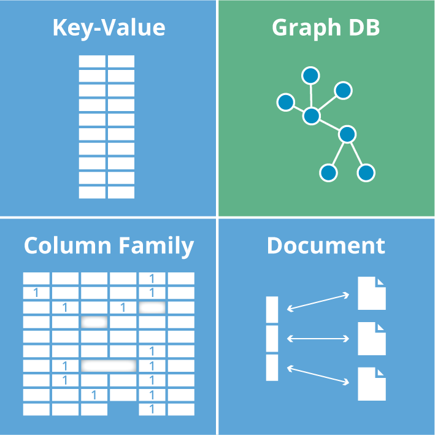
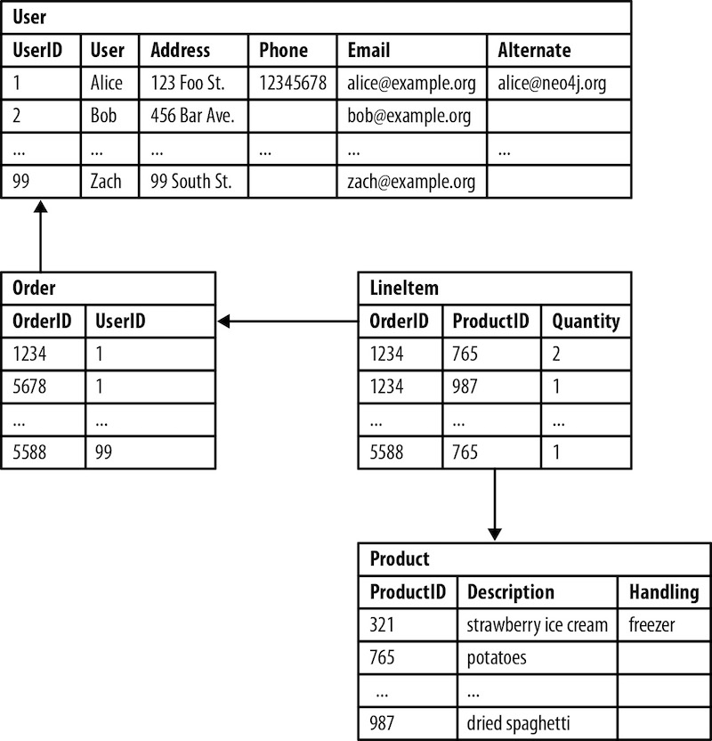
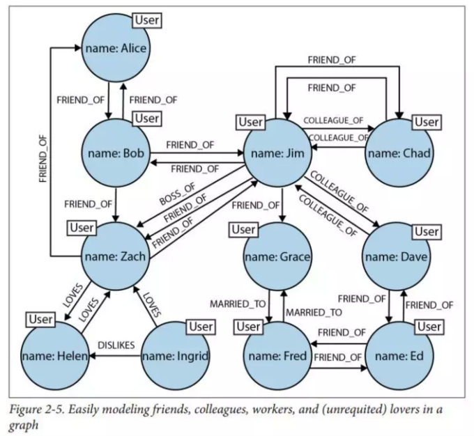
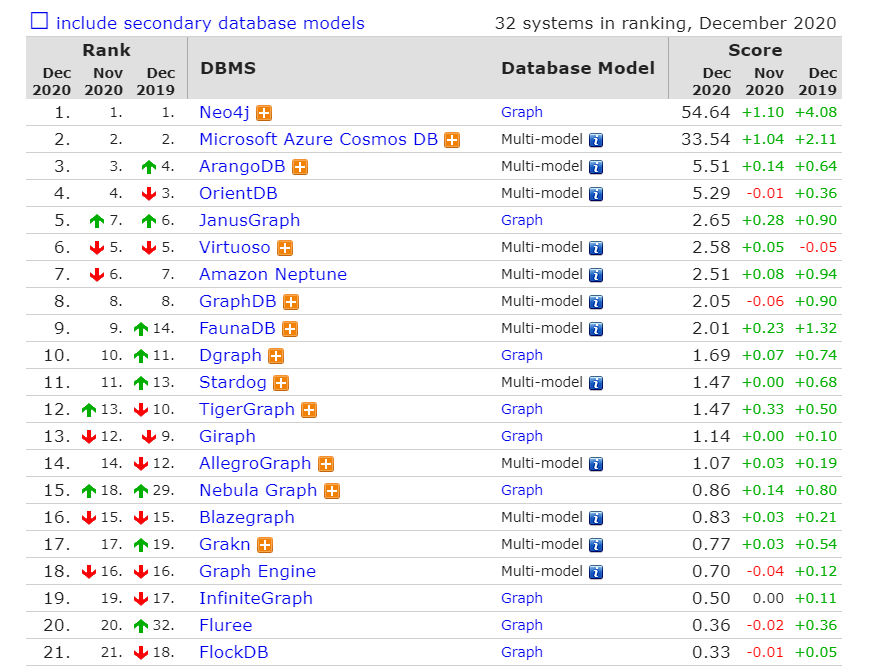
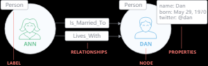
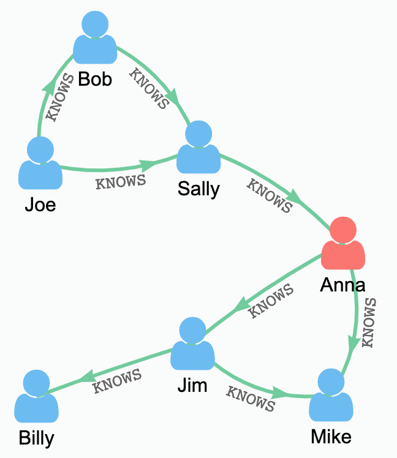

[TOC]: # "neo4j简介"

# neo4j简介
- [1.Why Graph DB?](#1why-graph-db)
  - [1.1 什么是图？](#11-什么是图)
- [1.2 什么是图数据库？](#12-什么是图数据库)
- [1.3 两个重要属性](#13-两个重要属性)
  - [①图存储](#图存储)
  - [②图处理引擎](#图处理引擎)
- [2.对比](#2对比)
  - [2.1 与NoSQL数据库对比](#21-与nosql数据库对比)
  - [2.2 与关系型数据库对比](#22-与关系型数据库对比)
- [3.Neo4j和JanusGraph](#3neo4j和janusgraph)
  - [Neo4J](#neo4j)
  - [JanusGraph](#janusgraph)
  - [3.1标记属性图模型](#31标记属性图模型)
  - [（1）节点](#1节点)
  - [（2）关系](#2关系)
  - [（3）属性](#3属性)
  - [（4）标签](#4标签)
  - [4.Cypher图查询语言](#4cypher图查询语言)
  - [5.小结](#5小结)


## 1.Why Graph DB?

学过数据结构这门课程的同学脑海中或多或少有图的概念。

### 1.1 什么是图？

图由两个元素组成：节点和关系。

每一个节点代表一个实体 （人，地，事物，类别或者其他数据），每个关系代表两个节点的关联方式。这种通用结构可以对各种场景进行建模-从道路系统到设备网络，从人口的病史或由关系定义的任何其他事物。

## 1.2 什么是图数据库？

图数据库(Graph database)并非指图片的数据库，而是以图这种数据结构存储和查询数据。

图形数据库是一种在线数据库管理系统，具有图形处理数据模型的创建，读取，更新和删除（CRUD）操作。

与其他数据库不同，关系在图数据库中占首要地位。这意味着应用程序不必使用外键或带外处理（如MapReduce）来推断数据连接。

与关系数据库或其他NoSQL数据库相比，图数据库的数据模型也更加简单，更具表现力。

图形数据库是为与事务（OLTP）系统一起使用而构建的，并且在设计时考虑了事务的完整性和操作可用性。

## 1.3 两个重要属性

根据存储和处理模型个不同，市面上图数据库也有一些区分。

比如：
Neo4J就是原生图数据库，它使用的后端存储是专门为Neo4J这种图数据库定制和优化的，理论上说能更有利于发挥图数据库的性能

而JanusGraph不是原生图数据库，而是将数据存储在其他系统上，比如Hbase。

### ①图存储

一些图数据库使用原生图存储，这类存储是经过优化的，并且是专门为了存储和管理图而设计的。并不是所有的图数据库都是使用原生图存储，也有一些图数据库将图数据序列化，然后保存到关系型数据库或者面向对象数据库，或其他通用数据存储中。

### ②图处理引擎

原生图处理（也称为无索引邻接）是处理图数据的最有效方法，因为连接的节点在数据库中物理地**指向**彼此。非本机图处理使用其他方法来处理CRUD操作。

## 2.对比

### 2.1 与NoSQL数据库对比

NoSQL数据库大致可以分为四类：

- 键值（key/value）数据库
- 列存储数据库
- 文档型数据库
- 图数据库
- 


| 分类               | 数据类型                   | 优势                                                                                        | 劣势                                                                            | 举例                           |
|:--------------|:---------------------|:-----------------------------------------------------------|:----------------------------------------------------|:----------------------|
| 键值数据库     | 哈希表                      | 查找速度快                                                                             | 数据无结构化，通常只被当做字符串或者二进制数据 | Redis                         |
| 列存储数据库 | 列式数据存储            | 查找速度快；支持分布横向扩展；数据压缩率高                   | 功能相对受限                                                              | HBase                        |
| 文档型数据库 | 键值对扩展               | 数据结构要求不严格；表结构可变；不需要预先定义表结构 | 查询性能不高，缺乏统一的查询语法                           | MongoDB                  |
| 图数据库        | 节点和关系组成的图 | 利用图结构相关算法（最短路径、节点度关系查找等）        | 可能需要对整个图做计算，不利于图数据分布存储     | Neo4j、JanusGraph |

### 2.2 与关系型数据库对比

关系型数据库实际上是不擅长处理关系的。很多场景下，你的业务需求完全超出了当前的数据库架构。

举个栗子：假设某关系型数据库有这么几张用户、订单、商品表：



当我们要查询：“用户购买了哪些商品？”或者“该商品有哪些客户购买过？”需要开发人员JOIN几张表，效率非常低下。

而“购买该产品的客户还购买了哪些商品？”类似的查询几乎不可能实现。

**关系查询性能对比**

在数据关系中心，图形数据库在查询速度方面非常高效，即使对于深度和复杂度的查询也是如此。在《Neo4j in Action》这本书中，作者在关系型数据库和图数据库（Neo4j）之间进行了实验。



他们的实验试图在一个社交网络里找到最大深度为5的朋友的朋友。他们的数据集包括100万人，每个人约有50个朋友。实验结果如下：

| 深度 | MySQL执行时间（s） | Neo4j执行时间（s） | 返回记录数 |
|:-----|:-----------------------|:----------------------|:------------|
| 2      | 0.016                            | 0.01                            | ≈2500        |
| 3      | 30.267                         | 0.168                          | ≈110000     |
| 4      | 1543.505                     | 1.359                          | ≈600000    |
| 5      | 未完成                          | 2.132                          | ≈800000   |

# 3.Neo4j和JanusGraph

根据DB-Engines最新的图数据库排名，Neo4J依然大幅领先排在第一位



### Neo4J


Neo4J是由Java实现的开源图数据库。自2003年开始开发，直到2007年正式发布第一版，并托管于GitHub上。

Neo4J支持ACID、集群、备份和故障转移。目前Neo4J最新版本为4.2，分为社区版和企业版，社区版只支持单机部署，功能受限。企业版支持主从复制和读写分离，包含可视化管理工具

### JanusGraph


JanusGraph是一个Linux基金会下的开源分布式图数据库。JanusGraph提供Apache2.0软件许可证。该项目由IBM、Google、Hortonworks支持。JanusGraph是由TitanDB图数据库修改而来，TitanDB从2012年开始开发。目前最新的版本为0.5.3

JanusGraph支持多种存储后端（包括Apache Cassandra、Apache HBase、Bigtable、Berkeley DB）。JanusGraph的可扩展性取决于与JanusGraph一起使用的基础技术。例如，通过Apache Cassandra作为存储后端，可以将JanusGraph简单地扩展到多个数据中心。

JanusGraph通过与大数据平台（Apache Spark，Apache Giraph，Apache Hadoop）集成，支持全局图数据的分析、报告和ETL。

JanusGraph通过外部索引存储（Elasticsearch，Solr，Lucene）支持地理、数字范围和全文搜索。

### 3.1标记属性图模型



### （1）节点

- 节点是主要的数据元素
- 节点通过**关系**连接到其他节点
- 节点可以具有一个或多个**属性**（即：存储为键值对的属性）
- 节点有一个或多个标签，用于描述其在图表中的作用

### （2）关系

- 关系连接两个节点
- 关系是方向性的
- 节点可以有多个甚至递归的关系
- 关系可以有一个或多个属性（即存储为键/值对的属性）

### （3）属性

- 属性是命名值，其中名称（或键）是字符串
- 属性可以被索引和约束
- 可以从多个属性创建复合索引

### （4）标签

- 标签用于将**节点**分组
- 一个节点可以具有多个标签
- 对标签进行索引以加速在图中查找节点
- 本机标签索引针对速度进行了优化

## 4.Cypher图查询语言

Cypher是Neo4j的图形查询语言，允许用户存储和检索图形数据库中的数据。

举例，我们要查找Joe的所有二度好友



查询语句如下：

```Cypher
MATCH 
  (person:Person)-[:KNOWS]-(friend:Person)-[:KNOWS]-
  (foaf:Person)
WHERE 
  person.name = "Joe"
  AND NOT (person)-[:KNOWS]-(foaf)
RETURN
  foaf    
```

Joe认识Sally，Sally认识Anna。Bob被排除在结果之外，因为除了通过Sally成为二级朋友之外，他还是一级朋友。

## 5.小结
图数据库应对的是当今一个宏观的商业世界大趋势：凭借高度关联、复杂的动态数据，获得洞察力和竞争优势。国内越来越多的公司开始进入图数据库领域，研发自己的图数据库系统。对于任何达到一定规模或价值的数据，图数据库都是呈现和查询这些关系数据的最好方式。而理解和分析这些图的能力将成为企业未来最核心的竞争力
