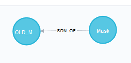
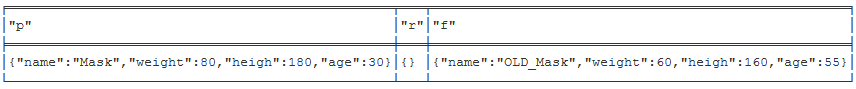
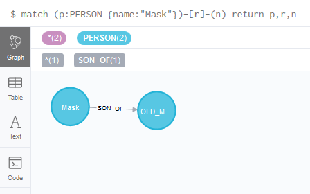
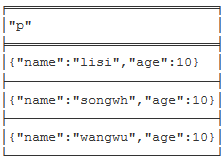
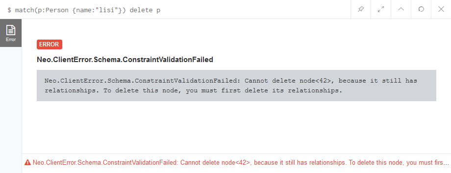
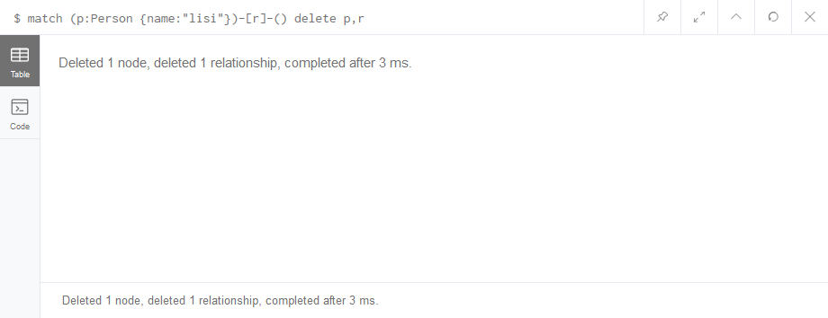

[TOC]: # "neo4j简介"

# neo4j简介
- [1.Why Graph DB?](#1why-graph-db)
  - [1.1 什么是图？](#11-什么是图)
- [1.2 什么是图数据库？](#12-什么是图数据库)
- [1.3 两个重要属性](#13-两个重要属性)
  - [①图存储](#图存储)
  - [②图处理引擎](#图处理引擎)
- [2.对比](#2对比)
  - [2.1 与NoSQL数据库对比](#21-与nosql数据库对比)
  - [2.2 与关系型数据库对比](#22-与关系型数据库对比)
- [3.Neo4j和JanusGraph](#3neo4j和janusgraph)
  - [Neo4J](#neo4j)
  - [JanusGraph](#janusgraph)
  - [3.1标记属性图模型](#31标记属性图模型)
  - [（1）节点](#1节点)
  - [（2）关系](#2关系)
  - [（3）属性](#3属性)
  - [（4）标签](#4标签)
  - [4.Cypher图查询语言](#4cypher图查询语言)
    - [查询语法](#查询语法)
    - [1. 基本查找 match return](#1-基本查找-match-return)
    - [2.查找指定节点、属性、指定关系的节点、关系](#2查找指定节点属性指定关系的节点关系)
    - [3. 对查找结果进行排序order by，并限制返回条数 limit](#3-对查找结果进行排序order-by并限制返回条数-limit)
    - [4.删除节点delete命令](#4删除节点delete命令)
  - [5.小结](#5小结)


## 1.Why Graph DB?

学过数据结构这门课程的同学脑海中或多或少有图的概念。

### 1.1 什么是图？

图由两个元素组成：节点和关系。

每一个节点代表一个实体 （人，地，事物，类别或者其他数据），每个关系代表两个节点的关联方式。这种通用结构可以对各种场景进行建模-从道路系统到设备网络，从人口的病史或由关系定义的任何其他事物。

## 1.2 什么是图数据库？

图数据库(Graph database)并非指图片的数据库，而是以图这种数据结构存储和查询数据。

图形数据库是一种在线数据库管理系统，具有图形处理数据模型的创建，读取，更新和删除（CRUD）操作。

与其他数据库不同，关系在图数据库中占首要地位。这意味着应用程序不必使用外键或带外处理（如MapReduce）来推断数据连接。

与关系数据库或其他NoSQL数据库相比，图数据库的数据模型也更加简单，更具表现力。

图形数据库是为与事务（OLTP）系统一起使用而构建的，并且在设计时考虑了事务的完整性和操作可用性。

## 1.3 两个重要属性

根据存储和处理模型个不同，市面上图数据库也有一些区分。

比如：
Neo4J就是原生图数据库，它使用的后端存储是专门为Neo4J这种图数据库定制和优化的，理论上说能更有利于发挥图数据库的性能

而JanusGraph不是原生图数据库，而是将数据存储在其他系统上，比如Hbase。

### ①图存储

一些图数据库使用原生图存储，这类存储是经过优化的，并且是专门为了存储和管理图而设计的。并不是所有的图数据库都是使用原生图存储，也有一些图数据库将图数据序列化，然后保存到关系型数据库或者面向对象数据库，或其他通用数据存储中。

### ②图处理引擎

原生图处理（也称为无索引邻接）是处理图数据的最有效方法，因为连接的节点在数据库中物理地**指向**彼此。非本机图处理使用其他方法来处理CRUD操作。

## 2.对比

### 2.1 与NoSQL数据库对比

NoSQL数据库大致可以分为四类：

- 键值（key/value）数据库
- 列存储数据库
- 文档型数据库
- 图数据库
- 


| 分类               | 数据类型                   | 优势                                                                                        | 劣势                                                                            | 举例                           |
|:--------------|:---------------------|:-----------------------------------------------------------|:----------------------------------------------------|:----------------------|
| 键值数据库     | 哈希表                      | 查找速度快                                                                             | 数据无结构化，通常只被当做字符串或者二进制数据 | Redis                         |
| 列存储数据库 | 列式数据存储            | 查找速度快；支持分布横向扩展；数据压缩率高                   | 功能相对受限                                                              | HBase                        |
| 文档型数据库 | 键值对扩展               | 数据结构要求不严格；表结构可变；不需要预先定义表结构 | 查询性能不高，缺乏统一的查询语法                           | MongoDB                  |
| 图数据库        | 节点和关系组成的图 | 利用图结构相关算法（最短路径、节点度关系查找等）        | 可能需要对整个图做计算，不利于图数据分布存储     | Neo4j、JanusGraph |

### 2.2 与关系型数据库对比

关系型数据库实际上是不擅长处理关系的。很多场景下，你的业务需求完全超出了当前的数据库架构。

举个栗子：假设某关系型数据库有这么几张用户、订单、商品表：


当我们要查询：“用户购买了哪些商品？”或者“该商品有哪些客户购买过？”需要开发人员JOIN几张表，效率非常低下。

而“购买该产品的客户还购买了哪些商品？”类似的查询几乎不可能实现。

**关系查询性能对比**

在数据关系中心，图形数据库在查询速度方面非常高效，即使对于深度和复杂度的查询也是如此。在《Neo4j in Action》这本书中，作者在关系型数据库和图数据库（Neo4j）之间进行了实验。


他们的实验试图在一个社交网络里找到最大深度为5的朋友的朋友。他们的数据集包括100万人，每个人约有50个朋友。实验结果如下：

| 深度 | MySQL执行时间（s） | Neo4j执行时间（s） | 返回记录数 |
|:-----|:-----------------------|:----------------------|:------------|
| 2      | 0.016                            | 0.01                            | ≈2500        |
| 3      | 30.267                         | 0.168                          | ≈110000     |
| 4      | 1543.505                     | 1.359                          | ≈600000    |
| 5      | 未完成                          | 2.132                          | ≈800000   |

# 3.Neo4j和JanusGraph

根据DB-Engines最新的图数据库排名，Neo4J依然大幅领先排在第一位


### Neo4J


Neo4J是由Java实现的开源图数据库。自2003年开始开发，直到2007年正式发布第一版，并托管于GitHub上。

Neo4J支持ACID、集群、备份和故障转移。目前Neo4J最新版本为4.2，分为社区版和企业版，社区版只支持单机部署，功能受限。企业版支持主从复制和读写分离，包含可视化管理工具

### JanusGraph


JanusGraph是一个Linux基金会下的开源分布式图数据库。JanusGraph提供Apache2.0软件许可证。该项目由IBM、Google、Hortonworks支持。JanusGraph是由TitanDB图数据库修改而来，TitanDB从2012年开始开发。目前最新的版本为0.5.3

JanusGraph支持多种存储后端（包括Apache Cassandra、Apache HBase、Bigtable、Berkeley DB）。JanusGraph的可扩展性取决于与JanusGraph一起使用的基础技术。例如，通过Apache Cassandra作为存储后端，可以将JanusGraph简单地扩展到多个数据中心。

JanusGraph通过与大数据平台（Apache Spark，Apache Giraph，Apache Hadoop）集成，支持全局图数据的分析、报告和ETL。

JanusGraph通过外部索引存储（Elasticsearch，Solr，Lucene）支持地理、数字范围和全文搜索。

### 3.1标记属性图模型


### （1）节点

- 节点是主要的数据元素
- 节点通过**关系**连接到其他节点
- 节点可以具有一个或多个**属性**（即：存储为键值对的属性）
- 节点有一个或多个标签，用于描述其在图表中的作用

### （2）关系

- 关系连接两个节点
- 关系是方向性的
- 节点可以有多个甚至递归的关系
- 关系可以有一个或多个属性（即存储为键/值对的属性）

### （3）属性

- 属性是命名值，其中名称（或键）是字符串
- 属性可以被索引和约束
- 可以从多个属性创建复合索引

### （4）标签

- 标签用于将**节点**分组
- 一个节点可以具有多个标签
- 对标签进行索引以加速在图中查找节点
- 本机标签索引针对速度进行了优化

## 4.Cypher图查询语言

### 查询语法

| 关键字        | 关键字作用                   |
|:------------|:-----------------------|
| CREATE     | 创建                              |
| MATCH      | 匹配                              |
| RETURN    | 加载                              |
| WHERE      | 过滤检索条件               |
| DELETE     | 删除节点和关系            |
| REMOVE    | 删除节点和关系的属性 |
| ORDER BY | 排序                              |
| SET            | 添加或更新属性            |

### 1. 基本查找 match return

`neo4j`使用的查询语法是`Cypher`语法，和我们常用的SQL查询语法不一样，但是在初步的学习之后，觉得他们之间使用的思路有很多重叠的地方，整个语句的执行流程也和SQL有比较多相似的地方。

> 创建两个节点，一个子节点（Mask），一个父节点（Old_Mask），他们之间是属于父子关系

```Cypher
create(p:PERSON {name:"Mask",age:30,heigh:180,weight:80})-[r:SON_OF]->(f:PERSON {name:"OLD_Mask",age:55,heigh:160,weight:60}) return p,r,f
```

> 其中create表示新建
> p表示这个节点的别名
> PERSON表示节点p的标签person的属性
> {}大括号中间的键值对，表示p这个节点作为PERSON这个标签类别所拥有的属性
> return表示执行这段语句之后，需要返回的对象，return p,r,f 表示返回节点p，节点f，以及他们之间的关系 r



返回数据：



### 2.查找指定节点、属性、指定关系的节点、关系

```Cypher
match (p:PERSON {name:"Mask"})-[r]-(n) return p,r,n
```
> MATCH 匹配命令
> return 后边的别名p还可以用as设置指定的返回值名称，如p as userName

命令执行结果




`where`关键字类似于SQL里面的`where`关键字，可以通过运算符`==  >= ...`来过滤一些查询条件。

### 3. 对查找结果进行排序order by，并限制返回条数 limit
`order by`关键字与`SQL`里面是一样的操作，后面跟上需要排序的关键字，`limit`的操作是指定输出前几条

> match(p:Person) return p order by p.name limit 3
> 这里利用order by来指定返回按照Person.name来排序
> limit表示只返回前三条数据

查找结果：




### 4.删除节点delete命令

删除节点的操作也是通过delete来操作，如果被删除的节点存在relationship，那么单独删除该节点的操作会不成功，所以如果想删除一个已经存在关系的节点，需要同时将关系进行删除

删除一个存在relationship节点，会报错：



删除一个节点以及与他有关的关系，成功：



> 删除指定条件的节点
> match (p:Person {name:"teacher_wange"}) delete p
> 先通过匹配关键字match找到匹配元素，然后通过delete关键字指定删除
>
> 删除节点和节点相关的关系
> match (p:Person {name:"lisi"})-\[r]-() delete p,r

## 5.在java中使用

### 5.1原生的Neo4j java API

`Neo4j Java API`的设计思路及基本概念：

1. Label接口，表示标签，实现这个接口的类，就可以当标签使用；
2. Relationship接口，表示关系，实现这个接口的类，就可以表示关系；
3. 通过`GraphDatabaseFactory`这个类实例化对象可以获取`GraphDatabaseService`实例
4. `GraphDatabaseService`实例对象，可以获取一个操作事务，通过这个事务可以实现任何操作异常的回滚，操作成功需要调用tx.success()方法；
5. `GraphDatabaseService`对象可以创建节点`node`;
6. 节点`node`可以设置属性`setProperty(key,value)`；
7. 节点`node`可以创建关系`Relationship`，`Relationship`也可以通过`setProperty(key,value)`来设置属性。

#### 枚举标签Label

```java
package com.snax.neo4j.java.examples;
import org.neo4j.graphdb.Label;
public enum Tutorials implements Label{
    JAVA,SCALA,SQL,NEO4J;
}
```

#### 枚举关系RelationShip
```java
package com.tp.neo4j.java.examples;
import org.neo4j.graphdb.RelationshipType;
public enum TutorialRelationships implements RelationshipType{
    JVM_LANGUAGES,NON_JVM_LANGUAGES;
}
```

#### 获取操作对象

```java
GraphDatabaseFactory dbFactory = new GraphDatabaseFactory();
GraphDatabaseService db= dbFactory.newEmbeddedDatabase("C:/TPNeo4jDB");
```

#### 启动neo4j数据库事务

```java
try (Transaction tx = graphDb.beginTx()) {
    // Perform DB operations				
    tx.success();
}
```

#### 整体代码

```java
import org.neo4j.graphdb.GraphDatabaseService;
import org.neo4j.graphdb.Node;
import org.neo4j.graphdb.Relationship;
import org.neo4j.graphdb.Transaction;
import org.neo4j.graphdb.factory.GraphDatabaseFactory;

public class Neo4jJavaAPIDBOperation {
public static void main(String[] args) {
    GraphDatabaseFactory dbFactory = new GraphDatabaseFactory();
    GraphDatabaseService db= dbFactory.newEmbeddedDatabase("C:/TPNeo4jDB");
    try (Transaction tx = db.beginTx()) {

        Node javaNode = db.createNode(Tutorials.JAVA);
        javaNode.setProperty("TutorialID", "JAVA001");
        javaNode.setProperty("Title", "Learn Java");
        javaNode.setProperty("NoOfChapters", "25");
        javaNode.setProperty("Status", "Completed");				
        
        Node scalaNode = db.createNode(Tutorials.SCALA);
        scalaNode.setProperty("TutorialID", "SCALA001");
        scalaNode.setProperty("Title", "Learn Scala");
        scalaNode.setProperty("NoOfChapters", "20");
        scalaNode.setProperty("Status", "Completed");
        
        Relationship relationship = javaNode.createRelationshipTo
        (scalaNode,TutorialRelationships.JVM_LANGIAGES);
        relationship.setProperty("Id","1234");
        relationship.setProperty("OOPS","YES");
        relationship.setProperty("FP","YES");
        
        tx.success();
    }
       System.out.println("Done successfully");
}
}
```
#### Cypher执行引擎，让Java执行原生CQL语句

```java
import org.neo4j.cypher.javacompat.ExecutionEngine;
import org.neo4j.cypher.javacompat.ExecutionResult;
import org.neo4j.graphdb.GraphDatabaseService;
import org.neo4j.graphdb.factory.GraphDatabaseFactory;

public class JavaNeo4jCQLRetrivalTest {
   public static void main(String[] args) {
      // 1. 获取graphDB
      GraphDatabaseFactory graphDbFactory = new GraphDatabaseFactory();
      GraphDatabaseService graphDb = graphDbFactory.newEmbeddedDatabase("C:/TPNeo4jDB");
      // 2. 获取Cypher执行引擎
      ExecutionEngine execEngine = new ExecutionEngine(graphDb);
      ExecutionResult execResult = execEngine.execute("MATCH (java:JAVA) RETURN java");
      // 3. 获取执行结果
      String results = execResult.dumpToString();
      System.out.println(results);
   }
}
```
#### Spring Data Neo4j的操作

操作思路：
1. 创建一个与图数据库存储数据对应的实体entity，并进行必要的注解；
2. dao层接口集成Spring Data Neo4j 类GraphRepository、GraphTemplate、CrudRepository、PaginationAndSortingRepository，这个和springDataJPA也比较类似;

pom.xml
```xml
<project xmlns="http://maven.apache.org/POM/4.0.0" 
   xmlns:xsi="http://www.w3.org/2001/XMLSchema-instance" 
   xsi:schemaLocation="http://maven.apache.org/POM/4.0.0 
   http://maven.apache.org/xsd/maven-4.0.0.xsd">
   
   <modelVersion> 4.0.0 </modelVersion>
   <groupId> com.tp.neo4j </groupId>
   <artifactId> springdata-neo4j </artifactId>
   <version> 1.0 </version>  
   
   <dependencies>
      <dependency>   
         <groupId> org.springframework.data </groupId>
         <artifactId> spring-data-neo4j </artifactId>
         <version> 3.1.2.RELEASE </version>
      </dependency>
      
      <dependency>
         <groupId> org.neo4j </groupId>
         <artifactId> neo4j-kernel </artifactId>
         <version> 2.1.3 </version>
      </dependency>  
      
      <dependency>
         <groupId> javax.transaction </groupId>
         <artifactId> jta </artifactId>
         <version> 1.1 </version>
      </dependency>
      
      <dependency>
         <groupId>javax.validation</groupId>
         <artifactId>validation-api</artifactId>
         <version>1.0.0.GA</version>
      </dependency>
      
   </dependencies>   
</project>
```
