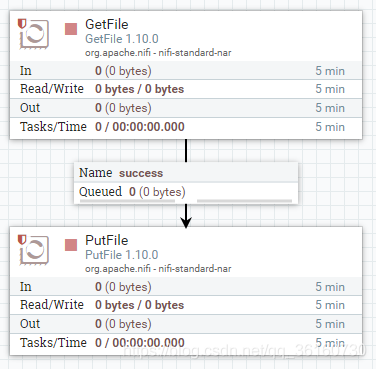

[TOC]: # "Apache NiFi 安装和简单的使用"

# Apache NiFi 安装和简单的使用
- [NiFi介绍](#nifi介绍)
- [NiFi架构](#nifi架构)
- [核心概念](#核心概念)
- [集群](#集群)
- [Nifi安装](#nifi安装)


## NiFi介绍

Nifi（NiagaraFiles）是为了实现系统间数据流和自动化而构建的。虽然术语”数据流“用于各种上下文，但我们在此处使用它来表示系统之间的自动管理信息流

官网地址：[http://nifi.apache.org/](http://nifi.apache.org/)

文档：[http://nifi.apache.org/docs.html](http://nifi.apache.org/docs.html)

## NiFi架构


## 核心概念

| NiFi术语                  | 描述                                                                                                                                                                                                                                                                                                                                      |
|:--------------------|:----------------------------------------------------------------------------------------------------------------------------------------------------------------------------------------------------------------|
| FlowFile                  | 表示在系统中移动的每个对象，对于每个FlowFile，Nifi都会记录它一个属性键值对和0个或多个字节内容（有attribute和content）                                                                                                                             |
| FlowFile Processor | 在eip术语中，处理器就是不同系统之间的数据路由，数据转换或者数据中介的组合。处理器可以访问给定FlowFile的属性及其内容。处理器可以给定工作单元中的流文件进行操作，并提交该工作或回滚该工作。 |
| Connection               | 连接处理器，充当队列并允许各种进程以不同的速率进行交互。这些队列可以动态地进行优先级排序，并且可以在负载上设置上限。                                                                                                                           |
| Flow Controller       | 流控制器维护流程如何连接，并管理和分配所有流程使用的线程。流控制器充当代理，促进处理器之间流文件的交换。                                                                                                                                                 |
| Process Group        | 进程组里面是一组特定的流程和连接，可以通过输入端口接收数据并通过输出端口发送数据，这样我们在进程组里简单地组合组件，就可以得到一个全新功能的组件。                                                                      |

## 集群


NIFI集群采用Zero-Master Clustering（零主集群）模式。Nifi集群中的每个节点对数据执行相同的任务，但每个阶段都在不同的数据集上运行。Zookeeper选择单个节点作为集群协调器，Zookeeper自动处理故障转移。所有集群节点都会向集群协调器发送心跳报告和状态信息。集群协调器负责断开和连接节点。此外每个集群都有一个主节点，主节点也是由Zookeeper选举产生。我们可以通过任何节点上的用户界面（UI）与NIFI集群进行交互，并且我们所做的任何修改都将复制到集群中的所有节点上。

| NiFi术语                              | 描述                                                                                                                                                                                                                                                                                                                                                                                                                                                                               |
|:---------------------------|:------------------------------------------------------------------------------------------------------------------------------------------------------------------------------------------------------------------------------------------------------------------------------------------------------|
| Nodes                                 | 每个集群由一个或多个节点组成，节点执行实际的数据处理                                                                                                                                                                                                                                                                                                                                                                                         |
| NIFI Cluster Coordinator | 由Zookeeper选举，集群协调器是NIFI集群中的节点，负责执行任务和管理集群中的节点，管理节点补充，同步节点的操作到所有节点                                                                                                                                                                                                                                                                |
| Primary Node                     | 由Zookeeper选举，每个集群都有一个主节点。在此节点上，可以运行“隔离处理器”。如果该节点由于任何原因断开与集群的连接，将自动选择新的主节点。默认相同的数据流可以在所有节点上运行。有的数据流不希望在所有的节点上运行，就可以设置主节点，只在主节点上运行。                         |
| Isolated Processors          | 隔离处理器，在Nifi集群中，相同的数据流在所有节点上运行。因此，流中的每个组件都在每个节点上运行。但是，可能存在DFM不希望在每个处理器在每个节点上运行的情况。在处理器中选择在All Node还是Primary Node执行，All Node会在所有节点上运行，Primary Node只会在主节点上运行 |
| Heartbeats                        | 节点通过“心跳”将其健康状况和状态传达给当前选定的集群协调器，这使协调器知道它们仍然连接到集群并正常工作。默认情况下，节点每5秒发出一次心跳，如果集群协调器在40秒内没有从节点收到心跳，则由于“缺乏心跳”而断开节点。                                                                                               |

## Nifi安装

### 单机

#### 压缩包安装

[Nifi官网下载](http://nifi.apache.org/download.html)

```shell script
mkdir /usr/local/software/nifi
tar -zxvf nifi-1.10.0-bin.tar.gz -C /usr/local/softwares/nifi
```

可在`conf/nifi.properties`修改端口，原8080

后台启动

```shell script
./bin/nifi.sh start
```

访问ip:8080/nifi

#### Docker安装

``` shell script
docker run --name nifi \
  -p 9090:9090 \
  -d \
  -e NIFI_WEB_HTTP_PORT='9090' \
  apache/nifi:latest
```

#### 测试

移动文件测试



修改GetFile中的Input Directory属性，使用相对地址是相对NiFi安装目录


修改GetFile中的Input Directory属性，使用相对地址的话是相对NiFi安装目录

