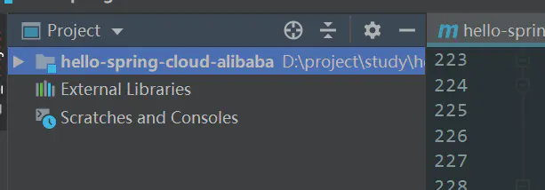
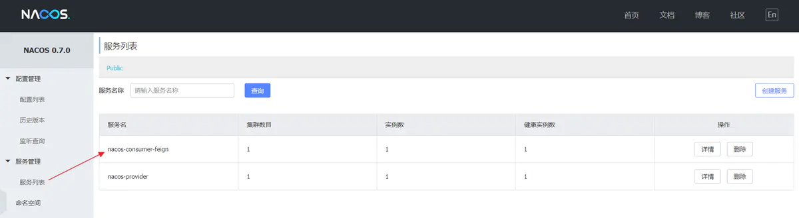
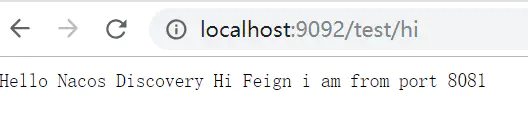
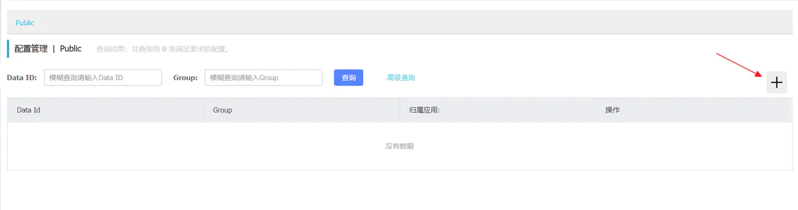
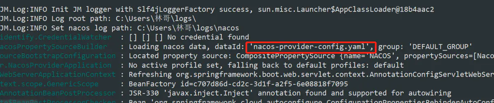

[TOC]: # "SpringCloud阿里巴巴"

# SpringCloud阿里巴巴
- [1.SpringCloud阿里巴巴简介](#1springcloud阿里巴巴简介)
  - [1.1 概述](#11-概述)
  - [1.2 主要功能](#12-主要功能)
  - [1.3 组件](#13-组件)
- [2. Spring Cloud Alibaba 创建依赖管理项目:](#2-spring-cloud-alibaba-创建依赖管理项目)
  - [创建文件夹](#创建文件夹)
  - [用idea打开](#用idea打开)
  - [创建子模块](#创建子模块)
  - [创建pom](#创建pom)
  - [将pom加到maven](#将pom加到maven)
  - [依赖版本简介](#依赖版本简介)
- [3. Spring Cloud Alibaba服务注册与发现（nacos）](#3-spring-cloud-alibaba服务注册与发现nacos)
  - [nacos](#nacos)
    - [Nacos地图](#nacos地图)
    - [Nacos生态图](#nacos生态图)
  - [安装nacos](#安装nacos)
    - [安装环境](#安装环境)
    - [下载并安装](#下载并安装)
    - [启动Nacos](#启动nacos)
    - [访问服务](#访问服务)
- [4. Spring Cloud Alibaba 创建服务提供者](#4-spring-cloud-alibaba-创建服务提供者)
  - [概述](#概述)
  - [POM](#pom)
  - [Application](#application)
  - [application.yml](#applicationyml)
  - [controller](#controller)
  - [启动工程](#启动工程)
  - [服务的端点检查](#服务的端点检查)
  - [Nacos Starter 更多配置项信息](#nacos-starter-更多配置项信息)
- [5.Spring Cloud Alibaba创建服务消费者](#5spring-cloud-alibaba创建服务消费者)
  - [概述](#概述-1)
  - [POM](#pom-1)
  - [Application](#application-1)
  - [Configuration](#configuration)
  - [Controller](#controller-1)
  - [application.yml](#applicationyml-1)
  - [启动工程](#启动工程-1)
  - [服务的端点检查](#服务的端点检查-1)
- [6.Spring Cloud Alibaba创建服务消费者（Feign）](#6spring-cloud-alibaba创建服务消费者feign)
  - [概述](#概述-2)
  - [POM](#pom-2)
  - [Application](#application-2)
  - [创建Feign接口](#创建feign接口)
  - [Controller](#controller-2)
  - [application.yml](#applicationyml-2)
  - [目录结构:](#目录结构)
  - [启动工程](#启动工程-2)
  - [测试负载均衡](#测试负载均衡)
- [7.Spring Cloud Alibaba 熔断(Sentinel)](#7spring-cloud-alibaba-熔断sentinel)
  - [概述](#概述-3)
  - [什么是Sentinel](#什么是sentinel)
  - [Sentinel的特征](#sentinel的特征)
  - [Feign中使用Sentinel](#feign中使用sentinel)
  - [在Service中`@FeignClient`注解增加fallback属性用来指定类](#在service中feignclient注解增加fallback属性用来指定类)
  - [创建熔断器类并实现对应的Feign接口](#创建熔断器类并实现对应的feign接口)
  - [目录结构](#目录结构-1)
  - [测试熔断器](#测试熔断器)
- [8.Spring Cloud Alibaba 熔断器仪表盘监控](#8spring-cloud-alibaba-熔断器仪表盘监控)
  - [Sentinel控制台](#sentinel控制台)
  - [下载并打包](#下载并打包)
  - [启动控制台](#启动控制台)
  - [访问服务](#访问服务-1)
  - [配置控制台信息](#配置控制台信息)
  - [测试Sentinel](#测试sentinel)
- [9.Spring Cloud Alibaba 路由网关(Gateway)](#9spring-cloud-alibaba-路由网关gateway)
  - [什么是Spring Cloud GateWay](#什么是spring-cloud-gateway)
  - [Spring Cloud Gateway 功能特征](#spring-cloud-gateway-功能特征)
  - [Spring Cloud Gateway 工程流程](#spring-cloud-gateway-工程流程)
  - [POM](#pom-3)
  - [Application](#application-3)
  - [application.yml](#applicationyml-3)
- [测试访问](#测试访问)
- [10 Spring Cloud Alibaba 网关全局过滤](#10-spring-cloud-alibaba-网关全局过滤)
  - [概述](#概述-4)
  - [生命周期](#生命周期)
  - [创建全局过滤器](#创建全局过滤器)
  - [测试过滤器](#测试过滤器)
  - [附：Spring Cloud Gateway Benchmark](#附spring-cloud-gateway-benchmark)
  - [说明](#说明)
- [11.Spring Cloud Alibaba 服务配置](#11spring-cloud-alibaba-服务配置)
  - [Nacos Config服务端初始化](#nacos-config服务端初始化)
    - [分布式配置中心](#分布式配置中心)
    - [Nacos Config](#nacos-config)
    - [创建配置文件](#创建配置文件)
  - [Nacos Config客户端的使用](#nacos-config客户端的使用)
    - [POM](#pom-4)
    - [bootstrap.properties](#bootstrapproperties)
    - [启动应用程序](#启动应用程序)
    - [配置的动态更新](#配置的动态更新)
  - [Nacos Config多环境的配置](#nacos-config多环境的配置)
    - [Spring Boot Profile](#spring-boot-profile)
    - [Nacos Config Profile](#nacos-config-profile)
    - [在Nacos Server中增加配置](#在nacos-server中增加配置)
    - [在项目中增加配置](#在项目中增加配置)
    - [启动应用程序](#启动应用程序-1)


## 1.SpringCloud阿里巴巴简介

### 1.1 概述

2018年10月31日,SpringCloudAlibaba正式入职SpringCloud官方孵化器，并在Maven中央仓库发布第一个版本。

[Spring Cloud for Alibaba 0.2.0 released](https://spring.io/blog/2018/10/30/spring-cloud-for-alibaba-0-2-0-released)

>The Spring Cloud Alibaba project,
>consisting of Alibaba’s open-source
>components and several Alibaba Cloud
>products, aims to implement and expose
>well known Spring Framework patterns
>and abstractions to bring the benefits of
>Spring Boot and Spring Cloud to Java
>developers using Alibaba products.

>Spring Cloud for
>Alibaba，它是由一些阿里巴巴的开源组件和云产品组成的。这个项目的目的是为了让大家所熟知的
>Spring
>框架，其优秀的设计模式和抽象理念，以给使用阿里巴巴产品的
>Java 开发者带来使用 Spring Boot 和 Spring
>Cloud 的更多便利。

Spring Cloud
Alibaba，您只需要添加一些注解和少量配置，就可以将SpringCloud应用接入阿里微服务解决方案，通过阿里中间件来迅速单间分布式应用系统。

### 1.2 主要功能

- **服务限流降级：**
  默认支持Servlet、Feign、RestTemplate、Dubbo和RocketMQ限流降级功能的接入，可以在运行时通过控制台实时修改限流降级规则，可以支持查看限流降级Metric监控。
- **服务注册与发现：**
  适配SpringCloud服务注册和发现标准，默认集成了Ribbon的支持。
- **分布式配置管理：**
  支持分布式系统中的外部化配置，配置更改时自动刷新。
- **消息驱动能力：**
  基于SpringCloudStream为微服务应用构建消息驱动能力。
- **阿里云对象存储：**
  阿里云提供的海量、安全、低成本、高可靠的云存储服务。支持在任何应用，任何时间、任何地点存储和访问任意类型的数据。
- **分布式任务调度：**
  提供秒级、精准、高可靠、高可用的地夯实（基于cron表达式）任务调度服务。同事提供分布式的任务执行模型，如网格任务。网格任务支持海量子任务均匀分配到所有Worker（schedulerx-client）上执行。

### 1.3 组件

- **Sentinel：**
  面向分布式服务架构的轻量级流量控制产品，主要以流量为切入点，从流量控制、熔断降级、系统负载保护等多个维度来帮助您保护服务的稳定性。
- **Nacos：**
  阿里巴巴推出来的一个新开源项目，这是一个更易于构建云原生应用的动态服务发现、配置管理和服务管理平台。
- **RocketMQ：**
  分布式消息系统，基于高可用分布式集群技术，提供低延时、高可靠的消息发布订阅与服务。
- **Alibaba Cloud ACM：**
  一款分布式架构环境中对应用配置进行集中管理和推送的应用配置中心产品。
- **Alibaba Cloud OSS：**
  阿里云对象存储服务（Object Storage
  Service，简称OSS），是阿里云提供的海量、安全、低成本、高可靠的云存储服务。您可以用任何应用、任何时间、任何地点存储和访问任意类型的数据。
- **Alibaba Cloud SchedulerX：**
  阿里中间件团队开发的一款
  分布式调度产品，提供秒级、精准、高可靠、高可用的定时（基于Cron表达式）任务调度服务。

## 2. Spring Cloud Alibaba 创建依赖管理项目:

> 当前Spring Cloud Alibaba 的2.1.0RELEASE
> 版本基于Spring Cloud
> Greenwich开发，SpringCloudAlibaba项目都是基于Spring
> Cloud，而Spring Cloud项目又是基于Spring
> Boot进行开发，并且都是使用Maven做项目管理工具。在实际开发中，我们一般都会创建一个依赖管理项目作为Maven的Parent项目使用，这样做可以极大地方便我们对Jar包版本的统一管理。

### 创建文件夹

在电脑上创建一个文件夹`hello-spring-cloud-alibaba`当做项目的根目录


### 用idea打开

用idea打开刚刚创建的文件夹：



### 创建子模块

选择hello-spring-cloud-alibaba跟目录鼠标右键  
创建子模块`hello-spring-cloud-alibaba-dependencies`


### 创建pom

在hello-spring-cloud-alibaba-dependencies下创建pom.xml文件  
pom.xml内容如下:

```xml
<?xml version="1.0" encoding="UTF-8"?>
<project xmlns="http://maven.apache.org/POM/4.0.0" xmlns:xsi="http://www.w3.org/2001/XMLSchema-instance"
         xsi:schemaLocation="http://maven.apache.org/POM/4.0.0 http://maven.apache.org/xsd/maven-4.0.0.xsd">
    <modelVersion>4.0.0</modelVersion>
    <parent>
        <groupId>org.springframework.boot</groupId>
        <artifactId>spring-boot-starter-parent</artifactId>
        <version>2.2.4.RELEASE</version>
    </parent>
    <groupId>com.snax</groupId>
    <artifactId>hello-spring-cloud-alibaba-dependencies</artifactId>
    <version>1.0.0-SNAPSHOT</version>
    <name>hello-spring-cloud-alibaba-dependencies</name>
    <inceptionYear>2019-Now</inceptionYear>
    <description>Demo project for Spring Boot</description>
    <packaging>pom</packaging>

    <properties>
        <!-- Environment Settings -->
        <java.version>1.8</java.version>
        <project.build.sourceEncoding>UTF-8</project.build.sourceEncoding>
        <project.reporting.outputEncoding>UTF-8</project.reporting.outputEncoding>

        <!-- Spring Settings -->
        <spring-cloud.version>Hoxton.SR1</spring-cloud.version>
        <spring-cloud-alibaba.version>2.2.0.RELEASE</spring-cloud-alibaba.version>
    </properties>

    <dependencyManagement>
        <dependencies>
            <dependency>
                <groupId>org.springframework.cloud</groupId>
                <artifactId>spring-cloud-dependencies</artifactId>
                <version>${spring-cloud.version}</version>
                <type>pom</type>
                <scope>import</scope>
            </dependency>
            <dependency>
                <groupId>com.alibaba.cloud</groupId>
                <artifactId>spring-cloud-alibaba-dependencies</artifactId>
                <version>${spring-cloud-alibaba.version}</version>
                <type>pom</type>
                <scope>import</scope>
            </dependency>
        </dependencies>
    </dependencyManagement>

    <dependencies>
        <dependency>
            <groupId>org.projectlombok</groupId>
            <artifactId>lombok</artifactId>
        </dependency>
    </dependencies>

    <build>
        <plugins>
            <!-- Compiler 插件, 设定 JDK 版本 -->
            <plugin>
                <groupId>org.apache.maven.plugins</groupId>
                <artifactId>maven-compiler-plugin</artifactId>
                <configuration>
                    <showWarnings>true</showWarnings>
                </configuration>
            </plugin>

            <!-- 打包 jar 文件时，配置 manifest 文件，加入 lib 包的 jar 依赖 -->
            <plugin>
                <groupId>org.apache.maven.plugins</groupId>
                <artifactId>maven-jar-plugin</artifactId>
                <configuration>
                    <archive>
                        <addMavenDescriptor>false</addMavenDescriptor>
                    </archive>
                </configuration>
                <executions>
                    <execution>
                        <configuration>
                            <archive>
                                <manifest>
                                    <!-- Add directory entries -->
                                    <addDefaultImplementationEntries>true</addDefaultImplementationEntries>
                                    <addDefaultSpecificationEntries>true</addDefaultSpecificationEntries>
                                    <addClasspath>true</addClasspath>
                                </manifest>
                            </archive>
                        </configuration>
                    </execution>
                </executions>
            </plugin>

            <!-- resource -->
            <plugin>
                <groupId>org.apache.maven.plugins</groupId>
                <artifactId>maven-resources-plugin</artifactId>
            </plugin>

            <!-- install -->
            <plugin>
                <groupId>org.apache.maven.plugins</groupId>
                <artifactId>maven-install-plugin</artifactId>
            </plugin>

            <!-- clean -->
            <plugin>
                <groupId>org.apache.maven.plugins</groupId>
                <artifactId>maven-clean-plugin</artifactId>
            </plugin>

            <!-- ant -->
            <plugin>
                <groupId>org.apache.maven.plugins</groupId>
                <artifactId>maven-antrun-plugin</artifactId>
            </plugin>

            <!-- dependency -->
            <plugin>
                <groupId>org.apache.maven.plugins</groupId>
                <artifactId>maven-dependency-plugin</artifactId>
            </plugin>
        </plugins>

        <pluginManagement>
            <plugins>
                <!-- Java Document Generate -->
                <plugin>
                    <groupId>org.apache.maven.plugins</groupId>
                    <artifactId>maven-javadoc-plugin</artifactId>
                    <executions>
                        <execution>
                            <phase>prepare-package</phase>
                            <goals>
                                <goal>jar</goal>
                            </goals>
                        </execution>
                    </executions>
                </plugin>

                <!-- YUI Compressor (CSS/JS压缩) -->
                <plugin>
                    <groupId>net.alchim31.maven</groupId>
                    <artifactId>yuicompressor-maven-plugin</artifactId>
                    <version>1.5.1</version>
                    <executions>
                        <execution>
                            <phase>prepare-package</phase>
                            <goals>
                                <goal>compress</goal>
                            </goals>
                        </execution>
                    </executions>
                    <configuration>
                        <encoding>UTF-8</encoding>
                        <jswarn>false</jswarn>
                        <nosuffix>true</nosuffix>
                        <linebreakpos>30000</linebreakpos>
                        <force>true</force>
                        <includes>
                            <include>**/*.js</include>
                            <include>**/*.css</include>
                        </includes>
                        <excludes>
                            <exclude>**/*.min.js</exclude>
                            <exclude>**/*.min.css</exclude>
                        </excludes>
                    </configuration>
                </plugin>
            </plugins>
        </pluginManagement>

        <!-- 资源文件配置 -->
        <resources>
            <resource>
                <directory>src/main/java</directory>
                <excludes>
                    <exclude>**/*.java</exclude>
                </excludes>
            </resource>
            <resource>
                <directory>src/main/resources</directory>
            </resource>
        </resources>
    </build>

    <repositories>
        <repository>
            <id>aliyun-repos</id>
            <name>Aliyun Repository</name>
            <url>http://maven.aliyun.com/nexus/content/groups/public</url>
            <releases>
                <enabled>true</enabled>
            </releases>
            <snapshots>
                <enabled>false</enabled>
            </snapshots>
        </repository>

        <repository>
            <id>sonatype-repos</id>
            <name>Sonatype Repository</name>
            <url>https://oss.sonatype.org/content/groups/public</url>
            <releases>
                <enabled>true</enabled>
            </releases>
            <snapshots>
                <enabled>false</enabled>
            </snapshots>
        </repository>
        <repository>
            <id>sonatype-repos-s</id>
            <name>Sonatype Repository</name>
            <url>https://oss.sonatype.org/content/repositories/snapshots</url>
            <releases>
                <enabled>false</enabled>
            </releases>
            <snapshots>
                <enabled>true</enabled>
            </snapshots>
        </repository>

        <repository>
            <id>spring-snapshots</id>
            <name>Spring Snapshots</name>
            <url>https://repo.spring.io/snapshot</url>
            <snapshots>
                <enabled>true</enabled>
            </snapshots>
        </repository>
        <repository>
            <id>spring-milestones</id>
            <name>Spring Milestones</name>
            <url>https://repo.spring.io/milestone</url>
            <snapshots>
                <enabled>false</enabled>
            </snapshots>
        </repository>
    </repositories>

    <pluginRepositories>
        <pluginRepository>
            <id>aliyun-repos</id>
            <name>Aliyun Repository</name>
            <url>http://maven.aliyun.com/nexus/content/groups/public</url>
            <releases>
                <enabled>true</enabled>
            </releases>
            <snapshots>
                <enabled>false</enabled>
            </snapshots>
        </pluginRepository>
    </pluginRepositories>
</project>
```

- parent: 继承了Spring
  Boot的Parent，表示我们是以一个Spring
  Boot工程
- package：pom，表示该项目仅当做依赖项目，没有具体实现的代码
- spring-cloud-alibaba-dependencies:
  在properties配置中预定义了版本号为2.1.0RELEASE，表示我们的Spring
  Cloud Alibaba对应的是Spring Cloud
  Greenwich版本
- build：配置了项目所需的各种插件
- repositories：配置项目下载依赖时的第三方库

### 将pom加到maven


### 依赖版本简介

项目的最新版本是2.2.1.RELEASE
1.5.x版本使用于Spring Boot 1.5.x
2.0.x版本使用于Spring Boot 2.0.x
2.1.x版本使用于Spring Boot 2.1.x

> 截止目前时间2019年8月16日，SpringCloudAlibaba毕业改的孵化器中的SpringCloudAlibaba仓库迁移回Alibaba官方仓库，进行正式的毕业发布，对原有使用的SpringCloudAlibaba开发项目影响如下：
> 

升级spring-boot版本为2.2.4.RELEASE
2020/02/21  
升级Spring-Cloud版本为Hoxton.SR1
2020/02/21  
升级Spring-cloud-dependencies版本为2.2.0.RELEASE
2020/02/21


## 3. Spring Cloud Alibaba服务注册与发现（nacos）

> 由于SpringCloud之前采用的Eureka已经进入暂停维护阶段，所哟我们采用阿里巴巴提供的Nacos组件，毕竟轮流量中国是世界之最，十年的双十一经验，阿里的服务支持还是很靠谱的
> [Nacos官网](https://links.jianshu.com/go?to=https%3A%2F%2Fnacos.io%2Fzh-cn%2F)

### nacos

Nacos致力于帮助您发现、配置和管理微服务。Nacos提供了一组简单易用的特性集，帮助您快速实现动态服务发现、服务配置、服务元数据及流量管理

Nacos帮助您更敏捷和容易地构建、交付和管理微服务平台。Nacos是构建以“服务”为中心的现代应用架构（例如微服务范式、云原生范式）的服务基础设施。

#### Nacos地图


- 特性大图：要从功能特性，非功能特性，全面介绍我们要解决的问题域的特性诉求
- 架构大图：通过清晰架构，让您快速进入Nacos世界
- 业务大图：利用当前特性可以支持的业务场景，及其最佳实践
- 生态大图：系统梳理Nacos和主流技术生态的关系
- 优势大图：展示Nacos核心竞争力
- 战略大图：要从战略到战术层面讲nacos的宏观优势

#### Nacos生态图


### 安装nacos

#### 安装环境

Nacos依赖Java环境来运行。如果你是从代码开始构建并运行Nacos，还需要为此配置Maven环境，请确保是在以下版本中安装使用：

- 64bit
  OS，支持Linux/Unix/Mac/Windows,推荐选用Linux/Unix/Mac
- 64 bit JDK 1.8+
- Maven 3.2.x+

#### 下载并安装

```bash
# 下载源码
git clone https://github.com/alibaba/nacos.git

# 安装到本地仓库
cd nacos/
mvn -Prelease-nacos -Dmaven.test.skip=true clean install -U
```

第一次下载时间有点长，耐心等一会，install时间也不短...

#### 启动Nacos

```bash
cd distribution/target/nacos-server-$version/nacos/bin

# linux
./startup.sh -m standalone

# Windows
startup.cmd
```


#### 访问服务

打开浏览器访问：[http://localhost:8848/nacos](http://localhost:8848/nacos)


**注：从0.8.0版本开始，需要登陆才能访问，默认账号密码为nacos/nacos**


## 4. Spring Cloud Alibaba 创建服务提供者

### 概述

通过一个简单的示例来感受一下如何将服务注册到nacos，其实和eureka没有太大差别。

### POM

创建一个工程名为hello-spring-alibaba-nacos-provider的服务提供者项目，pom.xml配置如下：

```xml
<?xml version="1.0" encoding="UTF-8"?>
<project xmlns="http://maven.apache.org/POM/4.0.0" xmlns:xsi="http://www.w3.org/2001/XMLSchema-instance"
         xsi:schemaLocation="http://maven.apache.org/POM/4.0.0 http://maven.apache.org/xsd/maven-4.0.0.xsd">
    <modelVersion>4.0.0</modelVersion>
    <parent>
        <groupId>com.snax</groupId>
        <artifactId>hello-spring-cloud-alibaba-dependencies</artifactId>
        <version>1.0.0-SNAPSHOT</version>
        <relativePath>../hello-spring-cloud-alibaba-dependencies/pom.xml</relativePath>
    </parent>

    <artifactId>hello-spring-cloud-alibaba-provider</artifactId>
    <packaging>jar</packaging>

    <name>hello-spring-cloud-alibaba-provider</name>

    <properties>
        <java.version>1.8</java.version>
    </properties>

    <dependencies>
        <!-- Spring Boot Begin -->
        <dependency>
            <groupId>org.springframework.boot</groupId>
            <artifactId>spring-boot-starter-web</artifactId>
        </dependency>
        <dependency>
            <groupId>org.springframework.boot</groupId>
            <artifactId>spring-boot-starter-actuator</artifactId>
        </dependency>
        <dependency>
            <groupId>org.springframework.boot</groupId>
            <artifactId>spring-boot-starter-test</artifactId>
            <scope>test</scope>
        </dependency>
        <!-- Spring Boot End -->

        <!-- Spring Cloud Begin -->
        <dependency>
            <groupId>com.alibaba.cloud</groupId>
            <artifactId>spring-cloud-starter-alibaba-nacos-discovery</artifactId>
        </dependency>
        <dependency>
            <groupId>com.alibaba.cloud</groupId>
            <artifactId>spring-cloud-starter-alibaba-nacos-config</artifactId>
        </dependency>
        <!-- Spring Cloud End-->
    </dependencies>

    <build>
        <plugins>
            <plugin>
                <groupId>org.springframework.boot</groupId>
                <artifactId>spring-boot-maven-plugin</artifactId>
                <configuration>
                    <mainClass>com.snax.provider.ProviderApplication</mainClass>
                </configuration>
            </plugin>
        </plugins>
    </build>

</project>
```

注：具体怎么创建项目请参考第一章

### Application

```java
package com.snax.provider;

import org.springframework.boot.SpringApplication;
import org.springframework.boot.autoconfigure.SpringBootApplication;
import org.springframework.cloud.client.discovery.EnableDiscoveryClient;

@SpringBootApplication
@EnableDiscoveryClient
public class ProviderApplication{
    public static void main(String[] args){
      SpringApplication.run(ProviderApplication.class,args);
    }
}
```

通过@EnableDiscoveryClient注解表名是一个nacos客户端，该注解是Springcloud提供的原生注解。

### application.yml

```yaml
spring:
  application:
    name: nacos-provider
  cloud:
    nacos:
      discovery:
        server-addr: 127.0.0.1:8848

server:
  port: 8081

management:
  endpoints:
    web:
      exposure:
        include: "*"
```


### controller

```java
@RestController
public class NacosProviderController {

    @Value("${server.port}")
    private String port;

    // 注入配置文件上下文
    @Autowired
    private ConfigurableApplicationContext applicationContext;

    @GetMapping(value = "/test/{message}")
    public String test(@PathVariable String message) {
        return "Hello Nacos Discovery " + message + " i am from port " + port;
    }

    // 从上下文中读取配置
    @GetMapping(value = "/hi")
    public String sayHi() {
        return "Hello " + applicationContext.getEnvironment().getProperty("user.name");
    }
}
```

### 启动工程

通过浏览器访问`http://localhost:8848/nacos`，即Nacos
Server网址


你会发现一个服务已经注册在服务中了，服务名为nacos-provider

这时打开`http://localhost:8081/test/hi`，你会在浏览器上看到：


### 服务的端点检查

spring-cloud-starter-alibaba-nacos-discovery在实现的时候提供了一个EndPoint，Endpoint的访问地址为`http://ip:port/actuator/nacos-discovery`。Endpoint的信息主要提供了两类：

1. subscribe：显示了当前有哪些服务订阅者
2. NacosDiscoveryProperties：显示了当前服务实例关于Nacos的基础配置

通过浏览器访问`http://localhost:8081/actuator/nacos-discovery`
你会在浏览器上看到：


### Nacos Starter 更多配置项信息

| 配置项                | Key                                                                        | 默认值                                 | 说明                                                                                                                                                                       |
|:-----------------|:-------------------------------------------------|:---------------------------|:------------------------------------------------------------------------------------------------------------|
| 服务端地址         | spring.cloud.nacos.discovery.server-addr          | 无                                        | Nacos Server启动监听的ip地址和端口                                                                                                                 |
| 服务名                | spring.cloud.nacos.discovery.service                   | ${spring.application.name} | 给当前的服务命名                                                                                                                                                 |
| 权重                   | spring.cloud.nacos.discovery.weight                     | 1                                          | 取值范围1到100，数值越大，权重越大                                                                                                                |
| 网卡名                | spring.cloud.nacos.discovery.network-interface | 无                                        | 当IP未配置时，注册的IP为此网卡所对应的IP地址，如果此项也未配置，则默认取第一块网卡的地址               |
| 注册的IP地址     | spring.cloud.nacos.discovery.ip                             | 无                                        | 优先级最高                                                                                                                                                           |
| 注册的端口         | spring.cloud.nacos.discovery.port                        | -1                                        | 默认情况下不用配置，会自动探测                                                                                                                        |
| 命名空间            | spring.cloud.nacos.discovery.namespace              | 无                                        | 常用场景之一是不同环境的注册的区分隔离，例如开发测试环境和生产环境的资源（如配置、服务）隔离等。 |
| AccessKey         | spring.cloud.nacos.discovery.access-key             | 无                                        | 当要上阿里云时，阿里云上面的一个云账号名                                                                                                      |
| SecretKey         | spring.cloud.nacos.discovery.secret-key             | 无                                        | 当要上阿里云时，阿里云上面的一个云账号密码                                                                                                  |
| Metadata           | spring.cloud.nacos.discovery.metadata                | 无                                        | 使用Map格式配置，用户可以根据自己的需要自定义一些和服务相关的元数据信息                                            |
| 日志文件名         | spring.cloud.nacos.discovery.log-name                | 无                                        |                                                                                                                                                                               |
| 接入点                | spring.cloud.nacos.discovery.enpoint                    | UTF-8                                | 地域的某个服务的入口域名，通过此域名可以动态地拿到服务端地址                                                                  |
| 是否集成Ribbon | ribbon.nacos.enabled                                            | true                                     | 一般都设置为true即可                                                                                                                                         |

## 5.Spring Cloud Alibaba创建服务消费者

### 概述

服务消费者的创建与服务提供者大同小异，这里采用最原始的一种方式，即显示的使用LoadBalanceClient和RestTemplate结合的方式来访问。

### POM

创建一个工程名为`hello-spring-cloud-alibaba-nacos-consumer`
的服务消费者项目，`pom.xml`配置如下：

```xml
<?xml version="1.0" encoding="UTF-8"?>
<project xmlns="http://maven.apache.org/POM/4.0.0" xmlns:xsi="http://www.w3.org/2001/XMLSchema-instance"
         xsi:schemaLocation="http://maven.apache.org/POM/4.0.0 http://maven.apache.org/xsd/maven-4.0.0.xsd">
    <modelVersion>4.0.0</modelVersion>
    <parent>
        <groupId>com.snax</groupId>
        <artifactId>hello-spring-cloud-alibaba-dependencies</artifactId>
        <version>1.0.0-SNAPSHOT</version>
        <relativePath>../hello-spring-cloud-alibaba-dependencies/pom.xml</relativePath>
    </parent>

    <artifactId>hello-spring-cloud-alibaba-consumer</artifactId>
    <packaging>jar</packaging>

    <properties>
        <java.version>1.8</java.version>
    </properties>

    <dependencies>
        <!-- Spring Boot Begin -->
        <dependency>
            <groupId>org.springframework.boot</groupId>
            <artifactId>spring-boot-starter-web</artifactId>
        </dependency>
        <dependency>
            <groupId>org.springframework.boot</groupId>
            <artifactId>spring-boot-starter-actuator</artifactId>
        </dependency>
        <dependency>
            <groupId>org.springframework.boot</groupId>
            <artifactId>spring-boot-starter-test</artifactId>
            <scope>test</scope>
        </dependency>
        <!-- Spring Boot End -->

        <!-- Spring Cloud Begin -->
        <dependency>
            <groupId>com.alibaba.cloud</groupId>
            <artifactId>spring-cloud-starter-alibaba-nacos-discovery</artifactId>
        </dependency>
        <dependency>
            <groupId>com.alibaba.cloud</groupId>
            <artifactId>spring-cloud-starter-alibaba-nacos-config</artifactId>
        </dependency>
        <!-- Spring Cloud End -->
    </dependencies>

    <build>
        <plugins>
            <plugin>
                <groupId>org.springframework.boot</groupId>
                <artifactId>spring-boot-maven-plugin</artifactId>
                <configuration>
                    <mainClass>com.snax.consumer.ConsumerApplication</mainClass>
                </configuration>
            </plugin>
        </plugins>
    </build>

</project>

```

### Application

```java
package com.snax.hello.consumer;

import org.springframework.boot.SpringApplication;
import org.springframework.boot.autoconfigure.SpringBootApplication;
import org.springframework.cloud.client.discovery.EnableDiscoveryClient;


@SpringBootApplication
@EnableDiscoveryClient
public class NacosConsumerApplication{
        public static void main(String[] args)
            {
                SpringApplication.run(NacosConsumerApplication.class,args);
            }
}
```

### Configuration

创建一个名为`NacosConsumerConfiguration`
的java配置类，主要作用是为了注入`RestTemplate`

```java
package com.snax.hello.consumer.config;

import org.springframework.context.annotation.Bean;
import org.springframework.context.annotation.Configuration;
import org.springframework.web.client.RestTemplate;

@Configuration
public class NacosConsumerConfiguration {

    @Bean
    public RestTemplate restTemplate() {
        return new RestTemplate();
    }
}
```

### Controller

创建一个名为`NacosConsumerController`测试用的Controller

```java
package com.snax.hello.consumer.controller;

import org.springframework.beans.factory.annotation.Autowired;
import org.springframework.beans.factory.annotation.Value;
import org.springframework.cloud.client.ServiceInstance;
import org.springframework.cloud.client.loadbalancer.LoadBalancerClient;
import org.springframework.web.bind.annotation.GetMapping;
import org.springframework.web.bind.annotation.RestController;
import org.springframework.web.client.RestTemplate;

@RestController
public class NacosConsumerController {

    @Autowired
    private LoadBalancerClient loadBalancerClient;

    @Autowired
    private RestTemplate restTemplate;

    @Value("${spring.application.name}")
    private String appName;

    @GetMapping(value = "/test/app/name")
    public String test() {
        //使用 LoadBalanceClient 和 RestTemplate 结合的方式来访问
        ServiceInstance serviceInstance = loadBalancerClient.choose("nacos-provider");
        String url = String.format("http://%s:%s/test/%s", serviceInstance.getHost(), serviceInstance.getPort(), appName);
        return restTemplate.getForObject(url, String.class);
    }
}
```

### application.yml

```yaml
spring:
  application:
    name: nacos-consumer
  cloud:
    nacos:
      discovery:
        server-addr: 127.0.0.1:8848

server:
  port: 9091

management:
  endpoints:
    web:
      exposure:
        include: "*"
```


### 启动工程

通过浏览器访问`http://localhost:8848/nacos`,即Nacos
Server网址

你会发现多了一个名为nacos-consumer的服务

这是打开`http://localhost:9091/test/app/name`，你会在浏览器上看到：


### 服务的端点检查

通过浏览器访问`http://localhost:9091/actuator/nacos-discovery`
你会在浏览器上看到：


## 6.Spring Cloud Alibaba创建服务消费者（Feign）

### 概述

Feign是一个声明式的为Http客户端，它使得写Http客户端变得更简单。使用Feign，只需要创建一个接口并注解。它具有可插拔的注解特性，可使用Feign注解和JAX-RS注解。Feign支持可插拔的编码器和解码器。Feign默认集成了Ribbon，Nacos也很好的兼容了Feign，默认实现了负载均衡的效果

- Feign采用的是基于接口的注解
- Feign整合了ribbon
- 

### POM

创建一个工程名为`hello-spring-cloud-alibaba-nacos-consumer-feign`的服务消费者项目，pom.xml  
配置如下：

```xml
<?xml version="1.0" encoding="UTF-8"?>
<project xmlns="http://maven.apache.org/POM/4.0.0" xmlns:xsi="http://www.w3.org/2001/XMLSchema-instance"
         xsi:schemaLocation="http://maven.apache.org/POM/4.0.0 http://maven.apache.org/xsd/maven-4.0.0.xsd">
    <modelVersion>4.0.0</modelVersion>
    <parent>
        <groupId>com.snax</groupId>
        <artifactId>hello-spring-cloud-alibaba-dependencies</artifactId>
        <version>1.0.0-SNAPSHOT</version>
        <relativePath>../hello-spring-cloud-alibaba-dependencies/pom.xml</relativePath>
    </parent>
    <artifactId>hello-spring-cloud-alibaba-consumer-feign</artifactId>
    <packaging>jar</packaging>

    <name>hello-spring-cloud-alibaba-consumer-feign</name>
    <description>Demo project for Spring Cloud Alibaba</description>

    <properties>
        <java.version>1.8</java.version>
    </properties>

    <dependencies>
        <!-- Spring Boot Begin -->
        <dependency>
            <groupId>org.springframework.boot</groupId>
            <artifactId>spring-boot-starter-web</artifactId>
        </dependency>
        <dependency>
            <groupId>org.springframework.boot</groupId>
            <artifactId>spring-boot-starter-actuator</artifactId>
        </dependency>
        <dependency>
            <groupId>org.springframework.boot</groupId>
            <artifactId>spring-boot-starter-test</artifactId>
            <scope>test</scope>
        </dependency>
        <!-- Spring Boot End -->

        <!-- Spring Cloud Begin -->
        <dependency>
            <groupId>com.alibaba.cloud</groupId>
            <artifactId>spring-cloud-starter-alibaba-nacos-discovery</artifactId>
        </dependency>
        <dependency>
            <groupId>org.springframework.cloud</groupId>
            <artifactId>spring-cloud-starter-openfeign</artifactId>
        </dependency>
        <dependency>
            <groupId>com.alibaba.cloud</groupId>
            <artifactId>spring-cloud-starter-alibaba-sentinel</artifactId>
        </dependency>
        <dependency>
            <groupId>com.alibaba.cloud</groupId>
            <artifactId>spring-cloud-starter-alibaba-nacos-config</artifactId>
        </dependency>
        <!-- Spring Cloud End -->
    </dependencies>

    <build>
        <plugins>
            <plugin>
                <groupId>org.springframework.boot</groupId>
                <artifactId>spring-boot-maven-plugin</artifactId>
                <configuration>
                    <mainClass>com.snax.consumer.ConsumerFeignApplication</mainClass>
                </configuration>
            </plugin>
        </plugins>
    </build>

</project>
  
```

主要增加了`org.springframework.cloud:spring-cloud-starter-openfeign`依赖

### Application

通过@EnableFeignClients注解开启Feign功能

```java
package com.snax.hello.consumer.feign;

import org.springframework.boot.SpringApplication;
import org.springframework.boot.autoconfigure.SpringBootApplication;
import org.springframework.cloud.client.discovery.EnableDiscoveryClient;
import org.springframework.cloud.openfeign.EnableFeignClients;

@SpringBootApplication
@EnableDiscoveryClient
@EnableFeignClients
public class NacosConsumerFeignApplication {
    public static void main(String[] args) {
        SpringApplication.run(NacosConsumerFeignApplication.class, args);
    }
}  
```

### 创建Feign接口

通过`@FeignClient("服务名")`注解来指定调用哪个服务。代码如下：

```java
package com.snax.hello.consumer.feign.service;

import org.springframework.cloud.openfeign.FeignClient;
import org.springframework.web.bind.annotation.GetMapping;
import org.springframework.web.bind.annotation.PathVariable;

@FeignClient(value = "nacos-provider")
public interface FeignService {
    @GetMapping(value = "/test/{message}")
    String test(@PathVariable("message") String message);
}
```

### Controller

```java
package com.snax.hello.consumer.feign.controller;

import com.snax.hello.consumer.feign.service.FeignService;
import org.springframework.beans.factory.annotation.Autowired;
import org.springframework.web.bind.annotation.GetMapping;
import org.springframework.web.bind.annotation.RestController;

@RestController
public class NacosConsumerFeignController {

    @Autowired
    private FeignService FeignService;

    @GetMapping(value = "/test/hi")
    public String test() {
        return FeignService.test("Hi Feign");
    }
}
```

### application.yml

```yml
spring:
  application:
    name: nacos-consumer-feign
  cloud:
    nacos:
      discovery:
        server-addr: 127.0.0.1:8848

server:
  port: 9092

management:
  endpoints:
    web:
      exposure:
        include: "*"
```

### 目录结构:


### 启动工程

通过浏览器访问`http://localhost:8848/nacos`,即Nacos
Server网址



你会发现多了一个名为`nacos-consumer-feign`的服务

这时打开`http://localhost:9092/test/hi`，你会在浏览器上看到：


### 测试负载均衡

- idea启动多个实例


在这里选Allow parallel run


然后修改yml文件里的端口号在启动一个就可以了。

- 启动多个`consumer-provider`实例，效果图如下：


- 修改`consumer-provider`项目中的`Controller`代码，用于确定负载均衡生效

```java
package com.snax.hello.provider.controller;

import org.springframework.beans.factory.annotation.Value;
import org.springframework.web.bind.annotation.GetMapping;
import org.springframework.web.bind.annotation.PathVariable;
import org.springframework.web.bind.annotation.RestController;

@RestController
public class NacosProviderController {

    @Value("${server.port}")
    private String port;

    @GetMapping(value = "/test/{message}")
    public String test(@PathVariable String message) {
        return "Hello Nacos Discovery " + message + " i am from port " + port;
    }
}
```

在浏览器上多次访问`http://localhost:9092/test/hi`，浏览器交替显示：




## 7.Spring Cloud Alibaba 熔断(Sentinel)

### 概述

在微服务架构中，根据业务拆分成一个个的服务，服务与服务之间可以通过`RPC`相互调用，在SpringCloud中可以用`RestTemplate
\+
LoadBalanceClient`和`Feign`来调用。为了保证其高可用，单个服务通常会集群部署。由于网络原因或者自身的原因，服务并不能保证100%可用，如果单个服务出现问题，调用这个服务就会出现线程阻塞，此时若有大量的请求涌入，`Servlet`容器的线程资源会被消耗完毕，导致服务瘫痪。服务与服务之间的依赖性，故障会传播，会对整个微服务系统造成灾难性的严重后果，这就是服务故障的
**“雪崩”** 效应。

为了解决这个问题，业界提出了熔断器模型

阿里巴巴开源了Sentinel组件，实现了熔断器模式，Spring
Cloud对这一组件进行了整合。在微服务框架中，一个请求需要调用多个服务是非常常见的，如下图：


较底层的服务如果出现故障，会导致连锁故障。当对特定的服务的调用的不可用达到一个阈值熔断器将会被打开。


熔断器打开后，为了避免连锁故障，通过`fallback`方法可以直接返回一个固定值。

### 什么是Sentinel

随着微服务的流行，服务和服务之间的稳定性变得越来越重要。Sentinel以流量为切入点，从流量控制、熔断降级、系统负载保护等多个维度保护服务的稳定性。

### Sentinel的特征

- **丰富的应用场景：**
  Sentinel承接了阿里巴巴近10年的
  **双十一大促流量**的核心场景，例如秒杀（即突发流量控制在系统容量可以承受的范围）、消息削峰填谷、实时熔断下游不可用应用等。
- **完备的实时监控：**
  Sentinel同时提供实时的监控功能。您可以在控制台中看到接入应用的单台机器秒级数据，甚至500台以下规模的集群的汇总运行情况。
- **广泛的开源生态：**
  Sentinel提供开箱即用的与其他开源框架/库的整合模块，例如与SpringCloud、Dubbo、gPRC的整合。您只需要引入相应的依赖并进行简单的配置即可快速地接入Sentinel。
- **完善的SPI扩展点：**
  Sentinel提供简单易用、完善的SPI扩展点。您可以通过实现扩展点，快速的定制逻辑。例如定制规则管理、适配数据源等。

### Feign中使用Sentinel

如果要在您的项目中引入Sentinel，使用group
ID为`org.springframework.cloud`和artifact
ID为`spring-cloud-starter-alibaba-sentinel`
的starter。

```xml
<dependency>
    <groupId>com.alibaba.cloud</groupId>
    <artifactId>spring-cloud-starter-alibaba-sentinel</artifactId>
</dependency>
```

Sentinel适配了Feign组件。但是默认是关闭的。需要在配置文件中配置打开它，在配置文件增加以下代码：

```yml
feign:
  sentinel:
    enabled: true
```

### 在Service中`@FeignClient`注解增加fallback属性用来指定类

```java
package com.snax.hello.consumer.feign.service;

import com.snax.hello.consumer.feign.service.fallback.FallbackServiceImpl;
import org.springframework.cloud.openfeign.FeignClient;
import org.springframework.web.bind.annotation.GetMapping;
import org.springframework.web.bind.annotation.PathVariable;

@FeignClient(value = "nacos-provider", fallback = FallbackServiceImpl.class)
public interface FeignService {
    @GetMapping(value = "/test/{message}")
    String test(@PathVariable("message") String message);
}
```

### 创建熔断器类并实现对应的Feign接口

```java
package com.snax.hello.consumer.feign.service.fallback;

import com.snax.hello.consumer.feign.service.FeignService;

@Component
public class FallbackServiceImpl implements FeignService {

    @Override
    public String test(String message) {
        return "test fallback";
    }
}
```

### 目录结构


### 测试熔断器

此时我们关闭服务提供者，再次请求[http://localhost:9092/test/hi](http://localhost:9092/test/hi)
浏览器会显示：

```
test fallback
```

## 8.Spring Cloud Alibaba 熔断器仪表盘监控

### Sentinel控制台

Sentinel控制台提供一个轻量级的控制台，它提供机器发现、单机资源实时监控、集群资源汇总、以及规则管理的功能。您只需要对应用进行简单的配置，就可以使用这些功能。

**注意：**
集群资源汇总仅支持500台以下的应用集群，大概有1-2秒的延时。如果想支持更多的集群，那就部署两个Sentinel


### 下载并打包

```bash
# 下载源码
git clone https://github.com/alibaba/Sentinel.git

# 编译打包
mvn clean package
```

**注：下载依赖时间较长，请耐心等待...**

### 启动控制台

Sentinel控制台是一个标准的Springboot应用，以SpringBoot的方式运行jar包即可。

```bash
cd sentinel-dashboard\target
java -Dserver.port=8080 -Dcsp.sentinel.dashboard.server=localhost:8080 -Dproject.name=sentinel-dashboard -jar sentinel-dashboard.jar
```

**如果8080端口冲突请修改**
`-Dserver.port=自定义端口号`


### 访问服务

打开浏览器访问:
`http://localhost:8080/#/dashboard/home`


### 配置控制台信息

`application.xml`
配置文件中增加如下配置：

```yaml
spring:
  cloud:
    sentinel:
      transport:
        port: 8719
        dashboard: localhost:8080
```

这里的`spring.cloud.sentinel.transport.port`端口配置会在应用对应的机器上启动一个Http
Server，该Server会与Sentinel控制台交互。比如Sentinel控制台添加了1个限流规则，会把规则数据push给这个Http
Server接收，Http
Server再将规则注册到Sentinel中。

### 测试Sentinel

使用之前的Feign客户端，`application.yml`完成配置如下

```yaml
spring:
  application:
    name: nacos-consumer-feign
  cloud:
    nacos:
      discovery:
        server-addr: 127.0.0.1:8848
    sentinel:
      transport:
        port: 8720
        dashboard: localhost:8080

server:
  port: 9092

feign:
  sentinel:
    enabled: true

management:
  endpoints:
    web:
      exposure:
        include: "*"
```

**注：由于8719端口已被sentinel-dashboard占用，故这里修改端口号为8720；不修改也能注册，会自动帮你在端口号上+1；**

打开浏览器访问：`http://localhost:8080/#/dashboard/home`

此时会多一个名为`nacos-consumer-feign`
的服务


## 9.Spring Cloud Alibaba 路由网关(Gateway)

### 什么是Spring Cloud GateWay

Spring Cloud
GateWay是Spring官方基于Spring5.0，SpringBoot2.0和Project
Reactor等技术开发的网关，**Spring Cloud
Gateway作为Spring Cloud
生态系中的网关，目标是替代Netflix
ZUUL**,其不仅提供统一的路由方式，并且基于Filter链的方式提供了网关基本功能，例如：安全，监控/埋点和限流等。


### Spring Cloud Gateway 功能特征

- 基于Spring Framework 5，Project
  Reactor 和 Spring Boot 2.0
- 动态路由
- Predicates和Filter作用于特定路由
- 集成Hystrix断路器
- 集成Spring Cloud DiscoveryClient
- 易于编写的Predicates和Filters
- 限流
- 路径重写

### Spring Cloud Gateway 工程流程


客户端向Spring Cloud Gateway
发出请求。然后在Gateway Handler
Mapping中找到与请求相匹配的路由，将其发送到Gateway
Web
Handler。Handler再通过请求指定的过滤器链来将请求发送到我们实际的服务执行业务逻辑，然后返回。

过滤器之间用虚线分开是因为过滤器可能会在发送代理请求之前(pre)或之后(post)执行业务逻辑。

### POM

```xml
<?xml version="1.0" encoding="UTF-8"?>
<project xmlns="http://maven.apache.org/POM/4.0.0" xmlns:xsi="http://www.w3.org/2001/XMLSchema-instance"
         xsi:schemaLocation="http://maven.apache.org/POM/4.0.0 http://maven.apache.org/xsd/maven-4.0.0.xsd">
    <modelVersion>4.0.0</modelVersion>
    <parent>
        <groupId>com.snax</groupId>
        <artifactId>hello-spring-cloud-alibaba-dependencies</artifactId>
        <version>1.0.0-SNAPSHOT</version>
        <relativePath>../hello-spring-cloud-alibaba-dependencies/pom.xml</relativePath>
    </parent>

    <artifactId>hello-spring-cloud-gateway</artifactId>
    <packaging>jar</packaging>

    <name>hello-spring-cloud-gateway</name>

    <dependencies>
        <!-- Spring Boot Begin -->
        <dependency>
            <groupId>org.springframework.boot</groupId>
            <artifactId>spring-boot-starter-actuator</artifactId>
        </dependency>
        <dependency>
            <groupId>org.springframework.boot</groupId>
            <artifactId>spring-boot-starter-test</artifactId>
            <scope>test</scope>
        </dependency>
        <!-- Spring Boot End -->

        <!-- Spring Cloud Begin -->
        <dependency>
            <groupId>com.alibaba.cloud</groupId>
            <artifactId>spring-cloud-starter-alibaba-nacos-discovery</artifactId>
        </dependency>
        <dependency>
            <groupId>com.alibaba.cloud</groupId>
            <artifactId>spring-cloud-starter-alibaba-sentinel</artifactId>
        </dependency>
        <dependency>
            <groupId>org.springframework.cloud</groupId>
            <artifactId>spring-cloud-starter-openfeign</artifactId>
        </dependency>
        <dependency>
            <groupId>org.springframework.cloud</groupId>
            <artifactId>spring-cloud-starter-gateway</artifactId>
        </dependency>
        <dependency>
            <groupId>com.alibaba.cloud</groupId>
            <artifactId>spring-cloud-starter-alibaba-nacos-config</artifactId>
        </dependency>
        <!-- Spring Cloud End -->

        <!-- Commons Begin -->
        <dependency>
            <groupId>javax.servlet</groupId>
            <artifactId>javax.servlet-api</artifactId>
        </dependency>
        <!-- Commons Begin -->
    </dependencies>

    <build>
        <plugins>
            <plugin>
                <groupId>org.springframework.boot</groupId>
                <artifactId>spring-boot-maven-plugin</artifactId>
                <configuration>
                    <mainClass>com.snax.hello.gateway.GatewayApplication</mainClass>
                </configuration>
            </plugin>
        </plugins>
    </build>

</project>

```

主要增加了`org.springframework.cloud:spring-cloud-starter-gateway`
依赖

### Application

```java
package com.snax.hello.gateway;

import org.springframework.boot.SpringApplication;
import org.springframework.boot.autoconfigure.SpringBootApplication;
import org.springframework.cloud.client.discovery.EnableDiscoveryClient;
import org.springframework.cloud.openfeign.EnableFeignClients;

@SpringBootApplication
@EnableDiscoveryClient
@EnableFeignClients
public class GatewayApplication {
    public static void main(String[] args) {
        SpringApplication.run(GatewayApplication.class, args);
    }
}
```

### application.yml

```yaml
spring:
  application:
    # 应用名称
    name: spring-gateway
  cloud:
    # 使用 Naoos 作为服务注册发现
    nacos:
      discovery:
        server-addr: 127.0.0.1:8848
    # 使用 Sentinel 作为熔断器
    sentinel:
      transport:
        port: 8721
        dashboard: localhost:8080
    # 路由网关配置
    gateway:
      # 设置与服务注册发现组件结合，这样可以采用服务名的路由策略
      discovery:
        locator:
          enabled: true
      # 配置路由规则
      routes:
        # 采用自定义路由 ID（有固定用法，不同的 id 有不同的功能，详见：https://cloud.spring.io/spring-cloud-gateway/2.0.x/single/spring-cloud-gateway.html#gateway-route-filters）
        - id: NACOS-CONSUMER
          # 采用 LoadBalanceClient 方式请求，以 lb:// 开头，后面的是注册在 Nacos 上的服务名
          uri: lb://nacos-consumer
          # Predicate 翻译过来是“谓词”的意思，必须，主要作用是匹配用户的请求，有很多种用法
          predicates:
            # Method 方法谓词，这里是匹配 GET 和 POST 请求
            - Method=GET,POST
        - id: NACOS-CONSUMER-FEIGN
          uri: lb://nacos-consumer-feign
          predicates:
            - Method=GET,POST

server:
  port: 9000

# 目前无效
feign:
  sentinel:
    enabled: true

# 目前无效
management:
  endpoints:
    web:
      exposure:
        include: "*"

# 配置日志级别，方别调试
logging:
  level:
    org.springframework.cloud.gateway: debug
```

**注意：请仔细阅读注释**

## 测试访问

依次运行Nacos服务：NacosProviderApplication、NacosConsumerApplication、NacosConsumerFeignApplication、GatewayApplication

打开浏览器访问：`http://localhost:9000/nacos-consumer/test/app/name`
浏览器显示

```
Hello Nacos Discovery nacos-consumer i am from port 9092
```

打开浏览器访问：`http://localhost:9000/nacos-consumer-feign/test/hi`
浏览器显示

```
Hello Nacos Discovery Hi Feign i am from port 8082
```

**注意：请求方式是http://路由网关IP:路由网关Port/服务名/**

至此说明Spring Cloud
Gateway的路由功能配置成功

## 10 Spring Cloud Alibaba 网关全局过滤

### 概述

全局过滤器作用于所有的路由，不需要单独配置，我们可以用它来实现很多统一化处理的业务需求，比如权限认证，IP限制访问等

**注意：截止2019年06月，Spring Cloud
Gateway正式版为2.0.2其文档并不完善，并且有些地方还要重新设计，这里仅提供一个基本案例**

**详见：[Spring Cloud Gateway Documentation](https://docs.spring.io/spring-cloud-gateway/docs/2.2.5.RELEASE/reference/html/)**

### 生命周期


Spring Cloud Gateway 基于Project
Reactor和WebFlux，采用响应式编程风格，打开它的Filter的接口和GlobalFilter
你会发现它只有一个方法filter

### 创建全局过滤器

实现`GlobalFilter，Ordered`接口并在类上增加`@Component`注解就可以使用过滤功能了，非常简单方便

```java
package com.snax.hello.gateway.filters;

import com.fasterxml.jackson.core.JsonProcessingException;
import com.fasterxml.jackson.databind.ObjectMapper;
import com.google.common.collect.Maps;
import org.springframework.cloud.gateway.filter.GatewayFilterChain;
import org.springframework.cloud.gateway.filter.GlobalFilter;
import org.springframework.core.Ordered;
import org.springframework.core.io.buffer.DataBuffer;
import org.springframework.http.HttpStatus;
import org.springframework.http.server.reactive.ServerHttpResponse;
import org.springframework.stereotype.Component;
import org.springframework.web.server.ServerWebExchange;
import reactor.core.publisher.Mono;

import java.util.Map;

/**
 * 鉴权过滤器
 */
@Component
public class AuthFilter implements GlobalFilter, Ordered {
    @Override
    public Mono<Void> filter(ServerWebExchange exchange, GatewayFilterChain chain) {
        String token = exchange.getRequest().getQueryParams().getFirst("token");

        if (token == null || token.isEmpty()) {
            ServerHttpResponse response = exchange.getResponse();

            // 封装错误信息
            Map<String, Object> responseData = Maps.newHashMap();
            responseData.put("code", 401);
            responseData.put("message", "非法请求");
            responseData.put("cause", "Token is empty");

            try {
                // 将信息转换为 JSON
                ObjectMapper objectMapper = new ObjectMapper();
                byte[] data = objectMapper.writeValueAsBytes(responseData);

                // 输出错误信息到页面
                DataBuffer buffer = response.bufferFactory().wrap(data);
                response.setStatusCode(HttpStatus.UNAUTHORIZED);
                response.getHeaders().add("Content-Type", "application/json;charset=UTF-8");
                return response.writeWith(Mono.just(buffer));
            } catch (JsonProcessingException e) {
                e.printStackTrace();
            }
        }
        return chain.filter(exchange);
    }

    /**
     * 设置过滤器的执行顺序
     *
     * @return
     */
    @Override
    public int getOrder() {
        return Ordered.LOWEST_PRECEDENCE;
    }
}
```


### 测试过滤器

浏览器访问：`http://localhost:9000/nacos-consumer/test/app/name`网页显示


浏览器访问：[http://localhost:9000/nacos-consumer/test/app/name?token=123456](http://localhost:9000/nacos-consumer/test/app/name?token=123456)网页显示

```
Hello Nacos Discovery nacos-consumer i am from port 8082
```


### 附：Spring Cloud Gateway Benchmark

Spring官方人员能提供的网关基准测试报告[Github](https://github.com/spencergibb/spring-cloud-gateway-bench)

| Proxy     | AvgLatency | Avg Req/Sec/Thread |
|:---------|:-------------|:-----------------------|
| gateway | 6.61ms         | 3.24k                           |
| linkered | 7.62ms        | 2.28k                            |
| zuul        | 12.56ms       | 2.09k                           |
| none       | 2.09ms        | 11.77k                           |

### 说明

- 这里的Zuul为1.x版本，是一个基于阻塞IO的API Gateway
- Zuul已经发布了Zuul 2.x，基于Netty，非阻塞的，支持长连接，但Spring Cloud 暂时还没有整合计划
- Linkered基于Scala实现的、目前市面上仅有的生产级别的Service Mesh（其他诸如Istio、Conduit暂时还不能用于生产）。

## 11.Spring Cloud Alibaba 服务配置

### Nacos Config服务端初始化

#### 分布式配置中心

在分布式系统中，由于服务数量巨多，为了方便服务配置文件统一管理，实时更新，所以需要分布式配置组件。

#### Nacos Config

Nacos 提供用于存储配置和其他源数据的key/value存储，为分布式系统中的外部化配置提供服务器端和客户端支持。使用Spring Cloud Alibaba Nacos Config ，您可以在Nacos Server集中管理你Spring Cloud应用的外部属性配置

Spring Cloud Alibaba Nacos Config 是Spring Cloud Config Server 和 Client的替代方案，客户端和服务器上的概念与Spring Environment和PropertySource有着一致的抽象，在特殊的bootstrap阶段，配置被加载到Spring环境中。当应用程序通过部署管道从开发到测试再到生产时，您可以管理这些环境之间的配置，并确保应用程序具有迁移时需要运行时的所有内容。

#### 创建配置文件

需要在Nacos Server中创建配置文件，我们依然采用YAMl的方式部署配置文件，操作流程如下：

- 浏览器打开`http://localhost:8848/nacos`,访问Nacos Server


- 新建配置文件，此处我们以之前创建的服务提供者项目为例




**注意：Data ID 的默认扩展名为`.properties`，希望使用YAML配置，此处必须指明是`.yaml`**

- 发布成功后在“配置列表”一栏即可看到刚才创建的配置项


### Nacos Config客户端的使用

#### POM

此处我们以之前创建的服务提供者项目为例

在`pom.xml`中增加`org.springframework.cloud:spring-cloud-starter-alibaba-nacos-config` 依赖

```xml
<dependency>
    <groupId>org.springframework.cloud</groupId>
    <artifactId>spring-cloud-starter-alibaba-nacos-config</artifactId>
</dependency>

```

完整的`pom.xml`如下

```xml
<?xml version="1.0" encoding="UTF-8"?>
<project xmlns="http://maven.apache.org/POM/4.0.0" xmlns:xsi="http://www.w3.org/2001/XMLSchema-instance"
         xsi:schemaLocation="http://maven.apache.org/POM/4.0.0 http://maven.apache.org/xsd/maven-4.0.0.xsd">
    <modelVersion>4.0.0</modelVersion>

    <parent>
        <groupId>com.snax</groupId>
        <artifactId>hello-spring-cloud-alibaba-dependencies</artifactId>
        <version>1.0.0-SNAPSHOT</version>
        <relativePath>../hello-spring-cloud-alibaba-dependencies/pom.xml</relativePath>
    </parent>

    <artifactId>hello-spring-cloud-alibaba-nacos-provider</artifactId>
    <packaging>jar</packaging>

    <name>hello-spring-cloud-alibaba-nacos-provider</name>

    <dependencies>
        <!-- Spring Boot Begin -->
        <dependency>
            <groupId>org.springframework.boot</groupId>
            <artifactId>spring-boot-starter-web</artifactId>
        </dependency>
        <dependency>
            <groupId>org.springframework.boot</groupId>
            <artifactId>spring-boot-starter-actuator</artifactId>
        </dependency>
        <dependency>
            <groupId>org.springframework.boot</groupId>
            <artifactId>spring-boot-starter-test</artifactId>
            <scope>test</scope>
        </dependency>
        <!-- Spring Boot End -->

        <!-- Spring Cloud Begin -->
        <dependency>
            <groupId>org.springframework.cloud</groupId>
            <artifactId>spring-cloud-starter-alibaba-nacos-discovery</artifactId>
        </dependency>
        <dependency>
            <groupId>org.springframework.cloud</groupId>
            <artifactId>spring-cloud-starter-alibaba-nacos-config</artifactId>
        </dependency>
        <!-- Spring Cloud End -->
    </dependencies>

    <build>
        <plugins>
            <plugin>
                <groupId>org.springframework.boot</groupId>
                <artifactId>spring-boot-maven-plugin</artifactId>
                <configuration>
                    <mainClass>com.snax.hello.provider.NacosProviderApplication</mainClass>
                </configuration>
            </plugin>
        </plugins>
    </build>
</project>
```

#### bootstrap.properties

创建名为 `bootstrap.propreties`的配置文件并删除之前创建的`application.yml`配置文件，由于已经在服务端配置，此处不再赘述

```properties
# 这里的应用名对应 Nacos Config 中的 Data ID，实际应用名称以配置中心的配置为准
spring.application.name=nacos-provider-config
# 指定查找名为 nacos-provider-config.yaml 的配置文件
spring.cloud.nacos.config.file-extension=yaml
# Nacos Server 的地址
spring.cloud.nacos.config.server-addr=127.0.0.1:8848
```

**注意：在之前的 Spring Cloud Netflix 课程中有提到过 Spring Boot 配置文件的加载顺序，依次为 `bootstrap.properties` -> `bootstrap.yml` -> `application.properties` -> `application.yml` ，其中 `bootstrap.properties` 配置为最高优先级**

#### 启动应用程序

启动应用后我们以可以通过日志看到，已经成功加载到了配置文件



#### 配置的动态更新

Nacos Config也支持配置的动态更新，操作流程如下：

- 修改服务端配置，增加一个`user.name`的属性


- 修改Controller，增加一个请求方法，测试配置更新效果

```java
// 注入配置文件上下文
@Autowired
private ConfigurableApplicationContext applicationContext;

// 从上下文中读取配置
@GetMapping(value = "/hi")
public String sayHi() {
    return "Hello " + applicationContext.getEnvironment().getProperty("user.name");
}  
```

- 通过浏览器访问该接口，浏览器显示

```
Hello Snax
```

- 修改服务端配置


此时观察控制台日志，你会发现我们已经成功刷新了配置

- 刷新浏览器，浏览器显示

```
Hello Snax1
```

**注意：你可以使用`spring.cloud.nacos.config.refresh.enabled=false`来关闭动态刷新**

### Nacos Config多环境的配置

#### Spring Boot Profile

我们在做项目开发的时候，生产环境和测试环境的一些配置可能会不一样，有时候一些功能也可能会不一样，所以我们可能会在上线的时候手工修改这些配置信息。但是Spring中为我们提供了Profile这个功能。我们只需要在启动的时候添加一个虚拟机参数，激活自己环境所要用的Profile就可以了。

操作起来很简单，只需要为不同的环境编写专门的配置文件，如：`application-dev.yml`、`application-prod.yml`，启动项目时只需要增加一个命令参数`--spring-profiles.active=环境配置`即可，启动命令如下：

```bash
 java -jar hello-spring-cloud-alibaba-nacos-provider-1.0.0-SNAPSHOT.jar --spring.profiles.active=prod
```

#### Nacos Config Profile

spring-cloud-starter-alibaba-nacos-config 在加载配置的时候，不仅仅加载了以 dataid 为 `${spring.application.name}.${file-extension:properties}` 为前缀的基础配置，还加载了 dataid 为 `${spring.application.name}-${profile}.${file-extension:properties}` 的基础配置。在日常开发中如果遇到多套环境下的不同配置，可以通过 Spring 提供的 `${spring.profiles.active}` 这个配置项来配置。

此处我们以之前创建的服务提供者项目为例

#### 在Nacos Server中增加配置

增加一个名为 `nacos-provider-config-prod.yaml`的配置


**注意：此时将配置文件中的端口由`8081`->`8082`**

#### 在项目中增加配置

增加一个名为 `bootstrap-prod.properties`的配置文件，内容如下：

```properties
spring.profiles.active=prod
spring.application.name=nacos-provider-config
spring.cloud.nacos.config.file-extension=yaml
spring.cloud.nacos.config.server-addr=127.0.0.1:8848
```

主要增加了`spring.profiles.active=prod`配置，用于指定访问Nacos Server中的`nacos-provider-config-prod.yaml`配置

#### 启动应用程序

此时我们有两个配置文件，分别为`bootstrap.properties`和`bootstrap-prod.properties`,我们需要指定启动时加载哪一个配置文件，操作流程如下：

- `Run` -> `Edit Configurations..`


- 设置需要激活的配置


- 观察日志，判断是否成功加载配置


