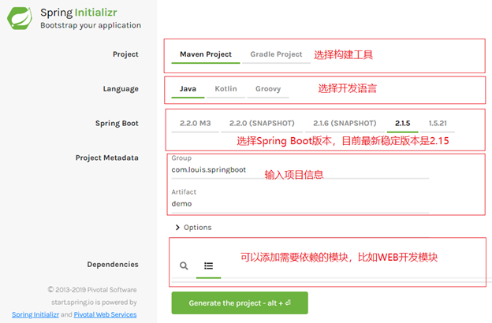
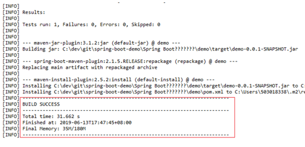
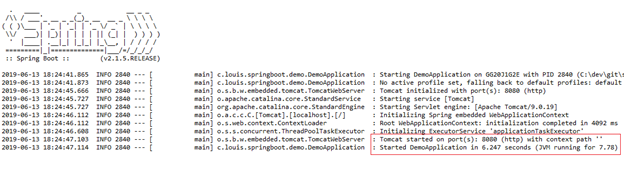
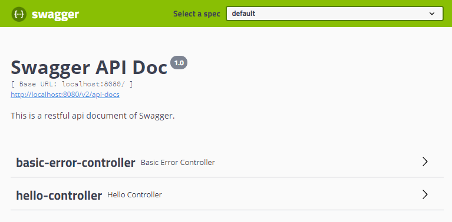
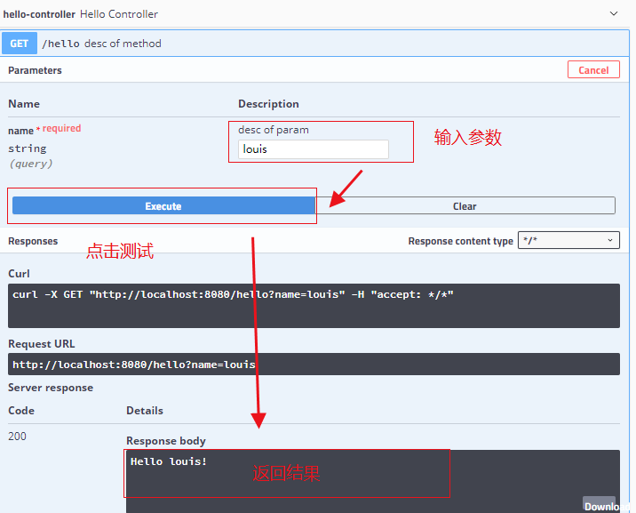
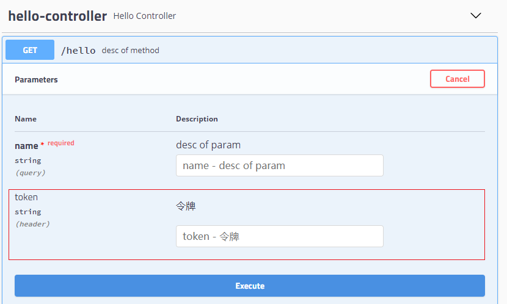

[TOC]: # "Springboot 整合Swagger"

# Springboot 整合Swagger
- [综合概述](#综合概述)
- [实现案例](#实现案例)
  - [生成项目模板](#生成项目模板)
  - [添加相关依赖](#添加相关依赖)
  - [添加配置类](#添加配置类)
  - [添加控制器](#添加控制器)
  - [编译运行测试](#编译运行测试)
  - [常用直接说明](#常用直接说明)
  - [添加请求参数](#添加请求参数)
- [参考资料](#参考资料)


## 综合概述

Spring-boot作为当前最为流行的Java Web开发脚手架，越来越多的开发者选择用其来构建企业级RestFul API接口。这些接口不到会服务于传统的web端（b/s），也会服务于移动端。在实际开发过程中，这些接口还要提供给开发测试进行相关的白盒测试，那么势必存在如何在多人协作中共享和及时更新API开发接口文档问题。

假如你已经对传统的Wiki文档共享方式所带来的弊端深恶痛绝，那么尝试一下Swagger 2 方式，一定会让你又不一样的开发体验。

使用Swagger集成文档具有以下几个优势：

- 功能丰富：支持多种注解，自动生成接口文档界面，支持在界面测试API接口功能；
- 及时更新：开发过程中花一点写注释的时间，就可以及时更新API文档，省心省力；
- 整合简单：通过添加pom依赖和简单配置，内嵌于应用中就可以同时发布API接口文档界面，不需要部署独立服务。

## 实现案例

接下来，我们就通过SpringBoot 来整合Swagger实现在线API文档的功能。

### 生成项目模板

为方便我们初始化项目，Spring boot给我们提供一个项目模板生成网站。

1. 打开浏览器，访问[http://start.spring.io](http://start.spring.io)
2. 根据也面显示，选择构建工具，开发语言，项目信息等。



3. 点击Generate the project，生成项目模板，生成之后会将压缩包下载到本地
4. 使用IDE导入项目，通过maven项目的方式导入。

### 添加相关依赖

添加Maven相关依赖，这里需要添加上Web和Swagger依赖

Web依赖
```xml
<dependency>
        <groupId>org.springframework.boot</groupId>
        <artifactId>spring-boot-starter-web</artifactId>
</dependency>

```

swagger依赖，这里选择2.9.2版本。

```mxml
<dependencies>
<!-- swagger -->
<dependency>
    <groupId>io.springfox</groupId>
    <artifactId>springfox-swagger2</artifactId>
    <version>2.9.2</version>
</dependency>
<dependency>
    <groupId>io.springfox</groupId>
    <artifactId>springfox-swagger-ui</artifactId>
    <version>2.9.2</version>
</dependency>
</dependencies>
```

### 添加配置类

添加一个swagger配置类，在工程下新建config包并添加一个SwaggerConfig配置类

SwaggerConfig.java
```java
import org.springframework.context.annotation.Bean;
import org.springframework.context.annotation.Configuration;
import springfox.documentation.builders.ApiInfoBuilder;
import springfox.documentation.builders.PathSelectors;
import springfox.documentation.builders.RequestHandlerSelectors;
import springfox.documentation.service.ApiInfo;
import springfox.documentation.spi.DocumentationType;
import springfox.documentation.spring.web.plugins.Docket;
import springfox.documentation.swagger2.annotations.EnableSwagger2;

@Configuration
@EnableSwagger2
public class SwaggerConfig {

    @Bean
    public Docket createRestApi(){
        return new Docket(DocumentationType.SWAGGER_2).apiInfo(apiInfo())
            .select()
            .apis(RequestHandlerSelectors.any())
            .paths(PathSelectors.any()).build();
    }

    private ApiInfo apiInfo(){
        return new ApiInfoBuilder()
            .title("Kitty API Doc")
            .description("This is a restful api document of Kitty.")
            .version("1.0")
            .build();
    }

}
```

### 添加控制器

添加一个控制器，在工程下新建controller包并添加一个HelloController控制器。

HelloController.java

```java
package com.louis.springboot.demo.controller;

import org.springframework.web.bind.annotation.GetMapping;
import org.springframework.web.bind.annotation.RequestParam;
import org.springframework.web.bind.annotation.RestController;

import io.swagger.annotations.Api;
import io.swagger.annotations.ApiOperation;
import io.swagger.annotations.ApiParam;

/* 类注解 */
@Api(value = "desc of class")
@RestController
public class HelloController {

    /* 方法注解 */
    @ApiOperation(value = "desc of method", notes = "")
    @GetMapping(value="/hello")
    public Object hello( /* 参数注解 */ @ApiParam(value = "desc of param" , required=true ) @RequestParam String name) {
        return "Hello " + name + "!";
    }
}
```

### 编译运行测试

1. 执行mvn install，开始执行maven构建，第一次会下载maven依赖，可能需要点时间，如果出现如下信息，就说明项目编译打包成功了。



2. 启动项目，开始启动应用，当出现如下信息的时候，就说明应用启动成功了，默认启动端口是8080。



3. 打开浏览器，访问[http://localhost:8080/swagger-ui.html](http://localhost:8080/swagger-ui.html)，进入swagger接口文档页面



4. 展开hello-controller的hello接口，输入参数并点击执行，就可以看到接口测试结果了。



### 常用直接说明

swagger通过注解接口生成文档，包括接口名，请求方法，参数，返回信息等。

@Api:修饰整个类，用于controller类上
@ApiOperation:描述一个接口，用于controller方法上
@ApiParam：单个参数描述
@ApiModel：用来对象接收参数，即返回对象
@ApiModelProperty：对象接收参数时，描述对象的字段
@ApiResponse：Http相应其中的描述，在ApiResponse中
@ApiIgnore：忽略这个API
@ApiError：发生错误的返回信息
@ApiImplicitParam：一个请求参数
@ApiImplicitParams：多个请求参数
更多使用说明，参考[Swagger使用手册](https://gumutianqi1.gitbooks.io/specification-doc/content/tools-doc/spring-boot-swagger2-guide.html)

### 添加请求参数

在很多时候，我们需要在调用我们每一个接口的时候都携带上一些通用参数，比如采取token验证逻辑，往往在接口请求时把token也一起传入后台，接下来，我们就讲解一下如何给Swagger添加固定的请求参数。

修改SwaggerConfig配置类，替换成如下内容，利用ParameterBuilder构成请求参数。

SwaggerConfig.java

```java
@Configuration
@EnableSwagger2
public class SwaggerConfig {

    @Bean
    public Docket createRestApi(){
        // 添加请求参数，我们这里把token作为请求头部参数传入后端
        ParameterBuilder parameterBuilder = new ParameterBuilder();  
        List<Parameter> parameters = new ArrayList<Parameter>();  
        parameterBuilder.name("token").description("令牌")
            .modelRef(new ModelRef("string")).parameterType("header").required(false).build();  
        parameters.add(parameterBuilder.build());  
        return new Docket(DocumentationType.SWAGGER_2).apiInfo(apiInfo()).select()
                .apis(RequestHandlerSelectors.any()).paths(PathSelectors.any())
                .build().globalOperationParameters(parameters);
//        return new Docket(DocumentationType.SWAGGER_2).apiInfo(apiInfo())
//                .select()
//                .apis(RequestHandlerSelectors.any())
//                .paths(PathSelectors.any()).build();
    }

    private ApiInfo apiInfo(){
        return new ApiInfoBuilder()
                .title("Swagger API Doc")
                .description("This is a restful api document of Swagger.")
                .version("1.0")
                .build();
    }

}
```

完成之后重启应用，再次查看hello接口，可以看到已经支持发送token请求参数了。



## 参考资料

官方网站:[http://swagger.io/](https://swagger.io/)  
使用手册:[https://gumutianqi1.gitbooks.io/specification-doc/content/tools-doc/spring-boot-swagger2-guide.html](https://gumutianqi1.gitbooks.io/specification-doc/content/tools-doc/spring-boot-swagger2-guide.html)  
maven仓库:[https://mvnrepository.com/artifact/io.springfox/springfox-swagger-ui](https://mvnrepository.com/artifact/io.springfox/springfox-swagger-ui)


