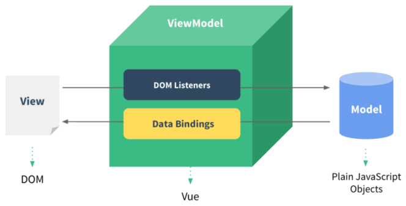

[TOC]: # "vue全家桶"

# vue全家桶
- [vue](#vue)
  - [1. 渐进式框架](#1-渐进式框架)
  - [2. 两个核心点](#2-两个核心点)
  - [3. 虚拟DOM](#3-虚拟dom)
  - [4. MVVM](#4-mvvm)


## vue

[vue官方API](https://cn.vuejs.org/v2/guide/)  
以下案例涉及到的实例代码：[示例代码](https://github.com/mm-bt/vue-demo)

### 1. 渐进式框架

vue是一套构建用户界面的渐进式框架，采用自底向上增量开发的设计。vue的核心库只关注视图层，不仅易于上手，还便于与第三方库或既有项目整合。  
渐进式表现：声明式渲染--组件系统--客户端路由--大数据状态管理--构建工具

### 2. 两个核心点

1. 响应式数据绑定  
当数据发生变化的时候，视图自动更新，即双向数据同步，原理利用了ES6中的Object.definedProperty中的setter/getter 代理数据，监控对数据的操作。
2.  组合的视图组件  
即页面最终映射为一个组件树，采用树形数据结构进行设计，方便维护，重用。

### 3. 虚拟DOM

利用在内存中生成与真实DOM与之对应的数据结构，这个在内存中生成的结构称之为虚拟DOM。当数据发生变化时，能够智能的计算出重新渲染组件的最小代价并应用到DOM操作上。

### 4. MVVM

MVVM是Model-View-ViewModel的缩写，它是一种基于前端开发的架构模式，其核心是提供对View和ViewModel的双向数据绑定，这使得ViewModel的状态改变可以自动传递给View，即所谓的数据双向绑定。  
M:Model（数据层，也就是指数据（前端js））  
V:View（也就是指DOM层或用户界面）  
VM：ViewModel（处理数据和界面的中间层，也就是Vue）



### 5. 声明式渲染

Vue.js的核心是一个允许采用简洁模板语法来声明式的将数据渲染进DOM的系统。  
**额外补充：**  
渲染分为： 命令式渲染和声明式渲染  
命令式渲染：命令我们的程序去做什么，程序就会跟着你的命令去一步一步执行  
声明式渲染：只需要告诉程序想要什么效果，其他的交给程序来做  
具体区别看如下代码，执行结果一样，实现方式不同。

```javascript
    var arr = [1, 2, 3, 4, 5];

    // 命令式渲染：关心每步，关心流程，用命令去实现
    var newArr = [];
    for(var i = 0; i < arr.length; i++) {
        newArr.push(arr[i] * 2);
    }
    console.log(newArr);

    // 声明式渲染：不关心中间流程，只需要关心结果和实现条件
    var arr1 = arr.map(function(item) {
        return item*2;
    });
    console.log(arr1);
```
