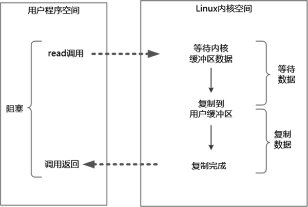
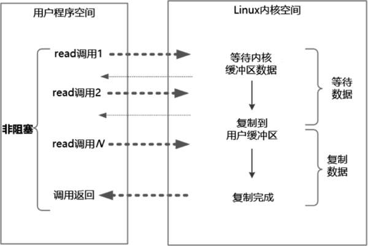
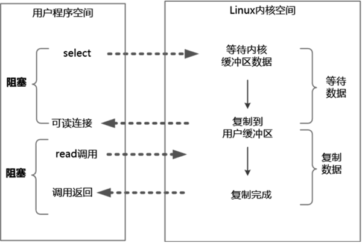
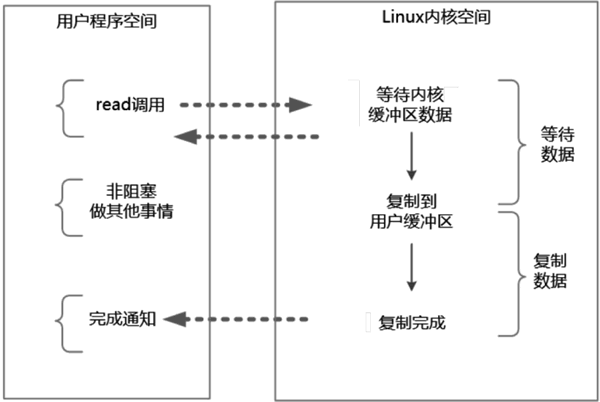

# 四种常见的IO模型

### 1. 同步阻塞IO

首先，解释一下阻塞和非阻塞

阻塞IO指的是需要内核IO操作彻底完成后才返回到用户空间执行用户程序的操作命令。
“阻塞”指的是用户程序（发起IO请求的进程或者线程）的执行状态。可以说传统的IO模型都是阻塞IO模型，
并且在JAVA中默认创建的socket都属于阻塞IO模型。

其次，解释一下同步与异步。简单来说，可以将同步或异步看成发起IO请求的两种方式。
同步IO是指用户空间（进程或者线程）是主动发起IO请求的一方，系统内核是被动的接收方。
异步IO则反过来，系统内核是主动发起IO请求的一方，用户空间是被动的接收方。

同步阻塞OP（Blocking IO)指的是用户空间（或者线程）主动发起，需要等待内核IO操作彻底完成后
才返回到用户空间的IO操作。在IO操作过程中，发起IO请求的用户进程（或者线程）处于阻塞状态。

### 2. 同步非阻塞IO

非阻塞IO（Non-Blocking IO，NIO）指的是用户空间的程序不需要等待内核IO操作彻底完成，
可以立即返回用户空间去执行后续的指令，即发起IO请求的进程（或者线程）处于非阻塞状态。

阻塞和非阻塞的区别是什么呢？阻塞是指用户进程（或者线程）一直在等待，而不能做别的事情；
非阻塞是指用户进程（或者线程）获得内核返回的状态值就返回自己的空间，可以去做别的事情。

    在Java中，非阻塞IO的socket被设置成NONBLOCK模式。

同步非阻塞IO指的是用户进程主动发起，不需要等待内核IO操作彻底完成就能立即返回
用户空间的IO操作。在IO操作过程中，发起IO请求的用户进程（或者线程）处于非阻塞状态。

同步非阻塞IO也可以简称NIO，但是它不是Java编程中的NIO。Java编程中的NIO（New IO)类库组件所
归属的不是基础IO模型中的NIO模型，而是IO多路复用模型。

### 3. IO多路复用

为了提高性能，操作系统引入了一种新的系统调用，专门用于查询IO文件描述符（含Socket连接）的就绪
状态。在Linux系统中，新的系统调用为select/epoll系统调用。通过该系统调用，一个用户进程（或者线程）
可以监视多个文件描述符，一旦某个描述符就绪（一般是内核缓冲区可读/可写）内核就能够将文件描述符
的就绪状态返回给用户进程（或者线程），用户空间可以根据文件描述符的就绪状态进行相应的IO系统调用。

IO多路复用（IO Multiplexing）属于一种经典的Reactor模式实现，有时也称为异步阻塞IO，Java中的
selector属于这种模型。

### 4. 异步IO

异步IO（Asynchronous IO，AIO）指的是用户空间的线程变成被动接受者，而内核空间成为主动调用者。
在异步IO模型中，当异步IO模型中，当用户线程收到通知时，数据已经被内核读取完毕并放在了；用户
缓冲区内，内核中IO完成后通知用户进程直接使用即可。

异步IO类似于Java中典型的回调模式，用户进程（或者线程）向内核空间注册了各种IO事件的回调函数，
由内核去主动调用。

接下来是对以上4种常见的IO模型进行详细介绍。

## 同步阻塞IO

默认情况下，在Java应用程序进程中所有对socket连接进行的IO操作都是同步阻塞IO。

在阻塞式IO模型中，从Java应用程序发起IO系统调用开始，一直到系统调用返回，这段时间内发起IO请求的
Java进程（或者线程）都是阻塞的。直到返回成功后，应用进程才能开始处理用户空间的缓存区数据。

同步阻塞IO的具体流程如图1所示：

举个例子，在Java中发起一个socket的read操作的系统调用，流程大致如下：

- 从Java进行IO读后发起read系统调用开始，用户线程（或者进程）就进入阻塞状态。
- 当系统内核收到read系统调用后就开始准备数据。一开始没数据可能还没有到达内核缓冲区
（例如，还没有收到一个完整的socket数据包），这是内核就要等待。
- 内核一直等到完整的数据到达，就会将数据从内核缓冲区复制到用户缓冲区（用户空间的内存），
然后内核返回结果（例如返回复制到用户缓冲区的字节数）。
- 直到内核返回后用户线程才会解除阻塞的状态，重新运行起来。

阻塞IO的特点是在内核执行IO操作的两个阶段，发起IO请求的用户进程（或者线程）被阻塞了。

阻塞IO的优点是：应用程序开发非常简单；在阻塞等待数据期间，用户线程挂起，基本不会占用CPU资源。

阻塞IO的缺点是：一般情况下会为每个连接配备一个独立的线程，一个线程维护一个连接的IO操作。在并发量
下的情况下，这样做没有什么问题。在高并发的应用场景下，阻塞IO模型需要大量的线程来维护大量的网络连接，
内存、线程切换的开销会非常巨大，性能很低，基本上是不可用的。

## 同步非阻塞IO

在linux系统下，socket连接默认是阻塞模式，可以将socket设置成非阻塞模式。

在NIO模型中，应用程序一旦开始IO系统调用，就会出现以下两种情况：
- 在内核缓冲区中没有数据的情况下，系统调用会立即返回一个调用失败的信息。
- 在内核缓冲区中有数据的情况下，在数据的复制过程中系统调用是阻塞的，直到完成数据从内核缓冲区
复制到用户缓冲区。复制完成后，系统调用返回成功，用户进程（或者线程）可以开始处理用户空间的
缓冲区数据。

同步非阻塞IO的流程如图2所示。

举个例子，发起一个非阻塞socket的read操作的系统调用，流程如下：

- 在内核数据没有准备好的阶段，用户线程发起IO请求时立即返回。所以，为了读取最终的数据，用户进程（或者线程）需要
不断的发起系统调用。
- 内核数据到达后，用户进程（或者线程）发起系统调用，用户进程（或者线程）阻塞。内核开始复制数据，它会将数据从内核
缓冲区复制到用户缓冲区，然后内核返回结果（例如返回复制到的用户缓冲区的字节数）。
- 用户进程（或者线程）读到数据后，才会解除阻塞状态，重新运行起来。也就是说，用户空间需要经过多次尝试
才能保证最终真正读到数据，而后继续执行。

同步非阻塞IO的特点是应用程序的线程需要不断地进行IO系统调用，轮询数据是否已经准备好，如果没有准备好就继续轮询，
直到完成IO系统调用为止。

同步非阻塞IO的优点是每次发起的IO系统调用在内核等待数据过程中可以立即返回，用户线程不会阻塞，实时性比较好。

同步非阻塞IO的缺点是不断地轮询内核，这将占用大量的CPU时间，效率低下。

## IO多路复用

如何避免同步非阻塞IO模型中轮询等待时间的问题呢？答案是采用IO多路复用模型。

目前支持IO多路复用模型的系统调用有select、epoll等。几乎所有的操作系统都支持select系统调用，
它具有良好的跨平台特性。epoll是在linux2.6内核中提出的，是select系统调用的Linux增强版本。

在IO多路复用模型中通过select/epoll系统调用，单个应用程序的线程可以不断地轮询成百上千的
socket连接的就绪状态，当某个或者某些socket网络连接有IO就绪状态时就返回这些就绪状态（或者
或就绪事件）。

举个例子来说明IO多路复用模型的流程。发起一个多路复用IO的read操作的系统调用，流程如下：

- 选择器注册。首先，将需要read操作的目标文件描述符（socket连接）提前注册到Linux的select/epoll
选择器中，在Java中所对应的选择器类是Selector类。然后，开启整个IO多路复用模型的轮询过程。
- 就绪状态的轮询。通过选择器的查询方法，查询所有提前注册过的目标文件描述符（socket连接）的
IO就绪状态。通过查询的系统调用，内核会返回一个就绪的socket列表。当任何一个注册过的socket
中的数据准备好或者就绪了就说明内核缓冲区有数据了，内核将该socket加入就绪的列表，并且返回就绪事件。
- 用户线程获得了就绪状态的列表后，根据其中的socket连接发起read系统调用，用户线程阻塞。内核开始
复制数据，将数据从内核缓冲区复制到用户缓冲区。
- 复制完成后，内核返回结果，用户线程才会解除阻塞的状态，用户线程读取到了数据，继续执行。

IO多路复用模型的read系统调用流程如图3所示：

IO多路复用模型的特点是：IO多路复用模型的IO涉及两种系统调用，一种是IO操作的系统调用，另一种是select/epoll
轮询，以达到IO操作就绪的socket连接。

IO多路复用模型与同步非阻塞IO模型是有密切关系的，具体来说，注册在选择器上的每一个可以查询的socket连接
一般都设置成同步非阻塞模型，只是这一点对于用户程序而言是无感知的。

IO多路复用模型的优点是一个选择器查询线程可以同时处理成千上万的网络连接，所以用户程序不必创建大量的线程，
也不必维护这些线程，从而大大减少了系统的开销。与一个线程维护一个连接的阻塞IO模型相比，这一点是IO多路复用
模型的最大优势。

通过JDK的源码可以看出，Java语言的NIO组件在Linux系统上是使用epoll系统调用实现的。所以，Java语言的NIO组件
所使用的就是IO多路复用模型。

IO多路复用模型的缺点是，本质上select/epoll系统调用是阻塞式的，属于同步IO，需要在读写事件就绪后由系统调用本身
负责读写，也就是说这个读写过程是阻塞的。要彻底地解除线程额度阻塞，就必须使用异步IO模型。

## 异步IO

异步IO模型的基本流程是：用户线程通过系统调用向内核注册某个IO操作。内核在整个IO操作（包括数据准备、数据复制）
完成后通知用户程序，用户执行后续的业务操作。

在异步IO模型中，在整个内核的数据处理罗成（包括内核将数据从网络物理设备（网卡）读取到内核缓冲区、
将内核缓冲区的数据复制到用户缓冲区）中，用户程序都不需要阻塞。

异步IO模型的流程如下图所示：

举个例子，发起一个异步IO的read操作的系统调用，流程如下：

- 当用户线程发起read系统调用后，立刻就可以去做其他的事，用户线程不阻塞。
- 内核开始IO的第一个阶段：准备数据。准备好数据，内核就会将数据从内核缓冲区复制到用户缓冲区。
- 内核会给用户线程发送一个信号（Signal），或者回调用户线程注册的回调方法，告诉用户线程read系统调用已经完成，
数据已经读入用户缓冲区。
- 用户线程读取用户缓冲区的数据，完成后续的业务操作。

异步IO模型的特点是在内核等待数据和复制数据的两个阶段，用户线程都不是阻塞的。用户线程需要接收
内核的IO操作完成的事件，或者用户线程需要注册一个IO操作完成的回调函数。正因为如此，异步IO有的时候
也被成为信号驱动IO。

异步IO模型的缺点是应用程序仅需要进行事件的注册与接收，其余的工作都留给了操作系统，也就是说需要底层内核提供
支持。

理论上来说，异步IO是真正的异步输入输出，它的吞吐量高于IO多路复用模型的吞吐量。就目前而言，Windows系统下
通过IOCP实现了真正的异步IO。在Linux系统下，异步IO模型在2.6版本才引入，JDK对它的支持目前并不完善，因此异步
IO在性能上没有明显的优势。

大多数高并发服务端的程序都是基于Linux系统的。因而，目前这列高并发网络应用程序的开发大多采用IO多路复用模型。
大名鼎鼎的Netty框架使用的就是IO多路复用模型，而不是异步IO模型。

