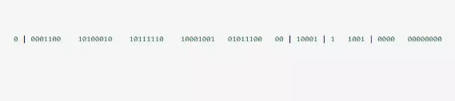
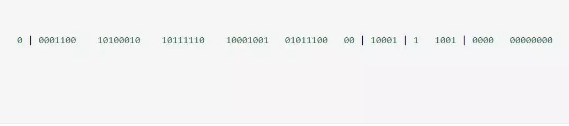

[TOC]: # "雪花算法的原理和实现（java）"


SnowFlake算法，是Twitter开源的分布式id生成算法。其核心思想就是：使用一个 64bit的long型的数字作为全局唯一id。在分布式系统中应用十分广泛，且ID引入了时间戳，基本上保持自增的，后边的代码中有详细的注解。

这64个bit中，其中1个bit是不用的，然后用其中的41bit作为毫秒数，用10bit作为工作机器id，12bit作为序列号。



给大家举个例子吧，比如下面那个64bit的long型数字：
- 第一个部分，是1个bit：0，这个是无意义的。
- 第二个部分是41个bit：表示的是时间戳。
- 第三个部分是5个bit：表示的是机房的id，10001
- 第四个部分是5个bit：表示的是机器的id，1 1001.
- 第五个部分是12个bit，表示的序号，就是某个机房某台机器上这一毫秒内同时生成的id的序号，000000000000

**1bit：是不用的，为什么？**

因为二级制里第一个bit如果是1，那么都是负数，但是我们生成的id都是正数，所以第一个bit统一都是0.

**41bit：表示的是时间戳，单位是毫秒。**

41bit可以表示的数字多达2^41-1，也就是可以标识2^41 - 1个毫秒值，换算成年就是表示69年的时间。

**10bit：记录工作机器id，代表的是这个服务最多可以部署在2^10台机器上，也就是1024台机器**

但是10bit里5bit代表机房id，5个bit代表机器id。意思就是最多代表2^5个机房（32个机房），每个机房里可以代表2^5个机器（32台机器），也可以根据自己公司的实际情况确定。

**12bit：这个是用来记录同一毫秒内产生的不同id**

12bit可以代表的最大正整数是2^12-1 = 4095，也就是说可以用这个12bit代表的数字来区分同一个毫秒内的4096个不同的id、

简单来说，你的某个服务假设要生成一个全局唯一id，那么就可以发送一个请求给部署了SnowFlake算法的系统，由这个SnowFlake算法系统来生成唯一id。

这个Snowflake算法系统首先肯定是知道自己的所在的机房和机器的，比如机房id = 17，机器id=12.

接着snowflake算法系统接收到这个请求之后，首先就会用二进制位运算的方式生成一个64bit的long型id，64个bit中的第一个bit是无意义的。

接着41个bit，就可以用当前时间戳（单位到毫秒），然后接着5个bit设置上这个机房id，还有5bit设置上机器id。

最后再判断一下，当前这台机房的这台机器上在这一毫秒内，这是第几个请求，给这次生成id的请求累加一个序号，作为最后的12个bit。

最终一个64bit的id就出来了，类似于：



这个算法可以保证，一个机房的一台机器上，在同一毫秒内，生成了一个唯一的id。可能一个毫秒内会生成多个id，但是最后有12个bit的序号来区分开来。

下面我们简单看看这个Snowflake算法的一个代码实现，这就是个实例，大家如果理解了这个意思之后，以后可以自己尝试改造这个算法。

总之就是用一个64bit的数字中各个bit为来设置不同的标志位，区分每一个id。

**Snowflake算法的实现代码如下：**


```java

public class IdWorker {

    //因为二进制里第一个 bit 为如果是 1，那么都是负数，但是我们生成的 id 都是正数，所以第一个 bit 统一都是 0。

    //机器ID  2进制5位  32位减掉1位 31个
    private long workerId;
    //机房ID 2进制5位  32位减掉1位 31个
    private long datacenterId;
    //代表一毫秒内生成的多个id的最新序号  12位 4096 -1 = 4095 个
    private long sequence;
    //设置一个时间初始值    2^41 - 1   差不多可以用69年
    private long twepoch = 1585644268888L;
    //5位的机器id
    private long workerIdBits = 5L;
    //5位的机房id
    private long datacenterIdBits = 5L;
    //每毫秒内产生的id数 2 的 12次方
    private long sequenceBits = 12L;
    // 这个是二进制运算，就是5 bit最多只能有31个数字，也就是说机器id最多只能是32以内
    private long maxWorkerId = -1L ^ (-1L << workerIdBits);
    // 这个是一个意思，就是5 bit最多只能有31个数字，机房id最多只能是32以内
    private long maxDatacenterId = -1L ^ (-1L << datacenterIdBits);

    private long workerIdShift = sequenceBits;
    private long datacenterIdShift = sequenceBits + workerIdBits;
    private long timestampLeftShift = sequenceBits + workerIdBits + datacenterIdBits;
    private long sequenceMask = -1L ^ (-1L << sequenceBits);
    //记录产生时间毫秒数，判断是否是同1毫秒
    private long lastTimestamp = -1L;
    public long getWorkerId(){
        return workerId;
    }
    public long getDatacenterId() {
        return datacenterId;
    }
    public long getTimestamp() {
        return System.currentTimeMillis();
    }


    public IdWorker(long workerId, long datacenterId, long sequence) {

        // 检查机房id和机器id是否超过31 不能小于0
        if (workerId > maxWorkerId || workerId < 0) {
            throw new IllegalArgumentException(
                String.format("worker Id can't be greater than %d or less than 0",maxWorkerId));
        }

        if (datacenterId > maxDatacenterId || datacenterId < 0) {

            throw new IllegalArgumentException(
                String.format("datacenter Id can't be greater than %d or less than 0",maxDatacenterId));
        }
        this.workerId = workerId;
        this.datacenterId = datacenterId;
        this.sequence = sequence;
    }

    // 这个是核心方法，通过调用nextId()方法，让当前这台机器上的snowflake算法程序生成一个全局唯一的id
    public synchronized long nextId() {
        // 这儿就是获取当前时间戳，单位是毫秒
        long timestamp = timeGen();
        if (timestamp < lastTimestamp) {

            System.err.printf(
                "clock is moving backwards. Rejecting requests until %d.", lastTimestamp);
            throw new RuntimeException(
                String.format("Clock moved backwards. Refusing to generate id for %d milliseconds",
                    lastTimestamp - timestamp));
        }

        // 下面是说假设在同一个毫秒内，又发送了一个请求生成一个id
        // 这个时候就得把seqence序号给递增1，最多就是4096
        if (lastTimestamp == timestamp) {

            // 这个意思是说一个毫秒内最多只能有4096个数字，无论你传递多少进来，
            //这个位运算保证始终就是在4096这个范围内，避免你自己传递个sequence超过了4096这个范围
            sequence = (sequence + 1) & sequenceMask;
            //当某一毫秒的时间，产生的id数 超过4095，系统会进入等待，直到下一毫秒，系统继续产生ID
            if (sequence == 0) {
                timestamp = tilNextMillis(lastTimestamp);
            }

        } else {
            sequence = 0;
        }
        // 这儿记录一下最近一次生成id的时间戳，单位是毫秒
        lastTimestamp = timestamp;
        // 这儿就是最核心的二进制位运算操作，生成一个64bit的id
        // 先将当前时间戳左移，放到41 bit那儿；将机房id左移放到5 bit那儿；将机器id左移放到5 bit那儿；将序号放最后12 bit
        // 最后拼接起来成一个64 bit的二进制数字，转换成10进制就是个long型
        return ((timestamp - twepoch) << timestampLeftShift) |
            (datacenterId << datacenterIdShift) |
            (workerId << workerIdShift) | sequence;
    }

    /**
     * 当某一毫秒的时间，产生的id数 超过4095，系统会进入等待，直到下一毫秒，系统继续产生ID
     * @param lastTimestamp
     * @return
     */
    private long tilNextMillis(long lastTimestamp) {

        long timestamp = timeGen();

        while (timestamp <= lastTimestamp) {
            timestamp = timeGen();
        }
        return timestamp;
    }
    //获取当前时间戳
    private long timeGen(){
        return System.currentTimeMillis();
    }

    /**
     *  main 测试类
     * @param args
     */
    public static void main(String[] args) {
        System.out.println(1&4596);
        System.out.println(2&4596);
        System.out.println(6&4596);
        System.out.println(6&4596);
        System.out.println(6&4596);
        System.out.println(6&4596);
        //		IdWorker worker = new IdWorker(1,1,1);
        //		for (int i = 0; i < 22; i++) {
        //			System.out.println(worker.nextId());
        //		}
    }
}
```

**Snowflake算法的优点：**

1. 高性能高可用：生成时不依赖于数据库，完全在内存中生成。
2. 容量大：每秒钟能生成数百万个自增ID。
3. ID自增：存入数据库中，索引效率高。

**Snowflake算法的缺点：**

依赖于系统时间的同一性，如果系统时间被回调，或者改变，可能会造成ID冲突或者重复。

实际中我们的机房并没有那么多，我们可以改进算法，将10bit的机器id优化，成业务表或者和我们系统相关的业务。
