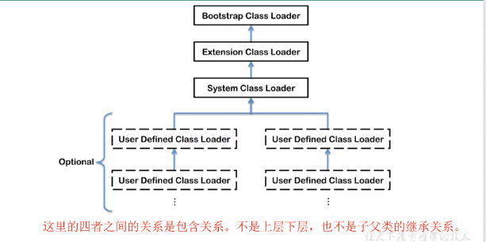
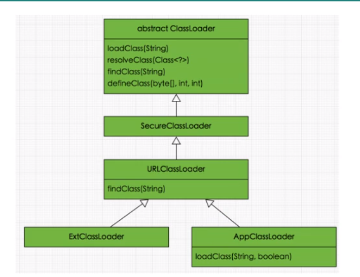
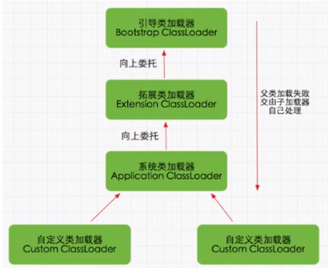

# 深入理解java虚拟机

<!-- TOC -->

- [深入理解java虚拟机](#深入理解java虚拟机)
  - [JVM的位置](#jvm的位置)
  - [JVM整体结构](#jvm整体结构)
  - [java代码执行流程](#java代码执行流程)
  - [jvm架构模型](#jvm架构模型)
  - [jvm生命周期](#jvm生命周期)
  - [内存结构概述](#内存结构概述)
  - [类加载器子系统](#类加载器子系统)

<!-- /TOC -->

## JVM的位置

JVM是运行在操作系统之上的，它与硬件没有直接的交互

## JVM整体结构

## java代码执行流程

1. java源码（xxx.java）
2. java编译器
   1. 词法分析
   2. 语法分析
   3. 语法/抽象语法树
   4. 语义分析
   5. 注解抽象语法树
   6. 字节码生成器
3. 字节码（xxx.class）
4. java虚拟机
   1. 类加载器
   2. 字节码校验器
   3. 翻译字节码(解析执行)/JIT编译器(编译执行)
5. 操作系统

## jvm架构模型

Java编译器输入的指令流基本上是一种基于栈的指令集架构，另一种指令集架构则是基于寄存器的指令集架构。

Hotspot虚拟机，除了PC寄存器之外，没有其他的寄存器

两种架构的区别

- 基于栈式架构的特点：
  - 设计和实现更简单，适用于资源受限的系统
  - 避开了寄存器的分配难题：使用零地址指令方式分配
  - 指令流中的指令大部分是零地址指令，其执行过程依赖于操作栈。指令集更小，编译器不容易实现
  - 不需要硬件支持，可移植性好，更好实现跨平台
- 基于寄存器架构的特点
  - 典型的应用就是x86的二进制指令集：比如传统的PC以及android的Davlik虚拟机
  - 指令集架构则完全依赖硬件，可移植性差
  - 性能优秀和执行更高效
  - 花费更少的指令去完成一项操作
  - 在大部分情况下，基于寄存器架构的指令集往往友谊一地址指令、二地址指令和三地址指令为主，而基于栈式架构的指令集却是以零地址指令为主

总结：

由于跨平台设计，Java的指令都是根据栈来设计的。不同的平台CPU架构不同，所以不能设计为基于寄存器的。优点是跨平台，指令集小，编译器容易实现，缺点是性能下降，实现同样的功能需要更多的指令。

栈：  
跨平台性、指令集小、指令多；执行性能比寄存器差

## Graal VM

- 2018年4月，Oracle Labs公开了Graal VM
  ，号称 "Run Programs Faster
  Anywhere"，勃勃野心。与1995年java的“write
  once，run anywhere”遥相呼应。

- Graal VM 在HotSpot
  VM基础上增强而成的跨语言全站虚拟机，可以作为“任何语言”的运行平台使用。语言包括：Java、Scala、Groovy、Kotlin；C、C++、JavaScript、Ruby、Python、R等

- 支持不同语言中混用对方的接口和对象，支持这些语言使用已经编写好的本地库文件

- 工作原理是将这些语言的源代码或源代码的中间格式，通过编译器转换为能被Graal
  VM接受的钟健表示。Graal
  VM提供Truffle工具集快速构建面向一种新语言的解释器。在运行时还能进行即时编译优化，获得比原生编译器更优秀的执行效率。

- 如果说HotSpot有一天真的被取代，Graal
  VM希望最大。但是Java的软件生态没有丝毫变化

## jvm生命周期

**虚拟机启动**

Java虚拟机的启动时通过引导类加载器（bootstrap
class loader）创建一个初始类（init
class）来完成的，这个类是由虚拟机的具体实现指定的

**虚拟机的运行**

- 一个运行中的java虚拟机有着一个清晰地任务：执行java程序
- 程序开始执行时他执行，程序结束时他就停止
- 执行一个所谓的java程序的时候，真正在执行的是一个java虚拟机的进程

**虚拟机的退出**

有如下几种情况
- 程序正常执行结束
- 程序在执行过程中遇到了异常或错误而异常终止
- 由于操作系统出现错误而导致java虚拟机进程终止
- 某线程调用Runtime类或System类的exit方法，或Runtime类的halt方法，并且java安全管理器也允许这次exit或halt操作
- 除此之外，JNI（Java Native
  Interface）规范描述了用JNI Invocation
  API
  来加载或卸载Java虚拟机时，java虚拟机的退出情况

## 内存结构概述

如果自己手写一个java虚拟机的话，考虑哪些结构：  
类加载器子系统、执行引擎

## 类加载器子系统

三个阶段：1.加载阶段 2. 链接阶段 3.
初始化阶段

- 类加载子系统负责从文件系统或者网络中加载class文件，class文件在文件头有特定的标识
- ClassLoader只负责class文件的加载，至于它是否可以运行，则由Execution
  Engine决定
- 加载的类信息存放于一块成为方法区的内存空间，除了类的信息外，方法区中还会存放运行时常量池信息，可能还包括字符串字面量和数字常量(这部分常量信息是Class文件中常量池部分的内存映射)

##  类加载器ClassLoader角色

1. class
   file存在于本地硬盘上，可以理解为设计师画在纸上的模板，而最终这个模板在执行的时候是要加载到JVM当中来根据这个文件实例化出n个一模一样的实例
2. class
   file加载到JVM中，被称为DNA元数据模板，放在方法区
3. 在.class文件-->JVM-->最终成为元数据模板，此过程就要一个运输工具(类装载器
   Class Loader)，扮演一个快递员的角色

##  类的加载过程
**loading**：

1. 通过一个类的全限定名获取定义此类的二进制字节流
2. 将这个字节流所代表的静态存储结构转化为方法区的运行时的数据结构
3. 在内存中生成一个代表这个类的java.lang.Class对象，作为方法区这个类的各种数据的访问接口

**补充：加载.class文件的方式**

- 从本地系统中直接加载
- 从网络获取，典型场景：Web Applet
- 从zip压缩包中读取，成为日后jar、war格式的基础
- 运行时计算生成，典型场景：JSP应用
- 从专有数据库中提取.class文件，比较少见
- 从加密文件中获取，典型的防class文件被反编译的保护措施

**linking**

**验证(Verify):**
- 目的在于确保Class文件的字节流中包含信息符合当前虚拟机要求，保证被加载类的正确性，不会危害虚拟机的自身安全
- 主要包括四种验证：文件格式验证、元数据验证、字节码验证、符号引用验证。

**准备(Prepare):**
- 为类变量分配内存并且设置该类变量的默认初始值，即零值。
- 这里不包含用final修饰的static，因为final在编译的时候就会分配了，准备阶段会显式初始化
- 这里不会为实例变量分配初始化，类变量会分配在方法区中，而实例变量是会随着对象一起分配到java堆中

**解析(Resolve):**
- 将常量池内的符号引用转换为直接引用的过程。
- 事实上，解析操作往往会伴随着JVM在执行完初始化之后再执行
- 符号引用就是一组符号来描述所引用的目标，符号引用的字面量行是明确定义在《Java虚拟机规范》的Class文件格式中。直接引用就是直接指向目标的指针、相对偏移量或一个间接定位到目标的句柄。
- 解析动作主要针对类或接口、字段、类方法、接口方法、方法类型等。对应常量池中的CONSTANT_Class_info、CONSTANT_Fieldref_info、CONSTANT_Methodref_info等。

**Initialization** 初始化：
- 初始化阶段就是执行类构造器方法<clinit>()的过程。
- 此方法不需定义，是javac编译器自动收集类中的所有变量的赋值动作和静态代码块中的语句合并而来。(如果类没有静态变量或静态代码块则没有这个方法)
- 构造器方法中指令按语句在源文件中出现的顺序执行。
- <clinit>()不同于类的构造器(关联：构造器是虚拟机视角下<init>())
- 若该类具有父类，JVM会保证在子类的<clinit>()执行前，父类的<clinit>()已经执行完毕。
- 虚拟机必须保证一个类的<clinit>()方法在多线程下被同步加锁。

##  类加载器的分类
对于用户自定义类来说：默认使用系统类加载器进行加载
String类(Java的核心类库)使用引导类加载器进行加载的

- JVM支持两种类型的类加载器，分别为`引导类加载器(Bootstrap ClassLoader)`和`自定义类加载器(User-Defind ClassLoader)`。
- 从概念上来讲，自定义类加载器一般指的是程序中由开发人员自定义的一类类加载器，但是Java虚拟机规范却没有一这么定义，而是将所有派生于抽象类ClassLoader的类加载器都划分为自定义类加载器(扩展类加载器和应用加载器都属于自定义类加载器)。
- 无论类加载器的类型如何划分，在程序中我们最常见的类加载器始终只有3个，如下所示：

这里的四者之间的关系是包含关系。不是上层下层，也不是子父类的继承关系

## 引导类、扩展类、系统类加载器的使用及演示
虚拟机自带的加载器

- 启动类加载器(引导类加载器，Bootstrap ClassLoader)
  - 这个类加载使用C/C++语言实现，嵌套在JVM内部。
  - 它用来加载Java的核心库(JAVA_HOME/jre/lib/rt.jar、resource.jar或sun.boot.class.path路径下的内容)，用于提供JVM自身需要的类
  - 并不继承自java.lang.ClassLoader，没有父加载器。
  - 加载扩展类和应用程序加载器，并指定为他们的父类加载器。
  - 出于安全考虑，BootStrap启动类加载器只加载包名为java、javax、sun等开头的类
- 扩展类加载器(Extension ClassLoader)
  - java语言编写，由sun.misc.Launcher$ExtClassLoader实现。
  - 派生于ClassLoader类
  - 父类加载器为启动类加载器
  - 从java.ext.dirs系统属性所指定的目录中加载类库，或从JDK的安装目录的jre/lib/ext子目录(扩展目录)下加载类库。如果用户创建的JAR放在此目录下，也会自动扩展类加载器加载。
- 应用程序类加载器(系统类加载器，AppClassLoader)
  - java语言编写，由sun.misc.Launcher$AppClassLoader实现
  - 派生于ClassLoader类
  - 父类加载器为扩展类加载器
  - 它负责加载环境变量classpath或系统属性 java.class.path 指定路径下的类库
  - 该类加载是程序中默认的类加载器，一般来说，Java应用的类都是由它来完成加载
  - 通过ClassLoader#getSystemClassLoader()方法可以获取到该类加载器

用户自定义类加载器

- 在Java的日常应用开发中，类的加载几乎是由上述3种类加载器相互配合执行的，在必要时，我们还可以自定义类加载器，来定制类的加载方式。

- 为什么要自定义类加载器？
  - 隔离加载类
  - 修改类加载的方式
  - 扩展加载源
  - 防止源码泄漏

用户自定义类加载器的实现步骤：

1. 开发人员可以通过继承抽象类java.lang.ClassLoader类的方式，实现自己的类加载器，以满足一些特殊的需求
2. 在JDK1.2之前，在自定义类加载器时，总会去集成ClassLoader类并重写loadClass()方法，从而实现自定义的类加载器类，但是在JDK1.2之后，已经不再建议用户去覆盖loadClass()方法，而是建议把自定义的类加载逻辑写在findClass()方法中
3. 在编写自定义类加载器时，如果没有太过于复杂的需求，可以直接继承URLClassLoader类，这样可以避免自己去编写findClass()方法及其获取字节码流的方式，使自定义类加载器编写更加简洁。

ClassLoader的常用方法及获取方法

ClassLoader类，它是一个抽象类，其后所有的类加载器都继承自ClassLoader(不包括启动类加载器)

| 方法名称(都不是抽象方法)                                       | 描述                                                                                                                    |
|:---------------------------------------------------|:-----------------------------------------------------------------------------|
| getParent()                                                              | 返回该类加载器的超类加载器                                                                             |
| loadClass(String name)                                           | 加载名称为name的类，返回结果为java.lang.Class类的实例                              |
| findClass(String name)                                           | 查找名称为name的类，返回结果为java.lang.Class类的实例                               |
| findLoadedClass(String name)                               | 查找名称为name的已经被加载过的类，返回结果为java.lang.Class类的实例     |
| defineClass(String name,byte[] b, int off,int len) | 把字节数组b中的内容转换为一个java类，返回结果为java.lang.Class类的实例 |
| resolveClass(Class<?> c)                                         | 连接指定的一个java类                                                                                        |

获取ClassLoader的途径
1. 获取当前类的ClassLoader---> clazz.getClassLoader()
2. 获取当前线程上下文的ClassLoader---> Thread.currentThread().getContextClassLoader()
3. 获取系统的ClassLoader---> ClassLoader.getSystemClassLoader()
4. 获取调用者的ClassLoader---> DriverManager.getCallerClassLoader()

双亲委派机制

Java虚拟机对class文件采用的是按需加载的方式，也就是说当需要使用该类时才会将它的class文件加载到内存生成class对象。而且加载某个类的class文件时，java虚拟机采用的是双亲委派模式，即把请求交由给父类处理，它是一种任务委派模式

工作原理：

1. 如果一个类加载器收到了类加载请求，它并不会自己先去加载，而是把这个请求委托给父类的加载器去执行；
2. 如果父类加载器还存在父类加载器，则进一步向上委托，依次递归，最终将达到顶层的启动类加载器；
3. 如果父类加载器可以完成类加载任务，就成功返回，倘若父类加载器无法完成此加载任务，子加载器才会尝试自己去加载，这就是双亲委派机制

双亲委派机制的优势

- 避免类的重复加载
- 保护程序安全，防止核心API被随意篡改
  - 自定义类：java.lang.String
  - 自定义类：java.lang.Apple
java.lang.SecurityException:Prohibited package name : java.lang

沙箱安全机制

自定义String类，但是在加载自定义String类的时候会率先使用引导类加载器加载，而引导类加载器在加载的过程中会加载jdk自带的文件(rt.jar包中的java\lang\String.class)，报错信息说没有main方法就是因为加载的是rt.jar包中的String的类。这样可以保证对java核心源代码的保护，这就是沙箱安全机制。

类的主动使用和被动使用

- 在JVM中表示两个class对象是否为同一个类存在两个必要条件
  - 类的完整雷鸣必须一致，包括包名
  - 加载这个类的ClassLoader(指ClassLoader实例对象)必须相同
- 换句话说，在JVM中，即使这两个类对象(class对象)来源同一个Class文件，被同一个虚拟机所加载，但只要加载它们的ClassLoader实例对象不同，那么这两个类对象也是不相等的

JVM必须知道一个类型是由启动加载器加载还是由用户类加载器加载的。如果一个类型是由用户类加载器加载的，那么JVM会将这个类加载器的一个引用作为类型信息的一部分保存在方法区中。当解析一个类型到另一个类型的引用的时候，JVM需要保证这两个类型的类加载器是相同的。

Java程序对类的使用方式分为：主动使用和被动使用。
- 主动使用，又分为七种情况：
  - 创建类的实例
  - 访问某个类或接口的静态变量，或者对该静态变量赋值
  - 调用类的静态方法
  - 反射 (比如：Class.forName("java.lang.String"))
  - 初始化一个类的子类
  - java虚拟机启动时被标明为启动类的类
  - JDK 7 开始提供的动态语言支持：
        java.lang.invoke.MethodHandle实例的解析结果REF_getStatic、REF_putStatic、REF_invokeStatic句柄对应的类没有初始化，则初始化

- 除了以上七种情况，其他使用Java类的方式都被看做是对类的被动使用，都不会导致类的初始化

## 运行时数据区

运行时数据区内部结构
