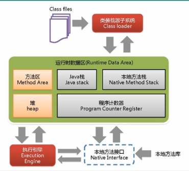
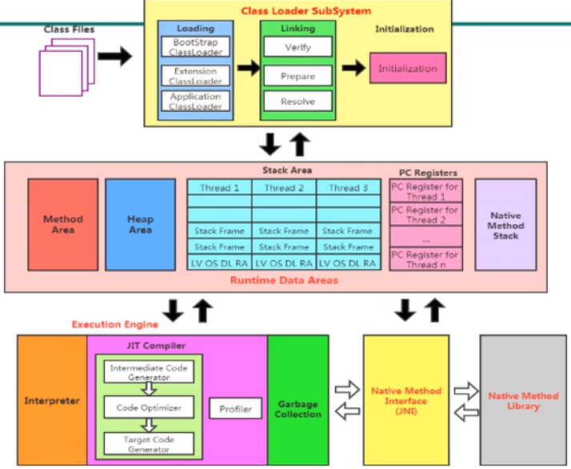
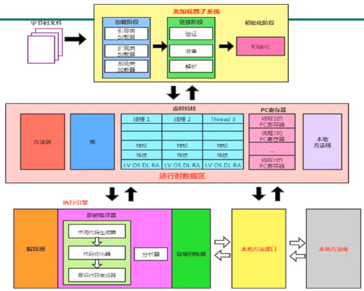
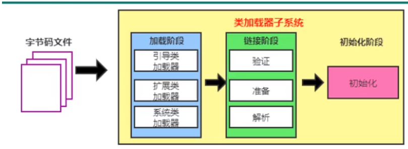
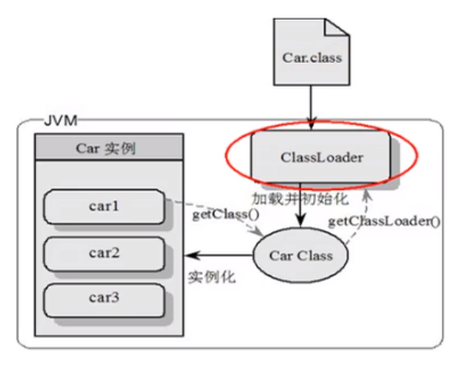

# 深入理解java虚拟机

<!-- TOC -->

- [深入理解java虚拟机](#深入理解java虚拟机)
    - [JVM的位置](#jvm的位置)
    - [JVM整体结构](#jvm整体结构)
    - [java代码执行流程](#java代码执行流程)
    - [jvm架构模型](#jvm架构模型)
    - [jvm生命周期](#jvm生命周期)
    - [内存结构概述](#内存结构概述)
    - [类加载器子系统](#类加载器子系统)

<!-- /TOC -->

## JVM的位置

JVM是运行在操作系统之上的，它与硬件没有直接的交互

## JVM整体结构

## java代码执行流程

1. java源码（xxx.java）
2. java编译器
    1. 词法分析
    2. 语法分析
    3. 语法/抽象语法树
    4. 语义分析
    5. 注解抽象语法树
    6. 字节码生成器
3. 字节码（xxx.class）
4. java虚拟机
    1. 类加载器
    2. 字节码校验器
    3. 翻译字节码(解析执行)/JIT编译器(编译执行)
5. 操作系统

## jvm架构模型

Java编译器输入的指令流基本上是一种基于栈的指令集架构，另一种指令集架构则是基于寄存器的指令集架构。

Hotspot虚拟机，除了PC寄存器之外，没有其他的寄存器

两种架构的区别

- 基于栈式架构的特点：
    - 设计和实现更简单，适用于资源受限的系统
    - 避开了寄存器的分配难题：使用零地址指令方式分配
    - 指令流中的指令大部分是零地址指令，其执行过程依赖于操作栈。指令集更小，编译器不容易实现
    - 不需要硬件支持，可移植性好，更好实现跨平台
- 基于寄存器架构的特点
    - 典型的应用就是x86的二进制指令集：比如传统的PC以及android的Davlik虚拟机
    - 指令集架构则完全依赖硬件，可移植性差
    - 性能优秀和执行更高效
    - 花费更少的指令去完成一项操作
    - 在大部分情况下，基于寄存器架构的指令集往往友谊一地址指令、二地址指令和三地址指令为主，而基于栈式架构的指令集却是以零地址指令为主

总结：

由于跨平台设计，Java的指令都是根据栈来设计的。不同的平台CPU架构不同，所以不能设计为基于寄存器的。优点是跨平台，指令集小，编译器容易实现，缺点是性能下降，实现同样的功能需要更多的指令。

栈：  
跨平台性、指令集小、指令多；执行性能比寄存器差

## Graal VM

- 2018年4月，Oracle Labs公开了Graal VM ，号称 "Run Programs Faster Anywhere"，勃勃野心。与1995年java的“write once，run anywhere”遥相呼应。

- Graal VM 在HotSpot VM基础上增强而成的跨语言全站虚拟机，可以作为“任何语言”的运行平台使用。语言包括：Java、Scala、Groovy、Kotlin；C、C++、JavaScript、Ruby、Python、R等

- 支持不同语言中混用对方的接口和对象，支持这些语言使用已经编写好的本地库文件

- 工作原理是将这些语言的源代码或源代码的中间格式，通过编译器转换为能被Graal VM接受的钟健表示。Graal VM提供Truffle工具集快速构建面向一种新语言的解释器。在运行时还能进行即时编译优化，获得比原生编译器更优秀的执行效率。

- 如果说HotSpot有一天真的被取代，Graal VM希望最大。但是Java的软件生态没有丝毫变化

## jvm生命周期

**虚拟机启动**

Java虚拟机的启动时通过引导类加载器（bootstrap class loader）创建一个初始类（init class）来完成的，这个类是由虚拟机的具体实现指定的

**虚拟机的运行**

- 一个运行中的java虚拟机有着一个清晰地任务：执行java程序
- 程序开始执行时他执行，程序结束时他就停止
- 执行一个所谓的java程序的时候，真正在执行的是一个java虚拟机的进程

**虚拟机的退出**

有如下几种情况
- 程序正常执行结束
- 程序在执行过程中遇到了异常或错误而异常终止
- 由于操作系统出现错误而导致java虚拟机进程终止
- 某线程调用Runtime类或System类的exit方法，或Runtime类的halt方法，并且java安全管理器也允许这次exit或halt操作
- 除此之外，JNI（Java Native Interface）规范描述了用JNI Invocation API 来加载或卸载Java虚拟机时，java虚拟机的退出情况

## 内存结构概述

如果自己手写一个java虚拟机的话，考虑哪些结构：  
类加载器子系统、执行引擎

## 类加载器子系统

三个阶段：1.加载阶段 2. 链接阶段 3. 初始化阶段

- 类加载子系统负责从文件系统或者网络中加载class文件，class文件在文件头有特定的标识
- ClassLoader只负责class文件的加载，至于它是否可以运行，则由Execution  Engine决定
- 加载的类信息存放于一块成为方法区的内存空间，除了类的信息外，方法区中还会存放运行时常量池信息，可能还包括字符串字面量和数字常量(这部分常量信息是Class文件中常量池部分的内存映射)

类加载器ClassLoader角色

1. class file存在于本地硬盘上，可以理解为设计师画在纸上的模板，而最终这个模板在执行的时候是要加载到JVM当中来根据这个文件实例化出n个一模一样的实例
2. class file加载到JVM中，被称为DNA元数据模板，放在方法区
3. 在.class文件-->JVM-->最终成为元数据模板，此过程就要一个运输工具(类装载器 Class Loader)，扮演一个快递员的角色

类的加载过程

**loading**：

1. 通过一个类的全限定名获取定义此类的二进制字节流
2. 将这个字节流所代表的静态存储结构转化为方法区的运行时的数据结构
3. 在内存中生成一个代表这个类的java.lang.Class对象，作为方法区这个类的各种数据的访问接口

**补充：加载.class文件的方式**

- 从本地系统中直接加载
- 从网络获取，典型场景：Web Applet
- 从zip压缩包中读取，成为日后jar、war格式的基础
- 运行时计算生成，典型场景：JSP应用
- 从专有数据库中提取.class文件，比较少见
- 从加密文件中获取，典型的防class文件被反编译的保护措施
